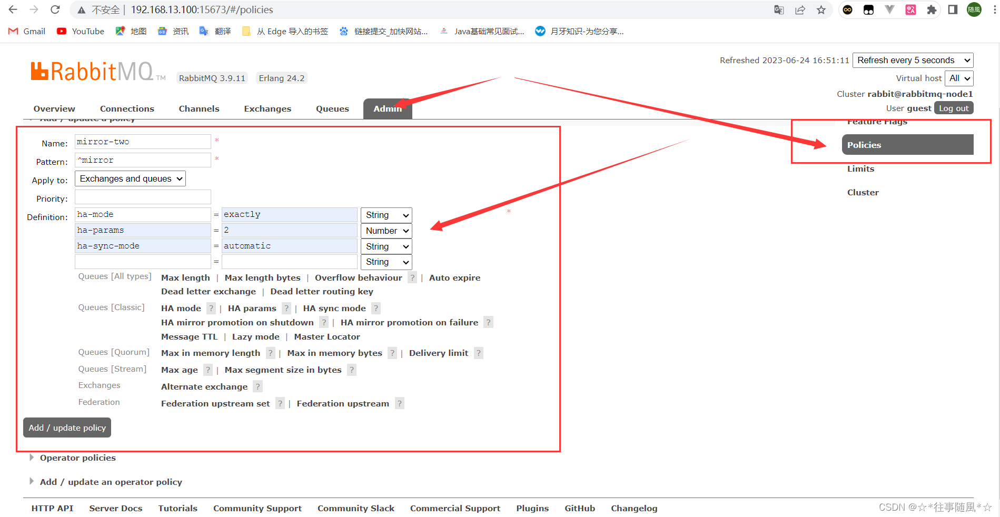

MQ的优势


MQ的劣势


MQ的不同类型


步骤

1.创建连接工厂

2.设置参数

3.创建连接

4.创建channel

5.创建队列

6.发送消息

# 生产者配置

```
public class RabbitmqTest {
    public static void main(String[] args) throws IOException, TimeoutException {
//        1.创建连接工厂
        ConnectionFactory conn = new ConnectionFactory();
//        2.设置参数
        conn.setHost("localhost");//默认是localhost
        conn.setPort(5672);//默认
        conn.setVirtualHost("/");//虚拟机 默认是“/”
        conn.setUsername("guest");// 连接rabbitmq的账号 默认guest
        conn.setPassword("guest");// 密码  默认guest

//        3.创建连接
        Connection newConnection = conn.newConnection();
//        4.创建channel
        Channel channel = newConnection.createChannel();

//        5.创建队列
        /**
         * queueDeclare(String queue, boolean durable, boolean exclusive, boolean autoDelete, Map<String, Object> arguments)
         * 参数
         * 1.queue 队列的名称
         * 2.durable 是否持久化，当mq重启的时候，数据还在
         * 3.exclusive 是否独占
         *      ·true 则只有一个消费者监听这个队列
         *             当连接关闭的时候，删除队列
     *          ·false 一般设置成false
         * 4.autoDelete 是否自动删除，当没有consumer时，自动删除
         * 5.参数
         */
        channel.queueDeclare("hello_world",true,false,false,null);

//        6.发送消息
        /*
        basicPublish(String exchange, String routingKey, BasicProperties props, byte[] body)
        参数：
            * exchange 交换机
            * routingKey 路由名称 如果使用默认的交换机，则要与队列的名称一样
            * props 配置信息
            * body 发送的消息
         */

        String body = "hello";
        channel.basicPublish("","hello_world",null,body.getBytes());

        // 7.释放资源
        channel.close();
        newConnection.close();
    }
}

```

依赖

```
<dependency>
            <groupId>com.rabbitmq</groupId>
            <artifactId>amqp-client</artifactId>
            <version>5.6.0</version>
        </dependency>
```

# 消费者配置

```
public class ConsumerRabbitmqTest {
    public static void main(String[] args) throws IOException, TimeoutException {
        //        1.创建连接工厂
        ConnectionFactory conn = new ConnectionFactory();
//        2.设置参数
        conn.setHost("localhost");//默认是localhost
        conn.setPort(5672);//默认
        conn.setVirtualHost("/");//虚拟机 默认是“/”
        conn.setUsername("guest");// 连接rabbitmq的账号 默认guest
        conn.setPassword("guest");// 密码  默认guest

//        3.创建连接
        Connection newConnection = conn.newConnection();
//        4.创建channel
        Channel channel = newConnection.createChannel();

//        5.创建队列
        /**
         * queueDeclare(String queue, boolean durable, boolean exclusive, boolean autoDelete, Map<String, Object> arguments)
         * 参数
         * 1.queue 队列的名称
         * 2.durable 是否持久化，当mq重启的时候，数据还在
         * 3.exclusive 是否独占
         *      ·true 则只有一个消费者监听这个队列
         *             当连接关闭的时候，删除队列
         *          ·false 一般设置成false
         * 4.autoDelete 是否自动删除，当没有consumer时，自动删除
         * 5.参数
         */
        channel.queueDeclare("hello_world",true,false,false,null);

        // 6.接收消息
        /*
        basicConsume(String queue, boolean autoAck, Consumer callback)
        参数：
        queue 队列名称
        autoAck 是否自动确认
        callback 回调对象
         */
        Consumer consumer = new DefaultConsumer(channel){
            @Override
            public void handleDelivery(String consumerTag, Envelope envelope, AMQP.BasicProperties properties, byte[] body) throws IOException {
                System.out.println("consumerTag = " + consumerTag);
                System.out.println("Exchange = " + envelope.getExchange());
                System.out.println("RoutingKey = " + envelope.getRoutingKey());
                System.out.println("properties = " + properties);
                System.out.println("body = " + Arrays.toString(body));
            }
        };
        channel.basicConsume("hello_world",true,consumer);
    }
}
```

# 工作模式

## Work Queue

test环境

生产者代码，利用for循环发送十条消息

```
public class ForProduceWorkQueue {
    public static void main(String[] args) throws IOException, TimeoutException {
//        1.创建连接工厂
        ConnectionFactory conn = new ConnectionFactory();
//        2.设置参数
        conn.setHost("localhost");//默认是localhost
        conn.setPort(5672);//默认
        conn.setVirtualHost("/");//虚拟机 默认是“/”
        conn.setUsername("guest");// 连接rabbitmq的账号 默认guest
        conn.setPassword("guest");// 密码  默认guest

//        3.创建连接
        Connection newConnection = conn.newConnection();
//        4.创建channel
        Channel channel = newConnection.createChannel();

//        5.创建队列
        /**
         * queueDeclare(String queue, boolean durable, boolean exclusive, boolean autoDelete, Map<String, Object> arguments)
         * 参数
         * 1.queue 队列的名称
         * 2.durable 是否持久化，当mq重启的时候，数据还在
         * 3.exclusive 是否独占
         *      ·true 则只有一个消费者监听这个队列
         *             当连接关闭的时候，删除队列
     *          ·false 一般设置成false
         * 4.autoDelete 是否自动删除，当没有consumer时，自动删除
         * 5.参数
         */
        channel.queueDeclare("work_queues",true,false,false,null);

//        6.发送消息
        /*
        basicPublish(String exchange, String routingKey, BasicProperties props, byte[] body)
        参数：
            * exchange 交换机
            * routingKey 路由名称 如果使用默认的交换机，则要与队列的名称一样
            * props 配置信息
            * body 发送的消息
         */
        for (int i = 0; i < 10; i++) {
            String body = i+"hello";
            channel.basicPublish("","work_queues",null,body.getBytes());
        }


        // 7.释放资源
        channel.close();
        newConnection.close();
    }
}

```

消费端1

```
public class ConsumerWorkQueue1 {
    public static void main(String[] args) throws IOException, TimeoutException {
        //        1.创建连接工厂
        ConnectionFactory conn = new ConnectionFactory();
//        2.设置参数
        conn.setHost("localhost");//默认是localhost
        conn.setPort(5672);//默认
        conn.setVirtualHost("/");//虚拟机 默认是“/”
        conn.setUsername("guest");// 连接rabbitmq的账号 默认guest
        conn.setPassword("guest");// 密码  默认guest

//        3.创建连接
        Connection newConnection = conn.newConnection();
//        4.创建channel
        Channel channel = newConnection.createChannel();

//        5.创建队列
        /**
         * queueDeclare(String queue, boolean durable, boolean exclusive, boolean autoDelete, Map<String, Object> arguments)
         * 参数
         * 1.queue 队列的名称
         * 2.durable 是否持久化，当mq重启的时候，数据还在
         * 3.exclusive 是否独占
         *      ·true 则只有一个消费者监听这个队列
         *             当连接关闭的时候，删除队列
         *          ·false 一般设置成false
         * 4.autoDelete 是否自动删除，当没有consumer时，自动删除
         * 5.参数
         */
        channel.queueDeclare("work_queues",true,false,false,null);

        // 6.接收消息
        /*
        basicConsume(String queue, boolean autoAck, Consumer callback)
        参数：
        queue 队列名称,对应生产者那一段的队列名称
        autoAck 是否自动确认
        callback 回调对象
         */
        Consumer consumer = new DefaultConsumer(channel){
            @Override
            public void handleDelivery(String consumerTag, Envelope envelope, AMQP.BasicProperties properties, byte[] body) throws IOException {
                /*System.out.println("consumerTag = " + consumerTag);
                System.out.println("Exchange = " + envelope.getExchange());
                System.out.println("RoutingKey = " + envelope.getRoutingKey());
                System.out.println("properties = " + properties);*/
                System.out.println("body1 = " + Arrays.toString(body));
            }
        };
        channel.basicConsume("work_queues",true,consumer);
    }
}

```

消费端2

```
public class ConsumerWorkQueue1 {
    public static void main(String[] args) throws IOException, TimeoutException {
        //        1.创建连接工厂
        ConnectionFactory conn = new ConnectionFactory();
//        2.设置参数
        conn.setHost("localhost");//默认是localhost
        conn.setPort(5672);//默认
        conn.setVirtualHost("/");//虚拟机 默认是“/”
        conn.setUsername("guest");// 连接rabbitmq的账号 默认guest
        conn.setPassword("guest");// 密码  默认guest

//        3.创建连接
        Connection newConnection = conn.newConnection();
//        4.创建channel
        Channel channel = newConnection.createChannel();

//        5.创建队列
        /**
         * queueDeclare(String queue, boolean durable, boolean exclusive, boolean autoDelete, Map<String, Object> arguments)
         * 参数
         * 1.queue 队列的名称
         * 2.durable 是否持久化，当mq重启的时候，数据还在
         * 3.exclusive 是否独占
         *      ·true 则只有一个消费者监听这个队列
         *             当连接关闭的时候，删除队列
         *          ·false 一般设置成false
         * 4.autoDelete 是否自动删除，当没有consumer时，自动删除
         * 5.参数
         */
        channel.queueDeclare("work_queues",true,false,false,null);

        // 6.接收消息
        /*
        basicConsume(String queue, boolean autoAck, Consumer callback)
        参数：
        queue 队列名称,对应生产者那一段的队列名称
        autoAck 是否自动确认
        callback 回调对象
         */
        Consumer consumer = new DefaultConsumer(channel){
            @Override
            public void handleDelivery(String consumerTag, Envelope envelope, AMQP.BasicProperties properties, byte[] body) throws IOException {
                /*System.out.println("consumerTag = " + consumerTag);
                System.out.println("Exchange = " + envelope.getExchange());
                System.out.println("RoutingKey = " + envelope.getRoutingKey());
                System.out.println("properties = " + properties);*/
                System.out.println("body2 = " + Arrays.toString(body));
            }
        };
        channel.basicConsume("work_queues",true,consumer);
    }
}

```

先运行消费端，等待接收数据，如果先运行服务端，当一个消费端运行，会把消息全部吞并，另一个无法再获取到

两个消费端运行起来等待消息的接收，接收到消息之后，是轮询着获取消息的


### 总结

如果一个队列中有多个消费者，则它们之间是一种**竞争**关系

Work Queue通常用于任务过多或者过重的之后处理消息，提高处理的效率。

例如：短信服务，只需要有一个阶段能够发送成功既成功。

## 订阅模式


服务端代码：在原来的基础上加了虚拟机

```
public class Product_PubSub {
    public static void main(String[] args) throws IOException, TimeoutException {
//        1.创建连接工厂
        ConnectionFactory conn = new ConnectionFactory();
//        2.设置参数
        conn.setHost("localhost");//默认是localhost
        conn.setPort(5672);//默认
        conn.setVirtualHost("/");//虚拟机 默认是“/”
        conn.setUsername("guest");// 连接rabbitmq的账号 默认guest
        conn.setPassword("guest");// 密码  默认guest

//        3.创建连接
        Connection newConnection = conn.newConnection();
//        4.创建channel
        Channel channel = newConnection.createChannel();

        //5. 创建交换机
        /*
         exchangeDeclare(String exchange, BuiltinExchangeType type, boolean durable, boolean autoDelete, boolean internal, Map<String, Object> arguments)
            exchange: 交换机的名称
            BuiltinExchangeType：交换机的类型
                DIRECT("direct"),
                FANOUT("fanout"),扇形广播，给所有与之绑定的队列
                TOPIC("topic"),
                HEADERS("headers");
            durable：是否持久化
            autoDelete：是否自动删除
            internal：内部使用
            arguments：参数
         */
        String exchangeName = "fanout_test";
        channel.exchangeDeclare(exchangeName, BuiltinExchangeType.FANOUT,true,false,false,null);

        //6. 创建队列
        String queueName1 = "fanout_test_queue1";
        String queueName2 = "fanout_test_queue2";
        channel.queueDeclare(queueName1,true,false,false,null);
        channel.queueDeclare(queueName2,true,false,false,null);

        //7. 绑定队列和交换机
        /*
        queueBind(String queue, String exchange, String routingKey)
            queue: 队列名称
            exchange: 交换机的名称
            routingKey: 路由的绑定规则
                如果交换机的类型是FANOUT("fanout"),默认不需要指定绑定，默认是""
         */
        channel.queueBind(queueName1,exchangeName,"");
        channel.queueBind(queueName2,exchangeName,"");

        String body = "打印日志";
        //8. 发送消息
        channel.basicPublish(exchangeName, "", null,body.getBytes());
        //9. 释放资源
    }
}
```

生产端1：

```
public class Consumer_PubSub1 {
    public static void main(String[] args) throws IOException, TimeoutException {
        //        1.创建连接工厂
        ConnectionFactory conn = new ConnectionFactory();
//        2.设置参数
        conn.setHost("localhost");//默认是localhost
        conn.setPort(5672);//默认
        conn.setVirtualHost("/");//虚拟机 默认是“/”
        conn.setUsername("guest");// 连接rabbitmq的账号 默认guest
        conn.setPassword("guest");// 密码  默认guest

//        3.创建连接
        Connection newConnection = conn.newConnection();
//        4.创建channel
        Channel channel = newConnection.createChannel();

//        5.创建队列
        /**
         * queueDeclare(String queue, boolean durable, boolean exclusive, boolean autoDelete, Map<String, Object> arguments)
         * 参数
         * 1.queue 队列的名称
         * 2.durable 是否持久化，当mq重启的时候，数据还在
         * 3.exclusive 是否独占
         *      ·true 则只有一个消费者监听这个队列
         *             当连接关闭的时候，删除队列
         *          ·false 一般设置成false
         * 4.autoDelete 是否自动删除，当没有consumer时，自动删除
         * 5.参数
         */
        channel.queueDeclare("fanout_test_queue1",true,false,false,null);

        // 6.接收消息
        /*
        basicConsume(String queue, boolean autoAck, Consumer callback)
        参数：
        queue 队列名称
        autoAck 是否自动确认
        callback 回调对象
         */
        Consumer consumer = new DefaultConsumer(channel){
            @Override
            public void handleDelivery(String consumerTag, Envelope envelope, AMQP.BasicProperties properties, byte[] body) throws IOException {
                /*System.out.println("consumerTag = " + consumerTag);
                System.out.println("Exchange = " + envelope.getExchange());
                System.out.println("RoutingKey = " + envelope.getRoutingKey());
                System.out.println("properties = " + properties);*/
                System.out.println("body1 = " + new String(body));
            }
        };
        channel.basicConsume("fanout_test_queue1",true,consumer);
    }
}

```

生产端2：

```
public class Consumer_PubSub2 {
    public static void main(String[] args) throws IOException, TimeoutException {
        //        1.创建连接工厂
        ConnectionFactory conn = new ConnectionFactory();
//        2.设置参数
        conn.setHost("localhost");//默认是localhost
        conn.setPort(5672);//默认
        conn.setVirtualHost("/");//虚拟机 默认是“/”
        conn.setUsername("guest");// 连接rabbitmq的账号 默认guest
        conn.setPassword("guest");// 密码  默认guest

//        3.创建连接
        Connection newConnection = conn.newConnection();
//        4.创建channel
        Channel channel = newConnection.createChannel();

//        5.创建队列
        /**
         * queueDeclare(String queue, boolean durable, boolean exclusive, boolean autoDelete, Map<String, Object> arguments)
         * 参数
         * 1.queue 队列的名称
         * 2.durable 是否持久化，当mq重启的时候，数据还在
         * 3.exclusive 是否独占
         *      ·true 则只有一个消费者监听这个队列
         *             当连接关闭的时候，删除队列
         *          ·false 一般设置成false
         * 4.autoDelete 是否自动删除，当没有consumer时，自动删除
         * 5.参数
         */
        channel.queueDeclare("fanout_test_queue2",true,false,false,null);

        // 6.接收消息
        /*
        basicConsume(String queue, boolean autoAck, Consumer callback)
        参数：
        queue 队列名称
        autoAck 是否自动确认
        callback 回调对象
         */
        Consumer consumer = new DefaultConsumer(channel){
            @Override
            public void handleDelivery(String consumerTag, Envelope envelope, AMQP.BasicProperties properties, byte[] body) throws IOException {
                /*System.out.println("consumerTag = " + consumerTag);
                System.out.println("Exchange = " + envelope.getExchange());
                System.out.println("RoutingKey = " + envelope.getRoutingKey());
                System.out.println("properties = " + properties);*/
                System.out.println("body2 = " + new String(body));
            }
        };
        channel.basicConsume("fanout_test_queue2",true,consumer);
    }
}
```

## 路由模式Routing

生产端

```
public class Product_Routing {
    public static void main(String[] args) throws IOException, TimeoutException {
//        1.创建连接工厂
        ConnectionFactory conn = new ConnectionFactory();
//        2.设置参数
        conn.setHost("localhost");//默认是localhost
        conn.setPort(5672);//默认
        conn.setVirtualHost("/");//虚拟机 默认是“/”
        conn.setUsername("guest");// 连接rabbitmq的账号 默认guest
        conn.setPassword("guest");// 密码  默认guest

//        3.创建连接
        Connection newConnection = conn.newConnection();
//        4.创建channel
        Channel channel = newConnection.createChannel();

        //5. 创建交换机
        /*
         exchangeDeclare(String exchange, BuiltinExchangeType type, boolean durable, boolean autoDelete, boolean internal, Map<String, Object> arguments)
            exchange: 交换机的名称
            BuiltinExchangeType：交换机的类型
                DIRECT("direct"),
                FANOUT("fanout"),扇形广播，给所有与之绑定的队列
                TOPIC("topic"),
                HEADERS("headers");
            durable：是否持久化
            autoDelete：是否自动删除
            internal：内部使用
            arguments：参数
         */
        String exchangeName = "direct_test";
        channel.exchangeDeclare(exchangeName, BuiltinExchangeType.DIRECT,true,false,false,null);

        //6. 创建队列
        String queueName1 = "direct_test_queue1";
        String queueName2 = "direct_test_queue2";
        channel.queueDeclare(queueName1,true,false,false,null);
        channel.queueDeclare(queueName2,true,false,false,null);

        //7. 绑定队列和交换机
        /*
        queueBind(String queue, String exchange, String routingKey)
            queue: 队列名称
            exchange: 交换机的名称
            routingKey: 路由的绑定规则
                如果交换机的类型是FANOUT("fanout"),默认不需要指定绑定，默认是""
         */
        // 队列1绑定error
        channel.queueBind(queueName1,exchangeName,"error");
        // 队列2绑定info error warning
        channel.queueBind(queueName2,exchangeName,"info");
        channel.queueBind(queueName2,exchangeName,"error");
        channel.queueBind(queueName2,exchangeName,"warning");


        String body = "打印日志";
        //8. 发送消息
        channel.basicPublish(exchangeName, "", null,body.getBytes());
        //9. 释放资源
    }
}

```

队列1绑定为error之后，info级别的消息就收不到了


消费端只需要把获取队列的名字改一下就可以

需要注意的是：使用路由模式，交换机需要指定routing Key，消息会转发到符合routing Key的队列

### routing Key的类型

routing key（路由键）是在消息发布到交换机时附带的一个属性，用于指定消息被路由到哪个队列。在 RabbitMQ 中，routing key 的类型可以是任意字符串，但常见的几种类型包括：

1. 空字符串：当交换机的类型为 `fanout` 时，将会忽略 routing key，消息会被广播到所有绑定的队列。
2. 直接匹配字符串：当交换机的类型为 `direct` 时，routing key 用于直接匹配绑定到交换机的队列的 routing key。只有完全匹配的队列会接收到消息。
3. 通配符匹配：当交换机的类型为 `topic` 时，routing key 可以使用通配符进行模式匹配。通配符有两种形式：

   - `*` ：匹配一个单词（以 `.` 为分隔符）。
   - `#` ：匹配零个或多个单词。

   通过使用通配符，可以灵活地将消息路由到多个队列。
4. 头部匹配：当交换机的类型为 `headers` 时，routing key 被忽略，而是根据消息的头部属性进行匹配。头部属性与值的匹配规则由发布者和消费者自行定义。

这些是常见的 routing key 类型，具体使用哪种类型取决于你的业务需求和交换机的类型。

## Topics模式


### 生产端代码

```
public class Product_Topics {
    public static void main(String[] args) throws IOException, TimeoutException {
//        1.创建连接工厂
        ConnectionFactory conn = new ConnectionFactory();
//        2.设置参数
        conn.setHost("localhost");//默认是localhost
        conn.setPort(5672);//默认
        conn.setVirtualHost("/");//虚拟机 默认是“/”
        conn.setUsername("guest");// 连接rabbitmq的账号 默认guest
        conn.setPassword("guest");// 密码  默认guest

//        3.创建连接
        Connection newConnection = conn.newConnection();
//        4.创建channel
        Channel channel = newConnection.createChannel();

        //5. 创建交换机
        /*
         exchangeDeclare(String exchange, BuiltinExchangeType type, boolean durable, boolean autoDelete, boolean internal, Map<String, Object> arguments)
            exchange: 交换机的名称
            BuiltinExchangeType：交换机的类型
                DIRECT("direct"),
                FANOUT("fanout"),扇形广播，给所有与之绑定的队列
                TOPIC("topic"),
                HEADERS("headers");
            durable：是否持久化
            autoDelete：是否自动删除
            internal：内部使用
            arguments：参数
         */
        String exchangeName = "fanout_topics";
        channel.exchangeDeclare(exchangeName, BuiltinExchangeType.TOPIC,true,false,false,null);

        //6. 创建队列
        String queueName1 = "topics_test_queue1";
        String queueName2 = "topics_test_queue2";
        channel.queueDeclare(queueName1,true,false,false,null);
        channel.queueDeclare(queueName2,true,false,false,null);

        //7. 绑定队列和交换机
        /*
        queueBind(String queue, String exchange, String routingKey)
            queue: 队列名称
            exchange: 交换机的名称
            routingKey: 路由的绑定规则
                如果交换机的类型是FANOUT("fanout"),默认不需要指定绑定，默认是""
         */
        // 绑定匹配规则，指定所有error级别的日志存入数据库
        // 所有order系统的日志存入数据库
        channel.queueBind(queueName1,exchangeName,"#.error");
        channel.queueBind(queueName1,exchangeName,"order.#");
        channel.queueBind(queueName2,exchangeName,"*.*");

        String body = "打印日志";
        //8. 发送消息
        channel.basicPublish(exchangeName, "order.info", null,body.getBytes());
        //9. 释放资源
    }
}

```

需要把交换机的类型改成**TOPIC**类型

#### 通配符

在这段代码中， `#` 和 `*` 是用于绑定队列和交换机之间的路由键（routing key）的通配符。

- `#` 是一个通配符，表示匹配零个或多个单词（以 `.` 分隔的字符串）。例如， `"#.error"` 可以匹配到 `"error"` 、 `"order.error"` 、 `"user.error"` 等路由键。
- `*` 也是一个通配符，表示匹配一个单词。例如， `"*.*"` 可以匹配到 `"order.error"` 、 `"order.success"` 、 `"user.login"` 等路由键，但无法匹配到 `"order"` 、 `"order.error.info"` 等路由键。

因此， `#` 通配符可以匹配更多的路由键，而 `*` 通配符只能匹配一个单词。

在消息队列中，交换机根据路由键来确定将消息发送到哪个队列。通过使用通配符，可以将特定的路由键模式与队列进行绑定，从而实现灵活的消息路由和过滤。

### 消费端1

```
public class Consumer_Topic1 {
    public static void main(String[] args) throws IOException, TimeoutException {
        //        1.创建连接工厂
        ConnectionFactory conn = new ConnectionFactory();
//        2.设置参数
        conn.setHost("localhost");//默认是localhost
        conn.setPort(5672);//默认
        conn.setVirtualHost("/");//虚拟机 默认是“/”
        conn.setUsername("guest");// 连接rabbitmq的账号 默认guest
        conn.setPassword("guest");// 密码  默认guest

//        3.创建连接
        Connection newConnection = conn.newConnection();
//        4.创建channel
        Channel channel = newConnection.createChannel();

//        5.创建队列
        /**
         * queueDeclare(String queue, boolean durable, boolean exclusive, boolean autoDelete, Map<String, Object> arguments)
         * 参数
         * 1.queue 队列的名称
         * 2.durable 是否持久化，当mq重启的时候，数据还在
         * 3.exclusive 是否独占
         *      ·true 则只有一个消费者监听这个队列
         *             当连接关闭的时候，删除队列
         *          ·false 一般设置成false
         * 4.autoDelete 是否自动删除，当没有consumer时，自动删除
         * 5.参数
         */
        channel.queueDeclare("fanout_test_queue1",true,false,false,null);

        // 6.接收消息
        /*
        basicConsume(String queue, boolean autoAck, Consumer callback)
        参数：
        queue 队列名称
        autoAck 是否自动确认
        callback 回调对象
         */
        Consumer consumer = new DefaultConsumer(channel){
            @Override
            public void handleDelivery(String consumerTag, Envelope envelope, AMQP.BasicProperties properties, byte[] body) throws IOException {
                /*System.out.println("consumerTag = " + consumerTag);
                System.out.println("Exchange = " + envelope.getExchange());
                System.out.println("RoutingKey = " + envelope.getRoutingKey());
                System.out.println("properties = " + properties);*/
                System.out.println("body1 = " + new String(body));
                System.out.println("将日志信息存到数据库");
            }
        };
        String q1Name = "topics_test_queue1";
        String q2Name = "topics_test_queue2";
        channel.basicConsume(q1Name,true,consumer);
    }
}

```

### 消费端2

```
public class Consumer_Topic2 {
    public static void main(String[] args) throws IOException, TimeoutException {
        //        1.创建连接工厂
        ConnectionFactory conn = new ConnectionFactory();
//        2.设置参数
        conn.setHost("localhost");//默认是localhost
        conn.setPort(5672);//默认
        conn.setVirtualHost("/");//虚拟机 默认是“/”
        conn.setUsername("guest");// 连接rabbitmq的账号 默认guest
        conn.setPassword("guest");// 密码  默认guest

//        3.创建连接
        Connection newConnection = conn.newConnection();
//        4.创建channel
        Channel channel = newConnection.createChannel();

//        5.创建队列
        /**
         * queueDeclare(String queue, boolean durable, boolean exclusive, boolean autoDelete, Map<String, Object> arguments)
         * 参数
         * 1.queue 队列的名称
         * 2.durable 是否持久化，当mq重启的时候，数据还在
         * 3.exclusive 是否独占
         *      ·true 则只有一个消费者监听这个队列
         *             当连接关闭的时候，删除队列
         *          ·false 一般设置成false
         * 4.autoDelete 是否自动删除，当没有consumer时，自动删除
         * 5.参数
         */
        channel.queueDeclare("fanout_test_queue1",true,false,false,null);

        // 6.接收消息
        /*
        basicConsume(String queue, boolean autoAck, Consumer callback)
        参数：
        queue 队列名称
        autoAck 是否自动确认
        callback 回调对象
         */
        Consumer consumer = new DefaultConsumer(channel){
            @Override
            public void handleDelivery(String consumerTag, Envelope envelope, AMQP.BasicProperties properties, byte[] body) throws IOException {
                /*System.out.println("consumerTag = " + consumerTag);
                System.out.println("Exchange = " + envelope.getExchange());
                System.out.println("RoutingKey = " + envelope.getRoutingKey());
                System.out.println("properties = " + properties);*/
                System.out.println("body1 = " + new String(body));
                System.out.println("将日志信息存到数据库");
            }
        };
        String q1Name = "topics_test_queue1";
        String q2Name = "topics_test_queue2";
        channel.basicConsume(q2Name,true,consumer);
    }
}

```

# spring整合MQ

## 生产端

### 需要现在rabbitmq中创建一个虚拟主机

### 生产端配置文件

```xml
<?xml version="1.0" encoding="UTF-8"?>
<beans xmlns="http://www.springframework.org/schema/beans"
       xmlns:xsi="http://www.w3.org/2001/XMLSchema-instance"
       xmlns:context="http://www.springframework.org/schema/context"
       xmlns:rabbit="http://www.springframework.org/schema/rabbit"
       xsi:schemaLocation="http://www.springframework.org/schema/beans
       http://www.springframework.org/schema/beans/spring-beans.xsd
       http://www.springframework.org/schema/context
       https://www.springframework.org/schema/context/spring-context.xsd
       http://www.springframework.org/schema/rabbit
       http://www.springframework.org/schema/rabbit/spring-rabbit.xsd">
    <!--加载配置文件-->
    <context:property-placeholder location="classpath:/rabbitmq.properties"/>

    <!-- 定义rabbitmq connectionFactory -->
    <rabbit:connection-factory id="connectionFactory" host="${rabbitmq.host}"
                               port="${rabbitmq.port}"
                               username="${rabbitmq.username}"
                               password="${rabbitmq.password}"
                               virtual-host="${rabbitmq.virtual-host}"/>
    <!--定义管理交换机、队列-->
    <rabbit:admin connection-factory="connectionFactory"/>

    <!--定义持久化队列，不存在则自动创建；不绑定到交换机则绑定到默认交换机
    默认交换机类型为direct，名字为：""，路由键为队列的名称
    -->
    <!--
            id：bean的名称
            name：queue的名称
            auto-declare:自动创建
            auto-delete:自动删除。 最后一个消费者和该队列断开连接后，自动删除队列
            exclusive:是否独占
            durable：是否持久化
        -->
    <rabbit:queue id="spring_queue" name="spring_queue" auto-declare="true"/>

    <!-- ~~~~~~~~~~~~~~~~~~~~~~~~~~~~广播；所有队列都能收到消息~~~~~~~~~~~~~~~~~~~~~~~~~~~~ -->
    <!--定义广播交换机中的持久化队列，不存在则自动创建-->
    <rabbit:queue id="spring_fanout_queue_1" name="spring_fanout_queue_1" auto-declare="true"/>

    <!--定义广播交换机中的持久化队列，不存在则自动创建-->
    <rabbit:queue id="spring_fanout_queue_2" name="spring_fanout_queue_2" auto-declare="true"/>

    <!--定义广播类型交换机；并绑定上述两个队列-->
    <rabbit:fanout-exchange id="spring_fanout_exchange" name="spring_fanout_exchange" auto-declare="true">
        <rabbit:bindings>
            <rabbit:binding queue="spring_fanout_queue_1"/>
            <rabbit:binding queue="spring_fanout_queue_2"/>
        </rabbit:bindings>
    </rabbit:fanout-exchange>

    <!--<rabbit:direct-exchange name="aa" >
            <rabbit:bindings>
                <!–direct 类型的交换机绑定队列  key ：路由key  queue：队列名称–>
                <rabbit:binding queue="spring_queue" key="xxx"></rabbit:binding>
            </rabbit:bindings>
        </rabbit:direct-exchange>-->

    <!-- ~~~~~~~~~~~~~~~~~~~~~~~~~~~~通配符；*匹配一个单词，#匹配多个单词 ~~~~~~~~~~~~~~~~~~~~~~~~~~~~ -->
    <!--定义广播交换机中的持久化队列，不存在则自动创建-->
    <rabbit:queue id="spring_topic_queue_star" name="spring_topic_queue_star" auto-declare="true"/>
    <!--定义广播交换机中的持久化队列，不存在则自动创建-->
    <rabbit:queue id="spring_topic_queue_well" name="spring_topic_queue_well" auto-declare="true"/>
    <!--定义广播交换机中的持久化队列，不存在则自动创建-->
    <rabbit:queue id="spring_topic_queue_well2" name="spring_topic_queue_well2" auto-declare="true"/>

    <rabbit:topic-exchange id="spring_topic_exchange" name="spring_topic_exchange" auto-declare="true">
        <rabbit:bindings>
            <!--指定交换机的匹配类型，*匹配一个单词，#匹配多个单词-->
            <rabbit:binding pattern="heima.*" queue="spring_topic_queue_star"/>
            <rabbit:binding pattern="heima.#" queue="spring_topic_queue_well"/>
            <rabbit:binding pattern="itcast.#" queue="spring_topic_queue_well2"/>
        </rabbit:bindings>
    </rabbit:topic-exchange>

    <!--定义rabbitTemplate对象操作可以在代码中方便发送消息-->
    <rabbit:template id="rabbitTemplate" connection-factory="connectionFactory"/>
</beans>
```

### properties

```properties
# 自己本机上的rabbitmq地址
rabbitmq.host: localhost
# 端口号
rabbitmq.port: 5672
rabbitmq.username: guest
rabbitmq.password: guest
#虚拟主机名
rabbitmq.virtual-host: /it
```

### 测试类

```java
@RunWith(SpringJUnit4ClassRunner.class)
@ContextConfiguration(locations = "classpath:spring-rabbitmq-producer.xml")
public class ProducerTest {

    //1.注入RabbitTemplate
    @Autowired
    private RabbitTemplate rabbitTemplate;

    @Test
    public void testSendInfo(){
        // 2.发送消息
        String send = "Hello My Dear!";
        rabbitTemplate.convertAndSend("spring_queue",send);
    }

    /**
     * 发送fanout类型的消息
     */
    @Test
    public void testSendFanoutInfo(){
        // 2.发送消息
        String send = "Hello My Dear!";
        rabbitTemplate.convertAndSend("spring_fanout_exchange","spring_queue",send);
    }

    /**
     * 发送topics类型的消息
     */
    @Test
    public void testSendTopicsInfo(){
        // 2.发送消息
        String send = "Hello My Dear!";
        rabbitTemplate.convertAndSend("spring_topic_exchange","heima.hehe.haha",send);
    }
}

```

## 消费端

### 配置文件

```xml
<?xml version="1.0" encoding="UTF-8"?>
<beans xmlns="http://www.springframework.org/schema/beans"
       xmlns:xsi="http://www.w3.org/2001/XMLSchema-instance"
       xmlns:context="http://www.springframework.org/schema/context"
       xmlns:rabbit="http://www.springframework.org/schema/rabbit"
       xsi:schemaLocation="http://www.springframework.org/schema/beans
       http://www.springframework.org/schema/beans/spring-beans.xsd
       http://www.springframework.org/schema/context
       https://www.springframework.org/schema/context/spring-context.xsd
       http://www.springframework.org/schema/rabbit
       http://www.springframework.org/schema/rabbit/spring-rabbit.xsd">
    <!--加载配置文件-->
    <context:property-placeholder location="classpath:rabbitmq.properties"/>

    <!-- 定义rabbitmq connectionFactory -->
    <rabbit:connection-factory id="connectionFactory" host="${rabbitmq.host}"
                               port="${rabbitmq.port}"
                               username="${rabbitmq.username}"
                               password="${rabbitmq.password}"
                               virtual-host="${rabbitmq.virtual-host}"/>

    <bean id="springQueueListener" class="com.gjg.rabbitmq.listener.SpringQueueListener"/>
    <bean id="fanoutListener1" class="com.gjg.rabbitmq.listener.FanoutListener1"/>
    <bean id="fanoutListener2" class="com.gjg.rabbitmq.listener.FanoutListener2"/>
    <bean id="topicListenerStar" class="com.gjg.rabbitmq.listener.TopicListenerStar"/>
    <bean id="topicListenerWell" class="com.gjg.rabbitmq.listener.TopicListenerWell"/>
    <bean id="topicListenerWell2" class="com.gjg.rabbitmq.listener.TopicListenerWell2"/>

    <rabbit:listener-container connection-factory="connectionFactory" auto-declare="true">
        <rabbit:listener ref="springQueueListener" queue-names="spring_queue"/>
        <rabbit:listener ref="fanoutListener1" queue-names="spring_fanout_queue_1"/>
        <rabbit:listener ref="fanoutListener2" queue-names="spring_fanout_queue_2"/>
        <rabbit:listener ref="topicListenerStar" queue-names="spring_topic_queue_star"/>
        <rabbit:listener ref="topicListenerWell" queue-names="spring_topic_queue_well"/>
        <rabbit:listener ref="topicListenerWell2" queue-names="spring_topic_queue_well2"/>
    </rabbit:listener-container>
</beans>
```

### 消息监听器

1）队列监听器

```java
public class SpringQueueListener implements MessageListener {
    public void onMessage(Message message) {
        try {
            String msg = new String(message.getBody(), "utf-8");            System.out.printf("接收路由名称为：%s，路由键为：%s，队列名为：%s的消息：%s \n",
                    message.getMessageProperties().getReceivedExchange(),
                    message.getMessageProperties().getReceivedRoutingKey(),
                    message.getMessageProperties().getConsumerQueue(),
                    msg);
        } catch (Exception e) {
            e.printStackTrace();
        }
    }
}
```

2）广播监听器1

```java
public class FanoutListener1 implements MessageListener {
    public void onMessage(Message message) {
        try {
            String msg = new String(message.getBody(), "utf-8");            System.out.printf("广播监听器1：接收路由名称为：%s，路由键为：%s，队列名为：%s的消息：%s \n",
                    message.getMessageProperties().getReceivedExchange(),
                    message.getMessageProperties().getReceivedRoutingKey(),
                    message.getMessageProperties().getConsumerQueue(),
                    msg);
        } catch (Exception e) {
            e.printStackTrace();
        }
    }
}
```

3）广播监听器2

```java
public class FanoutListener2 implements MessageListener {
    public void onMessage(Message message) {
        try {
            String msg = new String(message.getBody(), "utf-8");            System.out.printf("广播监听器2：接收路由名称为：%s，路由键为：%s，队列名为：%s的消息：%s \n",
                    message.getMessageProperties().getReceivedExchange(),
                    message.getMessageProperties().getReceivedRoutingKey(),
                    message.getMessageProperties().getConsumerQueue(),
                    msg);
        } catch (Exception e) {
            e.printStackTrace();
        }
    }
}
```

4）星号通配符监听器

```java
public class TopicListenerStar implements MessageListener {
    public void onMessage(Message message) {
        try {
            String msg = new String(message.getBody(), "utf-8");            System.out.printf("通配符*监听器：接收路由名称为：%s，路由键为：%s，队列名为：%s的消息：%s \n",
                    message.getMessageProperties().getReceivedExchange(),
                    message.getMessageProperties().getReceivedRoutingKey(),
                    message.getMessageProperties().getConsumerQueue(),
                    msg);
        } catch (Exception e) {
            e.printStackTrace();
        }
    }
}
```

5）井号通配符监听器

```java
public class TopicListenerWell implements MessageListener {
    public void onMessage(Message message) {
        try {
            String msg = new String(message.getBody(), "utf-8");            System.out.printf("通配符#监听器：接收路由名称为：%s，路由键为：%s，队列名为：%s的消息：%s \n",
                    message.getMessageProperties().getReceivedExchange(),
                    message.getMessageProperties().getReceivedRoutingKey(),
                    message.getMessageProperties().getConsumerQueue(),
                    msg);
        } catch (Exception e) {
            e.printStackTrace();
        }
    }
}
```

6）井号通配符监听器2

```java
public class TopicListenerWell2 implements MessageListener {
    public void onMessage(Message message) {
        try {
            String msg = new String(message.getBody(), "utf-8");    System.out.printf("通配符#监听器2：接收路由名称为：%s，路由键为：%s，队列名为：%s的消息：%s \n",
                    message.getMessageProperties().getReceivedExchange(),
                    message.getMessageProperties().getReceivedRoutingKey(),
                    message.getMessageProperties().getConsumerQueue(),
                    msg);
        } catch (Exception e) {
            e.printStackTrace();
        }
    }
}
```

### 测试

```
@RunWith(SpringJUnit4ClassRunner.class)
@ContextConfiguration(locations = "classpath:spring-rabbitmq-consumer.xml")
public class ConsumerTest {

    @Test
    public void test1(){
        while (true){

        }
    }
}
```

## 以上是使用AMQP方式实现的消息接收和发送

## RabbitTemplate

### 配置文件

```xml
<?xml version="1.0" encoding="UTF-8"?>
<beans xmlns="http://www.springframework.org/schema/beans"
       xmlns:xsi="http://www.w3.org/2001/XMLSchema-instance"
       xmlns:rabbit="http://www.springframework.org/schema/rabbit"
       xsi:schemaLocation="http://www.springframework.org/schema/beans
        http://www.springframework.org/schema/beans/spring-beans.xsd
        http://www.springframework.org/schema/rabbit
        http://www.springframework.org/schema/rabbit/spring-rabbit.xsd">

    <!-- 创建连接工厂 -->
    <rabbit:connection-factory id="connectionFactory"
                               host="192.168.80.121"
                               virtual-host="/"
                               username="guest"
                               password="guest"
                               port="5672"/>

    <!-- 用于自动向RabbitMQ声明队列、交换器、绑定等操作的工具类 -->
    <rabbit:admin id="rabbitAdmin" connection-factory="connectionFactory"/>

    <!-- 用于简化操作的模板类 -->
    <!--创建一个rabbit的template对象(org.springframework.amqp.rabbit.core.RabbitTemplate)，以便于访问broker-->
    <rabbit:template id="rabbitTemplate" connection-factory="connectionFactory"/>

    <!-- 自动查找类型是Queue、Exchange、Binding的bean，并为用户向RabbitMQ声明-->
    <!-- 因此，我们不需要显式地在java中声明 -->
    <!-- 声明一个消息队列，name属性就是RabbitMQ中的队列名 -->
    <rabbit:queue id="q1" name="queue.q1" durable="false" exclusive="false" auto-delete="false"/>

    <!-- 声明一个交换器 -->
    <rabbit:direct-exchange id="directExchange" name="ex.direct" durable="false" auto-delete="false">
        <rabbit:bindings>
            <!--queue：绑定到该交换器的queue的bean名称，使用队列的id-->
            <!--key：显式声明的路由key-->
            <!--exchange：其他绑定到该交换器的交换器名称-->
            <rabbit:binding queue="q1" key="routing.q1"/>
        </rabbit:bindings>
    </rabbit:direct-exchange>

    <rabbit:fanout-exchange id="fanoutExchange" name="fanoutExchange" durable="false" auto-delete="false">
  
    </rabbit:fanout-exchange>
</beans>
```

# 使用SpringBoot配置Rabbitmq

## 生产者配置类

```java
@Configuration//Rabbit配置类
class RabbitConfig {
    private final String EXCHANGE_NAME = "boot_topic_exchange";
    private final String QUEUE_NAME = "boot_queue";


    //创建交换机
    @Bean("bootExchange")
    public Exchange getExchange()
    {
        return ExchangeBuilder
                .topicExchange(EXCHANGE_NAME)//交换机类型 ;参数为名字
                .durable(true)//是否持久化，true即存到磁盘,false只在内存上
                .build();
    }
    //创建队列
    @Bean("bootQueue")
    public Queue getMessageQueue()
    {
        return new Queue(QUEUE_NAME);
    }
    //交换机绑定队列
    @Bean
    //@Qualifier注解,使用名称装配进行使用
    public Binding bindMessageQueue(@Qualifier("bootExchange") Exchange exchange, @Qualifier("bootQueue") Queue queue)
    {
        return BindingBuilder
                .bind(queue)
                .to(exchange)
                .with("boot.#")
                .noargs();
    }
}
```

## yml文件

```
spring:
  rabbitmq:
    host: localhost
    port: 5672
    username: guest
    password: guest
    virtual-host: /
```

## 测试类

```

@SpringBootTest
@RunWith(SpringRunner.class)
public class ProducerTest {

    @Autowired(required = false)
    private RabbitTemplate rabbitTemplate;

    @Test
    public void testSend(){
        rabbitTemplate.convertAndSend("boot_topic_exchange","boot.haha","boot mq hello");
    }
}
```

## 消费端代码


### 定义接收消息的类

使用@RabbitListener注解

```java
@Component
public class RabbitmqListener {

    @RabbitListener(queues = "boot_queue")
    public void ListenerQueue(Message message){
        System.out.println(message);
    }
}
```

### yml文件

```yml
spring:
  rabbitmq:
    host: localhost
    port: 5672
    username: guest
    password: guest
    virtual-host: /
```

### 依赖

```
<dependency>
            <groupId>org.springframework.boot</groupId>
            <artifactId>spring-boot-starter-amqp</artifactId>
        </dependency>
```

# 高级特性

## 消息可靠性投递

生产端xml文件

```xml
<?xml version="1.0" encoding="UTF-8"?>
<beans xmlns="http://www.springframework.org/schema/beans"
       xmlns:xsi="http://www.w3.org/2001/XMLSchema-instance"
       xmlns:context="http://www.springframework.org/schema/context"
       xmlns:rabbit="http://www.springframework.org/schema/rabbit"
       xsi:schemaLocation="http://www.springframework.org/schema/beans
       http://www.springframework.org/schema/beans/spring-beans.xsd
       http://www.springframework.org/schema/context
       https://www.springframework.org/schema/context/spring-context.xsd
       http://www.springframework.org/schema/rabbit
       http://www.springframework.org/schema/rabbit/spring-rabbit.xsd">
    <!--加载配置文件-->
    <context:property-placeholder location="classpath:/application.properties"/>

    <!-- 定义rabbitmq connectionFactory -->
    <rabbit:connection-factory id="connectionFactory" host="${rabbitmq.host}"
                               port="${rabbitmq.port}"
                               username="${rabbitmq.username}"
                               password="${rabbitmq.password}"
                               virtual-host="${rabbitmq.virtual-host}"
    />
    <rabbit:admin connection-factory="connectionFactory"/>

    <rabbit:template id="rabbitTemplate" connection-factory="connectionFactory"/>


    <!--消息可靠性传递-->
    <rabbit:queue id="test_queue_confirm" name="test_queue_confirm"></rabbit:queue>
    <rabbit:direct-exchange name="test_exchange_confirm">
        <rabbit:bindings>
            <rabbit:binding queue="test_queue_confirm" key="confirm"></rabbit:binding>
        </rabbit:bindings>
    </rabbit:direct-exchange>
</beans>
```

测试

```java
@SpringBootTest
@RunWith(SpringRunner.class)
@ContextConfiguration(locations = "classpath:spring-rabbitmq-producer.xml")
public class ProducerTest {

    @Autowired(required = false)
    private RabbitTemplate rabbitTemplate;

    @Test
    public void testConfirm(){
	/**
             *
             * @param correlationData 相关配置信息
             * @param ack  exchange交换机时候成功收到了消息
             * @param cause  失败的原因
             */
        // 定义回调
        rabbitTemplate.setConfirmCallback(new RabbitTemplate.ConfirmCallback() {
            @Override
            public void confirm(CorrelationData correlationData, boolean b, String s) {
                System.out.println("confirm方法被执行了。。。");
            }
        });

        // 发送消息
        rabbitTemplate.convertAndSend("test_exchange_confirm","confirm","message confirm...");
    }

  

  
}
```

## 回退模式

当消息发送到交换机，交换机路由到队列的时候，才执行returnCallBack方法

回退模式，也是调用rabbitTemplate的setRenturnsCallback,即设置回退模式的回调函数，创建rabbitTemplate内部封装的一个回调方法并重新回调方法内的一个returnedMessage（）方法。

```
 public void testReturn(){

        rabbitTemplate.setMandatory(true); //此处和spring.rabbitmq.template.mandatory=true效果一样
        rabbitTemplate.setReturnsCallback(returnedMessage -> {
            System.out.println("return执行了...");
            String exchange = returnedMessage.getExchange();
            String routingKey = returnedMessage.getRoutingKey();
            System.out.println("消息从" + exchange + "到路由key为" + routingKey);
            System.out.println("消息为：" + new String(returnedMessage.getMessage().getBody(), StandardCharsets.UTF_8));
        });

        // 发送消息
        rabbitTemplate.convertAndSend("test_exchange_confirm","confirm111","message confirm1...");
    }
```

在连接工厂中设置

```
publisher-returns="true"
```

## 消费者签收 Ack

```xml
<?xml version="1.0" encoding="UTF-8"?>
<beans xmlns="http://www.springframework.org/schema/beans"
       xmlns:xsi="http://www.w3.org/2001/XMLSchema-instance"
       xmlns:context="http://www.springframework.org/schema/context"
       xmlns:rabbit="http://www.springframework.org/schema/rabbit"
       xsi:schemaLocation="http://www.springframework.org/schema/beans
       http://www.springframework.org/schema/beans/spring-beans.xsd
       http://www.springframework.org/schema/context
       https://www.springframework.org/schema/context/spring-context.xsd
       http://www.springframework.org/schema/rabbit
       http://www.springframework.org/schema/rabbit/spring-rabbit.xsd">
    <!--加载配置文件-->
    <context:property-placeholder location="classpath:/application.properties"/>

    <!-- 定义rabbitmq connectionFactory -->
    <rabbit:connection-factory id="connectionFactory" host="${rabbitmq.host}"
                               port="${rabbitmq.port}"
                               username="${rabbitmq.username}"
                               password="${rabbitmq.password}"
                               virtual-host="${rabbitmq.virtual-host}"
                               publisher-returns="true"
    />
    <!--Bean的监听器-->
    <!--bean扫描-->
    <context:component-scan base-package="com.rabbit.springbootmqconsumer.com.gjg.listener"/>

    <!--定义容器监听器-->
    <!--acknowledge manual手动签收消息-->
    <rabbit:listener-container connection-factory="connectionFactory" acknowledge="manual">
        <rabbit:listener ref="ackListener" queue-names="test_queue_confirm"></rabbit:listener>
    </rabbit:listener-container>

</beans>
```

配置消息监听器

```
@Component
public class AckListener implements ChannelAwareMessageListener {

    @Override
    public void onMessage(Message message, Channel channel) throws Exception {
        // 获取消息的识别码
        long deliveryTag = message.getMessageProperties().getDeliveryTag();

        try {
            // 接收转换消息
            System.out.println("message = " + message.getBody().toString());

            //处理业务逻辑
            System.out.println("处理业务逻辑 = " + deliveryTag);
            //手动签收
            channel.basicAck(deliveryTag,true);
        } catch (Exception e){
            // 拒绝签收
            // 设置第三个参数为true，则重新将消息放入queue
            // broker会重新发送消息给客户端
            channel.basicNack(deliveryTag,true,true);
        }
    }
}
```


## 消费端限流

 `getMessageDeliveryTag` 是一个用于获取消息的传递标签（delivery tag）的方法。在RabbitMQ中，每条消息都有一个唯一的传递标签，用于标识消息在通道中的顺序和状态。

传递标签是一个64位的长整型数值，由RabbitMQ分配给每条消息。您可以使用 `getMessageDeliveryTag` 方法来获取当前处理的消息的传递标签，以便在处理消息时进行标识和跟踪。

请注意， `getMessageDeliveryTag` 方法是RabbitMQ客户端库（如Spring AMQP或RabbitMQ Java客户端）中的方法，您需要在相应的代码中调用该方法来获取传递标签。

```
<rabbit:listener-container connection-factory="connectionFactory" acknowledge="manual" prefetch="1">
        <!--<rabbit:listener ref="ackListener" queue-names="test_queue_confirm"></rabbit:listener>-->
        <rabbit:listener ref="qosListener" queue-names="test_queue_confirm"></rabbit:listener>
    </rabbit:listener-container>
```

**需要在listener-container中prefetch属性，表示一次拉取多少条数据**

配置监听器

```
/**
 * 消费端的限流机制
 * 确保ack机制是手动确认的
 * listener-container 中配置属性perfetch，如果perfetch=1，表示一次拉取一条数据
 */
@Component
public class QosListener implements ChannelAwareMessageListener {

    @Override
    public void onMessage(Message message, Channel channel) throws Exception {
        // 获取消息的识别码
        long deliveryTag = message.getMessageProperties().getDeliveryTag();

        try {
            // 接收转换消息
            System.out.println("message = " + message.getBody().toString());

            //处理业务逻辑
            System.out.println("处理业务逻辑 = " + deliveryTag);
            //手动签收
            //channel.basicAck(deliveryTag,true);
        } catch (Exception e){
            // 拒绝签收
            // 设置第三个参数为true，则重新将消息放入queue
            // broker会重新发送消息给客户端
            channel.basicNack(deliveryTag,true,true);
        }
    }
}
```


## TTL(Time To Live)过期时间

需要设置队列的属性的key为

```
x-message-ttl
```

xml配置

```
<!--ttl 设置队列的过期时间-->
    <rabbit:queue name="test_queue_ttl" id="test_queue_ttl">
        <rabbit:queue-arguments>
            <entry key="x-message-ttl" value="10000" value-type="java.lang.Integer"></entry>
        </rabbit:queue-arguments>
    </rabbit:queue>
  
    <rabbit:topic-exchange name="test_exchange_ttl">
        <rabbit:bindings>
            <rabbit:binding pattern="ttl.#" queue="test_queue_ttl"></rabbit:binding>
        </rabbit:bindings>
    </rabbit:topic-exchange>
```

### 消息后处理器

单独设置消息的过期时间

```
public void testSendTTL(){
        /*for (int i = 0; i < 10; i++) {
            rabbitTemplate.convertAndSend("test_exchange_ttl","ttl.dada","test ttl ...");
        }*/

        MessagePostProcessor messagePostProcessor = new MessagePostProcessor() {
            @Override
            public Message postProcessMessage(Message message) throws AmqpException {
                // 设置消息的过期时间
                message.getMessageProperties().setExpiration("5000");
                return message;
            }
        };
        rabbitTemplate.convertAndSend("test_exchange_ttl","ttl.dada","test ttl ...",messagePostProcessor);
    }
```

### **如果设置了消息的过期时间，又设置了队列的过期时间，则以ttl小的那一方为准**

### 队列顶端：既队列中的消息即将被消费的意思，当消息处于这个位置的时候，设置了消息的过期时间才有效，否则以队列的ttl为准


# 死信队列，死信交换机

如果一条消息设置了过期时间，但是这条消息没有被消费就过期了，则此消息被称为死信

如果这条消息绑定了死信交换机，则这条消息过期后，会被发送到死信交换机，由这个死信交换机发送给其他队列，继续被消费


xml

```xml
<!--创建正常队列和正常的交换机-->
    <rabbit:queue name="test_queue_dlx" id="queue_dlx">
        <rabbit:queue-arguments>
            <!--正常队列绑定死信交换机-->
            <entry key="x-dead-letter-exchange" value="exchange_dlx"></entry>

            <!--发送给死信交换机的routingKey  value是跟死信交换机相匹配的routingKey，只要能匹配上就行-->
            <entry key="x-dead-letter-routing-key" value="dlx.hehe"/>
	    <!--队列过期时间-->
            <entry key="x-message-ttl" value="10000" value-type="java.lang.Integer"/>
            <!--队列一次接收多少条消息-->
            <entry key="x-max-length" value="10" value-type="java.lang.Integer"/>
        </rabbit:queue-arguments>
    </rabbit:queue>
  
    <rabbit:topic-exchange name="test_exchange_dlx" id="exchange_dlx">
        <rabbit:bindings>
            <rabbit:binding queue="test_queue_dlx" pattern="test.dlx.#"></rabbit:binding>
        </rabbit:bindings>
    </rabbit:topic-exchange>

    <!--声明死信队列和死信交换机-->
    <rabbit:queue name="queue_dlx" id="queue_dlx">

    </rabbit:queue>

    <rabbit:topic-exchange name="exchange_dlx" id="exchange_dlx">
        <rabbit:bindings>
            <rabbit:binding queue="queue_dlx" pattern="dlx.#"></rabbit:binding>
        </rabbit:bindings>
    </rabbit:topic-exchange>
```

死信交换机与死信队列与普通交换机和队列差不多

测试

```
@Test
    public void testDlx(){
        for (int i = 0; i < 10; i++) {
            rabbitTemplate.convertAndSend("test_exchange_dlx","test.dlx.nihao","我是一条消息，马上过期了");
        }
    }
```

# 延迟队列


生产者xml配置

```
<!--使用ttl和死信队列实现延时队列-->
    <!--1.创建正常的队列和交换机-->
    <rabbit:queue name="order_queue" id="order_queue">
        <rabbit:queue-arguments>
            <!--正常队列绑定死信交换机-->
            <entry key="x-dead-letter-exchange" value="order_exchange_dlx"></entry>

            <!--发送给死信交换机的routingKey  value是跟死信交换机相匹配的routingKey，只要能匹配上就行-->
            <entry key="x-dead-letter-routing-key" value="dlx.order.haha"/>

            <!--队列过期时间-->
            <entry key="x-message-ttl" value="10000" value-type="java.lang.Integer"/>
            <!--队列一次接收多少条消息-->
            <entry key="x-max-length" value="10" value-type="java.lang.Integer"/>
        </rabbit:queue-arguments>
    </rabbit:queue>
    <rabbit:topic-exchange name="order_exchange">
        <rabbit:bindings>
            <rabbit:binding pattern="order.#" queue="order_queue"></rabbit:binding>
        </rabbit:bindings>
    </rabbit:topic-exchange>

    <!--创建死信队列和交换机-->
    <rabbit:queue name="order_queue_dlx" id="order_queue_dlx"></rabbit:queue>
    <rabbit:topic-exchange name="order_exchange_dlx">
        <rabbit:bindings>
            <rabbit:binding pattern="dlx.order.#" queue="order_queue_dlx"></rabbit:binding>
        </rabbit:bindings>
    </rabbit:topic-exchange>
```

test代码

```
@Test
    public void testTtlAndDlx() throws InterruptedException {
        rabbitTemplate.convertAndSend("order_exchange","order.nihao","订单id=1，待支付");
        for (int i = 0; i < 10; i++) {
            System.out.println(i);
            Thread.sleep(1000);
        }
    }
```

消费者xml代码，绑定监听器

```
<rabbit:listener-container connection-factory="connectionFactory" acknowledge="manual" prefetch="1">
        <!--<rabbit:listener ref="ackListener" queue-names="test_queue_confirm"></rabbit:listener>-->
<!--
        <rabbit:listener ref="qosListener" queue-names="test_queue_confirm"></rabbit:listener>
-->
        <!--延迟队列监听：一定要绑定监听的是死信队列中的消息，
        绑定正常队列起不到延迟收到消息的效果-->
        <rabbit:listener ref="orderListener" queue-names="order_queue_dlx"></rabbit:listener>
    </rabbit:listener-container>
```

监听器

```
@Component
public class OrderListener implements ChannelAwareMessageListener {

    @Override
    public void onMessage(Message message, Channel channel) throws Exception {
        // 获取消息的识别码
        long deliveryTag = message.getMessageProperties().getDeliveryTag();

        try {
            // 接收转换消息
            System.out.println("message = " + new String(message.getBody()));

            //处理业务逻辑
            System.out.println("根据订单id查询状态");
            System.out.println("判断支付状态是否为支付成功");
            //手动签收
            channel.basicAck(deliveryTag,true);
        } catch (Exception e){
            // 拒绝签收
            // 设置第三个参数为true，则重新将消息放入queue
            // broker会重新发送消息给客户端
            channel.basicNack(deliveryTag,true,true);
        }
    }
}

```


# 消息追踪


## 一、消息追踪-Firehose

（1）Firehose机制
firehose的机制是将生产者投递给rabbitmq的消息，rabbitmq投递给消费者的消息按照指定的格式发送到默认的exchange上。这个默认的exchange的名称为amq.rabbitmq.trace，它是一个topic类型的exchange。发送到这个exchange上的消息的routing key为 publish.exchangename 和 deliver.queuename。其中exchangename和queuename为实际exchange和queue的名称，分别对应生产者投递到exchange的消息，和消费者从queue上获取的消息。

注意： 打开 trace 会影响消息写入功能，适当打开后请关闭。

（2）Firehose开启与关闭命令
开启Firehose命令：

```
[root@localhost ~]# rabbitmqctl trace_on
```

关闭Firehose命令：

```
[root@localhost ~]# rabbitmqctl trace_off
```

注： 以上两条命令会默认开启/关闭RabbitMQ默认的虚拟主机“/”的Firehose功能，不推荐。

推荐命令（操作指定主机域的Firehose功能）：

rabbitmqctl trace_on -p 虚拟主机名
rabbitmqctl trace_off -p 虚拟主机名

（3）Firehose测试
① 开启Firehose：

```
[root@localhost ~]# rabbitmqctl trace_on -p /myhost
Starting tracing for vhost "/myhost" ...
[root@localhost ~]#
```

② 手动添加测试队列test_queue_trace

③ 将RabbitMQ内部提供的交换机amq.rabbitmq.trace绑定测试队列test_queue_trace

④ 在测试队列test_queue_trace中发布消息

⑤ 获取测试队列test_queue_trace中的消息

说明： 发现消息中，除我们自己发送的1条消息外，amq.rabbitmq.trace队列会自动发送多条更加详细的消息记录，以方便我们自己的消息丢失时，可以追踪相关原因。

注意： 打开 trace 会影响消息写入功能，适当打开后请关闭。

（4）关闭Firehose功能
测试完毕，为不影响RabbitMQ性能（特别是生产环境），请关闭Firehost功能。

```
[root@localhost ~]# rabbitmqctl trace_off -p /myhost
Stopping tracing for vhost "/myhost" ...
[root@localhost ~]#
```

## 二、消息追踪：rabbitmq_tracing插件

rabbitmq_tracing和Firehose在实现上如出一辙，只不过rabbitmq_tracing的方式比Firehose多了一层GUI的包装，更容易使用和管理。

（1）查看RabbitMQ插件列表（[e*]指已经开启的插件）：

```
[root@localhost ~]# rabbitmq-plugins list
 Configured: E = explicitly enabled; e = implicitly enabled
 | Status:   * = running on rabbit@localhost
 |/
[e*] amqp_client                       3.6.5
[  ] cowboy                            1.0.3
[  ] cowlib                            1.0.1
[e*] mochiweb                          2.13.1
[  ] rabbitmq_amqp1_0                  3.6.5
[  ] rabbitmq_auth_backend_ldap        3.6.5
[  ] rabbitmq_auth_mechanism_ssl       3.6.5
[  ] rabbitmq_consistent_hash_exchange 3.6.5
[  ] rabbitmq_event_exchange           3.6.5
[  ] rabbitmq_federation               3.6.5
[  ] rabbitmq_federation_management    3.6.5
[  ] rabbitmq_jms_topic_exchange       3.6.5
[E*] rabbitmq_management               3.6.5
[e*] rabbitmq_management_agent         3.6.5
[  ] rabbitmq_management_visualiser    3.6.5
[  ] rabbitmq_mqtt                     3.6.5
[  ] rabbitmq_recent_history_exchange  1.2.1
[  ] rabbitmq_sharding                 0.1.0
[  ] rabbitmq_shovel                   3.6.5
[  ] rabbitmq_shovel_management        3.6.5
[  ] rabbitmq_stomp                    3.6.5
[  ] rabbitmq_top                      3.6.5
[  ] rabbitmq_tracing                  3.6.5
[  ] rabbitmq_trust_store              3.6.5
[e*] rabbitmq_web_dispatch             3.6.5
[  ] rabbitmq_web_stomp                3.6.5
[  ] rabbitmq_web_stomp_examples       3.6.5
[  ] sockjs                            0.3.4
[e*] webmachine                        1.10.3
[root@localhost ~]#
```

（2）启用插件rabbitmq_tracing

```
[root@localhost ~]# rabbitmq-plugins enable rabbitmq_tracing
The following plugins have been enabled:
  rabbitmq_tracingApplying plugin configuration to rabbit@localhost... started 1 plugin.
[root@localhost ~]#
```

我们可以在RabbitMQ的web管理页面看到：插件已启动成功


（3）添加trace（使用guest用户）
添加测试trace报错：

trace配置说明：

Name:即将创建的trace的名称
Format:表示输出消息日志的格式，有Text和JSON两种，Text格式方便人类阅读，JSON格式方便程序解析
Max payload bytes:表示每条消息的最大限制，单位为B。比如设置了此值为10，那么当有超过10B的消息经过RabbitMQ流转时就会被载断，如：trace test payload会被载断成trace test。
Pattern用来设置匹配的模式，和Firehose类似，详解如下：
① "publish.#"匹配发送至所有交换器的消息
② “deliver.#"匹配消费所有队列的消息
③ “#”包含“publish.#“和“deliver.#”
④ "publish.test_exchange"匹配发送到指定交换器的消息
⑤ “deliver.test_queue"匹配消费指定队列的消息


账户：guest
密码：guest

此时需要我们 `切换guest用户添加trace`，选择虚拟主机“`/`”：


添加成功后，我们在“queue”中会看到多一个队列：


说明： trace的工作原理即使用该队列记录操作信息到日志文件中。

（4）测试trace（使用guest用户）：使用队列发送消息
说明： 在如上的测试trace（my_trace中设置了Pattern为#，可以记录所有信息）。

新建队列my_queue，发布2条消息：


（5）查看trace日志
第一次进入需要输入账户密码（账户：guest，密码：guest）：


注： 以上日志信息的显示中文乱码，暂时没有解决。

（5）关闭插件rabbitmq_tracing
测试完毕，为不影响RabbitMQ性能（特别是生产环境），请关闭rabbitmq_tracing插件。

关闭插件命令：

[root@localhost ~]# rabbitmq-plugins disable rabbitmq_tracing

启动插件命令：

[root@localhost ~]# rabbitmq-plugins enable rabbitmq_tracing

# 消息补偿机制


# rabbitmq集群

# 准备

* 系统Centos 7
* Rabbit版本：3.10.0
* Erlang版本：23.3.4.11
* 3台虚拟机，IP地址分别为：192.168.250.101、192.168.250.102 和 192.168.250.103
* 3台虚拟机上已正常安装RabbitMQ
* 安装rabbitmq看：[centos7下安装rabbitmq](https://links.jianshu.com/go?to=https%3A%2F%2Fwww.cnblogs.com%2FJiHC%2Fp%2F15879240.html)

# 避坑点（写前面）

* 在设置加入的node节点时，此节点必须要开放4369 和 25672端口（为了方便，建议给每台机器都开这2个端口）
  * Centos7使用firewall-cmd命令来开放端口。
  * 比如：rabbitmqctl join_cluster rabbit@rabbit-101，将当前rabbitmq添加到rabbit-101节点集群上，此时就必须要给rabbit-101开放4369和25672端口。
* 每台机器上，都需要设置其他node节点和本机器node节点的 host主机名称。否则rabbitmq无法与其他node节点通信。
* 每台机器上的rabbitmq，在修改玩host主机名称后，注意要重启网卡，让host主机名生效：`service network restart`
* 在host主机名称修改完成后，需要先重启动一次rabbitmq，主要目的是在 /var/lib/rabbitmq/mnesia/ 目录下生成已当前host主机名称为名的rabbitmq服务 和 /var/lib/rabbitmq/.erlang.cookie文件。
* 每个rabbitmq需要使用同一个.erlang.cookie文件（可以使用远程scp命令，将一个node节点上/var/lib/rabbitmq/.erlang.cookie文件同步到其他机器上）

# 开始

### 添加host主机名

* 在每台机器上添加 host主机名称（rabbitmq的node节点名，就是host主机名，所以每个node节点，都需要添加，否则会出现当前node节点，无法与另一个节点同步）
* ```
  [root@rabbit-101 ~]# vim /etc/hosts

  // 我的配置是如下，根据自行的机器ip地址，自行取名即可 
  192.168.250.101 rabbit-101
  192.168.250.102 rabbit-102
  192.168.250.103 rabbit-103
  ```
* 注意：每台机器都要配置。且都要配置其他node节点的host名称
* 重启网卡，让host生效：`service network restart`
* 3台机器，相互ping 一下hostname，确保互通
* ```
  [root@rabbit-102 rabbitmq]# ping rabbit-101
  [root@rabbit-102 rabbitmq]# ping rabbit-102
  [root@rabbit-102 rabbitmq]# ping rabbit-103
  ```

### 先重启一次rabbitmq

* 使用：`rabbitmq-server start &` 命令启动一下
* 再使用：`rabbitmqctl stop` 命令停止。
* 在停止时，会有提示当前rabbit的名称是什么，如果是配置的指定host主机名，则表示配置正确。
* ```
  // 比如：我在192.168.250.103机器下，重启rabbitmq后，会有如下提示
  [root@rabbit-103 ~]# rabbitmqctl stop

  // 这里能够看到，node名称为 rabbit@rabbit-103
  Stopping and halting node rabbit@rabbit-103 ...

  Gracefully halting Erlang VM
  [root@rabbit-103 mnesia]# 

  // 停止后，我们到 /var/lib/rabbitmq/mnesia/目录下看看是否生成对应的rabbit@rabbit-103类的文件和目录
  [root@rabbit-103 mnesia]# ll
  总用量 8
  drwxr-xr-x. 5 rabbitmq rabbitmq 4096 5月  23 16:40 rabbit@rabbit-103
  -rw-r--r--. 1 rabbitmq rabbitmq  194 5月  23 15:48 rabbit@rabbit-103-feature_flags
  drwxr-xr-x. 2 rabbitmq rabbitmq    6 5月  23 15:48 rabbit@rabbit-103-plugins-expand
  [root@rabbit-103 mnesia]#  
  ```

### 同步.erlang.cookie文件

* 选择一台主机，将 /var/lib/rabbitmq/.erlang.cookie文件同步到另外2台机器上。（这里使用scp命令，来的方便）
* [scp命令使用方法](https://links.jianshu.com/go?to=https%3A%2F%2Fwww.cnblogs.com%2Flinuxprobe%2Fp%2F16220207.html)
* ```
  // 使用scp命令，root@192.168.250.102，root是用户名，表示远程ssh登录的用户。
  [root@rabbit-101 rabbitmq]# scp /var/lib/rabbitmq/.erlang.cookie root@192.168.250.102:/var/lib/rabbitmq/
  [root@rabbit-101 rabbitmq]# scp /var/lib/rabbitmq/.erlang.cookie root@192.168.250.103:/var/lib/rabbitmq/
  ```
* 从192.168.250.101中将/var/lib/rabbitmq/.erlang.cookie同步到 192.168.250.102 和 192.168.250.103 机器上。

### 开放端口

* Centos7中使用firewall-cmd命令开放端口
* [Centos7 防火墙（firewalld）相关](https://www.jianshu.com/p/e24135530f34)
* ```
  [root@rabbit-101 rabbitmq]# firewall-cmd --zone=public --add-port=4369/tcp --permanent
  success
  [root@rabbit-101 rabbitmq]# firewall-cmd --zone=public --add-port=25672/tcp --permanent
  success
  [root@rabbit-101 rabbitmq]# firewall-cmd --reload  // 重启防火墙
  success
  [root@rabbit-101 rabbitmq]# 
  ```

### 开始配置

* 先启动rabbitmq：`rabbitmq-server start &`
* 停止应用程序（rabbitmq在启动时，会启动Erlang节点 和 rabbitmq应用程序2个进程）：`rabbitmqctl stop_app`
* 将rabbitmq加入集群：`rabbitmqctl join_cluster rabbit@rabbit-101`
* 启动应用程序：`rabbitmqctl start_app`

### 查看集群信息

* 查看集群信息：`rabbitmqctl cluster_status`

  

  集群信息

# 常见问题

* 在 `rabbitmqctl join_cluster` 命令时的问题：
  * 如果 /etc/hosts 文件中没有设置其他node节点ip时，那么指定node节点会出现下图问题（on node `xxx` nodedown）：

    

    image.png
  * 如果是master没有开启指定端口，那么就会出现下图中，未连接的错误提示。
  * 如果当前rabbitmq没有使用同一个erlang.cookie时，就会出现如下提示：

    

    image.png

# 节点操作

* 节点删除。比如：将rabbit-103节点，从集群中删除（在需要删除节点上操作）
  * `rabbitmqctl stop_app`（停止app）
  * `rabbitmqctl reset` （重置）
  * `rabbitmqctl start_app`（启动app）
* 硬删除，直接删掉集群中的某个节点（在master机器上操作）
  * `rabbitmqctl forget_cluster_node rabbit@rabbit-103`
  * 硬删除后，会导致rabbit-103无法启动，只需要将 /var/lib/rabbitmq/ 目录下所有文件删除（包括：.erlang.cookie文件）

# docker搭建rabbitmq集群

1、启动三个RabbitMQ容器
服务器IP	端口	hostname	管理界面地址
192.168.13.100	5673	rabbitmq-node1	192.168.13.100:15673
192.168.13.100	5674	rabbitmq-node2	192.168.13.100:15674
192.168.13.100	5675	rabbitmq-node3	192.168.13.100:15675
新版本已经不建议通过环境变量设置 Erlang Cookie 了，建议在 home 目录下新建 .erlang.cookie 文件，在 每个节点的 .erlang.cookie 写入一致的字符串，注意 .erlang.cookie 文件的权限应该为 400。

所以为了便于修改ErlangCookie，启动容器时要做好容器数据卷的映射。

因为/var/lib/rabbitmq 是 RabbitMQ home 目录和 data 目录，所以需要映射到宿主机

启动第一个容器：

docker run -d --hostname rabbitmq-node1 --name rabbitmq-node1 -p15673:15672 -p5673:5672 --privileged=true -v /app/RabbitMQ/rabbitmq-node1:/var/lib/rabbitmq rabbitmq:latest

启动第二个容器：

docker run -d --hostname rabbitmq-node2 --name rabbitmq-node2 -p15674:15672 -p5674:5672 --link rabbitmq-node1:rabbitmq-node1 --privileged=true -v /app/RabbitMQ/rabbitmq-node2:/var/lib/rabbitmq rabbitmq:latest

启动第三个容器：

docker run -d --hostname rabbitmq-node3 --name rabbitmq-node3 -p15675:15672 -p5675:5672 --link rabbitmq-node1:rabbitmq-node1 --link rabbitmq-node2:rabbitmq-node2 --privileged=true -v /app/RabbitMQ/rabbitmq-node3:/var/lib/rabbitmq rabbitmq:latest

启动完成之后，使用 docker ps命令查看RabbitMQ是否启动成功


RabbitMQ容器启动成功后，我们需要在容器中开启Web端的管理插件，具体启动教程在我的《docker中安装并启动rabbitMQ》中有详细的步骤，这里不再赘述。

2、为容器设置节点
2.1、设置Erlang Cookie
因为Erlang节点间通过认证Erlang cookie的方式来允许互相通信，所以RABBITMQ_ERLANG_COOKIE必须设置为同一个值。

RabbitMQ容器映射在宿主机上的文件：


首先进入宿主机的 /app/RabbitMQ/rabbitmq-node1(这里是rabbitmq-node1容器映射到宿主机的目录)目录下，使用 vim 命令打开 .erlang.cookie 文件，将Cookie值复制到另外两个容器的 .erlang.cookie 文件中。


复制完成后重新启动 rabbitmq-node1 和 rabbitmq-node2 容器，确保宿主机中修改后的 erlang cookie 的值能够被映射到这两个容器中。


2.2、设置节点1
docker exec -it rabbitmq-node1 bash
rabbitmqctl stop_app

# (rabbitmqctl stop 会将Erlang 虚拟机关闭，rabbitmqctl stop_app 只关闭 RabbitMQ 服务)

rabbitmqctl reset
rabbitmqctl start_app(只启动应用服务)
exit

2.3、设置节点2
docker exec -it rabbitmq-node2 bash
rabbitmqctl stop_app
rabbitmqctl reset
rabbitmqctl join_cluster rabbit@rabbitmq-node1
rabbitmqctl start_app(只启动应用服务)
exit

2.4、设置节点3
docker exec -it rabbitmq-node3 bash
rabbitmqctl stop_app
rabbitmqctl reset
rabbitmqctl join_cluster rabbit@rabbitmq-node1
rabbitmqctl start_app(只启动应用服务)
exit

2.5、预览结果

节点设置完成之后，在浏览器访问192.168.13.100:15673、192.168.13.100:15674和192.168.13.100:15675中任意一个来查看RabbitMQ Management：


至此，RabbitMQ集群搭建完毕。

3、配置镜像队列
3.1、配置镜像的原因
如果 RabbitMQ 集群中只有一个 Broker 节点，那么该节点的失效将导致整体服务的临时性不可用，并 且也可能会导致消息的丢失。可以将所有消息都设置为持久化，并且对应队列的durable属性也设置为true，但 是这样仍然无法避免由于缓存导致的问题：因为消息在发送之后和被写入磁盘井执行刷盘动作之间存在一 个短暂却会产生问题的时间窗。通过 publisherconfirm(发布确认) 机制能够确保客户端知道哪些消息己经存入磁盘，尽 管如此，一般不希望遇到因单点故障导致的服务不可用。

引入镜像队列(Mirror Queue)的机制，可以将队列镜像到集群中的其他 Broker 节点之上，如果集群中 的一个节点失效了，队列能自动地切换到镜像中的另一个节点上以保证服务的可用性。

3.2、搭建步骤
启动三台集群节点

随便找一个节点添加 policy（策略）



说明：

* Name：新建的策略的名字(按照自己的需求进行设置即可)
* Pattern：会按照设置的规则进行镜像设置（例如本例中设置为 `^mirror`，则会为开头是 `mirror` 的队列进行镜像备份）


在 rabbitmq-node1 上创建一个队列发送一条消息，队列存在镜像队列


停掉 rabbitmq-node1 之后发现 rabbitmq-node2 成为镜像队列


3. 就算整个集群只剩下一台机器了 依然能消费队列里面的消息 说明队列里面的消息被镜像队列传递到相应机器里面


