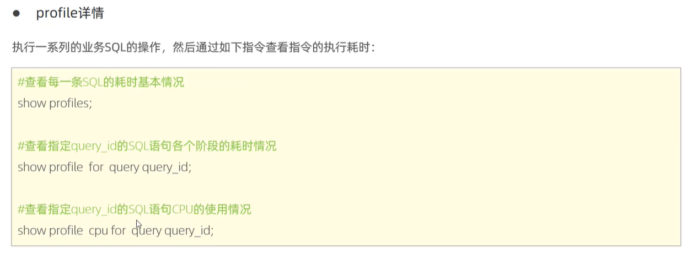
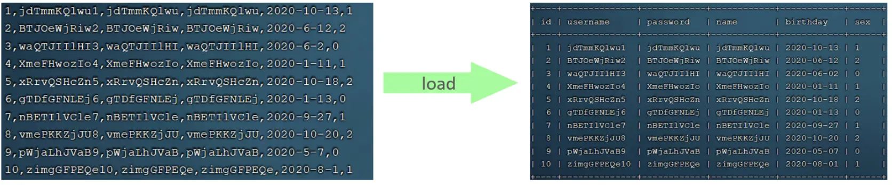

数据库索引是一种数据结构，用于提高数据库查询的性能。它类似于书籍的目录，可以帮助数据库快速定位和访问特定数据。

优点：

1. 提高查询性能：索引可以加快数据库的查询速度，减少数据扫描的时间，特别是在大型数据库中。
2. 加速数据检索：通过使用索引，数据库可以更快速地定位和检索特定数据，提高数据访问的效率。
3. 提升数据唯一性和完整性：索引可以强制数据的唯一性和完整性，确保数据库中的数据符合预期的要求。
4. 支持排序和聚合操作：索引可以帮助数据库进行排序和聚合操作，提供更快速和高效的数据处理能力。

缺点：

1. 占用存储空间：索引需要额外的存储空间来存储索引数据结构，这可能会增加数据库的存储需求。
2. 增加写操作的成本：当进行插入、更新和删除操作时，索引需要维护和更新，这会增加写操作的成本和时间。
3. 索引选择和优化的复杂性：选择合适的索引和优化查询性能需要一定的专业知识和经验，不当的索引使用可能会导致性能下降。

数据结构演示网址

https://www.cs.usfca.edu/~galles/visualization/Algorithms.html


非叶子节点存放的是向上裂变的数据的值，行成一个索引，不存储具体的数据


哈希索引是一种数据库索引结构，它使用哈希函数将索引键映射到存储桶中，从而加快数据的查找速度。

优点：

1. 快速查找：哈希索引通过哈希函数直接计算索引键的存储位置，因此查找速度非常快，通常是常数时间复杂度。
2. 适用于等值查询：哈希索引适用于等值查询，即通过精确匹配索引键来查找数据，对于这种类型的查询效果非常好。

缺点：

1. 不支持范围查询：哈希索引无法支持范围查询，例如大于、小于或范围内的查询，因为哈希函数是将键映射到一个特定的桶中，而不是按顺序排列。
2. 不支持排序：由于哈希索引中的数据是无序的，所以无法直接支持排序操作，如果需要排序，就需要使用其他索引结构或进行额外的排序操作。
3. 需要较多内存：哈希索引需要预先分配足够的桶来存储索引数据，如果数据量很大或者键的分布不均匀，可能会导致内存占用较高。

数据库索引的类型有多种，其中一些常见的类型包括：

1. B-树索引：B-树（或其变种，如B+树）是最常见的索引类型，用于支持范围查询和排序操作。B-树索引适用于大部分数据库系统，并且可以高效地处理大量的数据。
2. 唯一索引：唯一索引确保索引列中的值是唯一的，用于强制数据的唯一性约束。当插入或更新数据时，数据库会检查唯一索引以确保数据的唯一性。
3. 主键索引：主键索引是一种特殊的唯一索引，用于标识表中的唯一记录。主键索引对于快速查找和连接表格非常有用。
4. 外键索引：外键索引用于连接两个表格之间的关系。它可以帮助维护数据的完整性，并支持通过外键进行数据关联和查询。
5. 全文索引：全文索引用于对文本字段进行全文搜索。它可以加快文本搜索和匹配的速度，并支持高级搜索功能，如关键词匹配和语义搜索。
6. 哈希索引：哈希索引使用哈希函数将索引键映射到存储桶中。它适用于等值查询，可以提供快速的查找速度，但不支持范围查询和排序。
7. 聚集索引和非聚集索引：聚集索引决定了数据在磁盘上的物理排序方式，表格中只能有一个聚集索引。非聚集索引是基于聚集索引或表格的副本创建的，用于提高特定查询的性能。


回表查询既有好处也有坏处，具体取决于使用场景和需求。

好处：

1. 提高查询性能：回表查询可以减少磁盘访问次数，加快查询速度，特别是在处理大量数据时。
2. 减少系统资源消耗：通过优化查询，回表查询可以减少系统资源的使用，提高数据库的整体性能。
3. 改善用户体验：快速的查询响应时间可以提高用户体验，特别是在需要快速获取结果的情况下。

坏处：

1. 额外的存储空间占用：回表查询需要创建额外的索引，这可能会增加存储空间的占用。
2. 维护成本增加：由于回表查询需要额外的索引，因此在数据更新和插入时可能需要额外的维护工作，增加了系统的复杂性和维护成本。
3. 不适用于所有场景：回表查询对于某些特定的查询场景可能并不适用，因此需要根据具体需求进行权衡和选择。

总的来说，回表查询是一种优化技术，可以提高查询性能，但在使用时需要综合考虑其优缺点，并根据具体情况进行选择。


# SQL性能分析：

## 一、看SQL的执行频率，到底是以查询为主，还是增删改为主

主要优化以查询为主的SQL


```sql
#查询全局的sql语句执行次数
show global status like 'com_______'
```

## 二、查看慢查询日志

```SQL

#查看慢查询日志是否开启
show VARIABLES LIKE 'slow_query_log';
```

可以看到slow_query_log的值是OFF，也就是mysql默认是不启用慢查询日志的。

这里还有个long_query_time，默认是10秒，也就是超过了10秒即为慢查询。

log_queries_not_using_indexes，如果设置为ON，则会将所有没有使用索引的查询都记录为慢查询。

开启慢查询日志

```
set global slow_query_log='ON';

```

linux设置


## profile详情

有些sql语句，执行的业务很简单，但是却浪费了不必要的时间，也需要优化

```
#查看profile详情
select @@have_profiling;
```



## 执行计划


8.0.13版本优化掉了，是用了局部扫描代替了全表扫描

索引的最左前缀法则（Leftmost Prefix Rule for Indexing）是数据库中常用的索引策略之一。

在数据库中，索引用于加快数据的检索速度。最左前缀法则指定了在创建复合索引（Composite Index）时，索引的列顺序非常重要。它要求在复合索引中，只有最左边的列被用于查询时才能充分利用索引。

具体来说，如果一个复合索引包含多个列（比如(A, B, C)），那么只有以最左边的列开始的查询才能使用索引进行高效的匹配。例如，当查询条件中只涉及到列A时，索引可以被充分利用。但是，如果查询条件只涉及到列B或列C，而不涉及到列A，那么索引的效果将大打折扣，可能无法使用索引进行高效的查询。

因此，在设计数据库表和索引时，根据实际的查询需求和频率，需要仔细考虑列的顺序，将最常用的列放在最左边，以便充分利用最左前缀法则，提高查询性能。

需要注意的是，最左前缀法则并不适用于所有类型的查询，特别是涉及到范围查询、排序和分组等操作时可能会有一些例外情况。因此，在实际应用中，还需要根据具体的查询场景进行综合考虑和测试，选择合适的索引策略。


## 索引失效场景：

一、不要对用了索引的列进行函数运算；

二、字符串类型字段使用时，该加单引号的查询条件，没加单引号；

三、模糊查询，如果仅仅只是尾部模糊查询，索引不会失效；如果是头部模糊匹配，则会失效

MySQL索引失效的原因有多种，以下是一些常见的情况：

1. 不适当的索引设计：索引的设计需要根据实际的查询需求进行优化。如果没有正确选择索引列、索引类型或者索引顺序，就可能导致索引失效。
2. 数据量过大：当数据量过大时，索引的效果可能会减弱甚至失效。例如，如果某个列的基数（唯一值的数量）很低，而数据量很大，那么使用该列作为索引可能会导致索引失效。
3. 数据类型不匹配：当查询条件中的数据类型与索引列的数据类型不匹配时，MySQL可能无法使用索引进行匹配，从而导致索引失效。
4. 使用函数或表达式：如果查询中使用了函数或表达式，MySQL可能无法使用索引进行匹配。例如，对索引列进行函数操作或使用表达式进行计算，都可能导致索引失效。
5. 查询优化器选择性失效：MySQL的查询优化器负责决定如何使用索引来执行查询。有时，优化器可能会错误地选择不使用索引或者选择错误的索引，从而导致索引失效。
6. 数据分布不均匀：如果数据在索引列上的分布不均匀，可能会导致索引失效。例如，某个索引列的值集中在某个范围内，而查询条件不在这个范围内，那么索引可能无法有效地过滤数据。

针对以上情况，可以通过以下方法来解决索引失效的问题：

- 重新评估索引设计，根据实际的查询需求进行优化。
- 分析查询执行计划，了解优化器的选择，并考虑使用强制索引来指导查询执行。
- 确保查询条件中的数据类型与索引列的数据类型匹配。
- 避免在索引列上使用函数或表达式进行操作。
- 对于数据分布不均匀的情况，可以考虑使用分区技术或调整数据分布来改善索引效果。

需要根据具体的场景和查询需求来分析和解决索引失效的问题。

## 索引的使用规则


如果执行全表扫面比走索引查询效率高，则MySQL会评估这个效率，走全表而不是走索引

反之亦然

## SQL提示

人为的告诉数据库，需要执行哪些操作，需要用到哪些索引


比较长的字符串或者大文本字段


# SQL优化

## 插入数据

* insert

如果我们需要一次性往数据库表中插入多条记录，可以从以下三个方面进行优化。

```sql
insert into tb_test values(1,'tom');

insert into tb_test values(2,'cat');

insert into tb_test values(3,'jerry');

.....
```

1. 优化方案一:

批量插入数据

```sql
Insert into tb_test values(1,'Tom'),(2,'Cat'),(3,'Jerry');
```

2. 优化方案二

手动控制事务

```sql
start transaction;

insert into tb_test values(1,'Tom'),(2,'Cat'),(3,'Jerry');

insert into tb_test values(4,'Tom'),(5,'Cat'),(6,'Jerry');

insert into tb_test values(7,'Tom'),(8,'Cat'),(9,'Jerry');

commit;
```

3. 优化方案三

主键顺序插入，性能要高于乱序插入。

```sql
主键乱序插入 : 8 1 9 21 88 2 4 15 89 5 7 3
主键顺序插入 : 1 2 3 4 5 7 8 9 15 21 88 89
```

### 大批量插入数据

如果一次性需要插入大批量数据(比如: 几百万的记录)，使用insert语句插入性能较低，此时可以使用MySQL数据库提供的load指令进行插入。操作如下：



#### load指令如何执行

可以执行如下指令，将数据脚本文件中的数据加载到表结构中：

```sql
-- 客户端连接服务端时，加上参数 -–local-infile
mysql –-local-infile -u root -p

-- 设置全局参数local_infile为1，开启从本地加载文件导入数据的开关
set global local_infile = 1;

-- 执行load指令将准备好的数据，加载到表结构中
load data local infile '/root/sql1.log' into table tb_user fields terminated by ',' lines terminated by '\n' ;
```

> 主键顺序插入性能高于乱序插入

实例演示：

1. 创建表结构

```sql
CREATE TABLE `tb_user` (
	`id` INT(11) NOT NULL AUTO_INCREMENT,
	`username` VARCHAR(50) NOT NULL,
	`password` VARCHAR(50) NOT NULL,
	`name` VARCHAR(20) NOT NULL,
	`birthday` DATE DEFAULT NULL,
	`sex` CHAR(1) DEFAULT NULL,
	PRIMARY KEY (`id`),
	UNIQUE KEY `unique_user_username` (`username`)
) ENGINE=INNODB DEFAULT CHARSET=utf8 ;
```

2. 设置参数

```sql
-- 客户端连接服务端时，加上参数 -–local-infile
mysql –-local-infile -u root -p

-- 设置全局参数local_infile为1，开启从本地加载文件导入数据的开关
set global local_infile = 1;
```

3. load加载数据

```sql
load data local infile '/root/load_user_100w_sort.sql' into table tb_user fields terminated by ',' lines terminated by '\n' ;
```

```sql
mysql> load data local infile '/root/load_user_100w_sort.sql' into table tb_user fields terminated by ',' lines terminated by '\n' ;
Query OK, 1000000 rows affected (15.47 sec)
Records: 1000000  Deleted: 0  Skipped: 0  Warnings: 0

mysql> select count(*) from tb_user;
+----------+
| count(*) |
+----------+
|  1000000 |
+----------+
1 row in set (0.31 sec)
```

我们看到，插入100w的记录，15.47s就完成了，性能很好。

> 在load时，主键顺序插入性能高于乱序插入

## 主键优化

在上一小节，我们提到，主键顺序插入的性能是要高于乱序插入的。 这一小节，就来介绍一下具体的原因，然后再分析一下主键又该如何设计。

### 数据组织方式

在InnoDB存储引擎中， =表数据都是根据主键顺序组织存放的= ，这种存储方式的表称为索引组织表(index organized table IOT)。


行数据，都是存储在聚集索引的叶子节点上的。而我们之前也讲解过InnoDB的逻辑结构图：


在InnoDB引擎中，数据行是记录在逻辑结构 page 页中的，而每一个页的大小是固定的，默认16K。那也就意味着， 一个页中所存储的行也是有限的，如果插入的数据行row在该页存储不小，将会存储到下一个页中，页与页之间会通过指针连接。

### *页分裂(主键顺序插入的时候，不会发生，但是乱序插入的时候会发生)

页可以为空，也可以填充一半，也可以填充100%。每个页包含了2-N行数据(如果一行数据过大，会行溢出)，根据主键排列。

* 主键顺序插入效果

  * 从磁盘中申请页， 主键顺序插入

  

  * 第一个页没有满，继续往第一页插入
    
  * 当第一个也写满之后，再写入第二个页，页与页之间会通过指针连接
    
  * 当第二页写满了，再往第三页写入
    
* 主键乱序插入效果

  * 加入1#,2#页都已经写满了，存放了如图所示的数据

  

  * 此时再插入id为50的记录，我们来看看会发生什么现象
    会再次开启一个页，写入新的页中吗？
    
    不会。因为，索引结构的叶子节点是有顺序的。按照顺序，应该存储在47之后。
    
    但是47所在的1#页，已经写满了，存储不了50对应的数据了。 那么此时会开辟一个新的页 3#。
    
    但是并不会直接将50存入3#页，而是会将1#页后一半的数据，移动到3#页，然后在3#页，插入50。
    
    移动数据，并插入id为50的数据之后，那么此时，这三个页之间的数据顺序是有问题的。 1#的下一个 页，应该是3#， 3#的下一个页是2#。 所以，此时，需要重新设置链表指针。
    
    **上述的这种现象，称之为 " =页分裂= "，是比较耗费性能的操作。**
* ### 页合并
* ### 目前表中已有数据的索引结构(叶子节点)如下：
* 

  * 当我们对已有数据进行删除时，具体的效果如下:
  * 当删除一行记录时，实际上记录并没有被物理删除，只是记录被标记（flaged）为删除并且它的空间变得允许被其他记录声明使用。
    
  * 当我们继续删除2#的数据记录
    
  * 当页中删除的记录达到 `MERGE_THRESHOLD`（默认为页的50%），InnoDB会开始寻找最靠近的页（前 或后）看看是否可以将两个页合并以优化空间使用。
    
  * 删除数据，并将=页合并=之后，再次插入新的数据21，则直接插入3#页
    
  * 这个里面所发生的合并页的这个现象，就称之为 " =页合并= "。

知识小贴士：

`MERGE_THRESHOLD`：合并页的阈值，可以自己设置，在创建表或者创建索引时指定。

### 索引设计原则

1.满足业务需求的情况下，尽量降低主键的长度。

2.插入数据时，尽量选择顺序插入，选择使用 `AUTO_INCREMENT`自增主键。

3.尽量不要使用 `UUID做主键`或者是 `其他自然主键`，如身份证号。

4.业务操作时，`避免对主键的修改`。


## order by 优化

MySQL的排序，有两种方式：

`Using filesort` : 通过表的索引或全表扫描，读取满足条件的数据行，然后在排序缓冲区sort buffer中完成排序操作，所有不是通过索引直接返回排序结果的排序都叫 FileSort 排序。

`Using index` : 通过有序索引顺序扫描直接返回有序数据，这种情况即为 using index，不需要额外排序，操作效率高。

对于以上的两种排序方式，`Using index`的性能高，而 `Using filesort`的性能低，我们在优化排序操作时，尽量要优化为 `Using index`。

接下来，我们来做一个测试：

1. 数据准备

把之前测试时，为tb_user表所建立的部分索引直接删除掉

```sql
drop index idx_user_phone on tb_user;
drop index idx_user_phone_name on tb_user;
drop index idx_user_name on tb_user;
```

```sql
mysql> show index from tb_user;
+---------+------------+----------------------+--------------+-------------+-----------+-------------+----------+--------+------+------------+---------+---------------+---------+------------+
| Table   | Non_unique | Key_name             | Seq_in_index | Column_name | Collation | Cardinality | Sub_part | Packed | Null | Index_type | Comment | Index_comment | Visible | Expression |
+---------+------------+----------------------+--------------+-------------+-----------+-------------+----------+--------+------+------------+---------+---------------+---------+------------+
| tb_user |          0 | PRIMARY              |            1 | id          | A         |          23 |     NULL |   NULL |      | BTREE      |         |               | YES     | NULL       |
| tb_user |          0 | idx_user_phone       |            1 | phone       | A         |          24 |     NULL |   NULL |      | BTREE      |         |               | YES     | NULL       |
| tb_user |          0 | idx_user_phone_name  |            1 | phone       | A         |      935064 |     NULL |   NULL |      | BTREE      |         |               | YES     | NULL       |
| tb_user |          0 | idx_user_phone_name  |            2 | name        | A         |      951995 |     NULL |   NULL |      | BTREE      |         |               | YES     | NULL       |
| tb_user |          1 | idx_user_name        |            1 | name        | A         |          24 |     NULL |   NULL |      | BTREE      |         |               | YES     | NULL       |
| tb_user |          1 | idx_user_pro_age_sta |            1 | profession  | A         |          16 |     NULL |   NULL | YES  | BTREE      |         |               | YES     | NULL       |
| tb_user |          1 | idx_user_pro_age_sta |            2 | age         | A         |          22 |     NULL |   NULL | YES  | BTREE      |         |               | YES     | NULL       |
| tb_user |          1 | idx_user_pro_age_sta |            3 | status      | A         |          24 |     NULL |   NULL | YES  | BTREE      |         |               | YES     | NULL       |
| tb_user |          1 | idx_user_pro         |            1 | profession  | A         |          16 |     NULL |   NULL | YES  | BTREE      |         |               | YES     | NULL       |
| tb_user |          1 | idx_email_5          |            1 | email       | A         |          23 |        5 |   NULL | YES  | BTREE      |         |               | YES     | NULL       |
+---------+------------+----------------------+--------------+-------------+-----------+-------------+----------+--------+------+------------+---------+---------------+---------+------------+
10 rows in set (0.00 sec)

mysql> drop index idx_user_phone on tb_user;
Query OK, 0 rows affected (0.02 sec)
Records: 0  Duplicates: 0  Warnings: 0

mysql> drop index idx_user_phone_name on tb_user;
Query OK, 0 rows affected (0.00 sec)
Records: 0  Duplicates: 0  Warnings: 0

mysql> drop index idx_user_name on tb_user;
Query OK, 0 rows affected (0.01 sec)
Records: 0  Duplicates: 0  Warnings: 0
```

2. 执行排序SQL

```sql
explain select id,age,phone from tb_user order by age;
```

```sql
mysql> explain select id,age,phone from tb_user order by age;
+----+-------------+---------+------------+------+---------------+------+---------+------+--------+----------+----------------+
| id | select_type | table   | partitions | type | possible_keys | key  | key_len | ref  | rows   | filtered | Extra          |
+----+-------------+---------+------------+------+---------------+------+---------+------+--------+----------+----------------+
|  1 | SIMPLE      | tb_user | NULL       | ALL  | NULL          | NULL | NULL    | NULL | 971649 |   100.00 | Using filesort |
+----+-------------+---------+------------+------+---------------+------+---------+------+--------+----------+----------------+
1 row in set, 1 warning (0.00 sec)
```

```sql
explain select id,age,phone from tb_user order by age, phone ;
```

```sql
mysql> explain select id,age,phone from tb_user order by age, phone;
+----+-------------+---------+------------+------+---------------+------+---------+------+--------+----------+----------------+
| id | select_type | table   | partitions | type | possible_keys | key  | key_len | ref  | rows   | filtered | Extra          |
+----+-------------+---------+------------+------+---------------+------+---------+------+--------+----------+----------------+
|  1 | SIMPLE      | tb_user | NULL       | ALL  | NULL          | NULL | NULL    | NULL | 971649 |   100.00 | Using filesort |
+----+-------------+---------+------------+------+---------------+------+---------+------+--------+----------+----------------+
1 row in set, 1 warning (0.00 sec)
```

由于 age, phone 都没有索引，所以此时再排序时，出现Using filesort， 排序性能较低。

3. 创建索引

```sql
-- 创建索引
create index idx_user_age_phone_aa on tb_user(age,phone);
```

4. 创建索引后，根据age, phone进行升序排序

```sql
explain select id,age,phone from tb_user order by age;
```

```sql
mysql> explain select id,age,phone from tb_user order by age;
+----+-------------+---------+------------+-------+---------------+-----------------------+---------+------+--------+----------+-------------+
| id | select_type | table   | partitions | type  | possible_keys | key                   | key_len | ref  | rows   | filtered | Extra       |
+----+-------------+---------+------------+-------+---------------+-----------------------+---------+------+--------+----------+-------------+
|  1 | SIMPLE      | tb_user | NULL       | index | NULL          | idx_user_age_phone_aa | 48      | NULL | 971649 |   100.00 | Using index |
+----+-------------+---------+------------+-------+---------------+-----------------------+---------+------+--------+----------+-------------+
1 row in set, 1 warning (0.00 sec)
```

建立索引之后，再次进行排序查询，就由原来的Using filesort， 变为了 Using index，性能就是比较高的了。

5. 创建索引后，根据age, phone进行降序排序

```sql
explain select id,age,phone from tb_user order by age desc , phone desc;
```

```sql
mysql> explain select id,age,phone from tb_user order by age desc , phone desc ;
+----+-------------+---------+------------+-------+---------------+-----------------------+---------+------+--------+----------+----------------------------------+
| id | select_type | table   | partitions | type  | possible_keys | key                   | key_len | ref  | rows   | filtered | Extra                            |
+----+-------------+---------+------------+-------+---------------+-----------------------+---------+------+--------+----------+----------------------------------+
|  1 | SIMPLE      | tb_user | NULL       | index | NULL          | idx_user_age_phone_aa | 48      | NULL | 971649 |   100.00 | Backward index scan; Using index |
+----+-------------+---------+------------+-------+---------------+-----------------------+---------+------+--------+----------+----------------------------------+
1 row in set, 1 warning (0.00 sec)
```

也出现 Using index， 但是此时Extra中出现了 `Backward index scan`，这个代表反向扫描索引，因为在MySQL中我们创建的索引，默认索引的叶子节点是从小到大排序的，而此时我们查询排序时，是从大到小，所以，在扫描时，就是反向扫描，就会出现 Backward index scan。  =在MySQL8版本中，支持降序索引，我们也可以创建降序索引= 。

6. 根据phone，age进行升序排序，phone在前，age在后。

```sql
explain select id,age,phone from tb_user order by phone , age;
```

```sql
mysql> explain select id,age,phone from tb_user order by phone , age;
+----+-------------+---------+------------+-------+---------------+-----------------------+---------+------+--------+----------+-----------------------------+
| id | select_type | table   | partitions | type  | possible_keys | key                   | key_len | ref  | rows   | filtered | Extra                       |
+----+-------------+---------+------------+-------+---------------+-----------------------+---------+------+--------+----------+-----------------------------+
|  1 | SIMPLE      | tb_user | NULL       | index | NULL          | idx_user_age_phone_aa | 48      | NULL | 971649 |   100.00 | Using index; Using filesor |
+----+-------------+---------+------------+-------+---------------+-----------------------+---------+------+--------+----------+-----------------------------+
1 row in set, 1 warning (0.00 sec)
```

排序时,也需要满足最左前缀法则,否则也会出现 `filesort`。因为在创建索引的时候， age是第一个字段，phone是第二个字段，所以排序时，也就该按照这个顺序来，否则就会出现 `Usingfilesort`。

7. 根据age, phone进行降序一个升序，一个降序

```sql
explain select id,age,phone from tb_user order by age asc , phone desc;
```

```sql
mysql> explain select id,age,phone from tb_user order by age asc , phone desc;
+----+-------------+---------+------------+-------+---------------+-----------------------+---------+------+--------+----------+-----------------------------+
| id | select_type | table   | partitions | type  | possible_keys | key                   | key_len | ref  | rows   | filtered | Extra                       |
+----+-------------+---------+------------+-------+---------------+-----------------------+---------+------+--------+----------+-----------------------------+
|  1 | SIMPLE      | tb_user | NULL       | index | NULL          | idx_user_age_phone_aa | 48      | NULL | 971649 |   100.00 | Using index; Using filesort |
+----+-------------+---------+------------+-------+---------------+-----------------------+---------+------+--------+----------+-----------------------------+
1 row in set, 1 warning (0.00 sec)
```

因为创建索引时，如果未指定顺序，默认都是按照升序排序的，而查询时，一个升序，一个降序，此时就会出现Using filesort。


为了解决上述的问题，我们可以创建一个索引，这个联合索引中 age 升序排序，phone 倒序排序。

8. 创建联合索引(age 升序排序，phone 倒序排序)

```sql
create index idx_phone_age_ad on tb_user(age asc,phone desc);
```


9. 然后再次执行如下SQL

```sql
explain select id,age,phone from tb_user order by age asc,phone desc;
```

```sql
mysql> explain select id,age,phone from tb_user order by age asc,phone desc;
+----+-------------+---------+------------+-------+---------------+------------------+---------+------+--------+----------+-------------+
| id | select_type | table   | partitions | type  | possible_keys | key              | key_len | ref  | rows   | filtered | Extra       |
+----+-------------+---------+------------+-------+---------------+------------------+---------+------+--------+----------+-------------+
|  1 | SIMPLE      | tb_user | NULL       | index | NULL          | idx_phone_age_ad | 48      | NULL | 971649 |   100.00 | Using index |
+----+-------------+---------+------------+-------+---------------+------------------+---------+------+--------+----------+-------------+
1 row in set, 1 warning (0.01 sec)
```

升序/降序联合索引结构图示:


由上述的测试,我们得出 `order by优化原则`:

1. 根据排序字段建立合适的索引，多字段排序时，也 =遵循最左前缀法则= 。
2. 尽量使用覆盖索引。
3. 多字段排序, 一个升序一个降序，此时需要 =注意联合索引在创建时的规则（ASC/DESC）= 。
4. 如果不可避免的出现filesort，大数据量排序时，可以适当增大排序缓冲区大小 `sort_buffer_size(默认256k)`。

## group by 优化

分组操作，我们主要来看看索引对于分组操作的影响。

首先我们先将 tb_user 表的索引全部删除掉 。

```sql
drop index idx_user_pro_age_sta on tb_user;
drop index idx_email_5 on tb_user;
drop index idx_user_age_phone_aa on tb_user;
drop index idx_user_age_phone_ad on tb_user;
```

```sql
mysql> show index from tb_user;
+---------+------------+----------+--------------+-------------+-----------+-------------+----------+--------+------+------------+---------+---------------+---------+------------+
| Table   | Non_unique | Key_name | Seq_in_index | Column_name | Collation | Cardinality | Sub_part | Packed | Null | Index_type | Comment | Index_comment | Visible | Expression |
+---------+------------+----------+--------------+-------------+-----------+-------------+----------+--------+------+------------+---------+---------------+---------+------------+
| tb_user |          0 | PRIMARY  |            1 | id          | A         |          23 |     NULL |   NULL |      | BTREE      |         |               | YES     | NULL       |
+---------+------------+----------+--------------+-------------+-----------+-------------+----------+--------+------+------------+---------+---------------+---------+------------+
1 row in set (0.00 sec)
```

接下来，在没有索引的情况下，执行如下SQL，查询执行计划：

```sql
explain select profession , count(*) from tb_user group by profession;
```

```sql
mysql> explain select profession , count(*) from tb_user group by profession ;
+----+-------------+---------+------------+------+---------------+------+---------+------+--------+----------+-----------------+
| id | select_type | table   | partitions | type | possible_keys | key  | key_len | ref  | rows   | filtered | Extra           |
+----+-------------+---------+------------+------+---------------+------+---------+------+--------+----------+-----------------+
|  1 | SIMPLE      | tb_user | NULL       | ALL  | NULL          | NULL | NULL    | NULL | 971649 |   100.00 | Using temporary |
+----+-------------+---------+------------+------+---------------+------+---------+------+--------+----------+-----------------+
1 row in set, 1 warning (0.00 sec)
```

然后，我们在针对于 profession ， age， status 创建一个联合索引。

```sql
create index idx_pro_age_sta on tb_user(profession,age,status);
```

紧接着，再执行前面相同的SQL查看执行计划。

```sql
mysql> explain select profession , count(*) from tb_user group by profession;
+----+-------------+---------+------------+-------+-----------------+-----------------+---------+------+--------+----------+-------------+
| id | select_type | table   | partitions | type  | possible_keys   | key             | key_len | ref  | rows   | filtered | Extra       |
+----+-------------+---------+------------+-------+-----------------+-----------------+---------+------+--------+----------+-------------+
|  1 | SIMPLE      | tb_user | NULL       | index | idx_pro_age_sta | idx_pro_age_sta | 54      | NULL | 971649 |   100.00 | Using index |
+----+-------------+---------+------------+-------+-----------------+-----------------+---------+------+--------+----------+-------------+
1 row in set, 1 warning (0.00 sec)
```

再执行如下的分组查询SQL，查看执行计划：

```sql
mysql> explain select profession , count(*) from tb_user group by profession,age;
+----+-------------+---------+------------+-------+-----------------+-----------------+---------+------+--------+----------+-------------+
| id | select_type | table   | partitions | type  | possible_keys   | key             | key_len | ref  | rows   | filtered | Extra       |
+----+-------------+---------+------------+-------+-----------------+-----------------+---------+------+--------+----------+-------------+
|  1 | SIMPLE      | tb_user | NULL       | index | idx_pro_age_sta | idx_pro_age_sta | 54      | NULL | 971649 |   100.00 | Using index |
+----+-------------+---------+------------+-------+-----------------+-----------------+---------+------+--------+----------+-------------+
1 row in set, 1 warning (0.00 sec)

mysql> explain select age , count(*) from tb_user group by age;
+----+-------------+---------+------------+-------+-----------------+-----------------+---------+------+--------+----------+------------------------------+
| id | select_type | table   | partitions | type  | possible_keys   | key             | key_len | ref  | rows   | filtered | Extra                        |
+----+-------------+---------+------------+-------+-----------------+-----------------+---------+------+--------+----------+------------------------------+
|  1 | SIMPLE      | tb_user | NULL       | index | idx_pro_age_sta | idx_pro_age_sta | 54      | NULL | 971649 |   100.00 | Using index; Using temporary |
+----+-------------+---------+------------+-------+-----------------+-----------------+---------+------+--------+----------+------------------------------+
1 row in set, 1 warning (0.00 sec)
```

我们发现，如果仅仅根据 `age`分组，就会出现 `Using temporary` ；而如果是 根据 `profession,age`两个字段同时分组，则不会出现 `Using temporary`。原因是因为对于分组操作，在联合索引中，也是=符合最左前缀法则=的。

所以，在分组操作中，我们需要通过以下两点进行优化，以提升性能：

1. 在分组操作时，可以通过索引来提高效率。
2. 分组操作时，索引的使用也是满足最左前缀法则的。

## limit 优化

在数据量比较大时，如果进行limit分页查询，在查询时，越往后，分页查询效率越低。

我们一起来看看执行limit分页查询耗时对比：

```sql
mysql> select * from tb_user limit 0,10;
10 rows in set (0.00 sec)

mysql> select * from tb_user limit 100,10;
10 rows in set (0.00 sec)

mysql> select * from tb_user limit 1000,10;
10 rows in set (0.00 sec)

mysql> select * from tb_user limit 50000,10;
10 rows in set (0.01 sec)

mysql> select * from tb_user limit 500000,10;
10 rows in set (0.16 sec)

mysql> select * from tb_user limit 900000,10;
10 rows in set (0.28 sec)
```

通过测试我们会看到，越往后，分页查询效率越低，这就是分页查询的问题所在。

因为，当在进行分页查询时，如果执行 limit 2000000,10 ，此时需要MySQL排序前2000010 记录，仅仅返回 2000000 - 2000010 的记录，其他记录丢弃，查询排序的代价非常大 。

优化思路: 一般分页查询时，通过创建 覆盖索引 能够比较好地提高性能，可以通过**覆盖索引加子查询形式**进行优化。

```sql
explain select u.* from tb_user u,(select id from tb_user order by id limit 900000,10) a where u.id = a.id;
```

```sql
mysql> explain select u.* from tb_user u,(select id from tb_user order by id limit 900000,10) a where u.id = a.id;
+----+-------------+------------+------------+--------+---------------+---------+---------+------+--------+----------+-------------+
| id | select_type | table      | partitions | type   | possible_keys | key     | key_len | ref  | rows   | filtered | Extra       |
+----+-------------+------------+------------+--------+---------------+---------+---------+------+--------+----------+-------------+
|  1 | PRIMARY     | <derived2> | NULL       | ALL    | NULL          | NULL    | NULL    | NULL | 900010 |   100.00 | NULL        |
|  1 | PRIMARY     | u          | NULL       | eq_ref | PRIMARY       | PRIMARY | 4       | a.id |      1 |   100.00 | NULL        |
|  2 | DERIVED     | tb_user    | NULL       | index  | NULL          | PRIMARY | 4       | NULL | 900010 |   100.00 | Using index |
+----+-------------+------------+------------+--------+---------------+---------+---------+------+--------+----------+-------------+
3 rows in set, 1 warning (0.00 sec)
```

## count 优化

```sql
 select count(*) from tb_user;
```

在之前的测试中，我们发现，如果数据量很大，在执行count操作时，是非常耗时的。

* MyISAM 引擎把一个表的总行数存在了磁盘上，因此执行 count(*) 的时候会直接返回这个数，效率很高； 但是如果是带条件的count，MyISAM也慢。
* InnoDB 引擎就麻烦了，它执行 count(*) 的时候，需要把数据一行一行地从引擎里面读出来，然后累积计数。

如果说要大幅度提升InnoDB表的count效率，主要的优化思路：自己计数(可以借助于redis这样的数据库进行,但是如果是带条件的count又比较麻烦了)。

### count 用法

count() 是一个聚合函数，对于返回的结果集，一行行地判断，如果 count 函数的参数不是NULL，累计值就加 1，否则不加，最后返回累计值。

用法：`count（*）`、`count（主键）`、`count（字段）`、`count（数字）`

| count 用法  | 含义                                                                                                                                                                                                                            |
| ----------- | ------------------------------------------------------------------------------------------------------------------------------------------------------------------------------------------------------------------------------- |
| count(主键) | InnoDB 引擎会遍历整张表，把每一行的 主键id 值都取出来，返回给服务层。服务层拿到主键后，直接按行进行累加(主键不可能为null)                                                                                                       |
| count(字段) | 没有not null 约束 : InnoDB 引擎会遍历整张表把每一行的字段值都取出来，返回给服务层，服务层判断是否为null，不为null，计数累加。有not null 约束：InnoDB 引擎会遍历整张表把每一行的字段值都取出来，返回给服务层，直接按行进行累加。 |
| count(数字) | InnoDB 引擎遍历整张表，但不取值。服务层对于返回的每一行，放一个数字“1”进去，直接按行进行累加。                                                                                                                                |
| count(*)    | InnoDB引擎并不会把全部字段取出来，而是专门做了优化，不取值，服务层直接按行进行累加。                                                                                                                                            |

> 按照效率排序的话，count(字段) < count(主键 id) < count(1) ≈ count(*)，所以尽量使用 count(*)。

因为count(*)和count(1)不用取值，直接逐行累加，所以快

## update 优化

我们主要需要注意一下update语句执行时的注意事项。

```sql
update course set name = 'javaEE' where id = 1 ;
```

当我们在执行删除的SQL语句时，会锁定id为1这一行的数据，然后事务提交之后，行锁释放。

但是当我们在执行如下SQL时。

```sql
update course set name = 'SpringBoot' where name = 'PHP' ;
```

当我们开启多个事务，在执行上述的SQL时，我们发现行锁升级为了表锁。 导致该update语句的性能大大降低。

> =InnoDB的行锁是针对索引加的锁，不是针对记录加的锁 ，并且该索引不能失效，否则会从行锁升级为表锁 = 。也就是说我这边事务没有提交的话，其他关于这个表的update都不会执行成功，导致该update语句的性能大大降低。

### 更新的条件字段要加索引，因为InnoDB的行锁是针对索引加的，所以更新条件如果没有索引字段，就会加表锁，在事物没有提交之前，其他人就不能修改这张表里的数据了

# MySQL锁

## 概述

锁是计算机协调多个进程或线程并发访问某一资源的机制。在数据库中，除传统的计算资源（`CPU、RAM、I/O`）的争用以外，数据也是一种供许多用户共享的资源。如何保证数据并发访问的一致性、有效性是所有数据库必须解决的一个问题，锁冲突也是影响数据库并发访问性能的一个重要因素。从这个角度来说，锁对数据库而言显得尤其重要，也更加复杂。

MySQL中的锁，按照锁的粒度分，分为以下三类：

* 全局锁：锁定数据库中的所有表。
* 表级锁：每次操作锁住整张表。
* 行级锁：每次操作锁住对应的行数据。

## 全局锁

### 介绍

全局锁就是对整个数据库实例加锁，加锁后整个实例就处于只读状态，后续的DML的写语句，DDL语句，已经更新操作的事务提交语句都将被阻塞。

其典型的使用场景是做全库的逻辑备份，对所有的表进行锁定，从而获取一致性视图，保证数据的完整性。

为什么全库逻辑备份，就需要加全就锁呢？

A. 我们一起先来分析一下不加全局锁，可能存在的问题。

假设在数据库中存在这样三张表: tb_stock 库存表，tb_order 订单表，tb_orderlog 订单日志表。


* 在进行数据备份时，先备份了tb_stock库存表。
* 然后接下来，在业务系统中，执行了下单操作，扣减库存，生成订单（更新tb_stock表，插入tb_order表）。
* 然后再执行备份 tb_order表的逻辑。
* 业务中执行插入订单日志操作。
* 最后，又备份了tb_orderlog表。

此时备份出来的数据，是存在问题的。因为备份出来的数据，tb_stock表与tb_order表的数据不一致(有最新操作的订单信息,但是库存数没减)。

那如何来规避这种问题呢? 此时就可以借助于MySQL的全局锁来解决。

B. 再来分析一下加了全局锁后的情况


对数据库进行进行逻辑备份之前，先对整个数据库加上全局锁，一旦加了全局锁之后，其他的DDL、DML全部都处于阻塞状态，但是可以执行DQL语句，也就是处于只读状态，而数据备份就是查询操作。那么数据在进行逻辑备份的过程中，数据库中的数据就是不会发生变化的，这样就保证了数据的一致性和完整性。

### 语法

1. 加全局锁

```sql
flush tables with read lock;
```

2. 数据备份

```sql
mysqldump -uroot –p1234 itcast > itcast.sql
```

3. 释放锁

```sql
unlock tables;
```

### 特点

数据库中加全局锁，是一个比较重的操作，存在以下问题：

* 如果在主库上备份，那么在备份期间都不能执行更新，业务基本上就得停摆。
* 如果在从库上备份，那么在备份期间从库不能执行主库同步过来的二进制日志（binlog），会导致主从延迟。

在InnoDB引擎中，我们可以在备份时加上参数 --single-transaction 参数来完成不加锁的一致性数据备份。

```sql
mysqldump --single-transaction -uroot –p123456 itcast > itcast.sql
```

MySQL在某些情况下需要加全局锁，以确保数据的一致性和完整性。以下是一些需要加全局锁的情况：

1. 备份：在进行数据库备份时，为了保证备份的一致性，可以使用全局锁来阻止对数据的修改操作。
2. 数据库迁移：当需要将数据库迁移到其他服务器或进行数据同步时，可以使用全局锁来防止在迁移过程中对数据的修改。
3. 表结构变更：当需要对表结构进行变更操作，如添加、修改或删除表字段时，可以使用全局锁来防止在变更过程中对数据的修改。

需要注意的是，加全局锁会导致数据库的读写操作暂时无法执行，因此在使用全局锁时需要谨慎考虑，并在合适的时间窗口内进行操作，以尽量减少对业务的影响。此外，MySQL也提供了其他更细粒度的锁机制，如表级锁和行级锁，可以根据具体需求选择适当的锁策略。

## 表级锁

### 介绍

表级锁，每次操作锁住整张表。锁定粒度大，发生锁冲突的概率最高，并发度最低。应用在MyISAM、InnoDB、BDB等存储引擎中。

对于表级锁，主要分为以下三类：

* 表锁
* 元数据锁（meta data lock，MDL）
* 意向锁

### 表锁

对于表锁，分为两类：

* 表共享读锁（read lock）
* 表独占写锁（write lock）

语法：

* 加锁：lock tables 表名... read/write。
* 释放锁：unlock tables / 客户端断开连接 。

特点:

A. 读锁


左侧为客户端一，对指定表加了读锁，不会影响右侧客户端二的读，但是会阻塞右侧客户端的写。

测试:


B.写锁


左侧为客户端一，对指定表加了写锁，会阻塞右侧客户端的读和写。

测试:


结论

读锁不会阻塞其他客户端的读，但是会阻塞写。写锁既会阻塞其他客户端的读，又会阻塞其他客户端的写。

### 元数据锁

meta data lock , 元数据锁，简写MDL。

MDL加锁过程是系统自动控制，无需显式使用，在访问一张表的时候会自动加上。MDL锁主要作用是维护表元数据的数据一致性，在表上有活动事务的时候，不可以对元数据进行写入操作。 **为了避免DML与DDL冲突，保证读写的正确性** 。

这里的元数据，大家可以简单理解为就是一张表的表结构。 也就是说，某一张表涉及到未提交的事务时，是不能够修改这张表的表结构的。

在MySQL5.5中引入了MDL，当对一张表进行增删改查的时候，加MDL读锁(共享)；当对表结构进行变更操作的时候，加MDL写锁(排他)。

常见的SQL操作时，所添加的元数据锁：

| 对应SQL                                        | 锁类型                                  | 说明                                             |
| ---------------------------------------------- | --------------------------------------- | ------------------------------------------------ |
| lock tables xxx read/write                     | SHARED_READ_ONLY / SHARED_NO_READ_WRITE |                                                  |
| select 、select ... lock in share mode         | SHARED_READ                             | 与SHARED_READ、SHARED_WRITE兼容，与EXCLUSIVE互斥 |
| insert 、update、delete、select ... for update | SHARED_WRITE                            | 与SHARED_READ、SHARED_WRITE兼容，与EXCLUSIVE互斥 |
| alter table ...                                | EXCLUSIVE                               | 与其他的MDL都互斥                                |

演示：

当执行SELECT、INSERT、UPDATE、DELETE等语句时，添加的是元数据共享锁（SHARED_READ / SHARED_WRITE），之间是兼容的。


当执行SELECT语句时，添加的是元数据共享锁（SHARED_READ），会阻塞元数据排他锁（EXCLUSIVE），之间是互斥的。


我们可以通过下面的SQL，来查看数据库中的元数据锁的情况：

```sql
select object_type,object_schema,object_name,lock_type,lock_duration from performance_schema.metadata_locks;
```

我们在操作过程中，可以通过上述的SQL语句，来查看元数据锁的加锁情况。

```sql
mysql> select object_type,object_schema,object_name,lock_type,lock_duration from performance_schema.metadata_locks;
+-------------+--------------------+----------------+--------------+---------------+
| object_type | object_schema      | object_name    | lock_type    | lock_duration |
+-------------+--------------------+----------------+--------------+---------------+
| TABLE       | MySQL_Advanced     | tb_user        | SHARED_READ  | TRANSACTION   |
| TABLE       | MySQL_Advanced     | tb_user        | SHARED_READ  | TRANSACTION   |
| TABLE       | MySQL_Advanced     | tb_user        | SHARED_WRITE | TRANSACTION   |
| TABLE       | MySQL_Advanced     | user_logs      | SHARED_WRITE | TRANSACTION   |
| TABLE       | performance_schema | metadata_locks | SHARED_READ  | TRANSACTION   |
+-------------+--------------------+----------------+--------------+---------------+
5 rows in set (0.00 sec)
mysql> alter table tb_user add column java int;
...阻塞
```

```sql
-- 另开一个客户端窗口
mysql> select object_type,object_schema,object_name,lock_type,lock_duration from performance_schema.metadata_locks;
+-------------+--------------------+------------------------+---------------------+---------------+
| object_type | object_schema      | object_name            | lock_type           | lock_duration |
+-------------+--------------------+------------------------+---------------------+---------------+
| TABLE       | MySQL_Advanced     | tb_user                | SHARED_READ         | TRANSACTION   |
| GLOBAL      | NULL               | NULL                   | INTENTION_EXCLUSIVE | STATEMENT     |
| BACKUP LOCK | NULL               | NULL                   | INTENTION_EXCLUSIVE | TRANSACTION   |
| SCHEMA      | MySQL_Advanced     | NULL                   | INTENTION_EXCLUSIVE | TRANSACTION   |
| TABLE       | MySQL_Advanced     | tb_user                | SHARED_UPGRADABLE   | TRANSACTION   |
| TABLESPACE  | NULL               | MySQL_Advanced/tb_user | INTENTION_EXCLUSIVE | TRANSACTION   |
| TRIGGER     | MySQL_Advanced     | tb_user_insert_trigger | EXCLUSIVE           | TRANSACTION   |
| TRIGGER     | MySQL_Advanced     | tb_user_update_trigger | EXCLUSIVE           | TRANSACTION   |
| TRIGGER     | MySQL_Advanced     | tb_user_delete_trigger | EXCLUSIVE           | TRANSACTION   |
| TABLE       | MySQL_Advanced     | #sql-261d_18           | EXCLUSIVE           | STATEMENT     |
| TABLE       | MySQL_Advanced     | tb_user                | EXCLUSIVE           | TRANSACTION   |
| TABLE       | performance_schema | metadata_locks         | SHARED_READ         | TRANSACTION   |
+-------------+--------------------+------------------------+---------------------+---------------+
12 rows in set (0.00 sec)
```

### 意向锁

1. 介绍

为了避免DML在执行时，加的行锁与表锁的冲突，在InnoDB中引入了意向锁，使得表锁不用检查每行数据是否加锁，使用意向锁来减少表锁的检查。

假如没有意向锁，客户端一对表加了行锁后，客户端二如何给表加表锁呢，来通过示意图简单分析一下：

首先客户端一，开启一个事务，然后执行DML操作，在执行DML语句时，会对涉及到的行加行锁。

当客户端二，想对这张表加表锁时，会检查当前表是否有对应的行锁，如果没有，则添加表锁，此时就会从第一行数据，检查到最后一行数据，效率较低。


有了意向锁之后 :

客户端一，在执行DML操作时，会对涉及的行加行锁，同时也会对该表加上意向锁。


而其他客户端，在对这张表加表锁的时候，会根据该表上所加的意向锁来判定是否可以成功加表锁，而不用逐行判断行锁情况了。


2. 分类

* **意向共享锁(IS): 由语句select ... lock in share mode添加** 。 **与表锁共享锁(read)兼容，与表锁排他锁(write)互斥** 。
* **意向排他锁(IX)** : **由insert、update、delete、select...for update添加 **。 **与表锁共享锁(read)及排他锁(write)都互斥，意向锁之间不会互斥** 。

> 一旦事务提交了，意向共享锁、意向排他锁，都会自动释放。

可以通过以下SQL，查看意向锁及行锁的加锁情况：

```sql
select object_schema,object_name,index_name,lock_type,lock_mode,lock_data from performance_schema.data_locks;
```

演示：

A. 意向共享锁与表读锁是兼容的


B. 意向排他锁与表读锁、写锁都是互斥的


## 行级锁

### 介绍

行级锁，每次操作锁住对应的行数据。锁定粒度最小，发生锁冲突的概率最低，并发度最高。应用在InnoDB存储引擎中。

InnoDB的数据是基于索引组织的，行锁是通过对索引上的索引项加锁来实现的，而不是对记录加的锁。对于行级锁，主要分为以下三类：

* 行锁（Record Lock）：锁定单个行记录的锁，防止其他事务对此行进行update和delete。在RC、RR隔离级别下都支持。


* 间隙锁（Gap Lock）：锁定索引记录间隙（不含该记录），确保索引记录间隙不变，防止其他事务在这个间隙进行insert，产生幻读。在RR隔离级别下都支持。


* 临键锁（Next-Key Lock）：行锁和间隙锁组合，同时锁住数据，并锁住数据前面的间隙Gap。在RR隔离级别下支持。


### [#](https://frxcat.fun/database/MySQL/MySQL_lock/#%E8%A1%8C%E9%94%81)行锁

1. 介绍

InnoDB实现了以下两种类型的行锁：

* 共享锁（S）：允许一个事务去读一行，阻止其他事务获得相同数据集的排它锁。
* 排他锁（X）：允许获取排他锁的事务更新数据，阻止其他事务获得相同数据集的共享锁和排他 锁。

两种行锁的兼容情况如下:


常见的SQL语句，在执行时，所加的行锁如下：

| SQL                           | 行锁类型   | 说明                                     |
| ----------------------------- | ---------- | ---------------------------------------- |
| INSERT ...                    | 排他锁     | 自动加锁                                 |
| UPDATE ...                    | 排他锁     | 自动加锁                                 |
| DELETE ...                    | 排他锁     | 自动加锁                                 |
| SELECT（正常）                | 不加任何锁 |                                          |
| SELECT ... LOCK IN SHARE MODE | 共享锁     | 需要手动在SELECT之后加LOCK IN SHARE MODE |
| SELECT ... FOR UPDATE         | 排他锁     | 需要手动在SELECT之后加FOR UPDATE         |

2. 演示

默认情况下，InnoDB在 REPEATABLE READ事务隔离级别运行，InnoDB使用 next-key 锁进行搜索和索引扫描，以防止幻读。

* 针对唯一索引进行检索时，对已存在的记录进行等值匹配时，将会自动优化为行锁。
* InnoDB的行锁是针对于索引加的锁，不通过索引条件检索数据，那么InnoDB将对表中的所有记录加锁，此时 就会升级为表锁。

可以通过以下SQL，查看意向锁及行锁的加锁情况：

```sql
select object_schema,object_name,index_name,lock_type,lock_mode,lock_data from performance_schema.data_locks;
```

示例演示

数据准备:

```sql
CREATE TABLE `stu` (
	`id` int NOT NULL PRIMARY KEY AUTO_INCREMENT,
	`name` varchar(255) DEFAULT NULL,
	`age` int NOT NULL
) ENGINE = InnoDB CHARACTER SET = utf8mb4;
INSERT INTO `stu` VALUES (1, 'tom', 1);
INSERT INTO `stu` VALUES (3, 'cat', 3);
INSERT INTO `stu` VALUES (8, 'rose', 8);
INSERT INTO `stu` VALUES (11, 'jetty', 11);
INSERT INTO `stu` VALUES (19, 'lily', 19);
INSERT INTO `stu` VALUES (25, 'luci', 25);
```

演示行锁的时候，我们就通过上面这张表来演示一下。

A.  **普通的select语句，执行时，不会加锁** 。


B. select...lock in share mode，加共享锁， **共享锁与共享锁之间兼容** 。


共享锁与排他锁之间互斥。


客户端一获取的是id为1这行的共享锁，客户端二是可以获取id为3这行的排它锁的，因为不是同一行数据。 而如果客户端二想获取id为1这行的排他锁，会处于阻塞状态，以为共享锁与排他锁之间互斥。

C. **排它锁与排他锁之间互斥**


当客户端一，执行update语句，会为id为1的记录加排他锁； 客户端二，如果也执行update语句更新id为1的数据，也要为id为1的数据加排他锁，但是客户端二会处于阻塞状态，因为排他锁之间是互斥的。 直到客户端一，把事务提交了，才会把这一行的行锁释放，此时客户端二，解除阻塞。

D. **无索引行锁升级为表锁**

stu表中数据如下:

```sql
mysql> select * from stu;
+----+-----+-------+
| id | age | name  |
+----+-----+-------+
|  1 |   1 | Java  |
|  3 |   3 | Java  |
|  8 |   8 | rose  |
| 11 |  11 | jetty |
| 19 |  19 | lily  |
| 25 |  25 | luci  |
+----+-----+-------+
6 rows in set (0.00 sec)
```

我们在两个客户端中执行如下操作:


在客户端一中，开启事务，并执行update语句，更新name为Lily的数据，也就是id为19的记录 。然后在客户端二中更新id为3的记录，却不能直接执行，会处于阻塞状态，为什么呢？

原因就是因为此时，客户端一，根据name字段进行更新时，name字段是没有索引的，如果没有索引，此时行锁会升级为表锁(因为行锁是对索引项加的锁，而name没有索引)。

接下来，我们再针对name字段建立索引，索引建立之后，再次做一个测试：


此时我们可以看到，客户端一，开启事务，然后依然是根据name进行更新。而客户端二，在更新id为3的数据时，更新成功，并未进入阻塞状态。 这样就说明，我们根据索引字段进行更新操作，就可以避免行锁升级为表锁的情况。


### 间隙锁&临键锁

默认情况下，InnoDB在 REPEATABLE READ事务隔离级别运行，InnoDB使用 next-key 锁进行搜索和索引扫描，以防止幻读。

* 索引上的等值查询(唯一索引)，给不存在的记录加锁时, 优化为间隙锁 。
* 索引上的等值查询(非唯一普通索引)，向右遍历时最后一个值不满足查询需求时，next-key lock 退化为间隙锁。
* 索引上的范围查询(唯一索引)--会访问到不满足条件的第一个值为止。

注意:

间隙锁唯一目的是防止其他事务插入间隙。间隙锁可以共存，一个事务采用的间隙锁不会阻止另一个事务在同一间隙上采用间隙锁。

示例演示

A. **索引上的等值查询(唯一索引)，给不存在的记录加锁时, 优化为**间隙锁 。


B. 索引上的等值查询(非唯一普通索引)，向右遍历时最后一个值不满足查询需求时，next-key lock 退化为间隙锁。

介绍分析一下：

我们知道InnoDB的B+树索引，叶子节点是有序的双向链表。 假如，我们要根据这个二级索引查询值为18的数据，并加上共享锁，我们是只锁定18这一行就可以了吗？ 并不是，因为是非唯一索引，这个结构中可能有多个18的存在，所以，在加锁时会继续往后找，找到一个不满足条件的值（当前案例中也就是29）。此时会对18加临键锁，并对29之前的间隙加锁。


C. 索引上的范围查询(唯一索引)--会访问到不满足条件的第一个值为止。


查询的条件为id>=19，并添加共享锁。 此时我们可以根据数据库表中现有的数据，将数据分为三个部分：

[19]

(19,25]

(25,+∞]

所以数据库数据在加锁是，就是将19加了行锁，25的临键锁（包含25及25之前的间隙），正无穷的临键锁(正无穷及之前的间隙)。
