```java
SqlSessionFactory
```

* 一个数据库对应一个 `SqlSessionFactory`对象，通过 `SqlSessionFactory`对象可以创建 `SqlSession`会话
* 一个 `SqlSessionFactory`对象可以开启多个 `SqlSession`会话

## MyBatis框架的特点：

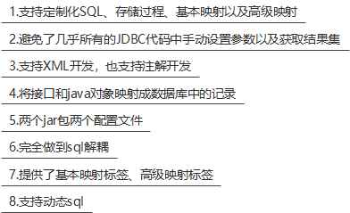

0（MyBatis是半自动化的ORM）

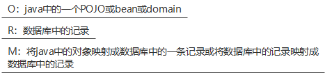

### MyBatis事务管理

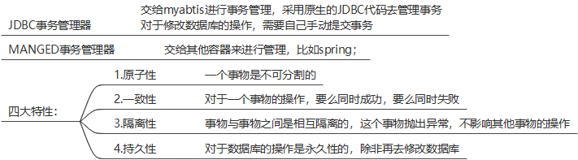

### SqlSessionFactory对象

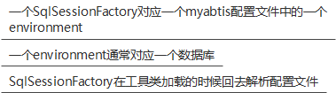

### CRUD

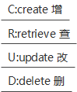

### 占位符

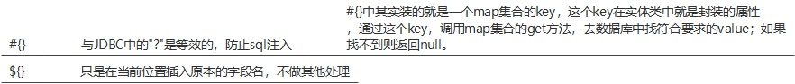

`<dataSource>`中的属性

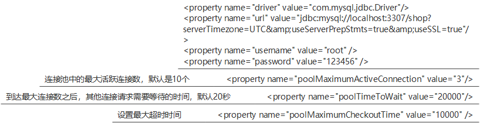

`<properties>`标签

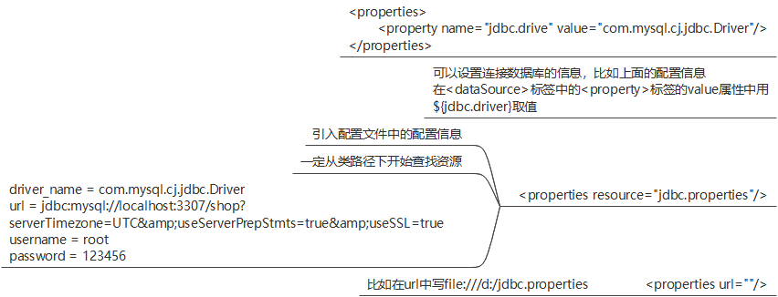

配置文件

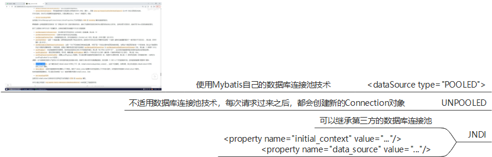

### MyBatis集成日志

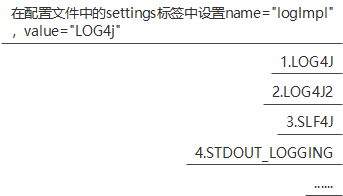

Mybatis传参

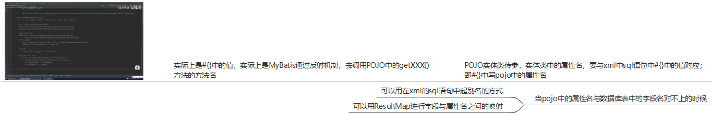

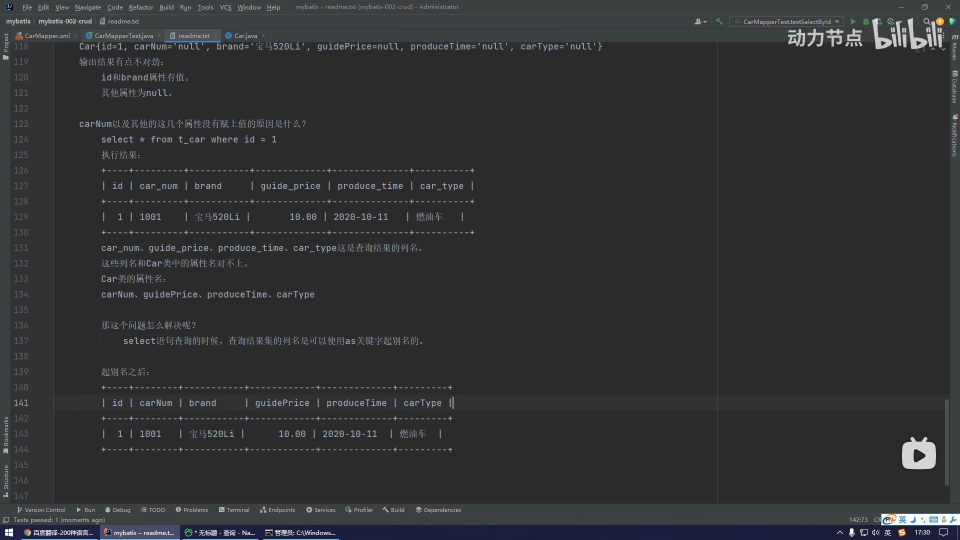

Select结果集

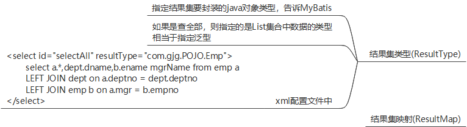

dom4j解析mybatis.xml

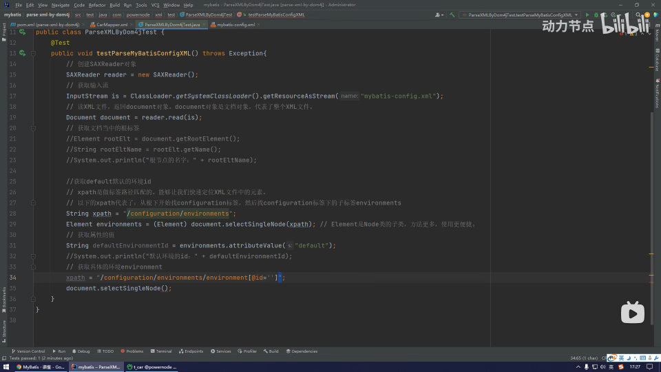

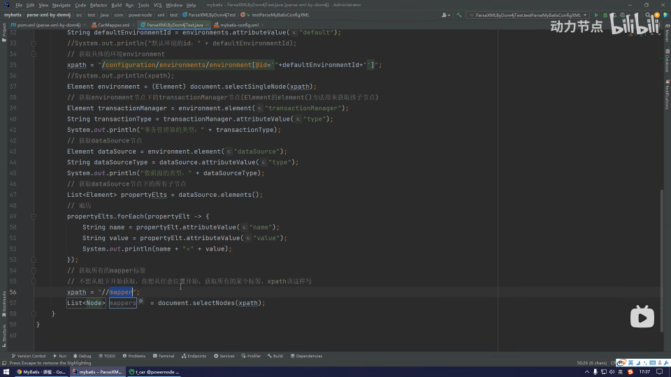

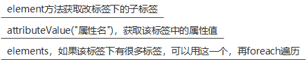

SAXReader对象是dom4j中自带的用来解析mybatis的文件

---

手写mybatis框架

Resources工具类

```java
package com.TBT.godBatis.utils;

import java.io.InputStream;

/**
 * 用来提供一个工具类
 * 该工具类专门用来完成"类路径"下文件的加载
 * @author gjg
 * @Since 1.0
 * @version 1.0
 */
public class Resources {

    //工具类的构造方法都是private的
    private Resources(){}

    /**
     * 从类路径中加载资源文件
     * @param resource 放在类路径中的资源文件
     * @return
     */
    public static InputStream getResourceAsStream(String resource){
        return ClassLoader.getSystemClassLoader().getResourceAsStream(resource);
    }
}
```

SqlSessionFactoryBuilder以流的方式解析配置文件

```java
package com.TBT.godBatis.core;


import java.io.InputStream;

public class SqlSessionFactoryBuilder {

    private SqlSessionFactoryBuilder(){}
    // 解析配置文件，以流的方式
    public static SqlSessionFactory build(InputStream in){
        SqlSessionFactory sqlSessionFactory = new SqlSessionFactory();
        return sqlSessionFactory;
    }
}
```

## 封装mapper中的sql标签

要想封装mapper.xml文件中的标签，可以建一个类去封装这个映射文件中的sql标签，属性就是这个文件中标签的属性

一个类代表一个sql标签，一个对象里有这个sql标签中除了id以外的所有。

**然后把这个类放到Map集合的value中，Map集合的key是这个标签的id**

```java
package com.TBT.godBatis.core;

/**
 * 用来封装sql标签中的sql和resultType
 *
 */
public class MapperStatement {

    private String sql;

    // 结果集类型，有时resultType是null
    private String resultType;


    public MapperStatement() {
    }

    public MapperStatement(String sql, String resultType) {
        this.sql = sql;
        this.resultType = resultType;
    }

    /**
     * 获取
* @return sql
     */
public String getSql() {
        return sql;
    }

    /**
     * 设置
* @param sql
*/
public void setSql(String sql) {
        this.sql = sql;
    }

    /**
     * 获取
* @return resultType
     */
public String getResultType() {
        return resultType;
    }

    /**
     * 设置
* @param resultType
*/
public void setResultType(String resultType) {
        this.resultType = resultType;
    }

    public String toString() {
        return "MapperStatement{sql = " + sql + ", resultType = " + resultType + "}";
    }
}
```

## 定义事务管理接口

```java
package com.TBT.godBatis.core;

public interface Transaction {

    /**
     * 提交事务
*/
void commit();

    /**
     * 回滚事务
*/
void rollback();

    /**
     * 关闭事务
*/
void close();
}
```

## 定义jdbc事务管理类实现事务管理接口

```java
package com.TBT.godBatis.core;

public class JdbcTransaction implements Transaction{

@Override
public void commit() {

    }

    @Override
public void rollback() {

    }

    @Override
public void close() {

    }
}
```

## 有关mybatis.xml中相关标签是怎么来的

```java
<configuration>

    <environments default="development">
        <environment id="development">
            <transactionManager type="JDBC" />
            <dataSource type="POOLED">
                <property name="driver" value="com.mysql.jdbc.Driver"/>
                <property name="url" value="jdbc:mysql://localhost:3307/shop?serverTimezone=UTC&useServerPrepStmts=true&useSSL=true"/>
                <property name="username" value="root" />
                <property name="password" value="123456" />
            </dataSource>
        </environment>
    </environments>
    <mappers>
        <!-- 执行sql映射的，将写sql语句的配置文件路径写在这里 -->
        <!--<mapper resource="com/GJG/mapper/UserMapper.xml"/>-->

        <!-- mapper代理，利用包扫描的方式进行映射 -->
<package name="com.shop.mapper" />
    </mappers>
</configuration>
```

### **1.**

```
<transactionManager type="JDBC" />
```

Mybatis封装了JDBCTransaction类(还有ManagerTransaction类)，实现Transaction接口，并且

Transaction接口中封装了事务的提交、回滚、关闭等操作

```
public class JdbcTransaction implements Transaction{

    /**
     * 数据源属性
*/


@Override
public void commit() {

    }

    @Override
public void rollback() {

    }

    @Override
public void close() {

    }
}
```

### **2.**

```
<dataSource type="POOLED">
    <property name="driver" value="com.mysql.jdbc.Driver"/>
    <property name="url" value="jdbc:mysql://localhost:3307/shop?serverTimezone=UTC&useServerPrepStmts=true&useSSL=true"/>
    <property name="username" value="root" />
    <property name="password" value="123456" />
</dataSource>
```

Mybatis封装了PooledDataSource类(还有UnPooledDataSource类和JNDIDataSource类),都需要实现 `javax.sql.DataSource`

里面封装了数据源对象与连接池的连接操作等

### 3.

手动封装Transaction接口，并用jdbcTransaction实现事务，以及获取连接

```java
public interface Transaction {

    /**
     * 提交事务
     */
    void commit();

    /**
     * 回滚事务
     */
    void rollback();

    /**
     * 关闭事务
     */
    void close();


    /**
     * 打开连接
     */
    void openConnection();

    /**
     * 创建连接对象
     */

    void getConnection();
}
```

封装JDBC事务

```java
public class JdbcTransaction implements Transaction{

    /**
     * 数据源属性
     */
    private DataSource dataSource;

    /**
     * 自动提交事务的标志位
     * true表示自动提交，false表示不开启自动提交
     */
    private boolean autoCommit;

    private Connection connection;

    public JdbcTransaction(DataSource dataSource, boolean autoCommit) {
        this.dataSource = dataSource;
        this.autoCommit = autoCommit;
    }

    @Override
    public void commit() {
        try {
            connection.commit();
        } catch (SQLException e) {
            e.printStackTrace();
        }
    }

    @Override
    public void rollback() {
        try {
            connection.rollback();
        } catch (SQLException e) {
            e.printStackTrace();
        }
    }

    @Override
    public void close() {
        try {
            connection.close();
        } catch (SQLException e) {
            e.printStackTrace();
        }
    }

    @Override
    public void openConnection(){
        if (connection == null){
            try {
                connection = dataSource.getConnection();
            } catch (SQLException e) {
                e.printStackTrace();
            }
        }
    }

    @Override
    public void getConnection() {

    }
}

```

封装SqlSesssionFactoryBuilder

主要实现数据源的解析、mapper映射文件的解析、事务类型的解析

```java
public class SqlSessionFactoryBuilder {

    private SqlSessionFactoryBuilder(){}

    public static SqlSessionFactory build(InputStream in){
        SqlSessionFactory sqlSessionFactory = null;
        try {
            // 解析配置文件
SAXReader saxReader = new SAXReader();
            // 以流的方式读取配置文件的信息
Document document = saxReader.read(in);

            String xpath = "/configuration/environments";
            // 获取配置文件中的根节点信息,获取节点信息就用selectSingleNode
Element environments = (Element) document.selectSingleNode(xpath);
            // 获取environments的type属性
String defaultId = environments.attributeValue("default");
            // 通过defaultId拿到下面的子标签environment
Element environment = (Element) document.selectSingleNode("/configuration/environments/environment[@id='" + defaultId + "']");
            // 拿到对应节点,这里是拿到transactionManager节点
Element transactionManager = environment.element("transactionManager");
            // 获取数据源节点
Element dataSourceEle = environment.element("dataSource");

            // 创建一个集合，用来存放解析到的mapper映射文件
List<String> sqlMapperXMLPathList = new ArrayList<>();
            // 拿到mapper标签对应的resource对应的文件
List<Node> nodes = document.selectNodes("//mapper");
            nodes.forEach(node -> {
                Element element = (Element) node;
                String resource = element.attributeValue("resource");
                sqlMapperXMLPathList.add(resource);
            });

//          获取数据源对象
DataSource dataSource = getDataSource(dataSourceEle);
            // 获取事务管理器，根据对应的事务类型获取相应的事务管理器
Transaction transaction = getTransaction(transactionManager,dataSource);
            // 获取mapper映射文件的信息
Map<String,MapperStatement> mappedStatement = getMappedStatement(sqlMapperXMLPathList);

            sqlSessionFactory = new SqlSessionFactory(transaction,mappedStatement);
        } catch (DocumentException e) {
            e.printStackTrace();
        }


        return sqlSessionFactory;
    }

    /**
     * 解析所有的sqlMapper.xml文件，构建map集合
* @param sqlMapperXMLPathList
* @return
*/
private static Map<String, MapperStatement> getMappedStatement(List<String> sqlMapperXMLPathList) {
        Map<String,MapperStatement> mappedStatements = new HashMap<>();
        sqlMapperXMLPathList.forEach(sqlMapperXMLPath -> { // sqlMapperXMLPath是.xml文件
try {
                // 读取mapper.xml文件
SAXReader saxReader = new SAXReader();
                Document read = saxReader.read(Resources.getResourceAsStream(sqlMapperXMLPath));
                // 读取跟标签
Element mapper = (Element) read.selectSingleNode("mapper");
                // 拿到mapper标签的namespace属性
String namespace = mapper.attributeValue("namespace");
                List<Element> elements = mapper.elements();
                elements.forEach(element -> {
                    // 拿到sql标签的id
String id = element.attributeValue("id");

                    // 防止将来id重复，需要加上命名空间
String sqlId = namespace + "." + id;

                    // 拿到sql标签的resultType属性
String resultType = element.attributeValue("resultType");
                    // 拿到标签中间的sql语句，这个方法自动将sql语句两边的空格去除
String sql = element.getTextTrim();
                    MapperStatement mapperStatement = new MapperStatement(sql,resultType);
                    mappedStatements.put(sqlId,mapperStatement);
                });
            } catch (Exception e) {
                e.printStackTrace();
            }

        });

        return mappedStatements;
    }

    /**
     * 获取事务管理器
* @param transactionManager 事务管理器标签
* @param dataSource    数据源对象
* @return
*/
private static Transaction getTransaction(Element transactionManager, DataSource dataSource) {
        Transaction transaction = null;
        String type = transactionManager.attributeValue("type").trim().toUpperCase();
        if (Const.JDBC_TRANSACTION.equals(type)){
            transaction = new JdbcTransaction(dataSource,false);
        }

        if (Const.MANAGED_TRANSACTION.equals(type)){

        }

        return transaction;
    }

    /**
     * 获取数据源对象
* @param dataSourceEle
* @return
*/
private static DataSource getDataSource(Element dataSourceEle) {
        Map<String,String> map = new HashMap<>();
        List<Element> property = dataSourceEle.elements("property");
        property.forEach(propertyElt ->{
            String name = propertyElt.attributeValue("name");
            String value = propertyElt.attributeValue("value");
            map.put(name,value);
        });
        DataSource dataSource = null;
        // <dataSource type="POOLED">，dataSourceType就是type的值
String dataSourceType = dataSourceEle.attributeValue("type").trim().toUpperCase();
        if (Const.UN_POOLED_DATASOURCE.equals(dataSourceType)) {
            dataSource = new UnPooledDataSource(map.get("driver"),map.get("url"),map.get("username"),map.get("password"));

        }
        if (Const.POOLED_DATASOURCE.equals(dataSourceType)) {
            dataSource = new PooledDataSource();
        }
        if (Const.JNDI_DATASOURCE.equals(dataSourceType)) {
            dataSource = new JNDIDataSource();
        }
        return null;
    }


}
```

## SqlSessionUtil可以这样写

```java
public class SqlSessionUtil {

    private SqlSessionUtil(){}

    private static SqlSessionFactory sqlSessionFactory;
    static {
        String resource = "mybatis-config.xml";
        try {
            sqlSessionFactory = new SqlSessionFactoryBuilder().build(Resources.getResourceAsStream(resource));

        } catch (IOException e) {
            e.printStackTrace();
        }
    }

    private static ThreadLocal<SqlSession> threadLocal = new ThreadLocal<>();

    /**
     * 开启会话，并放入线程池中
* @return
*/
public static SqlSession getSqlSession(){
        SqlSession sqlSession = threadLocal.get();
        if (sqlSession == null){
            sqlSession = sqlSessionFactory.openSession();
            // 将第一次创建的sqlSession绑定到线程中
threadLocal.set(sqlSession);
        }
        return sqlSession;
    }

    /**
     * 关闭sqlSession对象
* 并从线程池移出
* @param sqlSession
*/
public static void close(SqlSession sqlSession){
        if (sqlSession != null) {
            sqlSession.close();
            threadLocal.remove();
        }
    }
}
```

    因为每次打开的SqlSession对象并不是线程安全的，所以需要把同属于这个SqlSession对象的业务共用一个线程，让打开的SqlSession能够复用。

## MyBatis三大对象作用域：

### SqlSessionFactoryBuilder

这个类可以被实例化、使用和丢弃，**一旦创建了 SqlSessionFactory，就不再需要它了**。 因此 SqlSessionFactoryBuilder **实例的最佳作用域是方法作用域（也就是局部方法变量）**。 你可以重用 SqlSessionFactoryBuilder 来创建多个 SqlSessionFactory 实例，但最好还是不要一直保留着它，以保证所有的 XML 解析资源可以被释放给更重要的事情。

即：执行完build，解析完配置文件就不需要了

作用范围：服务器启动完就不需要了

### SqlSessionFactory

SqlSessionFactory **一旦被创建就应该在应用的运行期间一直存在，没有任何理由丢弃它或重新创建另一个实例**。 使用 SqlSessionFactory 的最佳实践是在应用运行期间不要重复创建多次，多次重建 SqlSessionFactory 被视为一种代码“坏习惯”。因此 SqlSessionFactory 的最佳作用域是应用作用域。 有很多方法可以做到，最简单的就是使用单例模式或者静态单例模式。

作用范围：一个数据库有一个，所以放在静态代码块中

### SqlSession

每个线程都应该有它自己的 SqlSession 实例。SqlSession 的实例不是线程安全的，因此是不能被共享的，所以它的最佳的作用域是请求或方法作用域。 **绝对不能将 SqlSession 实例的引用放在一个类的静态域**，甚至一个类的实例变量也不行。 也绝不能将 SqlSession 实例的引用放在任何类型的托管作用域中，比如 Servlet 框架中的 HttpSession。 如果你现在正在使用一种 Web 框架，考虑将 SqlSession 放在一个和 HTTP 请求相似的作用域中。 换句话说，每次收到 HTTP 请求，就可以打开一个 SqlSession，返回一个响应后，就关闭它。 **这个关闭操作很重要，为了确保每次都能执行关闭操作，你应该把这个关闭操作放到 finally 块中**。

作用范围：一个线程一个

## javassist(MyBatis内置，对javassist进行了二次封装)

MyBatis中的dao接口的实现类不需要自己实现，MyBatis会动态生成

底层会有一个叫类池(ClassPool)的东西，动态的将dao层接口的实现类做一个生成，***并将接口和实现类进行根据它们的名字，加入到这个类池中(通过makeInterface、addInterface、makeClass，addClass方法)，***

***注意：在mapper.xml文件中的namespace必须是dao层接口的全全限定名称，sql标签的id必须是dao接口的方法名。***

## #{}与${}的区别：

### #{}：

底层使用preparedStatement，先给SQL语句进行预编译，再给SQL语句的占位符"?"赋值

可以预防SQL注入

### ${}：

底层使用Statement，先进行SQL语句的拼接，再对SQL语句进行编译。

${}因为是使用的Statement，所以存在SQL注入的风险

什么时候使用：可以在升序后者降序排序的时候，或者非要SQL语句的字段放到SQL语句中，比如（**select ${user_name},... from user**）

eg：select * from 表名 order by ${传一个asc或者desc的字段，并赋值}

## 模糊查询：

select * from good

where

good_name like '%${属性名}%'

或者

select * from good

where

good_name like concat('%',#{属性名},'%')

或者

select * from good

where

good_name like "%"#{属性名}"%"

## 给resultType起别名

```javascript
<typeAliases>
	<!--自定义别名-->
	<!--<typeAlias type="com.shop.POJO.Good" alias="Good" />-->

	<!--指定包名，这个包下的所有类自动起别名,这个别名就是类的简称,可以代替上面的typeAlias-->
	<package name="com.shop.POJO"> 
</typeAliases>
```

注意：别名不区分大小写，但是namespace不能用别名，必须是全限定名称

```xml
<mappers>
    <!-- 执行sql映射的，将写sql语句的配置文件路径写在这里 -->
    <!--<mapper resource="com/GJG/mapper/UserMapper.xml"/>-->

    <!-- mapper代理，利用包扫描的方式进行映射 -->
<package name="com.shop.mapper" />
</mappers>
```

## Insert

```xml
<insert id="insertNewGood" useGeneratedKeys="true" keyProperty="customerNo">
    insert into shop_car
    values(#{customerNo},#{goodNo},1,#{price},#{shopNo})
</insert>
```

useGeneratedKeys：开启获取自增的主键值，

keyProperty：指定主键值赋值给对象的哪个属性

## **MyBatis参数类型：**

### 1.单个参数类型

简单类型包括：byte、short、int、long、float、double、char

    Byte、Short、Integer、Long、Float、Double、Character

    String

    java.util.Date

    java.sql.Date

```xml
<select id="selectNum" resultType="int" parameterType="">
    select num from shop_car where good_no = #{goodNo}
</select>
```

正常需要指定parameterType，来指定查询条件的参数类型，也就是mapper接口中方法传过来的参数

`int selectNum(String goodNo); ` 也就是selectNum中的参数，需要指定为string，**但是MyBatis会在底层做一个参数推断**，不写这个

parameterType也行。

### 下面是一些为常见的 Java 类型内建的类型别名。

它们都是不区分大小写的，注意，为了应对原始类型的命名重复，采取了特殊的命名风格。

| 别名       | 映射的类型 |
| ---------- | ---------- |
| _byte      | byte       |
| _long      | long       |
| _short     | short      |
| _int       | int        |
| _integer   | int        |
| _double    | double     |
| _float     | float      |
| _boolean   | boolean    |
| string     | String     |
| byte       | Byte       |
| long       | Long       |
| short      | Short      |
| int        | Integer    |
| integer    | Integer    |
| double     | Double     |
| float      | Float      |
| boolean    | Boolean    |
| date       | Date       |
| decimal    | BigDecimal |
| bigdecimal | BigDecimal |
| object     | Object     |
| map        | Map        |
| hashmap    | HashMap    |
| list       | List       |
| arraylist  | ArrayList  |
| collection | Collection |
| iterator   | Iterator   |

### 传递map集合的值：

```
<insert id="insertNewGood" useGeneratedKeys="true" keyProperty="customerNo">
    insert into shop_car
    values(#{customerNo},#{goodNo},1,#{price},#{shopNo})
</insert>
```

```
void insertNewGood(Map<String,Object> map);
```

```
public void testMap(){
    SqlSession sqlSession = SqlSessionUtil.getSqlSession();
    ShopCarMapper shopCarMapper = sqlSession.getMapper(ShopCarMapper.class);
    Map<String,Object> hashMap = new HashMap<>();
    hashMap.put("mapper.xml中#{}中的名字","要插入的值");
    shopCarMapper.insertNewGood(hashMap);

    sqlSession.commit();
    sqlSession.close();
}
```

### 2.多个参数类型

当一个mapper接口中的方法有多个参数时，mybatis会自动创建一个map集合，并且按照以下方式分别存储mapper接口中的参数以及mapper.xml中的查询条件(**#{}中的**)

map.put("arg0",接口方法中的参数1);

map.put("arg1",接口方法中的参数2);

......

map.put("param1",查询条件1);

map.put("param1",查询条件2);

......

注：这两种存储的查询结果都相同

### 3.用@Param注解方法指定mapper接口中方法的参数与mapper.xml中sql语句的#{}一一对应

```java
Customer selectByNameAndPwd(@Param("customerNo") String name,@Param("password") String password);
```

```xml
<select id="selectByNameAndPwd" resultMap="resultCustomerMapper">
    select * from customer
<where>
        customer_no = #{customerNo} and password = #{password}
    </where>
</select>
```

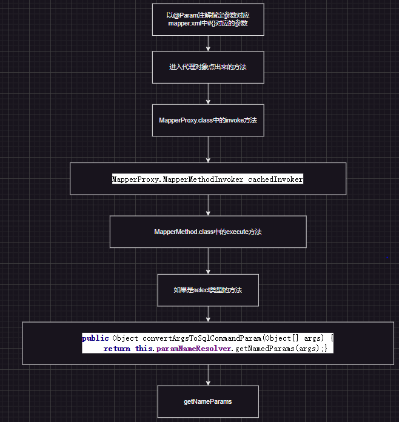

## MyBatis返回结果集类型：

### 1.返回对象类型：

一条或多条，都可以存放到List集合中

### 2.返回Map类型：

返回多个Map时，可以将Map存放到list集合中，但是ResultType还是map

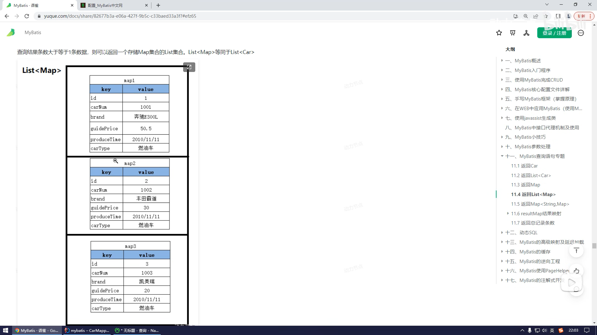

### 3.返回一个大Map

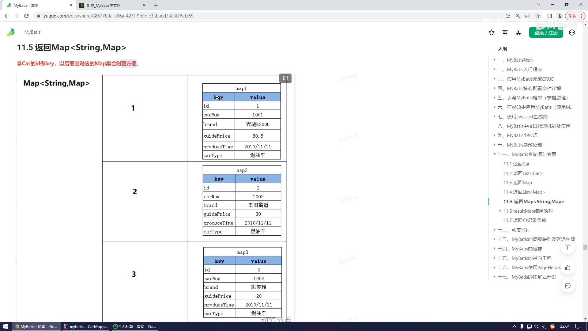

通过大Map的key拿到对应的数据

### 4.利用结果集映射返回结果集

```xml
<resultMap id="resultShopCarMapper" type="com.shop.pojo.ShopCar" extends="com.shop.mapper.CustomerMapper.resultCustomerMapper">
    <result column="customer_no" property="customerNo"/>
    <result column="good_no" property="goodNo"/>
    <result column="shop_no" property="shopNo"/>
    <result column="shop_name" property="shopName"/>
    <result column="good_name" property="goodName"/>
</resultMap>
```

## 动态SQL

### 1.if标签

`<if test="">`

    数据库表中字段名 = #{@Param中指定的属性名或POJO类中的属性名(要与数据库中对应)}

`</if>`

if标签的test属性是必须的，在test中会进行一次判断操作，结果为true，则进行sql语句的拼接，结果为false则if标签中的sql相当于没有。

test中可以是：

* 当使用@Param注解时，就是注解中指定的参数名，比如:

`int selectNum(@Param("goodNo") String goodNo,@Param("customerNo")String customerNo);`

```
<select id="selectNum" resultType="int">
    select num from shop_car where  
<if test="goodNo != null and goodNo != '' ">
        good_no = #{goodNo}
    </if>
    and customer_no=#{customerNo}
</select>
```

那么test属性中用于判断的只是goodNo与customerNo

***注意：在mybatis的sql标签中表示并列的语句，不能使用&&，只能使用and***

* 当mapper接口的参数是对象时，test属性必须使用指定POJO类中的属性名

**注：if标签有时不能单独使用，比如有多个查询条件的时候，需要跟 `<where>`标签配合使用**

### 2.where标签

* 当所有条件都为空时，保证sql语句不会生成where子句
* 自动去除某些条件**前面**多余的and或or

**注：只能去除前面的and或or，不能去除查询条件(`<if test=""></if>`标签中)后面的and或or**

### 3.trim标签

四个属性：

`<trim prefix="where" suffix="" prefixOverrides="" suffixOverrides="and|or"></trim>`

`prefix`：加前缀，范围是在trim标签里面，在**所有内容**前面

`suffix`：加后缀，范围是在trim标签里面

`prefixOverrides`：删除前缀，范围是在trim标签里面，去除每个标签里面的指定后缀

`suffixOverrides`：删除后缀，范围是在trim标签里面

### 4.set标签

主要用在update语句中，动态生成set语句，去除最后多余的逗号

与if标签连用，如果set的字段为null或者空字符串，则不更新当前字段

`<update id="update">`
    update good

`<set>`

    `<if test="goodNo != null and goodNo != '' ">`
        good_no = #{goodNo}
    `</if>`

    `<if test="customerNo!= null and customerNo!= '' ">`

    ,customer_no=#{customerNo}

    `</if>`

`</set>`
`</update>`

### 5.choose---when---otherwise

```xml
<choose>
	<when></when>
	<when></when>
	<when></when>
	<when></when>
	<otherwise></otherwise>
</choose>
```

其中when标签跟if标签的功能一样，很像java中的if --- else if --- else分支结构

***注：如果其中一个when标签的条件成立，则其他的分支都不执行***

### 6.foreach标签

一般跟where标签连用

#### 6.1批量删除

```xml
<delete id="deleteByNo">
    delete from shop_car
    <where>
        good_no in
        <foreach collection="ids" item="id" separator="," open="(" close=")">
            #{id}
        </foreach>
    </where>
</delete>
```

collection要与mapper映射文件中 `@Param("ids")` 对应，item是遍历的ids数组中的每一个元素，separator可以用**逗号也可以用or**

```java
/**
 * 完成批量删除
* @param ids
* @return
*/
int deleteByNo(@Param("ids") int[] ids);
```


#### 6.2批量插入

mapper.java

```
int insertEmpList(@Param("emps")List<Emp> emps);
```

mapper.xml

```
<insert id="insertEmpList" useGeneratedKeys="true" keyProperty="empno">
    insert into emp(ename,job,mgr,mgrName,hiredate,sal,COMM,deptno)
    values
    <foreach collection="emps" item="emp" separator=",">
        (#{emp.ename},#{emp.job},#{emp.mgr},#{emp.mgrName},#{emp.hiredate},#{emp.sal},#{emp.COMM},#{emp.deptno})
    </foreach>
</insert>
```

item中表示得是list集合中的一个对象，所以插入得元素需要用对象名.属性名

## 高级关系映射

### 1.多对一关系映射

确认关系主表或副表，谁在前谁是主表，映射到JVM中的对象就是这张表所对应的主表。

多对一：多在前，多的那一张表就是主表

一对多：一在前，一的那张表就是主表

**怎样表示这样的关系呢？**

***可以在主表的实体类中添加一个副表的引用,比如，多个学生对应一个班级，则可以在学生的实体类中添加班级类的引用***

```java
public class student{
	private String stuno;
	private String sname;
	private Clazz clazz;
}

public class Clazz{
	private String cid;
	private String cname;
}
```

注：在写结果集映射时，需要这样写：

#### 第一种方式

```
<resultMap id="stumapper" type="student">
    <result column="stuno" property="stuno"/>
    <result column="sname" property="sname"/>
    <result column="clazz.cid" property="cid"/>
    <result column="clazz.cname" property="cname"/>
</resultMap>
```

#### 第二种方式

设置关联映射

```
<resultMap id="stumapper" type="student">
    <result column="stuno" property="stuno"/>
    <result column="sname" property="sname"/>
    <association property="clazz" javaType="Clazz">
        <id column="cid" property="cid"/>
        <result column="cname" property="cname"/>
    </association>
</resultMap>
```

`<association property="指定关联映射的的名字" javaType="指定实体类">`

    `<id column="主键" property="实体类中的属性名"/>`

    `<result column="sql中的字段" property="实体类中的属性名"/>`

`</association>`

#### 第三种方式(可复用，支持延迟加载)

将多表查询分步进行

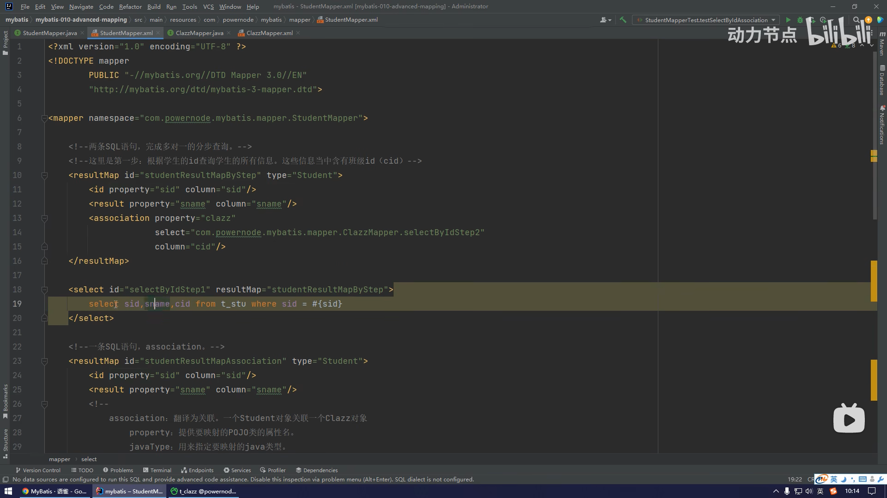

    只看select标签id是selectByIdStep1的，将查出来的数据，sid、sname分别映射到property上，resultMap中的association标签中的**property属性，表示Student这个类对Clazz这个类的引用**；select中的值是***另一个mapper.xml的全路径加上另一个查询的id***；**column是另一个mapper.xml中对应id的查询的查询条件**。如下

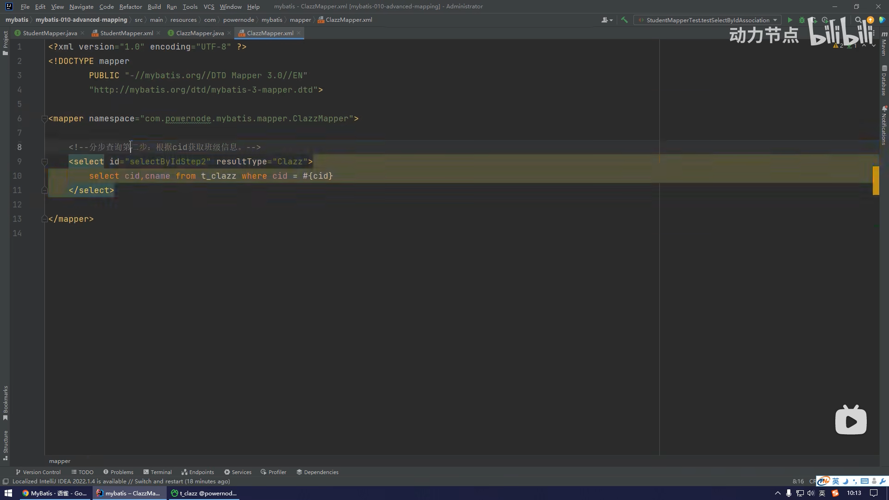

并且在对应mapper接口中声明对应的方法

这样只需要执行Student接口中的selectByIdStep1这个方法就可以了

##### **设置懒加载**

即不用的时候不加载，延迟加载：

在 `<association>`标签中设置fetchType="lazy"，***前提是将多表连接查询分步进行的情况下，并且这是局部设置***

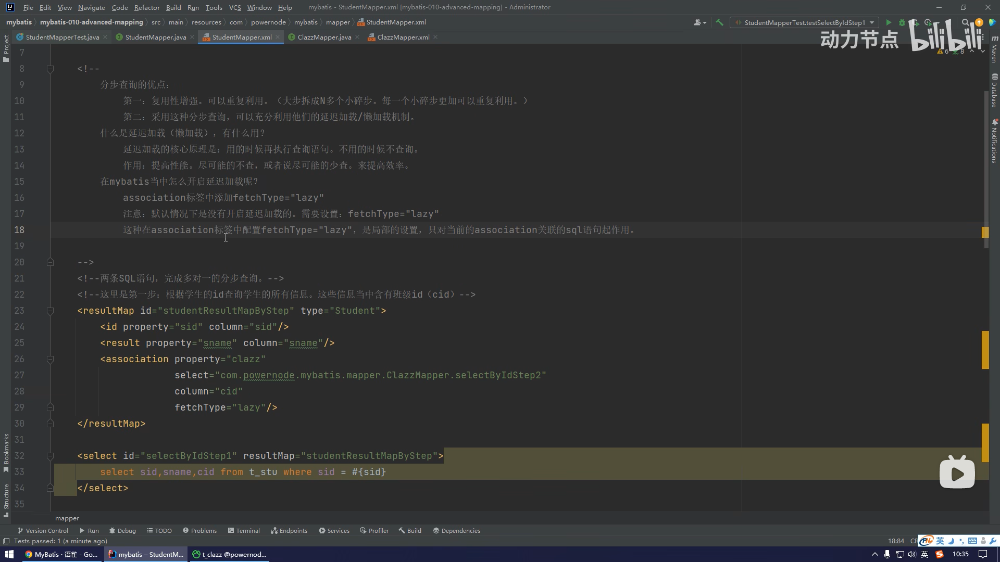

这里的property中的值是Student这个类中List `<clazz>`属性，column是select中查出来的cid，也就是利用select属性中的另一个mapper.xml中的sql标签查出来cid，再利用column接收，传给这个mapper.xml中用到这个resultMap并且查询条件是**cid=？的sql标签。**

设置全局开启懒加载模式，需要在mybatis.xml文件中设置

```
<settings>
    <setting name="lazyLoadingEnabled" value="true"/>
</settings>
```

### 2.一对多关系映射

#### 第一种方式：Collection标签，集合

collection标签需要在resultMap标签中，这样就不用在需要这个字段的时候，在这个类另外再定义其他表中的字段

```
<resultMap id="clazzResultMap" type="Clazz">
    <id column="cid" property="cid"/>
    <result column="cname" property="cname"/>
    <!--在Clazz类中指定Student类的集合，用collection映射这个集合
        property是这个集合的名字，ofType是这个集合的泛型;
	collection里面是ofType这个类中的属性
    -->
    <collection property="students" ofType="Student">
        <id column="sid" property="sid"/>
        <result column="sname" property="sname"/>
    </collection>
</resultMap>
```

## Mybatis缓存机制：

缓存技术：

* 字符串常量池
* 整数型常量池
* 连接池
* 线程池

  。。。。。。

缓存：cache

缓存的作用：通过减少IO的方式，提高程序的执行效率

mybatis的缓存：将select语句的查询结果放入缓存中，下次如果还是执行这条select语句的话，**直接从缓存中取，不再查询数据库。一方面减少了IO；另一方面不再执行复杂的查询算法，提高查询的效率。**

mybatis的缓存包括：

一级缓存：查询的数据放入SqlSession中

二级缓存：查询的结果存储在SqlSessionFactory中

其他第三方的缓存

### 一级缓存：SqlSession

一级缓存不需要任何配置，默认开启

只要执行一条sql语句就会有一个sqlSession对象

原理：如果是同一个SqlSession并且执行的是同一条sql语句，就会走缓存

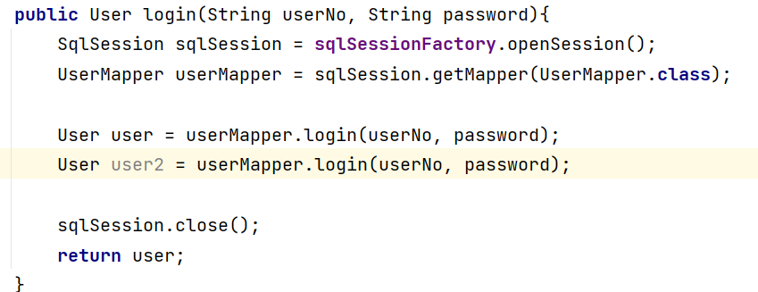

**一级缓存失效：**

如果在第一次DQL与第二次DQL之间做了以下两种操作，都会导致一级缓存清空

    1.手动清空一级缓存，执行SqlSession的clearCache()方法

    2.执行了insert、update、delete中的其中一个或多个

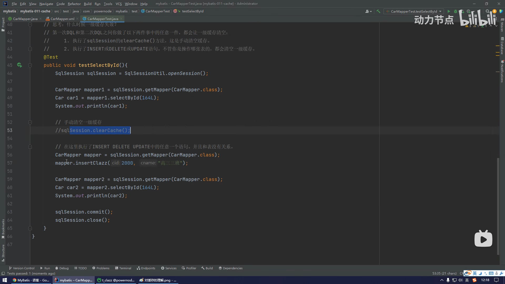

注意：缓存清空，这样做的原因是，保证数据的一致性，防止幻读

### 二级缓存：SqlSessionFactory

使用二级缓存需要配置以下几个条件：

1.`<setting name="cacheEnable" value="true">`全局开启或关闭映射器配置文件中已配置的任何缓存，***无须设置，默认为true***

2.在需要使用二级缓存的SqlMapper.xml文件中***添加一个 `<cache/>`标签***

3.使用二级缓存的实体类必须是***可序列化的***，也就是必须使用java.io.Serializable接口

4.***需要SqlSession对象关闭或提交之后***，一级缓存中的数据才被提交到二级缓存，此时二级缓存才可用。

***二级缓存失效：只要两次DQL之间，执行了增删改操作，二级缓存一定会失效，一级缓存必定失效***

`<cache/>`标签的相关配置

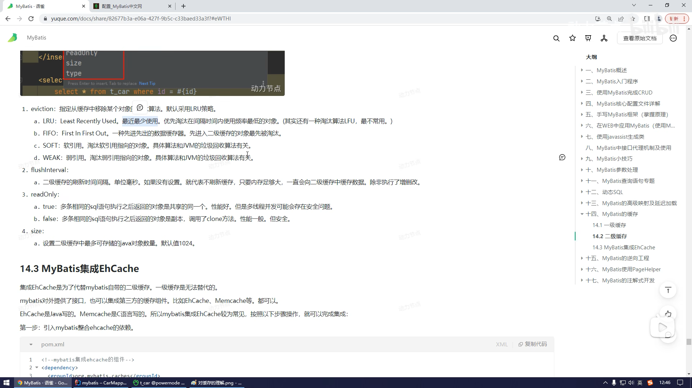

MyBatis集成Ehcache

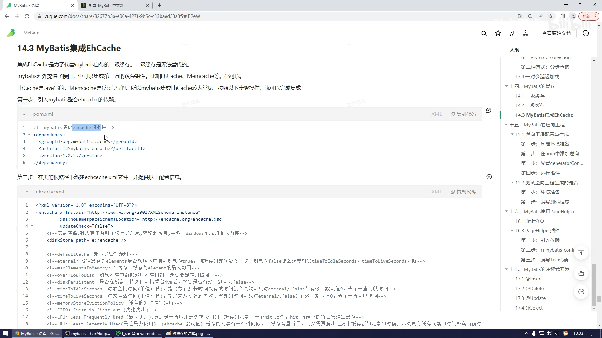

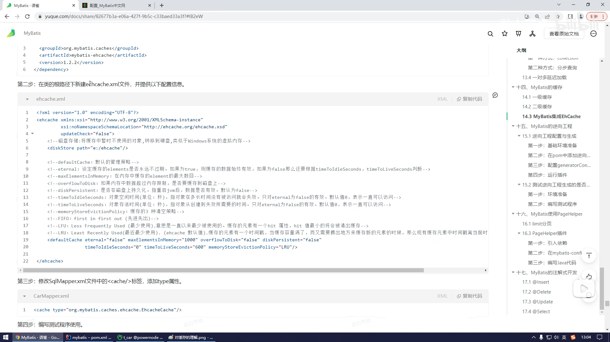

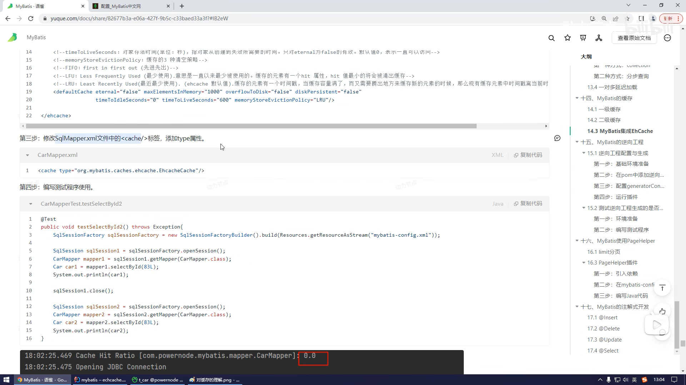

## 逆向工程插件

这个插件是别人已经写好的，拿来用就可以，但是要用这个插件需要告诉插件以下配置信息：

1.POJO类生成的位置，以及包名，类名

2.SqlMapper.xml的名字和生成位置

3.mapper接口的名字和生成位置

4.连接数据库的信息

5.指定那些表需要逆向工程

### 配置mybatis逆向工程插件：

#### 1.引入组件

```
<!--定制构建过程-->
<build>
  <!--插件的跟标签-->
<plugins>
    <plugin>
      <!--插件的GAV坐标-->
<groupId>org.mybatis.generator</groupId>
      <artifactId>mybatis-generator-maven-plugin</artifactId>
      <version>1.4.1</version>
      <!--允许覆盖-->
<configuration>
        <overwrite>true</overwrite>
      </configuration>
      <!--插件的依赖-->
<dependencies>
        <!--mysql驱动的依赖-->
<dependency>
          <groupId>mysql</groupId>
          <artifactId>mysql-connector-java</artifactId>
          <version>8.0.30</version>
        </dependency>
      </dependencies>
    </plugin>
  </plugins>
</build>
```

#### 2.引入配置文件

generatorConfig.xml文件

```
<?xml version="1.0" encoding="UTF-8"?>
<!DOCTYPE generatorConfiguration
        PUBLIC "-//mybatis.org//DTD MyBatis Generator Configuration 1.0//EN"
        "http://mybatis.org/dtd/mybatis-generator-config_1_0.dtd">
<generatorConfiguration>
 
    <!-- 数据库驱动:选择你的本地硬盘上面的数据库驱动包 -->
    <classPathEntry  location="D:\maven-warehouse\repository\mysql\mysql-connector-java\5.1.47\mysql-connector-java-5.1.47.jar"/>
    <!-- <classPathEntry  location="D:\maven-warehouse\repository\mysql\mysql-connector-java\8.0.17\mysql-connector-java-8.0.17.jar"/> -->
 
    <context id="DB2Tables"  targetRuntime="MyBatis3">
        <!-- 实体类生成序列化属性-->
        <plugin type="org.mybatis.generator.plugins.SerializablePlugin" />
        <!-- 实体类重写HashCode()和equals()-->
        <plugin type="org.mybatis.generator.plugins.EqualsHashCodePlugin" />
        <!-- 实体类重写toString() -->
        <plugin type="org.mybatis.generator.plugins.ToStringPlugin" />
 
        <commentGenerator>
            <!-- 是否去除自动生成的注释 -->
            <property name="suppressAllComments" value="true"/>
            <!-- 生成注释是否带时间戳-->
            <property name="suppressDate" value="true"/>
            <!-- 生成的Java文件的编码格式 -->
            <property name="javaFileEncoding" value="utf-8"/>
            <!-- 格式化java代码-->
            <property name="javaFormatter" value="org.mybatis.generator.api.dom.DefaultJavaFormatter" />
            <!-- 格式化XML代码-->
            <property name="xmlFormatter" value="org.mybatis.generator.api.dom.DefaultXmlFormatter" />
        </commentGenerator>
 
        <!-- 数据库连接驱动类,URL，用户名、密码 -->
        <jdbcConnection driverClass="com.mysql.jdbc.Driver"
                        connectionURL="jdbc:mysql://127.0.0.1:3306/dbName?useUnicode=true&characterEncoding=UTF-8"
                        userId="root" password="root">
        </jdbcConnection>
 
        <!-- java类型处理器：处理DB中的类型到Java中的类型 -->
        <javaTypeResolver type="org.mybatis.generator.internal.types.JavaTypeResolverDefaultImpl">
            <!-- 是否有效识别DB中的BigDecimal类型 -->
            <property name="forceBigDecimals" value="true"/>
        </javaTypeResolver>
 
        <!-- 生成Domain模型：包名(targetPackage)、位置(targetProject) -->
        <javaModelGenerator targetPackage="com.project.business.domain" targetProject="D:/workSpace/project/src/main/java">
            <!-- 在targetPackage的基础上，根据数据库的schema再生成一层package，最终生成的类放在这个package下，默认为false -->
            <property name="enableSubPackages" value="true"/>
            <!-- 设置是否在getter方法中，对String类型字段调用trim()方法-->
            <property name="trimStrings" value="true"/>
        </javaModelGenerator>
 
        <!-- 生成xml映射文件：包名(targetPackage)、位置(targetProject) -->
        <sqlMapGenerator targetPackage="com.project.business.dao" targetProject="D:/workSpace/project/src/main/java">
            <property name="enableSubPackages" value="true"/>
        </sqlMapGenerator>
 
        <!-- 生成DAO接口：包名(targetPackage)、位置(targetProject) -->
        <javaClientGenerator type="XMLMAPPER" targetPackage="com.project.business.dao" targetProject="D:/workSpace/project/src/main/java">
            <property name="enableSubPackages" value="true"/>
        </javaClientGenerator>
 
        <!-- 要生成的表：tableName - 数据库中的表名或视图名，domainObjectName - 实体类名 -->
        <table tableName="tableName" domainObjectName="tableNameDO"
               enableCountByExample="false"
               enableUpdateByExample="false"
               enableDeleteByExample="false"
               enableSelectByExample="false"
               selectByExampleQueryId="false">
        </table>
 
    </context>
</generatorConfiguration>
```

> https://blog.csdn.net/weixin_44259720/article/details/102716165

上面这篇文章解释了配置文件的用法

配置完以上的东西就可以用了

## 分页但是用插件

pageHelper插件

1.引入依赖：

```
<dependency>
	<groupId>com.github.pagehelper</groupId>
	<artifacted>pagehelper</artifacted>
	<version>5.3.1</version>
</dependency>
```

2.在mybatis-config.xml中添加拦截器，放在typeAliases标签后面

```
<plugins>
	<plugin interceptor="com.github.pagehelper.PageInterceptor"></plugin>
</plugins>
```

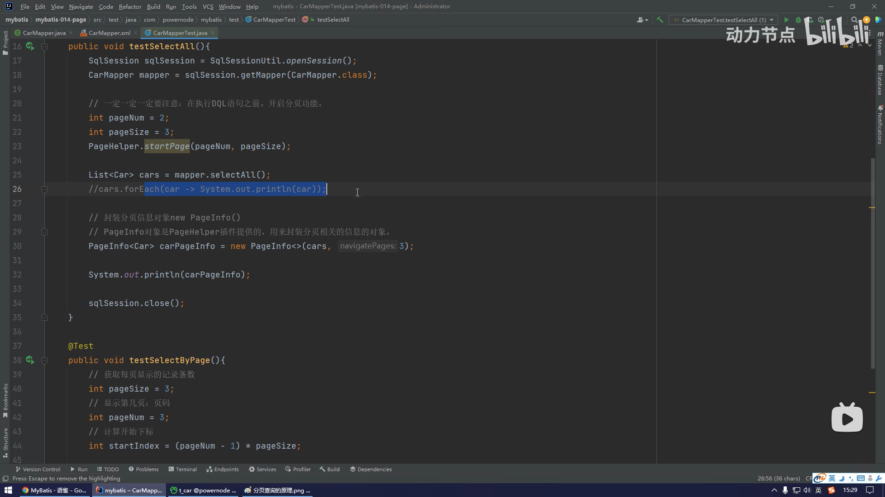
