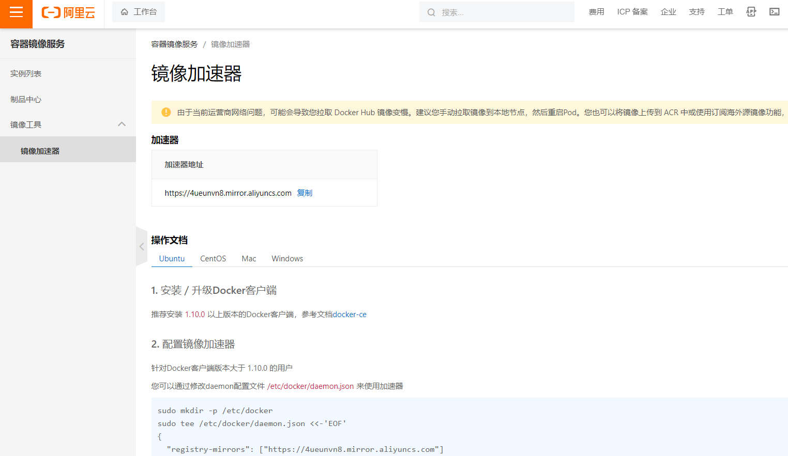

我的镜像加速器地址：https://4ueunvn8.mirror.aliyuncs.com

查看docker版本

`docker -v `

配置docker加速器

```
sudo mkdir -p /etc/docker
sudo tee /etc/docker/daemon.json <<-'EOF'
{
  "registry-mirrors": ["https://4ueunvn8.mirror.aliyuncs.com"]
}
EOF
sudo systemctl daemon-reload
sudo systemctl restart docker
```

## 开机启动docker

启动docker服务

    `systemctl start docker`

查看虚拟机状态

    `systemctl status docker`

关闭docker服务

    `systemctl stop docker`

重启docker服务

    `restart docker`

配置开机启动docker

```
[root@192 gjg]# systemctl enable  docker
Created symlink /etc/systemd/system/multi-user.target.wants/docker.service → /usr/lib/systemd/system/docker.service.

```

## 镜像

查看镜像

`[root@192 gjg]# docker images `

查看redis镜像是否存在

```L
[root@192 gjg]# docker search redis
NAME                                DESCRIPTION                                      STARS     OFFICIAL   AUTOMATED
redis                               Redis is an open source key-value store that…   12255     [OK]   
redislabs/redisearch                Redis With the RedisSearch module pre-loaded…   57         
redislabs/redisinsight              RedisInsight - The GUI for Redis                 89         
redislabs/rebloom                   A probablistic datatypes module for Redis        24                   [OK]
redislabs/redis                     Clustered in-memory database engine compatib…   38         
redis/redis-stack-server            redis-stack-server installs a Redis server w…   49         
redislabs/rejson                    RedisJSON - Enhanced JSON data type processi…   53         
redis/redis-stack                   redis-stack installs a Redis server with add…   62         
redislabs/redisgraph                A graph database module for Redis                26                   [OK]
redislabs/redismod                  An automated build of redismod - latest Redi…   41                   [OK]
redislabs/redistimeseries           A time series database module for Redis          12         
redislabs/operator                                                                   7          
redislabs/operator-internal         This repository contains pre-released versio…   1          
redislabs/redis-py                                                                   5          
redislabs/redis-webcli              A tiny Flask app to provide access to Redis …   3                    [OK]
redislabs/redisgears                An automated build of RedisGears                 4          
redislabs/k8s-controller-internal                                                    0          
redislabs/memtier_benchmark         Docker image to run memtier_benchmark            0          
redislabs/ng-redis-raft             Redis with redis raft module                     0          
redislabs/k8s-controller                                                             2          
redislabs/redisai                                                                    5          
redislabs/olmtest                   Test artefact for OLM CSV                        1          
bitnami/redis                       Bitnami Redis Docker Image                       259                  [OK]
redislabs/olm-bundle                                                                 0          
redislabs/redisml                   A Redis module that implements several machi…   3                    [OK]

```

### 拉取redis镜像

docker pull redis:[版本号]

不写版本号，默认就是最新版本

```
[root@192 gjg]# docker pull redis
Using default tag: latest
latest: Pulling from library/redis
a2abf6c4d29d: Pull complete 
c7a4e4382001: Pull complete 
4044b9ba67c9: Pull complete 
c8388a79482f: Pull complete 
413c8bb60be2: Pull complete 
1abfd3011519: Pull complete 
Digest: sha256:db485f2e245b5b3329fdc7eff4eb00f913e09d8feb9ca720788059fdc2ed8339
Status: Downloaded newer image for redis:latest
docker.io/library/redis:latest
[root@192 gjg]# docker images
REPOSITORY   TAG       IMAGE ID       CREATED         SIZE
redis        latest    7614ae9453d1   19 months ago   113MB

```

### 下载指定版本的镜像

[root@192 gjg]# docker pull redis:5.0

### 删除指定镜像id的镜像

```
[root@192 gjg]# docker rmi c5da061a611a
Untagged: redis:5.0
Untagged: redis@sha256:a30e893aa92ea4b57baf51e5602f1657ec5553b65e62ba4581a71e161e82868a
Deleted: sha256:c5da061a611a09b0a09cbb60dde89dfdb0a3e995e60cfc195a098fab3ba97aaf
Deleted: sha256:b187a4ea5ec8301c5616bdbe4db7a96af5c8c48b88f3504df5115398b58adb00
Deleted: sha256:a5b1ddb17f28c5c06e7c44c7b0a7530b85778f4ab20162e5c3b1882c3a3fdefe
Deleted: sha256:65291409d01927b2b45eccb7a8630f531e059ff5758238f57e95a5ede64be6a4
[root@192 gjg]# docker images
REPOSITORY   TAG       IMAGE ID       CREATED         SIZE
redis        latest    7614ae9453d1   19 months ago   113MB
```

通过指定TAG删除镜像

`[root@192 gjg]# docker rmi redis:latest `

查看所有的镜像id的列表

```
[root@192 gjg]# docker images -q
7614ae9453d1

```

## 容器相关命令

### 1.run

相关参数

- `-d` ：在后台运行容器。
- `-it` ：以交互模式运行容器，并分配一个伪终端。
- `--name <container_name>` ：为容器指定一个名称。
- `-p <host_port>:<container_port>` ：将容器的端口映射到主机的端口。
- `-v <host_path>:<container_path>` ：将主机的目录或文件挂载到容器中。
- `--rm` ：容器停止后自动删除。
- `--network <network_name>` ：指定容器所连接的网络。
- `-e <environment_variable>=<value>` ：设置容器的环境变量。
- `--restart <restart_policy>` ：设置容器的重启策略。

这只是一些常用的参数，Docker 还有很多其他参数可以使用。您可以使用  `docker run --help`  命令查看完整的参数列表和说明。

### 进入容器，如果有则直接进入，没有则创建一个

以下是没有，创建一个的实例

```
[root@192 gjg]# docker run -it  --name=c1 centos:8 /bin/bash
Unable to find image 'centos:8' locally
8: Pulling from library/centos
a1d0c7532777: Pull complete 
Digest: sha256:a27fd8080b517143cbbbab9dfb7c8571c40d67d534bbdee55bd6c473f432b177
Status: Downloaded newer image for centos:8


```

centos:8     指定版本

/bin/bash      指定进入之后可以执行bash命令，**默认**

### 创建容器并后台运行

```
[root@192 gjg]# docker run -id --name=c2 centos:8
d8c3e4e2e3bb738b333faad420741ef60aeeb9ce2e7492a5156be3b373eea30e
[root@192 gjg]# docker ps -a
CONTAINER ID   IMAGE      COMMAND       CREATED          STATUS                       PORTS     NAMES
d8c3e4e2e3bb   centos:8   "/bin/bash"   27 seconds ago   Up 25 seconds                          c2
249bf96562fe   centos:8   "/bin/bash"   9 minutes ago    Exited (130) 7 minutes ago             c1
[root@192 gjg]# docker exec -it c2 /bin/bash

```

通过exec进入的容器，在退出时不会关闭

```
[root@d8c3e4e2e3bb /]# exit
exit
[root@192 gjg]# docker ps -a
CONTAINER ID   IMAGE      COMMAND       CREATED          STATUS                        PORTS     NAMES
d8c3e4e2e3bb   centos:8   "/bin/bash"   7 minutes ago    Up 7 minutes                            c2
249bf96562fe   centos:8   "/bin/bash"   16 minutes ago   Exited (130) 14 minutes ago             c1

```

### 退出容器

exit

注意：通过"-it"参数创建的容器，执行退出命令后，自动关闭

### 查看容器

```
[root@192 gjg]# docker ps
CONTAINER ID   IMAGE     COMMAND   CREATED   STATUS    PORTS     NAMES
[root@192 gjg]# docker ps -aq
249bf96562fe
[root@192 gjg]# docker ps -a
CONTAINER ID   IMAGE      COMMAND       CREATED         STATUS                       PORTS     NAMES
249bf96562fe   centos:8   "/bin/bash"   5 minutes ago   Exited (130) 3 minutes ago             c1

```

### docker exec命令

`docker exec`  命令用于在正在运行的容器中执行命令。它允许您在容器内部执行特定的命令，例如运行脚本、调试容器内部的应用程序等。
 使用  `docker exec`  命令的基本语法是：
docker exec [OPTIONS] CONTAINER COMMAND [ARG...]
其中， `OPTIONS`  是一些可选参数， `CONTAINER`  是要执行命令的容器的名称或 ID， `COMMAND`  是要在容器内部执行的命令， `ARG...`  是命令的参数。
 例如，要在名为  `mycontainer`  的容器中执行  `ls`  命令，可以使用以下命令：
docker exec mycontainer ls
`docker exec`  命令对于在运行中的容器中执行临时任务或调试应用程序非常有用。它使您能够与容器进行交互，并在容器内部执行所需的操作。

### 停止容器的运行

```
[root@192 gjg]# docker stop c2
c2

```

### 启动容器

```
[root@192 gjg]# docker start c2
c2

```

### 删除容器

```
[root@192 gjg]# docker rm c1

```

注意：开启的容器是不能被删除的

### 删除所有容器

```
[root@192 gjg]# docker rm `docker ps -aq`

```

### 查看容器的信息，部分截取

```
[root@192 gjg]# docker inspect c2
[
    {
        "Id": "d8c3e4e2e3bb738b333faad420741ef60aeeb9ce2e7492a5156be3b373eea30e",
        "Created": "2023-08-04T02:08:02.583464444Z",
        "Path": "/bin/bash",
        "Args": [],
        "State": {
            "Status": "running",
            "Running": true,
            "Paused": false,

```

## 数据卷


容器和容器之间相互通信，可以通过挂载到宿主机上的目录进行互传

### 创建一个名为c1的容器，将c1中的指定目录挂载到宿主机的指定目录上

```
[root@192 gjg]# docker  run -it --name=c1 -v /root/data:/root/data_container centos:8  /bin/bash
[root@9905575a3953 /]# cd
[root@9905575a3953 ~]# ls
anaconda-ks.cfg  anaconda-post.log  data_container  original-ks.cfg
[root@9905575a3953 ~]# ls -l
total 12
-rw-------. 1 root root 2361 Sep 15  2021 anaconda-ks.cfg
-rw-r--r--. 1 root root  608 Sep 15  2021 anaconda-post.log
drwxr-xr-x. 2 root root    6 Aug  4 02:52 data_container
-rw-------. 1 root root 2059 Sep 15  2021 original-ks.cfg

```

-v 宿主机的目录:容器目录

查看宿主机是否挂载上

```
[root@192 gjg]# cd
[root@192 ~]# ll
总用量 8
-rw-------. 1 root root 1473 8月   2 09:35 anaconda-ks.cfg
drwxr-xr-x. 2 root root    6 8月   4 10:52 data
-rw-r--r--. 1 root root 1765 8月   2 11:31 initial-setup-ks.cfg

```

### 实现宿主机和容器的资源互传

宿主机创建文件

```
[root@192 ~]# clear
[root@192 ~]# cd data
[root@192 data]# touch  gjg.txt
```

容器的挂在目录中就会有gjg.txt

```
[root@9905575a3953 ~]# cd data_container 
[root@9905575a3953 data_container]# ls
gjg.txt
```

在容器目录中创建一个txt文件，并写入内容

```
[root@9905575a3953 data_container]# touch a.txt
[root@9905575a3953 data_container]# ls
a.txt  gjg.txt
[root@9905575a3953 data_container]# echo  "nihao" > a.txt
[root@9905575a3953 data_container]# cat a.txt
nihao

```

在宿主机中也没有响应的内容

```
[root@192 data]# ll
总用量 4
-rw-r--r--. 1 root root 6 8月   4 11:04 a.txt
-rw-r--r--. 1 root root 0 8月   4 10:58 gjg.txt
[root@192 data]# cat a.txt
nihao

```

持久化功能演示

此时c1这个容器是没有的，重新将它加入到容器中，并挂载到刚刚的宿主机的data目录上

```
[root@192 ~]# docker run  -it --name=c1 -v /root/data:/root/data_container centos:8 /bin/bash
[root@8fed9d3d975a /]# cd
[root@8fed9d3d975a ~]# ls
anaconda-ks.cfg  anaconda-post.log  data_container  original-ks.cfg
[root@8fed9d3d975a ~]# cd data_container/
[root@8fed9d3d975a data_container]# ls
a.txt  gjg.txt
[root@8fed9d3d975a data_container]# 
```

此时，宿主机/root/data中的文件又回到了容器的data_container中

### 挂载多个目录

```
[root@192 gjg]# docker run -it --name=c3 \
> -v /root/data2:/root/data2 \
> -v /root/data3:/root/data3 \
> centos:8

```

## 实现容器与容器之间的文件互传，以宿主机为中介

创建名叫c3的容器，并挂载到宿主机的/root/data目录下

```
[root@192 gjg]# docker run -it --name=c3 -v /root/data:/root/data centos:8 /bin/bash
[root@84fb1363be49 /]# cd 
[root@84fb1363be49 ~]# ls -l
total 12
-rw-------. 1 root root 2361 Sep 15  2021 anaconda-ks.cfg
-rw-r--r--. 1 root root  608 Sep 15  2021 anaconda-post.log
drwxr-xr-x. 2 root root   34 Aug  4 03:04 data
-rw-------. 1 root root 2059 Sep 15  2021 original-ks.cfg
[root@84fb1363be49 ~]# cd data
[root@84fb1363be49 data]# ls
a.txt  gjg.txt

```

创建名叫c4的容器，也挂载到宿主机的/root/data目录下

```
[root@192 ~]# docker run -it --name=c4 -v /root/data:/root/data centos:8 /bin/bash
[root@044e8e3e1321 /]# cd
[root@044e8e3e1321 ~]# ls
anaconda-ks.cfg  anaconda-post.log  data  original-ks.cfg
[root@044e8e3e1321 ~]# cd data
[root@044e8e3e1321 data]# ls
a.txt  gjg.txt

```

在c4容器中创建文件，并写入内容

```
[root@044e8e3e1321 data]# touch c4.txt
[root@044e8e3e1321 data]# echo "c4.txt" > c4.txt 
[root@044e8e3e1321 data]# cat c4.txt 
c4.txt

```

c3容器也会又相同的文件和内容

```
[root@84fb1363be49 data]# ls
a.txt  c4.txt  gjg.txt
[root@84fb1363be49 data]# cat c4.txt 
c4.txt

```

## 数据卷容器

在容器和宿主机之间又加了一层，

    使用数据卷容器时，需要将要使用数据卷的容器挂载到数据卷容器上，然后再将数据卷容器挂载到宿主机上。这样可以实现数据的持久化存储和共享。数据卷容器充当一个中间层，可以将数据卷从容器中解耦出来，使得容器与数据的关系更加灵活和可管理。通过这种方式，即使容器被重新创建或迁移，数据仍然可以保持不变。

先删除前面创建的所有容器

```
[root@192 gjg]# docker rm `docker ps -aq`
044e8e3e1321
84fb1363be49
8fed9d3d975a
d8c3e4e2e3bb
[root@192 gjg]# docker ps -a

```

创建数据卷容器

```
[root@192 gjg]# docker run -it --name=c3 -v /volume centos:8

```

只写容器的目录，系统会自动创建挂载目录

创建需要挂载的容器c1

```
[root@192 ~]# docker run -it --name=c1 --volumes-from  c3 centos:8
[root@0c5f6aeab248 /]# ls -l

```

此时c1的根目录下就有了volume这个目录

创建需要挂载的容器c2

```
[root@192 /]# docker run -it --name=c2 --volumes-from  c3 centos:8
[root@19bd86d193ef /]# ls -l

```

此时，c3,c1,c2相互之间通过/volume这个目录可以通信

用docker inspect c3和docker inspect c1查看数据卷信息


会发现它们的Source是一样的


## docker安装mysql

1.先将mysql的镜像拉到docker中

`docker pull mysql:8.0.25`

2.配置容器和挂载目录

```
[root@192 mysql]# docker run -id \
 -p  3307:3306 \
 --name=c_mysql \
 -v  $PWD/conf:/etc/mysql/conf.d \
 -v  $PWD/logs:/logs \
 -v  $PWD/data:/var/lib/mysql \
 -e MYSQL_ROOT_PASSWORD=123456 \
 mysql:8.0.25

```

-p  3307:3306\     将容器的3306端口映射到主机的3307端口上

$PWD   当前目录以及其父目录

-v  $PWD/conf:/etc/mysql/conf.d \      挂在配置目录

-v  $PWD/logs:logs \     挂载日志目录

-v  $PWD/data:/var/lib/mysql \  挂载数据目录

-e MYSQL_ROOT_PASSWORD=123456 \   初始化密码

### 如果遇到mysql后台启动几秒就关闭的情况，建议删了重新装

改成5.6版本的

```
docker run -id \
-p 3307:3306 \
--name=c_mysql \
-v $PWD/conf:/etc/mysql/conf.d \
-v $PWD/logs:/logs \
-v $PWD/data:/var/lib/mysql \
-e MYSQL_ROOT_PASSWORD=123456 \
mysql:5.6
```

创建成功之后登录mysql

`root@9ecf7dec84ac:/# mysql -uroot -p123456 `

用本地Navicat建立一个与docker的ip地址相同的连接就可以实现本地访问docker的MySQL了

端口号是上面映射的端口号======>3307

## docker安装tomcat

1.拉取tomcat的镜像

docker pull tomcat

2.挂载目录

```
 docker run -id \
 -p 8080:8080 \
 -v $PWD:/usr/local/tomcat/webapps \
 tomcat

```


3.创建一个test目录，再创建一个index.html文件

```
[root@192 tomcat]# mkdir  test
[root@192 tomcat]# ll
总用量 0
drwxr-xr-x. 2 root root 6 8月   4 15:36 test
[root@192 tomcat]# cd  test
[root@192 test]# vim index.html

```

4.用docker的ip地址+端口号再加index.html文件地址访问

eg：http://192.168.37.128:8080/test/index.html

## docker安装Nginx

1.拉取镜像

`[root@192 ~]# docker pull nginx`

2.创建/root/nginx目录

`[root@192 ~]# mkdir ~/nginx `

3.创建config目录

`[root@192 nginx]# mkdir config `

4.创建nginx.conf文件

`[root@192 config]# vim nginx.conf `

```
user  nginx;
worker_processes  auto;

error_log  /var/log/nginx/error.log notice;
pid        /var/run/nginx.pid;


events {
    worker_connections  1024;
}


http {
    include       /etc/nginx/mime.types;
    default_type  application/octet-stream;

    log_format  main  '$remote_addr - $remote_user [$time_local] "$request" '
                      '$status $body_bytes_sent "$http_referer" '
                      '"$http_user_agent" "$http_x_forwarded_for"';

    access_log  /var/log/nginx/access.log  main;

    sendfile        on;
    #tcp_nopush     on;

    keepalive_timeout  65;

    #gzip  on;

    include /etc/nginx/conf.d/*.conf;
}
```

复制进去

5.执行容器创建命令

`[root@192 nginx]# docker run -id  -p 80:80 -v $PWD/config/nginx.conf:/etc/nginx/nginx.conf  -v $PWD/logs:/var/log/nginx -v $PWD/html:/usr/share/nginx/html nginx `

完成

## docker安装redis

1.拉取镜像

2.创建容器

```
[root@192 ~]# docker run -id --name=c_redis -p 6379:6379 redis:latest
87bb0b09f4e38f9f64d8dca7550a47533f7f80213a63e88598fd0cfcee1218ae
[root@192 ~]# docker ps -a

```

3.在本机的redis目录下访问

D:\redis>redis-cli.exe -h 192.168.37.128 -p 6379

# Dockerfile


## 容器转镜像

```
[root@192 ~]# docker ps -a
CONTAINER ID   IMAGE          COMMAND                   CREATED             STATUS                           PORTS                                       NAMES
87bb0b09f4e3   redis:latest   "docker-entrypoint.s…"   About an hour ago   Up About an hour                 0.0.0.0:6379->6379/tcp, :::6379->6379/tcp   c_redis
010c32bc9bcf   nginx          "/docker-entrypoint.…"   About an hour ago   Up About an hour                 0.0.0.0:80->80/tcp, :::80->80/tcp           gallant_dhawan
3c30128919bd   tomcat         "catalina.sh run"         2 hours ago         Exited (143) About an hour ago                                               lucid_gates
9ecf7dec84ac   mysql:5.6      "docker-entrypoint.s…"   2 hours ago         Exited (0) About an hour ago                                                 c_mysql
[root@192 ~]# docker commit 3c3012 gjgtomcat:1.0
sha256:9d1f060f2eee14402972f8e3fe51b3c5d7753e4b6d1214d6232f826c28301389
[root@192 ~]# docker images
REPOSITORY   TAG       IMAGE ID       CREATED         SIZE
gjgtomcat    1.0       9d1f060f2eee   6 seconds ago   680MB
nginx        latest    605c77e624dd   19 months ago   141MB
tomcat       latest    fb5657adc892   19 months ago   680MB
redis        latest    7614ae9453d1   19 months ago   113MB
mysql        5.6       dd3b2a5dcb48   19 months ago   303MB
centos       8         5d0da3dc9764   22 months ago   231MB

```

提交的时候不需要把容器的id复制全，只需要保证与其他的不一样就行

### 将镜像打包成压缩文件

docker save -o 压缩文件名.tar REPOSITORY:TAG

解压缩

docker load -i 压缩文件名.tar

## docker部署springboot项目

1.拉取java的镜像，没有的话，在运行的时候会自动下去


正确写法

[root@192 docker-file]# vim springboot_dockerfile
[root@192 docker-file]# docker build -f ./springboot_dockerfile -t app .

执行完之后的效果


```
[root@192 docker-file]# ll
总用量 18764
-rw-r--r--. 1 root root      117 8月   5 11:44 springboot_dockerfile
-rw-r--r--. 1 root root 19207481 8月   5 11:14 springboot-web-admin-0.0.1-SNAPSHOT.jar
[root@192 docker-file]# docker run -id -p 9000:8080 app
4f07f451b2a63b302c6f062d6a49d5399c6bc3372b67c880b6f3cf47b6b53d7a
[root@192 docker-file]# docker ps -a
CONTAINER ID   IMAGE          COMMAND                   CREATED          STATUS                      PORTS                                       NAMES
4f07f451b2a6   app            "/bin/sh -c 'java -j…"   44 seconds ago   Up 18 seconds               0.0.0.0:9000->8080/tcp, :::9000->8080/tcp   pedantic_heyrovsky
87bb0b09f4e3   redis:latest   "docker-entrypoint.s…"   20 hours ago     Exited (255) 2 hours ago    0.0.0.0:6379->6379/tcp, :::6379->6379/tcp   c_redis
010c32bc9bcf   nginx          "/docker-entrypoint.…"   20 hours ago     Exited (255) 2 hours ago    0.0.0.0:80->80/tcp, :::80->80/tcp           gallant_dhawan
3c30128919bd   tomcat         "catalina.sh run"         20 hours ago     Exited (143) 20 hours ago                                               lucid_gates
9ecf7dec84ac   mysql:5.6      "docker-entrypoint.s…"   21 hours ago     Exited (0) 20 hours ago    
```

## 自定义镜像centos8


上面的不行

用下面的

```
FROM centos:8
MAINTAINER gjg <gjg@gjg.cn>
RUN cd /etc/yum.repos.d/

RUN sed -i 's/mirrorlist/#mirrorlist/g' /etc/yum.repos.d/CentOS-*
RUN sed -i 's|#baseurl=http://mirror.centos.org|baseurl=http://vault.centos.org|g' /etc/yum.repos.d/CentOS-*


RUN yum clean all

RUN yum makecache
# 验证
RUN yum update -y
RUN yum install -y vim
WORKDIR /usr
CMD /bin/bash

```

效果


## Docker Compose

Docker Compose是一个用于定义和运行多个Docker容器的工具。它使用一个YAML文件来配置应用程序的服务、网络和卷等方面的设置，并可以通过简单的命令来管理整个应用程序的生命周期。

使用Docker Compose，您可以将多个相关的Docker容器组合在一起，以创建一个完整的应用程序环境。通过定义各个服务之间的依赖关系和配置选项，您可以轻松地启动、停止和管理整个应用程序。

Docker Compose提供了一种简化和自动化多容器应用程序的部署和管理的方式。它可以帮助您快速搭建开发、测试和生产环境，并提供了一种可重复使用和可扩展的方式来管理容器化应用程序。

要使用Docker Compose，您需要创建一个名为 `docker-compose.yml` 的文件，并在其中定义您的服务、网络和卷等配置。然后，您可以使用 `docker-compose` 命令来启动、停止、重启和管理您的应用程序。

Docker Compose是一个功能强大的工具，可以大大简化多容器应用程序的管理和部署。它是Docker生态系统中广泛使用的工具之一，适用于各种规模的应用程序和环境。

### 安装

要安装Docker Compose，您可以按照以下步骤进行操作：

1. 首先，确保您已经安装了Docker。Docker Compose是Docker的一个附加组件，因此需要先安装Docker。
2. 打开终端或命令行界面，并运行以下命令来下载Docker Compose的二进制文件：
   `sudo curl -L "https://mirrors.tuna.tsinghua.edu.cn/docker-compose/`
   这个命令会从Docker Compose的GitHub存储库下载最新版本的二进制文件，并将其保存在 `/usr/local/bin/docker-compose` 路径下。
3. 授予 `docker-compose` 二进制文件可执行权限：
   `sudo chmod +x /usr/local/bin/docker-compose`
4. 确保您的 `/usr/local/bin` 路径已添加到您的系统的 `PATH` 环境变量中。这样，您就可以在任何位置运行 `docker-compose` 命令。
5. 验证安装是否成功，运行以下命令来检查Docker Compose的版本：
   docker-compose --version
   如果安装成功，您将看到Docker Compose的版本信息。

现在，您已经成功安装了Docker Compose。您可以使用 `docker-compose` 命令来管理和部署多容器应用程序。要使用Docker Compose，您需要在项目目录中创建一个名为 `docker-compose.yml` 的文件，并在其中定义您的服务、网络和卷等配置。然后，您可以使用 `docker-compose` 命令来启动、停止和管理整个应用程序。

希望这可以帮助您安装和使用Docker Compose。如果您有任何其他问题，请随时提问。

在docker-compose目录下配置docker-compose.yml文件

```
version: '3'
services:
    nginx:
        image: nginx
        ports:
           - 80:80
        links:
           - app
        volumes:
           - ./nginx/conf.d:/etc/nginx/conf.d
    app:
        image: app
        expose:
          - "8080"

```

创建与nginx的配置文件挂载的目录

```
[root@192 docker-compose]# mkdir -p ./nginx/conf.d
[root@192 docker-compose]# cd ./nginx/conf.d/

```

在conf.d写compose.yml配置文件

```
server{
    listen: 80;
    access_log off;
    location / {
        proxy_pass http://app:8080;
    }
}

```

完成之后，启动docker-compose

```
[root@192 docker-compose]# docker-compose up
```

## docker私有仓库


