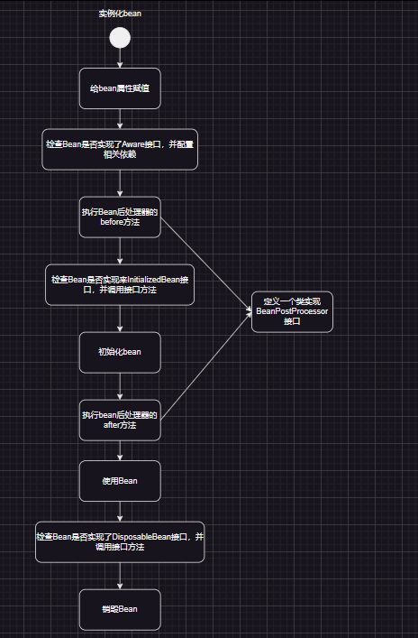

## 软件开发七大原则

设计模式中分别是创建型，结构型，行为型，总共有23种设计模式。设计模式是软件开发人员在软件开发过程中面临的一般问题的解决方案。这些解决方案是众多软件开发人员经过相当长的一段时间的试验和错误总结出来的。

使用设计模式能够使我们开发的程序，易维护、可拓展，可复用。但是在23个设计模式的背后，还有7个开发原则去支撑着设计模式，保证23个设计模式能够易维护、可拓展，可复用。所以这篇文章来解开七大设计原则的神秘面纱。

SOLID 是面向对象设计5大重要原则的首字母缩写，当我们设计类和模块时，遵守 SOLID 原则可以让软件更加健壮和稳定。（迪米特与组合/聚合是后加的）


### 单一职责原则（SRP：Singleresponsibility principle）

#### 1.设计原则的概念

**就一个类而言，应该仅有一个引起它变化的原因。**

符合单一职责原则的类具有高内聚的特性

#### 2.详细解释

每一个职责都是变化的一个轴线，如果一个类有一个以上的职责，这些职责就耦合在了一起。耦 合会影响复用性。

如果单一职责原则遵守的好，当修改一个功能时，可以显著降低对其他功能的影响。

所以要遵守单一职责原则，避免将不同职责的功能或接口写到同一个类中，增加了耦合性。

### 开闭原则（OCP：OpenClosed Principle）

#### 1.设计原则的概念

软件实体（类、模块、函数等）应该可以扩展，但是不可修改。

**对扩展是开放的，对于更改是封闭的。**

面对新需求，对程序的改动是通过增加新代码进行的，而不是更改现有的代码

#### 2.详细解释

当软件需要变化时，尽量通过扩展软件实体的行为来实现变化，而不是通过修改已有的代码来实现变化。

**编程中遵循其他原则，以及使用设计模式的目的就是遵循开闭原则。**

**开闭原则是所有原则中最重要的原则，它是所有原则的“老大”，其他原则是服务于开闭原则的。**

### 里氏替换原则（LSP：liskovsubstitution principle）

#### 1.设计原则的概念

子类型必须能够替换掉他们的父类型。所有引用父类的地方必须能透明地使用其子类的对象。

**只有当子类可以替换掉父类、软件单位的功能不受影响时，父类才能真正被复用，而子类也能够在父类的基础上增加新的行为**

正是由于里氏代换原则，才使得开放-封闭成为了可能。

由于子类型的可替换性才使得使用父类类型的模块在无需修改的情况下就可以拓展。

#### 2.详细解释

任何基类可以出现的地方，子类一定可以出现。 **LSP是继承复用的基石，只有当衍生类可以替换掉基类，软件单位的功能不受到影响时，基类才能真正被复用，而衍生类也能够在基类的基础上增加新的行为。**

在使用继承时，遵循里氏替换原则，在子类中尽量不要重写父类已经实现了的方法。

里氏替换原则告诉我们，继承实际上让两个类耦合性增强了，在适当的情况下，可以通过聚合、组合、依赖来解决问题。

### 接口隔离原则（ISP：InterfaceSegregation Principle）

### 1.设计原则的概念

客户端不应该依赖它不需要的接口。一个类对另一个类的依赖应该建立在最小的接口上。

#### 2.详细解释

**提供尽可能小的单独接口，而不要提供大的总接口。暴露行为让后面的实现类知道的越少越好。**

**建立单一接口，不要建立庞大的接口，尽量细化接口，接口中的方法尽量少。**

接口是设计时对外部设定的约定，通过分散定义多个接口，可以预防外来变更的扩散，提高系统的灵活性和可维护性。

### 依赖倒转原则（DIP：Dependence Inversion Principle）

#### 1.设计原则的概念

A.高层模块不应该依赖底层模块。两个都应该依赖抽象

B.抽象不应该依赖细节。细节应该依赖抽象。

**简单的说就是要求对抽象进行编程，不要对实现进行编程，这样就降低了客户与实现模块间的耦合。**

#### 2.详细解释

跟面向对象的多态意思很相像。

**核心思想就是面向接口编程，使用抽象的目的是制定规范，不涉及任何具体的操作，把展示细节的任务交给实现去完成。（跟里氏代换、接口隔离，有很大关系，最后都是为了要维持开闭原则）**

采用依赖倒置原则可以减少类间的耦合性，提高系统的稳定性，减少并行开发引起的风险，提高代码的可读性和可维护性。

### 组合/聚合复用原则 （CARP：Combination/ aggregation Reuse Principle）

#### 1.设计原则的概念

尽量使用组合、聚合，尽量不要使用类继承

#### 2.详细解释

**合成复用原则就是指在一个新的对象里通过关联关系（包括组合关系和聚合关系）来使用一些已有的对象，使之成为新对象的一部分；新对象通过委派调用已有对象的方法达到复用其已有功能的目的。简言之：要尽量使用组合/聚合关系，少用继承。**

在面向对象设计中，可以通过两种基本方法在不同的环境中复用已有的设计和实现，即通过组合/聚合关系或通过继承。

组合/聚合复用原则可以使系统更加灵活，类与类之间的耦合度降低，一个类的变化对其他类造成的影响相对较少，因此一般首选使用组合/聚合来实现复用；其次才考虑继承，在使用继承时，需要严格遵循里氏代换原则，有效使用继承会有助于对问题的理解，降低复杂度，而滥用继承反而会增加系统构建和维护的难度以及系统的复杂度，因此需要慎重使用继承复用。

### 迪米特法则（LOD：Law ofDemeter）

#### 1.设计原则的概念

如果两个类不必彼此直接通信，那么这两个类就不应当发生直接的相互作用。如果其中一个类需要调用另一个类的某一个方法的话，可以通过第三者转发这个调用。

#### 2.详细解释

类与类之间的关系越密切，耦合度也就越来越大，只有尽量降低类与类之间的耦合才符合设计模式；对于被依赖的类来说，无论逻辑多复杂都要尽量封装在类的内部；每个对象都会与其他对象有耦合关系，我们称出现成员变量、方法参数、方法返回值中的类为直接的耦合依赖，而出现在局部变量中的类则不是直接耦合依赖，也就是说，不是直接耦合依赖的类最好不要作为局部变量的形式出现在类的内部。

**一个对象对另一个对象知道的越少越好，即一个软件实体应当尽可能少的与其他实体发生相互作用，在一个类里能少用多少其他类就少用多少，尤其是局部变量的依赖类，能省略尽量省略。同时如果两个类不必彼此直接通信，那么这两个类就不应当发生直接的相互作用。**如果其中一个类需要调用另一个类的某一方法的话，可以通过第三者转发这个调用。

---

**开闭原则，是软件开发七大基本原则之一，其他几个原则：**

    ***里氏代换原则、迪米特原则（最少知道原则）、单一职责原则、接口分隔原则、依赖倒置原则、组合/聚合复用原则***

在其他几个原则中，开闭原则是最核心的，最基础的，

需要搞清楚的是，对什么开，对什么闭；

* 对扩展开放，对修改关闭
* 如果在扩展系统的时候，没有修改原来的程序，只是在原来的基础上进行功能扩展，则符合开闭原则
* 如果在扩展系统的时候，修改了之前的代码，则开闭原则失效，所有的代码都需要重新测试。

**依赖倒置(DIP)：**

核心思想就是，上层的业务不要依赖下层具体的类，比如service层不要依赖具体的mapper层的类，而是用接口调用具体的方法，这里可以用到mybatis的动态代理和反射机制。

## 控制反转IoC(Inversion of Control)

什么时候用到IoC：即违背了OCP，又违背了DIP原则

把两个控制权交出去：

    1.不再采用硬编码的方式new对象了(new对象的控制权交出去了)

    2.不再采用硬编码的方式维护对象之间的关系了(对象之前代码修改的权力交出去了)

spring是实现了IoC思想的容器；

* spring可以帮忙new对象
* spring可以帮忙维护对象之间的关系
* 其中一个IoC的实现方式是依赖注入DI(Dependency Injection)
* 控制反转是思想，依赖注入是控制反转的一种实现方式

DI的两种实现方式：

    1.构造方法注入(通过构造方法给属性赋值)

    2.setter注入(通过set方法给属性赋值)

依赖注入是什么：

* 依赖：对象A与对象B之间的关系
* 注入：通过这种方式可以使对象A与对象B产生关系
* 依赖注入：对象A和对象B之间的关系，通过注入的方式进行维护，而注入的方式有：构造器注入和set方法注入；


## spring的特点

1.轻量：

    spring框架的大小和开销是轻量的，spring框架完整版的代码在1MB的jar中就可以运行；

    spring是非侵入式的：spring应用中的对象不依赖于spring的特定类

2.容器：

    spring包含并管理应用对象的配置和生命周期，能够管理项目中的所有对象。且本身就是一个容器。

    spring用来管理javabean，bean的意思是"豆子"，可以形容成将豆子(对象)放在spring容器中进行管理。

3.控制反转：

    促进了低耦合（对象与对象之间松散耦合，也利于功能的复用）。

    一个对象依赖其他对象会通过被动的方式传递进来，而不是对象自己创建或者查找依赖对象。

    将创建对象的控制权的转移Spring容器中。

    此时 容器根据配置文件去创建实例和管理各个实例之间的依赖关系。应用到了java的反射机制。

    （1）Spring的IOC有三种注入方式 ：构造器注入、setter方法注入、根据注解注入。

4.面向切面（AOP）

    将纵向重复的代码（公共行为和逻辑）横向抽取出来并封装为一个可重用的模块，这个模块被命名为“切面”（Aspect）。

    Spring框架应用了面向切面的思想，主要体现在为容器中管理的对象生成动态代理对象。


## 依赖注入(DI)

### set注入

1.简易流程

dao层定义dao的映射类

```
public class UserDao {

    public void insert(){
        System.out.println("保存成功");
    }
}
```

service层定义业务类，并定义dao层的引用，完成set注入需要给这个引用定义set方法，参数列表就是dao层的这个引用。

```
public class UserService {

    private UserDao userDao;

    public void setUserDao(UserDao userDao) {
        this.userDao = userDao;
    }

    public void saveService(){
        userDao.insert();
    }
}
```

在spring的配置文件中装配bean

Tip：property标签的name属性本质上并不是UserService这个类中属性的属性名，而是生成的set方法，去掉set之后，首字母小写之后，取得的值。

```
<!--配置userDao-->
    <bean id="userDao" class="com.TBT.dao.UserDao"/>

    <!--配置userService-->
    <bean id="userService" class="com.TBT.service.UserService">
        <!--spring调用指定bean里的set方法，需要用到property标签-->
        <!--标签的name属性书写方式，setXXX，去掉set，首字母变小写-->
        <!--标签的ref属性书写方式，可以直接引用另一个bean的id，作为这个set方法的参数-->
        <!--使用这个标签的前提是，定义了set方法-->
        <property name="userDao" ref="userDao"/>
    </bean>
```

2.set注入的时机：对象被构造之后，new对象之后

### 构造器注入

调用构造方法给属性赋值

首先需要在上层的类中定义下层类的引用，并生成构造方法，根据需要指定参数列表的个数

```
public class CustomerService {

    private UserDao userDao;

    private VipDao vipDao;

    public CustomerService(UserDao userDao, VipDao vipDao) {
        this.userDao = userDao;
        this.vipDao = vipDao;
    }

    public void saveService(){
        userDao.insert();
        vipDao.insert();
    }
}

```

在spring的配置文件中做如下配置

1.根据参数列表的下标进行赋值

```
<bean id="userDao" class="com.TBT.dao.UserDao"/>

    <bean id="vipDao" class="com.TBT.dao.VipDao"/>

    <bean id="ctService" class="com.TBT.service.CustomerService">
        <!--利用构造器注入-->
        <!--构造器中的参数有几个，就写一个constructor-arg标签-->
        <!--index=0，表示参数列表中的第一个参数，ref指定配置好的bean-->
        <constructor-arg index="0" ref="userDao"/>
        <!--index=1，表示参数列表中的第二个参数-->
        <constructor-arg index="1" ref="vipDao"/>
    </bean

```

2.根据参数的名字进行赋值，这样做，标签的顺序可以随意

```
<bean id="userDao" class="com.TBT.dao.UserDao"/>

    <bean id="vipDao" class="com.TBT.dao.VipDao"/>

    <bean id="ctService2" class="com.TBT.service.CustomerService">

        <constructor-arg name="userDao" ref="userDao"/>
  
        <constructor-arg name="vipDao" ref="vipDao"/>
    </bean>
```

3.根据参数类型进行赋值

```
<bean id="ctService3" class="com.TBT.service.CustomerService">
        <constructor-arg name="userDao" ref="userDao"/>
        <!--index=1，表示参数列表中的第二个参数-->
        <constructor-arg name="vipDao" ref="vipDao"/>
    </bean>

    <bean id="ctService3" class="com.TBT.service.CustomerService">
        <constructor-arg ref="userDao"/>
        <constructor-arg ref="vipDao"/>
    </bean>
```

交给spring容器自身去判断，只需要指定构造方法中的引用，但是可读性差

## set注入的各种实现方式

### 1.外部bean，一般采用的方式

```
<bean id="userDaoBean" class="com.TBT.dao.UserDao"/>
  
    <bean id="vipDaoBean" class="com.TBT.dao.VipDao"/>
  
    <bean id="userServiceBean" class="com.TBT.service.UserService">
        <property name="userDao" ref="userDaoBean"/>
    </bean>
```

### 2.内部bean

```
<bean id="userServiceBean2" class="com.TBT.service.UserService">
        <property name="userDao">
            <bean class="com.TBT.dao.UserDao"/>
        </property>
    </bean>
```

**哪些类型属于简单类型，Bean都可以注入哪些简单类型**

**BeanUtils的源码解释了：**

```
public static boolean isSimpleValueType(Class<?> type) {
		return (Void.class != type && void.class != type &&
				(ClassUtils.isPrimitiveOrWrapper(type) ||
				Enum.class.isAssignableFrom(type) ||
				CharSequence.class.isAssignableFrom(type) ||
				Number.class.isAssignableFrom(type) ||
				Date.class.isAssignableFrom(type) ||
				Temporal.class.isAssignableFrom(type) ||
				URI.class == type ||
				URL.class == type ||
				Locale.class == type ||
				Class.class == type));
	}
```

八种基本数据类型+八种封装类+枚举+Charquence(字符串)+Number+Date+Temporal(时间时区类型)+URI+URL+Locale(语言类型)+Class

**Tip：实际开发中，一般不把Date看作简单类型。可以采用ref给date类型赋值**

```
<bean id="sv" class="com.TBT.entity.SimpleValue">
        <property name="bd1" value="0.0000000011111111"/>
        <property name="age" value="23"/>
        <property name="age2" value="24"/>
        <property name="clazz" value="java.util.Scanner"/>
        <property name="name" value="zhangsan"/>
        <property name="season" value="SPRING"/>
    </bean>
```

即在实体类中定义属性，创建set方法，再通过上面的bean进行赋值

**注：可以通过简单类型注入实现数据库驱动、url、username、password的注入。**

### 3.级联属性赋值

```
<beans>
        <bean id="student" class="com.TBT.entity.Student">
            <property name="stuId" value="1001"/>
            <property name="stuName" value="zhangsan"/>
            <property name="clazz" ref="clazz"/>
            <property name="clazz.classId" value="01111"/>
            <property name="clazz.className" value="高三二班"/>
        </bean>

        <bean id="clazz" class="com.TBT.entity.Clazz"></bean>
    </beans>
```

**tips：**

**Student类中的Clazz引用，必须提供get方法**

**property标签的顺序不能颠倒**

```
public class Student {

    private String stuId;
    private String stuName;

    public void setStuId(String stuId) {
        this.stuId = stuId;
    }

    public void setStuName(String stuName) {
        this.stuName = stuName;
    }

    private Clazz clazz;

    public Clazz getClazz() {
        return clazz;
    }

    public void setClazz(Clazz clazz) {
        this.clazz = clazz;
    }

    @Override
    public String toString() {
        return "Student{" +
                "stuId='" + stuId + '\'' +
                ", stuName='" + stuName + '\'' +
                ", clazz=" + clazz +
                '}';
    }
}
```

```
public class Clazz {

    private int classId;
    private String className;

    public void setClassId(int classId) {
        this.classId = classId;
    }

    public void setClassName(String className) {
        this.className = className;
    }

    @Override
    public String toString() {
        return "Clazz{" +
                "classId=" + classId +
                ", className='" + className + '\'' +
                '}';
    }
}
```

### 4.注入数组

```
<beans>
  
        <!--注入数组，第一种方式-->
        <bean id="student" class="com.TBT.entity.Student">
            <property name="hobby">
                <array>
                    <value>唱</value>
                    <value>跳</value>
                    <value>rap</value>
                    <value>篮球</value>
                </array>
            </property>
  
            <!--注入数组，第二种方式-->
            <property name="hobbies">
                <array>
                    <ref bean="hobby1"/>
                    <ref bean="hobby2"/>
                    <ref bean="hobby3"/>
                    <ref bean="hobby4"/>
                </array>
            </property>
        </bean>

        <bean id="hobby1" class="com.TBT.entity.Hobby">
            <property name="name" value="唱"/>
        </bean>
        <bean id="hobby2" class="com.TBT.entity.Hobby">
            <property name="name" value="跳"/>
        </bean>
        <bean id="hobby3" class="com.TBT.entity.Hobby">
            <property name="name" value="rap"/>
        </bean>
        <bean id="hobby4" class="com.TBT.entity.Hobby">
            <property name="name" value="篮球"/>
        </bean>
    </beans>
```

### 5.List和Set

```xml
<beans>
        <bean id="student" class="com.TBT.entity.Student">
            <property name="stuId" value="1001"/>
            <property name="stuName" value="zhangsan"/>
            <property name="clazz" ref="clazz"/>
            <property name="clazz.classId" value="01111"/>
            <property name="clazz.className" value="高三二班"/>
        </bean>

        <bean id="clazz" class="com.TBT.entity.Clazz"></bean>

        <bean id="personBean" class="com.TBT.entity.Person">
            <property name="list">
                <list>
                    <value>胡桃</value>
                    <value>雷电影</value>
                    <value>爷</value>
                    <value>桑歌马哈巴依老爷</value>
                    <value>刻晴</value>
                </list>
            </property>

            <property name="set">
                <set>
                    <value>胡桃</value>
                    <value>雷电影</value>
                    <value>爷</value>
                    <value>桑歌马哈巴依老爷</value>
                    <value>刻晴</value>
                </set>
            </property>

            <property name="stuList">
                <list>
                    <ref bean="student" />
                </list>
            </property>
        </bean>
    </beans>
```

```
public class Person {

    private List<String> list;

    private Set<String> set;

    private List<Student> stuList;

    public void setList(List<String> list) {
        this.list = list;
    }

    public void setSet(Set<String> set) {
        this.set = set;
    }

    public void setStuList(List<Student> stuList) {
        this.stuList = stuList;
    }
}
```

### 6.map和properties

```xml
<beans>
        <bean id="personBean" class="com.TBT.entity.Person">
            <property name="personMap">
                <map>
                    <!--如果key和value不是简单类型
                        则用这样的写法
                        <entry key-ref=""  value-ref="" />
                    -->
                    <entry key="1" value="120"/>
                    <entry key="2" value="119"/>
                </map>
            </property>

	    <property name="properties">
                <props>
                    <!--properties类型
                        key和value只能是String类型
                        可以用这个类型注入数据库驱动
                    -->
                    <prop key="driver">com.mysql.jdbc.cj.Driver</prop>
                    <prop key="url">jdbc:mysql://localhost:8080/emp</prop>
                </props>
            </property>
        </bean>
    </beans>
```

entity类

```
public class Person {

    private Map<String,Object> personMap;

    private Properties properties;

    public void setPersonMap(Map<String, Object> personMap) {
        this.personMap = personMap;
    }

    public void setProperties(Properties properties) {
        this.properties = properties;
    }

}

```

***tip：如果不给bean的属性赋值，则字符串默认是null，如果直接给属性赋值为null，则其实是赋了一个null字符串***

```
<bean id="userBean" class="com.TBT.entity.User">
        <!--赋null-->
        <property name="username" value="null"/>
        <!--不赋值-->
        <!--<property name="username" value="张三"/>-->
        <property name="password" value="123456"/>
        <property name="age" value="23"/>
    </bean>
```

赋null，则打印出来的是null字符串

不赋值，则属性值为null

***tip：如果注入的时候有特殊字符，则请使用这个字符的转义字符***

如

| 特殊字符 | 转义字符 |
| -------- | -------- |
| >        | &gt；    |
| <        | &lt；    |
| *        | &quot；  |
| &        | &amp；   |

### `<![CDATA[含有特殊字符的值]]>`注入含有特殊符号的值

当解析xml的时候，碰到这个表达式就会认为CDATA中的值是一个普通字符串

### 7.p命名空间注入

**p命名空间也是基于set注入的，简化set注入方式**

在beans的配置中加一行

`xmlns:p="http://www.springframework.org/schema/p"`

就可以开启p命名空间注入了

```
<?xml version="1.0" encoding="UTF-8"?>
<beans xmlns="http://www.springframework.org/schema/beans"
       xmlns:xsi="http://www.w3.org/2001/XMLSchema-instance"
       xmlns:p="http://www.springframework.org/schema/p"
       xsi:schemaLocation="http://www.springframework.org/schema/beans http://www.springframework.org/schema/beans/spring-beans.xsd">

    <bean id="dogBean" class="com.TBT.entity.Dog" p:name="小黑" p:age="1"></bean>

</beans>
```

ps:虽然简化了书写，但是赋值方式更难理解

### 8.c命名空间注入，基于构造方法的注入

**用于简化构造注入**

在spring配置文件的配置头信息中加一行

```
xmlns:c="http://www.springframework.org/schema/c"
```

```
<?xml version="1.0" encoding="UTF-8"?>
<beans xmlns="http://www.springframework.org/schema/beans"
       xmlns:xsi="http://www.w3.org/2001/XMLSchema-instance"
       xmlns:c="http://www.springframework.org/schema/c"
       xsi:schemaLocation="http://www.springframework.org/schema/beans http://www.springframework.org/schema/beans/spring-beans.xsd">

    <!--第一种方式
        通过参数列表的下标进行赋值
    -->
    <bean id="personBean" class="com.TBT.entity.Person" c:_0="zs" c:_1="23"></bean>

    <!--第二种方式
        通过参数列表的参数名赋值   
    -->
    <bean id="personBean" class="com.TBT.entity.Person" c:name="zs" c:age="23"></bean>
</beans>
```

### 9.基于xml的自动装配-byName

底层也是set注入

```xml
<?xml version="1.0" encoding="UTF-8"?>
<beans xmlns="http://www.springframework.org/schema/beans"
       xmlns:xsi="http://www.w3.org/2001/XMLSchema-instance"
       xsi:schemaLocation="http://www.springframework.org/schema/beans http://www.springframework.org/schema/beans/spring-beans.xsd">

    <bean id="orderServiceImpl" class="com.TBT.service.impl.OrderServiceImpl" autowire="byName"></bean>

    <bean id="orderDao" class="com.TBT.dao.impl.OrderDaoImpl"></bean>
</beans>
```

OrderServiceImpl类通过byName进行自动注入，同时bean容器中要管理OrderDao的实现类

并且OrderServiceImpl中要有OrderDao的set方法，且与bean容器管理的OrderDao的实现类id对应关系为：setOrderDao去掉set，首字母小写

service层

```java
public class OrderServiceImpl implements OrderService {

    OrderDao orderDao;

    public void setOrderDao(OrderDao orderDao) {
        this.orderDao = orderDao;
    }

    @Override
    public void save() {
        orderDao.insert();
    }
}
```

mapper层

```java
public class OrderDaoImpl implements OrderDao {
    @Override
    public void insert() {
        System.out.println("订单正在生成！");
    }
}
```

### 10.基于xml的自动装配-byType

本质也是基于set注入，必须有set方法，与构造方法无关

```xml
<!--利用byType的进行自动装配-->
    <bean class="com.TBT.dao.VipDao"/>
    <bean class="com.TBT.dao.impl.UserDao"/>
    <bean id="customerServiceBean" class="com.TBT.service.CustomerService" autowire="byType"/>
```

service层

```java
public class CustomerService {

    private UserDao userDao;

    private VipDao vipDao;

    public void setUserDao(UserDao userDao) {
        this.userDao = userDao;
    }

    public void setVipDao(VipDao vipDao) {
        this.vipDao = vipDao;
    }

    public void saveService(){
        userDao.insert();
        vipDao.insert();
    }
}
```

根据类型进行装配，某个类型的实例只能有一个，下面这样会报错

**但是不同配置文件之间无所谓**

```
<!--利用byType的进行自动装配-->
    <bean class="com.TBT.dao.VipDao"/>
  
    <bean class="com.TBT.dao.impl.UserDao"/>
    <bean class="com.TBT.dao.impl.UserDao"/>
  
    <bean id="customerServiceBean" class="com.TBT.service.CustomerService" autowire="byType"/>
```


## Bean的作用域

    spring默认情况下是在ClassPathXmlApplicationContext这个类加载的时候，就创建了Bean，也就是说，创建了这个对象就会在这个对象的构造方法中调用初始化bean的方法。

    spring默认创建的bean都是单例的，在spring上下文实例化的时候实例化指定配置文件中的Bean，每次调用getBean()方法会返回单例的那个对象，既无论执行多少次getBean()方法，只要是beanId与beanClass相同，那么就是会创建同一个对象。

设置bean的scope属性为单例(singleton)，还是多例(prototype)

```
<bean id="userDao1" class="com.TBT.dao.impl.UserDao" scope="prototype"/>
<bean id="userDao2" class="com.TBT.dao.impl.UserDao" scope="singleton"/>
```

**注意：**

**如果设置成多例，当beanId相同时，创建的也是多个对象，对象的hash值不同，无参的构造方法不会执行**

**如果设置程多例，创建对象的hash值相同，无参的构造方法会执行**


## Bean的生命周期之十步



步骤：

1.实例化bean

2.给bean赋值

***3.检查bean是否实现了Aware接口，并调用接口方法***

4.执行bean后处理器的before方法

***5.检查bean是否实现了initialized接口，并调用接口方法***

6.初始化bean

7.执行bean后处理器的after方法

8.使用bean

***9.检查bean是否实现了DisposableBean接口，并调用接口中的方法***

10.销毁bean

其中第三步的Awire接口有三个，分别是BeanNameAware，BeanClassLoaderAware，BeanFactoryAware

BeanNameAware：实现了这个接口的Bean，Spring会将Bean的名字传递给Bean

BeanClassLoaderAware：实现了这个接口的Bean，Spring会将加载该Bean的类加载器传递给Bean

BeanFactoryAware：实现了这个接口的Bean，Spring会将传递给Bean


可以设置Bean的名字

设置Bean的类加载器

设置Bean工厂


实现InitializingBean接口，并重写afterPropertiesSet方法

实现DisposableBean接口，并重写distory方法，在自定义的销毁bean方法之前调用

### Bean的作用域不同，Spring的管理方式不同

Singleton：Spring管理Bean的整个生命周期

prototype：Spring只负责实例化Bean，客户端获取到Bean，Spring容器不再管理这个Bean，也就是当执行到Bean的生命周期的使用Bean阶段，Spring不再管理这个Bean

将自己new的对象中途交给Spring容器处理

使用DefaultListableBeanFactory对象的registerSingleton方法将对象注册进去


## 注解方式开发

### 1.标注注解的注解，元注解

* @Taget：标注自定义注解可以出现在哪些地方，如：

  ElementType.TYPE：自定义注解可以出现在类上。

  ElementType.METHOD：自定义注解可以出现在方法上。

  ElementType.FIELD：自定义注解可以出现在类的属性上。
* Retention

用来标注自定义注解在程序编译通过后，最用留在字节码文件中，并且可以被反射读取到

RetentionPolicy.SOURCE：表示自定义注解最终只保存在java源文件中，class文件中没有

RetentionPolicy.CLASS：表示java源文件和class文件中都有自定义的注解，但是无法被反射机制读取到

RetentionPolicy.RUNTIME：以上条件都满足，并且能被反射机制读取到

自定义注解

```
@Target(ElementType.TYPE)
@Retention(RetentionPolicy.RUNTIME)
public @interface Component {

    // 定义注解的属性
    // String是属性类型
    // value是属性名
    String value();
}
```

```
@Component("userBean")
public class User {

}
```

测试类

```
public class ReflectAnnotationTest {

    public static void main(String[] args) throws ClassNotFoundException {

        // 想要获取一个类上的注解，需要
        // 1.先获取这个类
        Class<?> aClass = Class.forName("com.tbt.entity.User");

        // 2.判断这个类上是否是这个注解，这里是@Component注解
        if (aClass.isAnnotationPresent(Component.class)) {
            // 3.获取注解
            Component annotation = aClass.getAnnotation(Component.class);
            System.out.println(annotation.value());
        }
    }
}
```

模拟ComponentScan扫描组件

```

/**
 * 组件扫面器
 */
public class ComponentScan {
    static Map<String,Object> beanMap = new HashMap<>();
    public static void main(String[] args) {
        // 当前bean的包路径
        String beanPath = "com.tbt.entity";

        // com/tbt/entity
        String packagePath = beanPath.replaceAll("\\.", "/");

        //file:/D:/My%20Work%20National/IJ_IDEA/annotationtolearn/target/classes/com/tbt/entity
        URL url = ClassLoader.getSystemClassLoader().getResource(packagePath);

        // /D:/My%20Work%20National/IJ_IDEA/annotationtolearn/target/classes/com/tbt/entity
        String path = url.getPath();


        // 根据路径创建文件对象
        File file = new File(path);
        // 获取path路径下所有的文件
        File[] files = file.listFiles();
        Arrays.stream(files).forEach(f -> {
            try{
                //System.out.println(f.getName().split("\\.")[0]);
                // 获取bean的权限定类名
                String className = beanPath + "." + f.getName().split("\\.")[0];
                // 利用反射创建对象
                Class<?> aClass = Class.forName(className);
                // 判断类上面是否有@Component注解
                if (aClass.isAnnotationPresent(Component.class)) {
                    // 有则创建对象
                    Component annotation = aClass.getAnnotation(Component.class);
                    String value = annotation.value();
                    Object obj = aClass.newInstance();

                    beanMap.put(value,obj);
                }
            } catch (Exception e){
                e.printStackTrace();
            }

        });
    }
}
```

根据用户创建的包路径，拿到这个文件的路径，利用文件路径创建文件对象；

拿到这个文件夹下所有的class文件，并遍历;

将.class后缀切掉并在前面拼上包路径;

获取对象字节码文件，拿到注解，创建对象

### 2.声明bean的注解

@Component

@Controller

@Service

@Repository

其他三个都是Component的别名，这四个其实是一个注解

#### 要用这四个注解，需要指定包扫描的路径

```
<?xml version="1.0" encoding="UTF-8"?>
<beans xmlns="http://www.springframework.org/schema/beans"
       xmlns:xsi="http://www.w3.org/2001/XMLSchema-instance"
       xmlns:context="http://www.springframework.org/schema/context"
       xsi:schemaLocation="http://www.springframework.org/schema/beans http://www.springframework.org/schema/beans/spring-beans.xsd
                            http://www.springframework.org/schema/context http://www.springframework.org/schema/context/spring-context  .xsd">

    <!--指定spring的框架需要扫描哪个包中的类-->
    <context:component-scan base-package="com.TBT.spring.bean"/>
</beans>
```

xmlns:context="http://www.springframework.org/schema/context"

http://www.springframework.org/schema/context http://www.springframework.org/schema/context/spring-context  .xsd

<context:component-scan base-package="com.TBT.spring.bean"/>

在spring的配置文件中加这三条

```
@Component("userBean")
public class User {
}

//相当于<bean id="user" class="com.TBT.spring.bean.User"/>
```

如果不指定value的话，默认是类名首字母变小写

Tips：多个包直接用逗号隔开，在一个配置文件里

**了解**

#### 让注解生效和失效的配置

```
<?xml version="1.0" encoding="UTF-8"?>
<beans xmlns="http://www.springframework.org/schema/beans"
       xmlns:xsi="http://www.w3.org/2001/XMLSchema-instance"
       xmlns:context="http://www.springframework.org/schema/context"
       xsi:schemaLocation="http://www.springframework.org/schema/beans http://www.springframework.org/schema/beans/spring-beans.xsd
                           http://www.springframework.org/schema/context http://www.springframework.org/schema/context/spring-context.xsd">

    <!--use-default-filters="false",
    先使com.TBT.spring.bean包下，所有声明bean的注解失效
    Component、Controller、Service、Repository
    -->
    <context:component-scan base-package="com.TBT.spring.bean" use-default-filters="false">
        <!--只让指定的注解生效-->
        <context:include-filter type="annotation" expression="org.springframework.stereotype.Controller"/>
    </context:component-scan>

    <!--use-default-filters="true",
    先使com.TBT.spring.bean包下，所有声明bean的注解生效
    Component、Controller、Service、Repository
    -->
    <context:component-scan base-package="com.TBT.spring.bean">
        <!--只让指定的注解失效-->
        <context:exclude-filter type="annotation" expression="org.springframework.stereotype.Controller"/>
    </context:component-scan>
</beans>
```

### 3.负责属性注入的注解

**有了这些注解，就不需要set方法了**

#### @Value：注入简单类型

**可以出现的位置：**

```
@Target({ElementType.FIELD, ElementType.METHOD, ElementType.PARAMETER, ElementType.ANNOTATION_TYPE})
@Retention(RetentionPolicy.RUNTIME)
```

```
<bean id="userBean" class="com.TBT.spring.bean.User">
    <property name="username" value="张三"/>
</bean>
```

#### @Autowired：注入非简单类型，***默认是根据类型进行自动装配-->byType***

    根据名字进行自动装配，***需要@Autowired和@Qualifier一起用***

**可以出现的位置：**

```
@Target({ElementType.CONSTRUCTOR, ElementType.METHOD, ElementType.PARAMETER, ElementType.FIELD, ElementType.ANNOTATION_TYPE})
@Retention(RetentionPolicy.RUNTIME)
```

OrderDao接口

```
public interface OrderDao {

    void insert();
}
```

OrderDao实现类

```
@Repository
public class OrderDaoForMySql implements OrderDao {
    @Override
    public void insert() {
        System.out.println("mysql数据库正在生成订单。。。");
    }
}
```

OrderService接口

```
public interface OrderService {

    void generate();
}

```

OrderService实现类

```
@Service
public class OrderServiceImpl implements OrderService {

    @Autowired
    private OrderDao orderDao;

    @Override
    public void generate() {
        orderDao.insert();
    }
}
```

@Autowired的缺点：如果一个dao层接口有多个实现类，则会自动报错

    所以一个接口有多个实现类，则这个注解无法识别需要注入哪个实现类

#### @Qualifier

为了解决@Autowired注解根据类型进行注入时，一个接口有多个实现类而不能识别的情况

@Autowired和@Qualifier("实现类的组件名子")唯一标识一个实现类

可以出现的位置：

```
@Target({ElementType.FIELD, ElementType.METHOD, ElementType.PARAMETER, ElementType.TYPE, ElementType.ANNOTATION_TYPE})
@Retention(RetentionPolicy.RUNTIME)
```


### 动态代理

为什么要使用动态代理？

    在内存中动态的生成代理类，目的是为了减少代理类的数量，解决代码复用的问题

有哪些技术：

* JDK的动态代理；
* CGLIB动态代理；

  底层是同过继承的方式实现的；性能比JDK好(底层有一个小而快的字节码处理框架ASM)
* javassist动态代理

#### JDK动态代理

##### 定义调用处理器

```
public class MyInvocationHandler implements InvocationHandler {

    // 目标对象，如果需要调用目标对象中的方法，对方法做增强
    // 则需要如下定义
    private Object target;

    public MyInvocationHandler(Object target) {
        this.target = target;
    }

    /*
    * 这个调用处理器只有在代理对象调用目标类中的方法时
    * JDK才会调用处理器中的invoke()方法
    *
    * 三个参数的作用
    * Object proxy ： 目标对象的引用
    * Method method ： 目标对象的目标方法，就是你要增强的方法
    * Object[] args ： 目标方法的参数
    * */
    @Override
    public Object invoke(Object proxy, Method method, Object[] args) throws Throwable {
        System.out.println("invoke...");
        long start = System.currentTimeMillis();
	// method参数调用invoke方法，将传过来的目标对象以及参数执行
        method.invoke(target,args);
        long end = System.currentTimeMillis();
        System.out.println("总用时"+(end-start));
  
        // 获取调用的目标对象中的方法，有返回值，则需要返回
        // 也就是method.invoke(target,args);这一句接收到了参数
        return null;
    }
}

```

##### 创建代理对象

```
public class TestDynamicProxy {

    public static void main(String[] args) {


        /*
        * newProxyInstance方法的作用
        *   1.用来在内存动态生成代理类的字节码文件.class
        *   2.用来实例化代理类，并在代理类中实现目标类所实现的所有接口
        *
        * newProxyInstance中参数的意义和作用
        *   ClassLoader loader
        *       JDK要求，目标类的类加载器与代理类的类加载器要使用同一个
        *       所以这里可以使用多态实例化目标类，并获取它的类加载器
        *
        *   Class<?>[] interfaces
        *       代理类要实现目标类所有实现的接口，
        *       所以这里可以使用多态实例化目标类，并获取它所实现的所有接口
        *
        *   InvocationHandler h
        *       调用处理器，用来实现代码增强的，所有增强代码都要写在这个类里面
        *       这个类实现了InvocationHandler接口，需要自己手动写
        * */
        OrderService orderService = new OrderServiceImpl();
        OrderService proxyObj = (OrderService) Proxy.newProxyInstance(orderService.getClass().getClassLoader(),
                orderService.getClass().getInterfaces(),
                new MyInvocationHandler());

        // 调用代理对象的代理方法，调用处理器中的invoke方法被调用
        proxyObj.generate();
    }
}
```

#### CGLIB动态代理

依赖

```
<dependency>
	<groupId>cglib</groupId>
	<artifactId>cglib</artifactId>
	<version>3.3.0</version>
</dependency>
```

CGLIB与JDK的动态代理有什么区别

    CGLIB底层采用的是继承的方式，有一个小而轻的字节码处理框架ASM，性能优于JDK

    JDK的动态代理，底层采用实现的接口的方式
