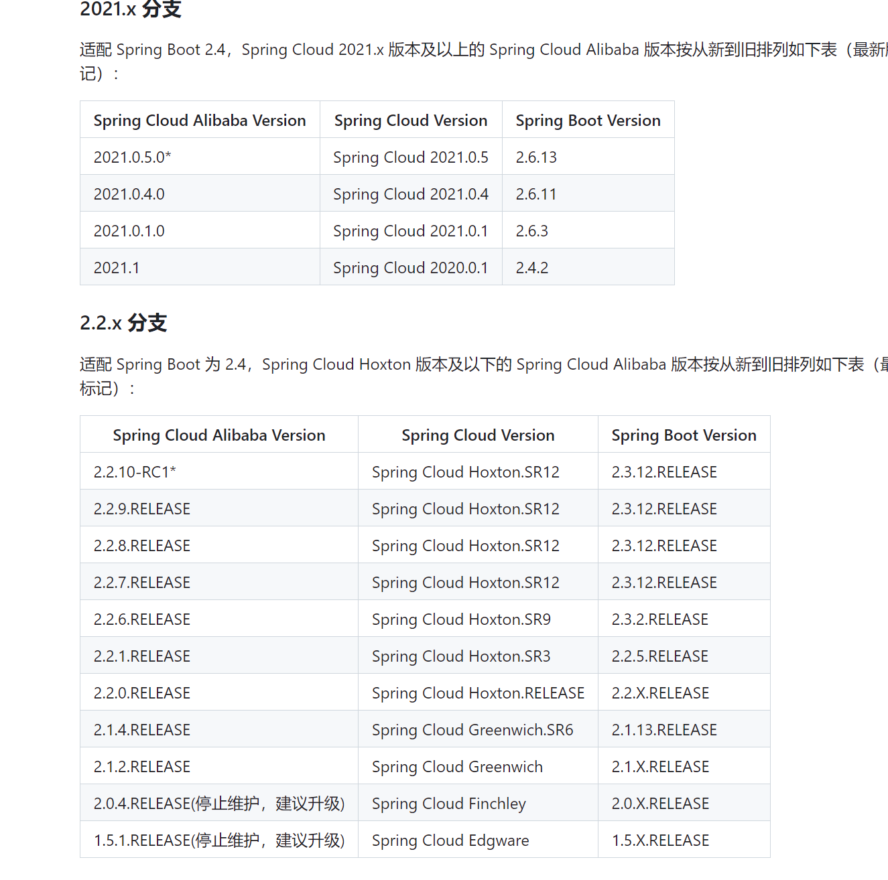
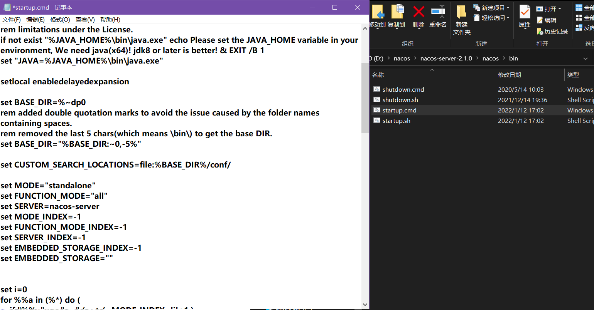
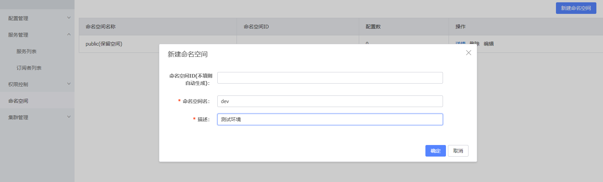
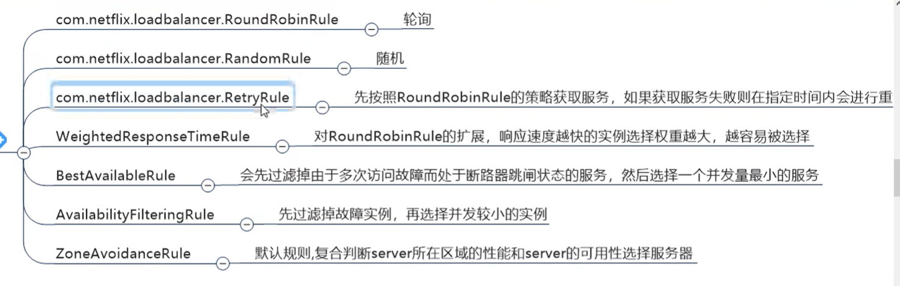

springcloud的版本说明

https://github.com/alibaba/spring-cloud-alibaba/wiki/%E7%89%88%E6%9C%AC%E8%AF%B4%E6%98%8E

在父项目中

```
<dependencyManagement>
        <dependencies>
            <dependency>
                <groupId>org.springframework.boot</groupId>
                <artifactId>spring-boot-starter-parent</artifactId>
                <version>2.3.12.RELEASE</version>
                <type>pom</type>
                <scope>import</scope>
            </dependency>

            <!--spring自己的cloud-->
            <dependency>
                <groupId>org.springframework.cloud</groupId>
                <artifactId>spring-cloud-dependencies</artifactId>
                <version>Hoxton.SR1</version>
                <type>pom</type>
                <scope>import</scope>
            </dependency>

            <!--alibaba的cloud-->
            <dependency>
                <groupId>com.alibaba.cloud</groupId>
                <artifactId>spring-cloud-alibaba-dependencies</artifactId>
                <version>2.2.8.RELEASE</version>
                <type>pom</type>
                <scope>import</scope>
            </dependency>
        </dependencies>

    </dependencyManagement>
```

## 修改nacos的启动文件为单机启动



http://127.0.0.1:8848/nacos/index.html

登录到这个网址

用户名：nacos

密码：nacos

## 新建命名空间



## 配置客户端的yml

```
server:
  port: 8011

#配置nacos
spring:
  application:
    name: child-demo
  cloud:
    nacos:
      server-addr: 127.0.0.1:8848
      discovery:
        namespace: d41c46e3-22b5-4651-a371-9d5bb4c96a32
        username: nacos
        password: nacos
```

java: Compilation failed: internal java compiler error

报这个错，改setting的java编译环境

## 配置服务端1的yml

```
server:
  port: 8012

#配置nacos
spring:
  application:
    name: child-nacos
  cloud:
    nacos:
      server-addr: 127.0.0.1:8848
      discovery:
        namespace: d41c46e3-22b5-4651-a371-9d5bb4c96a32
        username: nacos
        password: nacos
```

## 配置服务端2的yml

```
server:
  port: 8013

#配置nacos
spring:
  application:
    name: child-nacos
  cloud:
    nacos:
      server-addr: 127.0.0.1:8848
      discovery:
        namespace: d41c46e3-22b5-4651-a371-9d5bb4c96a32
        username: nacos
        password: nacos
```

## ribbon配置

ribbon是一个开源的Java库，用于在微服务架构中实现客户端负载均衡、服务发现和容错的功能。它提供了一组API和工具，可以帮助开发人员轻松地构建具有高可用性和可伸缩性的分布式系统。Ribbon可以与Spring Cloud等框架集成，使得在微服务架构中管理和调用服务变得更加简单和可靠。

配置客户端的启动类

```
@SpringBootApplication
@EnableDiscoveryClient
@RibbonClients(
        value = {
                @RibbonClient(name = "child-demo",configuration = RibbonRandomRule.class)
        }
)
public class ChildDemoApplication {

    public static void main(String[] args) {
        SpringApplication.run(ChildDemoApplication.class, args);
    }

    @Bean
    @LoadBalanced
    public RestTemplate restTemplate(RestTemplateBuilder builder){
        RestTemplate restTemplate = new RestTemplate();
        return restTemplate;
    }

}

```

依赖

```
<dependency>
                <groupId>org.springframework.cloud</groupId>
                <artifactId>spring-cloud-starter-loadbalancer</artifactId>
            </dependency>
```

ribbon配置类

```
@Configuration
public class RibbonRandomRule {
    @Bean
    public IRule iRule(){
        return new RandomRule();
    }
}
```


ribbon的策略




## openfeign
