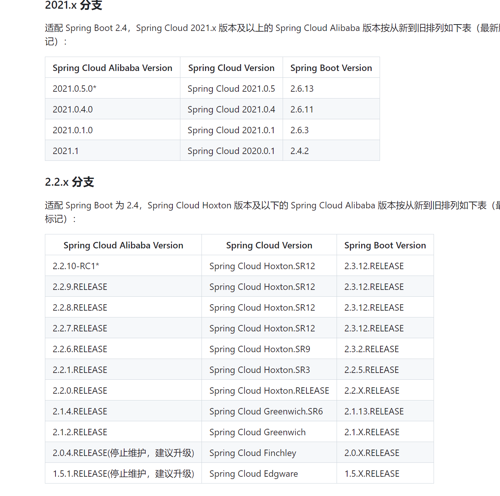
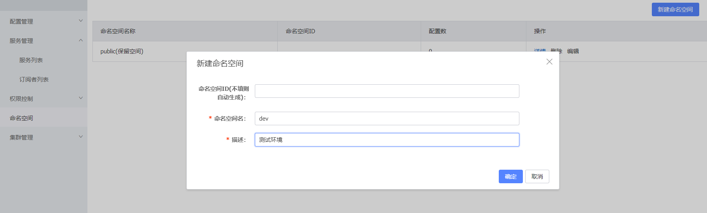
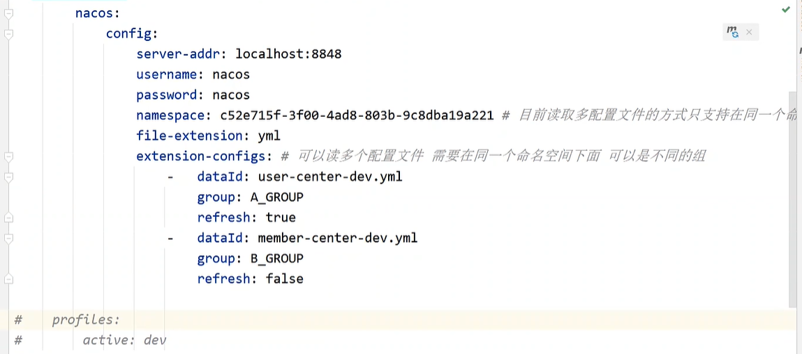
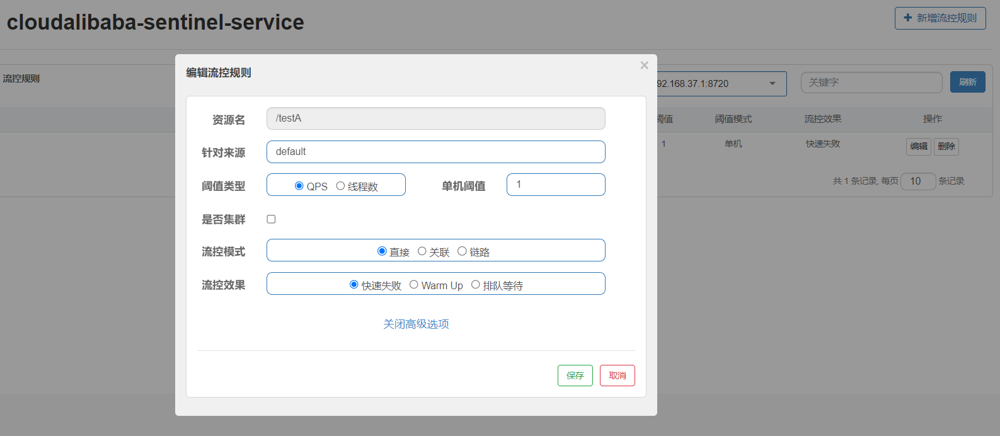

 

## 技术选型


## 文件过滤


父pom

```
<?xml version="1.0" encoding="UTF-8"?>

<project xmlns="http://maven.apache.org/POM/4.0.0" xmlns:xsi="http://www.w3.org/2001/XMLSchema-instance"
         xsi:schemaLocation="http://maven.apache.org/POM/4.0.0 http://maven.apache.org/xsd/maven-4.0.0.xsd">
    <modelVersion>4.0.0</modelVersion>

    <groupId>org.springcloud</groupId>
    <artifactId>springcloud2023</artifactId>
    <version>1.0-SNAPSHOT</version>
    <packaging>pom</packaging>

    <!--统一jar包管理-->
    <properties>
        <project.build.sourceEncoding>UTF-8
        </project.build.sourceEncoding>
        <maven.compiler.source>1.8
        </maven.compiler.source>
        <maven.compiler.target>1.8
        </maven.compiler.target>
        <junit.version>4.12
        </junit.version>
        <log4j.version>1.2.17
        </log4j.version>
        <lombok.version>1.16.18
        </lombok.version>
        <mysql.version>5.1.47
        </mysql.version>
        <druid.version>1.1.16
        </druid.version>
        <mybatis.spring.boot.version>1.3.0
        </mybatis.spring.boot.version>
    </properties>

    <!--子模块继承成功，起作用：锁定版本+子模块不需要配置groupId和version-->
    <dependencyManagement>
        <dependencies>

            <dependency>
                <groupId>org.springframework.boot</groupId>
                <artifactId>spring-boot-dependencies</artifactId>
                <version>2.2.2.RELEASE</version>
                <type>pom</type>
                <scope>import</scope>
            </dependency>

            <dependency>
                <groupId>org.springframework.cloud</groupId>
                <artifactId>spring-cloud-dependencies</artifactId>
                <version>Hoxton.SR1</version>
                <type>pom</type>
                <scope>import</scope>
            </dependency>

            <dependency>
                <groupId>com.alibaba.cloud</groupId>
                <artifactId>spring-cloud-alibaba-dependencies</artifactId>
                <version>2.1.0.RELEASE</version>
                <type>pom</type>
                <scope>import</scope>
            </dependency>
            <dependency>
                <groupId>mysql</groupId>
                <artifactId>mysql-connector-java</artifactId>
            </dependency>
            <dependency>
                <groupId>com.alibaba</groupId>
                <artifactId>druid</artifactId>
            </dependency>
            <dependency>
                <groupId>org.mybatis.spring.boot</groupId>
                <artifactId>mybatis-spring-boot-starter</artifactId>
            </dependency>
            <dependency>
                <groupId>junit</groupId>
                <artifactId>junit</artifactId>
                <version>${junit.version}</version>
            </dependency>
            <dependency>
                <groupId>log4j</groupId>
                <artifactId>log4j</artifactId>
                <version>${log4j.version}</version>
            </dependency>
            <dependency>
                <groupId>org.projectlombok</groupId>
                <artifactId>lombok</artifactId>
                <optional>true</optional>
            </dependency>
        </dependencies>
    </dependencyManagement>

    <build>
        <plugins>
            <plugin>
                <groupId>org.springframework.boot</groupId>
                <artifactId>spring-boot-maven-plugin</artifactId>
                <configuration>
                    <addResources>true</addResources>
                </configuration>
            </plugin>
        </plugins>
    </build>

</project>


```

跳过测试


## Nacos



springcloud的版本说明

https://github.com/alibaba/spring-cloud-alibaba/wiki/%E7%89%88%E6%9C%AC%E8%AF%B4%E6%98%8E

在父项目中

```
<dependencyManagement>
        <dependencies>
            <dependency>
                <groupId>org.springframework.boot</groupId>
                <artifactId>spring-boot-starter-parent</artifactId>
                <version>2.3.12.RELEASE</version>
                <type>pom</type>
                <scope>import</scope>
            </dependency>

            <!--spring自己的cloud-->
            <dependency>
                <groupId>org.springframework.cloud</groupId>
                <artifactId>spring-cloud-dependencies</artifactId>
                <version>Hoxton.SR1</version>
                <type>pom</type>
                <scope>import</scope>
            </dependency>

            <!--alibaba的cloud-->
            <dependency>
                <groupId>com.alibaba.cloud</groupId>
                <artifactId>spring-cloud-alibaba-dependencies</artifactId>
                <version>2.2.8.RELEASE</version>
                <type>pom</type>
                <scope>import</scope>
            </dependency>
        </dependencies>

    </dependencyManagement>
```

## 修改nacos的启动文件为单机启动


http://127.0.0.1:8848/nacos/index.html

登录到这个网址

用户名：nacos

密码：nacos

## 新建命名空间



# 生产者

## 启动类1

```
@SpringBootApplication
@EnableDiscoveryClient
public class CloudAlibabaProviderPayment9001Application {

    public static void main(String[] args) {
        SpringApplication.run(CloudAlibabaProviderPayment9001Application.class, args);
    }

}
```

## 配置文件1

```
server:
  port: 9002

spring:
  application:
    name: nacos-payment-provider
  cloud:
    nacos:
      discovery:
        server-addr: localhost:8848 #配置Nacos地址

management:
  endpoints:
    web:
      exposure:
        include: '*'
```

## 接口1

```
@RestController
public class PaymentController {

    @Value("${server.port}")
    private String serverPort;

    @GetMapping(value = "/payment/nacos/{id}")
    public String getPayment(@PathVariable("id") Integer id)
    {
        return "nacos registry, serverPort: "+ serverPort+"\t id"+id;
    }
}
```

## 启动类2

```
@SpringBootApplication
@EnableDiscoveryClient
public class CloudAlibabaProviderPayment9002Application {

    public static void main(String[] args) {
        SpringApplication.run(CloudAlibabaProviderPayment9002Application.class, args);
    }

}
```

## 配置文件2

```
server:
  port: 9003

spring:
  application:
    name: nacos-payment-provider
  cloud:
    nacos:
      discovery:
        server-addr: localhost:8848 #配置Nacos地址

management:
  endpoints:
    web:
      exposure:
        include: '*'
```

## 接口2

```
@RestController
public class PaymentController {

    @Value("${server.port}")
    private String serverPort;

    @GetMapping(value = "/payment/nacos/{id}")
    public String getPayment(@PathVariable("id") Integer id)
    {
        return "nacos registry, serverPort: "+ serverPort+"\t id"+id;
    }
}
```

## 服务调用者的接口

```
@RestController
public class OrderNacosController {
    @Resource
    private RestTemplate restTemplate;

    @Value("${service-url.nacos-user-service}")
    private String serverUrl;

    @GetMapping("/consumer/payment/nacos/{id}")
    public String paymentInfo(@PathVariable("id") Long id)
    {
        return restTemplate.getForObject(serverUrl+"/payment/nacos/"+id,String.class);
    }
}
```

## 集成nacos的依赖

```
<dependency>
    <groupId>com.alibaba.cloud</groupId>
    <artifactId>spring-cloud-starter-alibaba-nacos-discovery</artifactId>
</dependency>
```

## 配置调用者的Restemplate

```
@Configuration
public class ApplicationContextBean {
    @Bean
    @LoadBalanced
    public RestTemplate getRestTemplate()
    {
        return new RestTemplate();
    }
}
```

## 服务调用者的配置yml

```
server:
  port: 83

spring:
  application:
    name: nacos-order-consumer
  cloud:
    nacos:
      discovery:
        server-addr: localhost:8848


#消费者将要去访问的微服务名称(注册成功进nacos的微服务提供者)
service-url:
  nacos-user-service: http://nacos-payment-provider
```


C是所有节点在同一时间看到的数据是一致的；而A的定义是所有的请求都会收到响应。

何时选择使用何种模式？

一般来说，

如果不需要存储服务级别的信息且服务实例是通过nacos-client注册，并能够保持心跳上报，那么就可以选择AP模式。当前主流的服务如 Spring cloud 和 Dubbo 服务，都适用于AP模式，AP模式为了服务的可能性而减弱了一致性，因此AP模式下只支持注册临时实例。

如果需要在服务级别编辑或者存储配置信息，那么 CP 是必须，K8S服务和DNS服务则适用于CP模式。

CP模式下则支持注册持久化实例，此时则是以 Raft 协议为集群运行模式，该模式下注册实例之前必须先注册服务，如果服务不存在，则会返回错误。

## 切换模式

curl -X PUT '$NACOS_SERVER:8848/nacos/v1/ns/operator/switches?entry=serverMode&value=CP'

# nacos配置中心

```
<?xml version="1.0" encoding="UTF-8"?>
<project xmlns="http://maven.apache.org/POM/4.0.0" xmlns:xsi="http://www.w3.org/2001/XMLSchema-instance"
         xsi:schemaLocation="http://maven.apache.org/POM/4.0.0 https://maven.apache.org/xsd/maven-4.0.0.xsd">
    <modelVersion>4.0.0</modelVersion>
    <parent>
        <groupId>com.springcloud</groupId>
        <artifactId>cloudalibaba</artifactId>
        <version>0.0.1-SNAPSHOT</version>
    </parent>
    <groupId>com.springcloud</groupId>
    <artifactId>cloudalibaba-config-nacos-client3377</artifactId>
    <version>0.0.1-SNAPSHOT</version>
    <name>cloudalibaba-config-nacos-client3377</name>
    <description>cloudalibaba-config-nacos-client3377</description>
    <properties>
        <java.version>17</java.version>
    </properties>
    <dependencies>

        <dependency>
            <groupId>com.alibaba.cloud</groupId>
            <artifactId>spring-cloud-starter-alibaba-nacos-config</artifactId>
        </dependency>
        <dependency>
            <groupId>com.alibaba.cloud</groupId>
            <artifactId>spring-cloud-starter-alibaba-nacos-discovery</artifactId>
        </dependency>

        <dependency>
            <groupId>org.springframework.boot</groupId>
            <artifactId>spring-boot-starter-web</artifactId>
        </dependency>

        <dependency>
            <groupId>org.springframework.boot</groupId>
            <artifactId>spring-boot-starter-test</artifactId>
            <scope>test</scope>
        </dependency>
    </dependencies>

    <build>
        <plugins>
            <plugin>
                <groupId>org.springframework.boot</groupId>
                <artifactId>spring-boot-maven-plugin</artifactId>
            </plugin>
        </plugins>
    </build>

</project>

```

需要先配置nacos自己的配置文件

bootstrap.yml

```
# nacos配置
server:
  port: 3377

spring:
  application:
    name: nacos-config-client
  cloud:
    nacos:
      discovery:
        server-addr: localhost:8848 #Nacos服务注册中心地址
      config:
        server-addr: localhost:8848 #Nacos作为配置中心地址
        file-extension: yaml #指定yaml格式的配置
      # ${spring.application.name}-${spring.profile.active}.${spring.cloud.nacos.config.file-extension}
```

再配置springboot的配置文件

application.yml

```
spring:
  profiles:
    active: dev # 表示开发环境

```

controller

```
@RestController
@RefreshScope //在控制器类加入@RefreshScope注解使当前类下的配置支持Nacos的动态刷新功能。
public class ConfigClientController {
    @Value("${config.info}")
    private String configInfo;

    @GetMapping("/config/info")
    public String getConfigInfo() {
        return configInfo;
    }
}
```

# dataId的配置

官网

https://nacos.io/zh-cn/docs/quick-start-spring-cloud.html


 最后公式：

${spring.application.name}-${spring.profiles.active}.${spring.cloud.nacos.config.file-extension}


spring.application.name就是nacos-config-client

spring.profile.active就是当前的环境，比如dev

最后的文件格式就是yaml


## 必须是yaml


Nacos的命名空间

1 是什么

   类似Java里面的package名和类名

   最外层的namespace是可以用于区分部署环境的，Group和DataID逻辑上区分两个目标对象。

2 三者情况


默认情况：

Namespace=public，Group=DEFAULT_GROUP, 默认Cluster是DEFAULT

Nacos默认的命名空间是public，Namespace主要用来实现隔离。

比方说我们现在有三个环境：开发、测试、生产环境，我们就可以创建三个Namespace，**不同的Namespace之间是隔离的**。

Group默认是DEFAULT_GROUP，Group可以把不同的微服务划分到同一个分组里面去

Service就是微服务；一个Service可以包含多个Cluster（集群），Nacos默认Cluster是DEFAULT，Cluster是对指定微服务的一个虚拟划分。

比方说为了容灾，将Service微服务分别部署在了杭州机房和广州机房，

这时就可以给杭州机房的Service微服务起一个集群名称（HZ），

给广州机房的Service微服务起一个集群名称（GZ），还可以尽量让同一个机房的微服务互相调用，以提升性能。

最后是Instance，就是微服务的实例。

## 配置Nacos的环境，在application.yml中

```
spring:
  profiles:
    active: test
#    active: dev # 表示开发环境
```

dataId可以用来区分开发环境还是测试环境

在配置中心中配置不同的组


## windows中Nacos配置，Nacos持久化


```
##################################################

spring.datasource.platform=mysql
db.num=1
db.url.0=jdbc:mysql://127.0.0.1:3307/nacos_config?characterEncoding=utf8&connectTimeout=1000&socketTimeout=3000&autoReconnect=true&serverTimezone=Asia/Shanghai
db.user=root
db.password=123456
```

新建数据库

在D:\nacos\nacos-server-2.1.0\nacos\conf中找到叫nacos-mysql.sql的sql文件

# Nacos集群，windows版


比如三个集群

就是建三个nacos文件

修改配置文件conf目录下的cluster.conf文件

添加三个集群的IP，自己主机ip+端口号

再去修改application.properties文件中的端口号为对应的ip地址

放开数据库的配置，并修改为自己数据库配置的nacos数据库


放开注解

其他集群的配置相同

注意端口号冲突问题，建议端口号配置的时候大一点

并在启动nacos服务的时候点快一点，有连接超时时间


然后在服务调用者的yml中配置集群的ip+端口


有几个就可以配置几个

## Nacos配置中心

### 依赖

```
<dependency>
    <groupId>com.alibaba.cloud</groupId>
    <artifactId>spring-cloud-starter-alibaba-nacos-config</artifactId>
</dependency>
```

### yml

```
server:
  port: 10000
spring:
  cloud:
    nacos:
      config:
        server-addr: 127.0.0.1:8848
        username: nacos
        password: nacos
        namespace: 1767982e-177b-4e06-9f16-1990e4172adb
        group: USER_GROUP
        prefix: user-service #读取dataId对应的配置文件
        file-extension: yaml
  application:
    name: nacos-config-a
```

### 读取多个dataId和group下的配置文件，dataId要写全



可以使用一个类来接收这些数据

并注入到controller或者其他类中

## ribbon配置

ribbon是一个开源的Java库，用于在微服务架构中实现客户端负载均衡、服务发现和容错的功能。它提供了一组API和工具，可以帮助开发人员轻松地构建具有高可用性和可伸缩性的分布式系统。Ribbon可以与Spring Cloud等框架集成，使得在微服务架构中管理和调用服务变得更加简单和可靠。

配置客户端的启动类

```
@SpringBootApplication
@EnableDiscoveryClient
@RibbonClients(
        value = {
                @RibbonClient(name = "child-demo",configuration = RibbonRandomRule.class)
        }
)
public class ChildDemoApplication {

    public static void main(String[] args) {
        SpringApplication.run(ChildDemoApplication.class, args);
    }

    @Bean
    @LoadBalanced
    public RestTemplate restTemplate(RestTemplateBuilder builder){
        RestTemplate restTemplate = new RestTemplate();
        return restTemplate;
    }

}

```

依赖

```
<dependency>
                <groupId>org.springframework.cloud</groupId>
                <artifactId>spring-cloud-starter-loadbalancer</artifactId>
            </dependency>
```

ribbon配置类

```
@Configuration
public class RibbonRandomRule {
    @Bean
    public IRule iRule(){
        return new RandomRule();
    }
}
```

ribbon的策略


## OpenFeign

声明式接口，我们只需要创建一个接口，并添加注解就可以使用。

OpenFeign是一个用于构建RESTful API客户端的Java库。它提供了一种简单、声明性的方式来定义和调用HTTP API。OpenFeign的目标是使编写HTTP客户端变得更加简单和优雅。
 OpenFeign允许开发人员使用注解来定义API接口，并自动处理HTTP请求和响应。它提供了一些强大的功能，如请求和响应的编码和解码、错误处理、负载均衡和服务发现等。通过使用OpenFeign，开发人员可以更轻松地与远程服务进行通信，而无需手动处理底层的HTTP细节。
 总而言之，OpenFeign是一个方便的工具，可以帮助开发人员在Java应用程序中轻松地构建和调用RESTful API。

依赖

```
<dependency>
	<groupId>org.springframework.cloud</groupId>
	<artifactId>spring-cloud-starter-openfeign</artifactId>
</dependency>
```

主启动类加@EnableFeignClients注解

## Feign接口

```
@Component
@FeignClient(value = "CLOUD-PAYMENT-SERVICE")
public interface OpenFeignService {

    @GetMapping(value = "/payment/get/{id}")
    CommonResult<Payment> getPaymentById(@PathVariable("id") Long id);
}
```


# Gateway

Gateway是在Spring生态系统之上构建的API网关服务，基于Spring 5，Spring Boot 2和 Project Reactor等技术。

Gateway旨在提供一种简单而有效的方式来对API进行路由，以及提供一些强大的过滤器功能， 例如：熔断、限流、重试等

SpringCloud Gateway 是 Spring Cloud 的一个全新项目，基于 Spring 5.0+Spring Boot 2.0 和 Project Reactor 等技术开发的网关，它旨在为微服务架构提供一种简单有效的统一的 API 路由管理方式。

SpringCloud Gateway 作为 Spring Cloud 生态系统中的网关，目标是替代 Zuul，在Spring Cloud 2.0以上版本中，没有对新版本的Zuul 2.0以上最新高性能版本进行集成，仍然还是使用的Zuul 1.x非Reactor模式的老版本。而为了提升网关的性能，SpringCloud Gateway是基于WebFlux框架实现的，而WebFlux框架底层则使用了高性能的Reactor模式通信框架Netty。

Spring Cloud Gateway的目标提供统一的路由方式且基于 Filter 链的方式提供了网关基本的功能，例如：安全，监控/指标，和限流。

SpringCloud Gateway 使用的Webflux中的reactor-netty响应式编程组件，底层使用了Netty通讯框架。


**Route(路由)：**路由是构建网关的基本模块，它由ID，目标URI，一系列的断言和过滤器组成，如果断言为true则匹配该路由

**Predicate(断言)：**

参考的是Java8的java.util.function.Predicate

开发人员可以匹配HTTP请求中的所有内容(例如请求头或请求参数)，如果请求与断言相匹配则进行路由

**Filter(过滤)：**指的是Spring框架中GatewayFilter的实例，使用过滤器，可以在请求被路由前或者之后对请求进行修改。

### 核心逻辑：路由转发+执行过滤器链

这是利用eureka进行的路由转发

yum配置

```
server:
  port: 9527

spring:
  application:
    name: cloud-gateway

eureka:
  instance:
    hostname: cloud-gateway-service
    client: #服务提供者provider注册进eureka服务列表内
    service-url:
      register-with-eureka: true
    fetch-registry: true
    defaultZone: http://eureka7001.com:7001/eureka
```

依赖

```
<dependency>
    <groupId>org.springframework.cloud</groupId>
    <artifactId>spring-cloud-starter-gateway</artifactId>
</dependency>
```

# **注意注意：网关里不能有web的依赖**

要想顺利在新建的网关模块中对其他接口进行映射

需要在yum中加网关的配置

```
cloud:
    gateway:
      routes:
        - id: payment_routh #payment_route    #路由的ID，没有固定规则但要求唯一，建议配合服务名
          uri: http://localhost:8001          #匹配后提供服务的路由地址
          predicates:
            - Path=/payment/get/**         # 断言，路径相匹配的进行路由

        - id: payment_routh2 #payment_route    #路由的ID，没有固定规则但要求唯一，建议配合服务名
          uri: http://localhost:8001          #匹配后提供服务的路由地址
          predicates:
            - Path=/payment/lb/**         # 断言，路径相匹配的进行路由
```

其中Path存的就是localhost:8001这个地址中controller是**payment/get/**(参数)** 的接口

## nacos集成gateway

yml

```
server:
  port: 8033

spring:
  application:
    name: gateway
  cloud:
    nacos:
      server-addr: localhost:8848
      username: nacos
      password: nacos
      discovery:
        namespace: 1767982e-177b-4e06-9f16-1990e4172adb
        GROUP: USER_GROUP
      #开启动态路由
    gateway:
      discovery:
        locator:
          enabled: true
          lower-case-service-id: true # 服务名称小写
```

1.https://blog.csdn.net/weixin_46604354/article/details/126334155

2.https://blog.csdn.net/apple_52109766/article/details/126695106

动态路由的本质就是防止一个路由配置多个访问接口不方便，直接注册到nacos中，并通过服务名或者dataId访问

## 过滤器


# Sentinel


下载sentinel到本地

到sentinel的本地磁盘地址，使用java -jar sentinel-dashboard-1.8.0.jar命令

启动sentinel服务，默认启动的端口号是8080

这样会和tomcat的端口号冲突

可以这样

java -Dserver.port=8718 -Dcsp.sentinel.dashboard.server=localhost:8718 -Dproject.name=sentinel-dashboard -Dcsp.sentinel.api.port=8719 -jar D:\jar\sentinel-dashboard-1.8.0.jar

## 依赖

```
<dependency>
            <groupId>com.alibaba.cloud</groupId>
            <artifactId>spring-cloud-starter-alibaba-nacos-discovery</artifactId>
        </dependency>

        <dependency>
            <groupId>com.alibaba.csp</groupId>
            <artifactId>sentinel-datasource-nacos</artifactId>
        </dependency>

        <dependency>
            <groupId>com.alibaba.cloud</groupId>
            <artifactId>spring-cloud-starter-alibaba-sentinel</artifactId>
        </dependency>

        <dependency>
            <groupId>org.springframework.cloud</groupId>
            <artifactId>spring-cloud-starter-openfeign</artifactId>
        </dependency>

        <dependency>
            <groupId>org.springframework.boot</groupId>
            <artifactId>spring-boot-starter-web</artifactId>
        </dependency>
        <dependency>
            <groupId>org.springframework.boot</groupId>
            <artifactId>spring-boot-starter-actuator</artifactId>
        </dependency>

        <dependency>
            <groupId>org.springframework.boot</groupId>
            <artifactId>spring-boot-devtools</artifactId>
            <scope>runtime</scope>
            <optional>true</optional>
        </dependency>
        <dependency>
            <groupId>cn.hutool</groupId>
            <artifactId>hutool-all</artifactId>
            <version>4.6.3</version>
        </dependency>
        <dependency>
            <groupId>org.projectlombok</groupId>
            <artifactId>lombok</artifactId>
            <optional>true</optional>
        </dependency>
        <dependency>
            <groupId>org.springframework.boot</groupId>
            <artifactId>spring-boot-starter-test</artifactId>
            <scope>test</scope>
        </dependency>
```

## yml配置

```
server:
  port: 8401

spring:
  application:
    name: cloudalibaba-sentinel-service
  cloud:
    nacos:
      discovery:
        #Nacos服务注册中心地址
        server-addr: localhost:8848
    sentinel:
      transport:
        #配置Sentinel dashboard地址
        dashboard: localhost:8718
        #默认8719端口，假如被占用会自动从8719开始依次+1扫描,直至找到未被占用的端口
        port: 8719

management:
  endpoints:
    web:
      exposure:
        include: '*'
```

## controller

```
@RestController
public class FlowLimitController {
    @GetMapping("/testA")
    public String testA() {
        return "------testA";
    }

    @GetMapping("/testB")
    public String testB() {
        return "------testB";
    }
}
```


默认是懒加载模式，需要访问一次接口才行

## 直接->快速失败



如果QPS大于1则前台报错，也就是每秒每次请求数为1

资源名：请求的接口地址


QPS：如果设置为1则，每秒只能请求一次，否则进行限流。

线程数：如果设置为1，用户每次请求开启一个线程时，如果这个线程一直存在，则再开一个线程的话就会被限流。


关联：当与A关联的资源B达到阈值，则限流A（比如支付接口达到阈值，则限流下订单的接口）


如果/testB接口访问达到阈值，则限流/testA

## 预热WarmUp


公式：阈值除以coldFactor(默认值为3),经过预热时长后才会达到阈值

coldFactor就是冷加载因子


阈值10/默认冷加载因子3=3(向下取整)，这是一开始的阈值

再经过5秒的预热时长过渡到10的阈值

### 应用场景:淘宝、京东的秒杀系统

## 降级


RT（平均响应时间，秒级）

    平均响应时间   超出阈值  且   在时间窗口内通过的请求>=5，两个条件同时满足后触发降级

    窗口期过后关闭断路器

    RT最大4900（更大的需要通过-Dcsp.sentinel.statistic.max.rt=XXXX才能生效）

异常比列（秒级）

   QPS >= 5 且异常比例（秒级统计）超过阈值时，触发降级；时间窗口结束后，关闭降级

* 异常比例 (`ERROR_RATIO`)：当单位统计时长（`statIntervalMs`）内请求数目大于设置的最小请求数目，并且异常的比例大于阈值，则接下来的熔断时长内请求会自动被熔断。经过熔断时长后熔断器会进入探测恢复状态（HALF-OPEN 状态），若接下来的一个请求成功完成（没有错误）则结束熔断，否则会再次被熔断。异常比率的阈值范围是 `[0.0, 1.0]`，代表 0% - 100%。

异常数（分钟级）

 异常数（分钟统计）超过阈值时，触发降级；时间窗口结束后，关闭降级

* 异常数 (`ERROR_COUNT`)：当单位统计时长内的异常数目超过阈值之后会自动进行熔断。经过熔断时长后熔断器会进入探测恢复状态（HALF-OPEN 状态），若接下来的一个请求成功完成（没有错误）则结束熔断，否则会再次被熔断。

注意异常降级 **仅针对业务异常** ，对 Sentinel 限流降级本身的异常（`BlockException`）不生效。为了统计异常比例或异常数，需要通过 `Tracer.trace(ex)` 记录业务异常。

```
Entry entry = null;
try {
  entry = SphU.entry(key, EntryType.IN, key);

  // Write your biz code here.
  // <<BIZ CODE>>
} catch (Throwable t) {
  if (!BlockException.isBlockException(t)) {
    Tracer.trace(t);
  }
} finally {
  if (entry != null) {
    entry.exit();
  }
}
```

## 测试@SentinelResource注解

### 新建一个controller，按资源名称限流

```

@RestController
public class RateLimitController {
    @GetMapping("/byResource")
    @SentinelResource(value = "byResource", blockHandler = "handleException")
    public CommonResult byResource() {
        return new CommonResult(200, "按资源名称限流测试OK", new Payment(2020L, "serial001"));
    }

    public CommonResult handleException(BlockException exception) {
        return new CommonResult(444, exception.getClass().getCanonicalName() + "\t 服务不可用");
    }
}
```

@SentinelResource(value = "byResource", blockHandler = "handleException")

value是sentinel的名字;

blockHandler是一个兜底的异常处理方法，当发生限流之后进入这个方法

### 按url地址限流

新增一个接口

```
@GetMapping("/rateLimit/byUrl")
    @SentinelResource(value = "byUrl")
    public CommonResult byUrl()
    {
        return new CommonResult(200,"按url限流测试OK",new Payment(2020L,"serial002"));
    }
```

如果@SentinelResource没有指定blockHandler，则会用系统默认的异常处理

## 客户自定义限流处理逻辑

1.新建一个接口

```
/**
     * 自定义通用的限流处理逻辑，
     blockHandlerClass = CustomerBlockHandler.class
     blockHandler = handleException2
     上述配置：找CustomerBlockHandler类里的handleException2方法进行兜底处理
     */
    /**
     * 自定义通用的限流处理逻辑
     */
    @GetMapping("/rateLimit/customerBlockHandler")
    @SentinelResource(value = "customerBlockHandler",
            blockHandlerClass = CustomerBlockHandler.class, blockHandler = "handleException2")
    public CommonResult customerBlockHandler()
    {
        return new CommonResult(200,"按客户自定义限流处理逻辑");
    }
```

2.新建一个handler的类

```
public class CustomerBlockHandler {
    public static CommonResult handleException1(BlockException exception){
        return new CommonResult(2020,"自定义的限流处理信息......CustomerBlockHandler");
    }

    public static CommonResult handleException2(BlockException exception){
        return new CommonResult(2020,"自定义的限流处理信息......CustomerBlockHandler");
    }
}
```

## 熔断

1.新建cloudalibaba-provider-payment9003/9004两个一样的做法

2.pom文件引入discovery、config、sentinel的依赖

3.yml文件

```

server:
  port: 9003

spring:
  application:
    name: nacos-payment-provider
cloud:
    nacos:
      discovery:
        server-addr: localhost:8848 #配置Nacos地址

management:
  endpoints:
    web:
      exposure:
        include: '*'

```

4.业务类

```
@RestController
public class PaymentController
{
@Value("${server.port}")
private String serverPort;

public static HashMap hashMap = new HashMap();
static
{
hashMap.put(1L,new Payment(1L,"28a8c1e3bc2742d8848569891fb42181"));
hashMap.put(2L,new Payment(2L,"bba8c1e3bc2742d8848569891ac32182"));
hashMap.put(3L,new Payment(3L,"6ua8c1e3bc2742d8848569891xt92183"));
    }

@GetMapping(value = "/paymentSQL/{id}")
public CommonResult paymentSQL(@PathVariable("id") Long id)
    {
        Payment payment = hashMap.get(id);
        CommonResult result = new CommonResult(200,"from mysql,serverPort:  "+serverPort,payment);
return result;
    }


}
```

5.新建cloudalibaba-consumer-nacos-order84

yml文件

```
server:
  port: 84


spring:
  application:
    name: nacos-order-consumer
  cloud:
    nacos:
      discovery:
        server-addr: localhost:8848
    sentinel:
      transport:
        #配置Sentinel dashboard地址
        dashboard: localhost:8080
        #默认8719端口，假如被占用会自动从8719开始依次+1扫描,直至找到未被占用的端口
        port: 8719


#消费者将要去访问的微服务名称(注册成功进nacos的微服务提供者)
service-url:
  nacos-user-service: http://nacos-payment-provider

```

6.编写ApplicationContextBean类

```

@Configuration
public class ApplicationContextConfig
{
@Bean
@LoadBalanced
public RestTemplate getRestTemplate()
    {
return new RestTemplate();
    }
}
```

controller类

```
@RestController
@Slf4j
public class CircleBreakerController
{
public static final String SERVICE_URL = "http://nacos-payment-provider";

@Resource
private RestTemplate restTemplate;

@RequestMapping("/consumer/fallback/{id}")
//@SentinelResource(value = "fallback") 
@SentinelResource(value = "fallback",fallback="handlerFallback") 
public CommonResult fallback(@PathVariable Long id)
    {
        CommonResult result = restTemplate.getForObject(SERVICE_URL + "/paymentSQL/"+id,CommonResult.class,id);

if (id == 4) {
throw new IllegalArgumentException ("IllegalArgumentException,非法参数异常....");
        }else if (result.getData() == null) {
throw new NullPointerException ("NullPointerException,该ID没有对应记录,空指针异常");
        }

return result;
    }
}

```

兜底的fallback方法，在CircleBreakerController类中加入以下代码

```
public CommonResult handlerFallback(@PathVariable  Long id,Throwable e) {
        Payment payment = new Payment(id,"null");
	return new CommonResult(444,"兜底异常handlerFallback,exception内容  "+e.getMessage(),payment);
    }
```

### fallback和blockhandler

```
@RestController
@Slf4j
public class CircleBreakerController
{
public static final String SERVICE_URL = "http://nacos-payment-provider";

@Resource
private RestTemplate restTemplate;

@RequestMapping("/consumer/fallback/{id}")
@SentinelResource(value = "fallback",fallback = "handlerFallback",blockHandler = "blockHandler")
public CommonResult fallback(@PathVariable Long id)
    {
        CommonResult result = restTemplate.getForObject(SERVICE_URL + "/paymentSQL/"+id,CommonResult.class,id);
if (id == 4) {
throw new IllegalArgumentException ("非法参数异常....");
        }else if (result.getData() == null) {
throw new NullPointerException ("NullPointerException,该ID没有对应记录");
        }
return result;
    }
public CommonResult handlerFallback(@PathVariable  Long id,Throwable e) {
        Payment payment = new Payment(id,"null");
return new CommonResult(444,"fallback,无此流水,exception  "+e.getMessage(),payment);
    }
public CommonResult blockHandler(@PathVariable  Long id,BlockException blockException) {
        Payment payment = new Payment(id,"null");
return new CommonResult(445,"blockHandler-sentinel限流,无此流水: blockException  "+blockException.getMessage(),payment);
    }

}

```

结果


若 blockHandler 和 fallback 都进行了配置，则被限流降级而抛出 BlockException 时只会进入 blockHandler 处理逻辑。

如果只是错误抛异常，则归java管，会找兜底的fallback方法

### @SentinelResource中配置exceptionsToIgnore =后，如果发生IllegalArgumentException异常，则fallback不会再去管这个异常，需要人为去管

## sentinel集成openfeign

引入openfeign的依赖

```
<dependency>
    <groupId>org.springframework.cloud</groupId>
    <artifactId>spring-cloud-starter-openfeign</artifactId>
</dependency>
```

yml配置

```
server:
  port: 84


spring:
  application:
    name: nacos-order-consumer
  cloud:
    nacos:
      discovery:
        #Nacos服务注册中心地址
         server-addr: localhost:8848
    sentinel:
      transport:
      #配置Sentinel dashboard地址
      dashboard: localhost:8080
      #默认8719端口，假如被占用会自动从8719开始依次+1扫描,直至找到未被占用的端口
      port: 8719

management:
  endpoints:
    web:
      exposure:
        include: '*'
# 激活Sentinel对Feign的支持
feign:
  sentinel:
    enabled: true 

```

主启动类

```
@EnableDiscoveryClient
@SpringBootApplication
@EnableFeignClients
public class OrderNacosMain84
{
public static void main(String[] args) {
            SpringApplication.run(OrderNacosMain84.class, args);
    }
}
```

业务类,调用业务模块的接口，需要跟业务接口的方法和接口的定义等一摸一样

service接口

```
@FeignClient(value = "nacos-payment-provider",fallback = PaymentFallbackService.class)//调用中关闭9003服务提供者
public interface PaymentService
{
@GetMapping(value = "/paymentSQL/{id}")
public CommonResult paymentSQL(@PathVariable("id") Long id);
}
```

service实现类

```
@Component
public class PaymentFallbackService implements PaymentService
{
@Override
public CommonResult paymentSQL(Long id)
    {
return new CommonResult(444,"服务降级返回,没有该流水信息",new Payment(id, "errorSerial......"));
    }
}
```

controller

```
@RestController
@Slf4j
public class CircleBreakerController
{
public static final String SERVICE_URL = "http://nacos-payment-provider";

@Resource
private RestTemplate restTemplate;

@RequestMapping("/consumer/fallback/{id}")
//@SentinelResource(value = "fallback") //没有配置
//@SentinelResource(value = "fallback",fallback = "handlerFallback") //fallback只负责业务异常
//@SentinelResource(value = "fallback",blockHandler = "blockHandler") //blockHandler只负责sentinel控制台配置违规
@SentinelResource(value = "fallback",fallback = "handlerFallback",blockHandler = "blockHandler",
            exceptionsToIgnore = {IllegalArgumentException.class})
public CommonResult fallback(@PathVariable Long id)
    {
        CommonResult result = restTemplate.getForObject(SERVICE_URL + "/paymentSQL/"+id,CommonResult.class,id);

if (id == 4) {
throw new IllegalArgumentException ("IllegalArgumentException,非法参数异常....");
        }else if (result.getData() == null) {
throw new NullPointerException ("NullPointerException,该ID没有对应记录,空指针异常");
        }

return result;
    }
//本例是fallback
public CommonResult handlerFallback(@PathVariable  Long id,Throwable e) {
        Payment payment = new Payment(id,"null");
return new CommonResult(444,"兜底异常handlerFallback,exception内容  "+e.getMessage(),payment);
    }
//本例是blockHandler
public CommonResult blockHandler(@PathVariable  Long id,BlockException blockException) {
        Payment payment = new Payment(id,"null");
return new CommonResult(445,"blockHandler-sentinel限流,无此流水: blockException  "+blockException.getMessage(),payment);
    }

//==================OpenFeign
@Resource
private PaymentService paymentService;

    @GetMapping(value = "/consumer/openfeign/{id}")
public CommonResult paymentSQL(@PathVariable("id") Long id)
    {
if(id == 4)
        {
throw new RuntimeException("没有该id");
        }
return paymentService.paymentSQL(id);
    }

}

```

## sentinel持久化

依赖，把sentinel写进nacos的数据库

```
<dependency>
  <groupId>com.alibaba.csp</groupId>
  <artifactId>sentinel-datasource-nacos</artifactId>
</dependency>
```

yum配置nacos的数据库

```
server:
  port: 8401

spring:
  application:
    name: cloudalibaba-sentinel-service
  cloud:
    nacos:
      discovery:
        server-addr: localhost:8848 #Nacos服务注册中心地址
  sentinel:
      transport:
      dashboard: localhost:8080 #配置Sentinel dashboard地址
        port: 8719
        datasource:
          ds1:
           nacos:
            server-addr: localhost:8848  
            dataId: cloudalibaba-sentinel-service #服务名dataId
            groupId: DEFAULT_GROUP #组名
            data-type: json
            rule-type: flow

management:
  endpoints:
    web:
      exposure:
        include: '*'

feign:
  sentinel:
    enabled: true # 激活Sentinel对Feign的支持

```
