# Spring框架

## 软件开发七大原则

设计模式中分别是创建型，结构型，行为型，总共有23种设计模式。设计模式是软件开发人员在软件开发过程中面临的一般问题的解决方案。这些解决方案是众多软件开发人员经过相当长的一段时间的试验和错误总结出来的。

使用设计模式能够使我们开发的程序，易维护、可拓展，可复用。但是在23个设计模式的背后，还有7个开发原则去支撑着设计模式，保证23个设计模式能够易维护、可拓展，可复用。所以这篇文章来解开七大设计原则的神秘面纱。

SOLID 是面向对象设计5大重要原则的首字母缩写，当我们设计类和模块时，遵守 SOLID 原则可以让软件更加健壮和稳定。（迪米特与组合/聚合是后加的）


### 单一职责原则（SRP：Singleresponsibility principle）

#### 1.设计原则的概念

**就一个类而言，应该仅有一个引起它变化的原因。**

符合单一职责原则的类具有高内聚的特性

#### 2.详细解释

每一个职责都是变化的一个轴线，如果一个类有一个以上的职责，这些职责就耦合在了一起。耦 合会影响复用性。

如果单一职责原则遵守的好，当修改一个功能时，可以显著降低对其他功能的影响。

所以要遵守单一职责原则，避免将不同职责的功能或接口写到同一个类中，增加了耦合性。

### 开闭原则（OCP：OpenClosed Principle）

#### 1.设计原则的概念

软件实体（类、模块、函数等）应该可以扩展，但是不可修改。

**对扩展是开放的，对于更改是封闭的。**

面对新需求，对程序的改动是通过增加新代码进行的，而不是更改现有的代码

#### 2.详细解释

当软件需要变化时，尽量通过扩展软件实体的行为来实现变化，而不是通过修改已有的代码来实现变化。

**编程中遵循其他原则，以及使用设计模式的目的就是遵循开闭原则。**

**开闭原则是所有原则中最重要的原则，它是所有原则的“老大”，其他原则是服务于开闭原则的。**

### 里氏替换原则（LSP：liskovsubstitution principle）

#### 1.设计原则的概念

子类型必须能够替换掉他们的父类型。所有引用父类的地方必须能透明地使用其子类的对象。

**只有当子类可以替换掉父类、软件单位的功能不受影响时，父类才能真正被复用，而子类也能够在父类的基础上增加新的行为**

正是由于里氏代换原则，才使得开放-封闭成为了可能。

由于子类型的可替换性才使得使用父类类型的模块在无需修改的情况下就可以拓展。

#### 2.详细解释

任何基类可以出现的地方，子类一定可以出现。 **LSP是继承复用的基石，只有当衍生类可以替换掉基类，软件单位的功能不受到影响时，基类才能真正被复用，而衍生类也能够在基类的基础上增加新的行为。**

在使用继承时，遵循里氏替换原则，在子类中尽量不要重写父类已经实现了的方法。

里氏替换原则告诉我们，继承实际上让两个类耦合性增强了，在适当的情况下，可以通过聚合、组合、依赖来解决问题。

### 接口隔离原则（ISP：InterfaceSegregation Principle）

### 1.设计原则的概念

客户端不应该依赖它不需要的接口。一个类对另一个类的依赖应该建立在最小的接口上。

#### 2.详细解释

**提供尽可能小的单独接口，而不要提供大的总接口。暴露行为让后面的实现类知道的越少越好。**

**建立单一接口，不要建立庞大的接口，尽量细化接口，接口中的方法尽量少。**

接口是设计时对外部设定的约定，通过分散定义多个接口，可以预防外来变更的扩散，提高系统的灵活性和可维护性。

### 依赖倒转原则（DIP：Dependence Inversion Principle）

#### 1.设计原则的概念

A.高层模块不应该依赖底层模块。两个都应该依赖抽象

B.抽象不应该依赖细节。细节应该依赖抽象。

**简单的说就是要求对抽象进行编程，不要对实现进行编程，这样就降低了客户与实现模块间的耦合。**

#### 2.详细解释

跟面向对象的多态意思很相像。

**核心思想就是面向接口编程，使用抽象的目的是制定规范，不涉及任何具体的操作，把展示细节的任务交给实现去完成。（跟里氏代换、接口隔离，有很大关系，最后都是为了要维持开闭原则）**

采用依赖倒置原则可以减少类间的耦合性，提高系统的稳定性，减少并行开发引起的风险，提高代码的可读性和可维护性。

### 组合/聚合复用原则 （CARP：Combination/ aggregation Reuse Principle）

#### 1.设计原则的概念

尽量使用组合、聚合，尽量不要使用类继承

#### 2.详细解释

**合成复用原则就是指在一个新的对象里通过关联关系（包括组合关系和聚合关系）来使用一些已有的对象，使之成为新对象的一部分；新对象通过委派调用已有对象的方法达到复用其已有功能的目的。简言之：要尽量使用组合/聚合关系，少用继承。**

在面向对象设计中，可以通过两种基本方法在不同的环境中复用已有的设计和实现，即通过组合/聚合关系或通过继承。

组合/聚合复用原则可以使系统更加灵活，类与类之间的耦合度降低，一个类的变化对其他类造成的影响相对较少，因此一般首选使用组合/聚合来实现复用；其次才考虑继承，在使用继承时，需要严格遵循里氏代换原则，有效使用继承会有助于对问题的理解，降低复杂度，而滥用继承反而会增加系统构建和维护的难度以及系统的复杂度，因此需要慎重使用继承复用。

### 迪米特法则（LOD：Law ofDemeter）

#### 1.设计原则的概念

如果两个类不必彼此直接通信，那么这两个类就不应当发生直接的相互作用。如果其中一个类需要调用另一个类的某一个方法的话，可以通过第三者转发这个调用。

#### 2.详细解释

类与类之间的关系越密切，耦合度也就越来越大，只有尽量降低类与类之间的耦合才符合设计模式；对于被依赖的类来说，无论逻辑多复杂都要尽量封装在类的内部；每个对象都会与其他对象有耦合关系，我们称出现成员变量、方法参数、方法返回值中的类为直接的耦合依赖，而出现在局部变量中的类则不是直接耦合依赖，也就是说，不是直接耦合依赖的类最好不要作为局部变量的形式出现在类的内部。

**一个对象对另一个对象知道的越少越好，即一个软件实体应当尽可能少的与其他实体发生相互作用，在一个类里能少用多少其他类就少用多少，尤其是局部变量的依赖类，能省略尽量省略。同时如果两个类不必彼此直接通信，那么这两个类就不应当发生直接的相互作用。**如果其中一个类需要调用另一个类的某一方法的话，可以通过第三者转发这个调用。

---

**开闭原则，是软件开发七大基本原则之一，其他几个原则：**

    ***里氏代换原则、迪米特原则（最少知道原则）、单一职责原则、接口分隔原则、依赖倒置原则、组合/聚合复用原则***

在其他几个原则中，开闭原则是最核心的，最基础的，

需要搞清楚的是，对什么开，对什么闭；

* 对扩展开放，对修改关闭
* 如果在扩展系统的时候，没有修改原来的程序，只是在原来的基础上进行功能扩展，则符合开闭原则
* 如果在扩展系统的时候，修改了之前的代码，则开闭原则失效，所有的代码都需要重新测试。

**依赖倒置(DIP)：**

核心思想就是，上层的业务不要依赖下层具体的类，比如service层不要依赖具体的mapper层的类，而是用接口调用具体的方法，这里可以用到mybatis的动态代理和反射机制。

## 控制反转IoC(Inversion of Control)

什么时候用到IoC：即违背了OCP，又违背了DIP原则

把两个控制权交出去：

    1.不再采用硬编码的方式new对象了(new对象的控制权交出去了)

    2.不再采用硬编码的方式维护对象之间的关系了(对象之前代码修改的权力交出去了)

spring是实现了IoC思想的容器；

* spring可以帮忙new对象
* spring可以帮忙维护对象之间的关系
* 其中一个IoC的实现方式是依赖注入DI(Dependency Injection)
* 控制反转是思想，依赖注入是控制反转的一种实现方式

DI的两种实现方式：

    1.构造方法注入(通过构造方法给属性赋值)

    2.setter注入(通过set方法给属性赋值)

依赖注入是什么：

* 依赖：对象A与对象B之间的关系
* 注入：通过这种方式可以使对象A与对象B产生关系
* 依赖注入：对象A和对象B之间的关系，通过注入的方式进行维护，而注入的方式有：构造器注入和set方法注入；

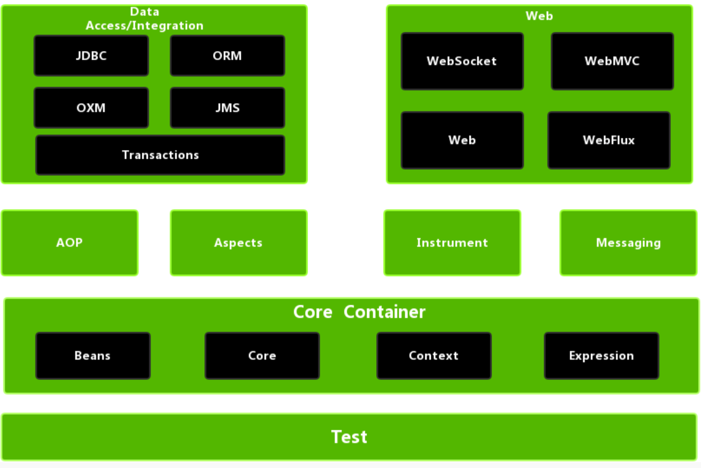

spring8大模块

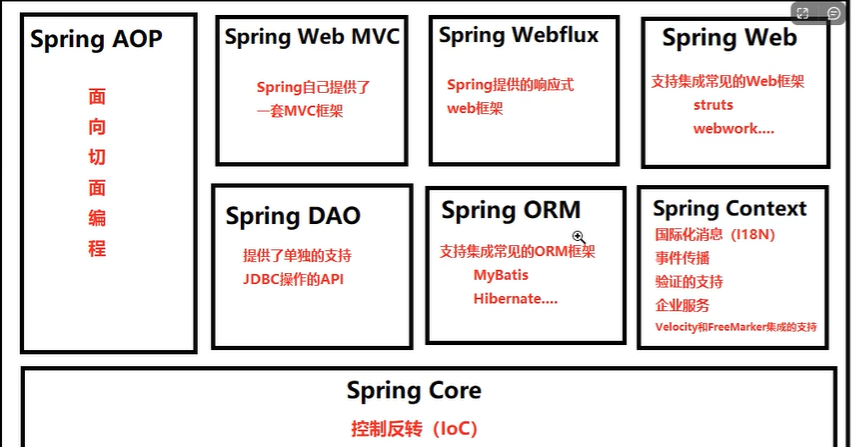

## spring的特点

1.轻量：

    spring框架的大小和开销是轻量的，spring框架完整版的代码在1MB的jar中就可以运行；

    spring是非侵入式的：spring应用中的对象不依赖于spring的特定类

2.容器：

    spring包含并管理应用对象的配置和生命周期，能够管理项目中的所有对象。且本身就是一个容器。

    spring用来管理javabean，bean的意思是"豆子"，可以形容成将豆子(对象)放在spring容器中进行管理。

3.控制反转：

    促进了低耦合（对象与对象之间松散耦合，也利于功能的复用）。

    一个对象依赖其他对象会通过被动的方式传递进来，而不是对象自己创建或者查找依赖对象。

    将创建对象的控制权的转移Spring容器中。

    此时 容器根据配置文件去创建实例和管理各个实例之间的依赖关系。应用到了java的反射机制。

    （1）Spring的IOC有三种注入方式 ：构造器注入、setter方法注入、根据注解注入。

4.面向切面（AOP）

    将纵向重复的代码（公共行为和逻辑）横向抽取出来并封装为一个可重用的模块，这个模块被命名为“切面”（Aspect）。

    Spring框架应用了面向切面的思想，主要体现在为容器中管理的对象生成动态代理对象。

## 测试程序

spring的配置文件

```xml
<?xml version="1.0" encoding="UTF-8"?>
<beans xmlns="http://www.springframework.org/schema/beans"
       xmlns:xsi="http://www.w3.org/2001/XMLSchema-instance"
       xsi:schemaLocation="http://www.springframework.org/schema/beans http://www.springframework.org/schema/beans/spring-beans.xsd">

    <!--idea提供了spring配置文件的模板-->
    <!--最好放在resources目录下-->
    <!--需要配置bean，也就是配置实体类，方便spring管理-->
    <!--配置bean-->
        <!--id：实体类的唯一标识，通过getBean()方法获取这个bean-->
        <!--class：实体类存放的位置-->
    <bean id="userBean" class="com.TBT.spring.bean.User" />
</beans>
```

```java
@Test
    public void testFirstSpringCode(){
        ApplicationContext applicationContext = new ClassPathXmlApplicationContext("spring-config.xml");
        User userBean = (User) applicationContext.getBean("userBean");
        System.out.println(userBean);
    }
```

***可以创建多个spring的配置文件，如果有多个配置文件，则直接在ClassPathXmlApplicationContext的参数列表中写***

`ApplicationContext applicationContext = new ClassPathXmlApplicationContext("spring-config.xml","spring-config.xml",...);`

springs是如何new对象的：

    默认情况下，spring是通过反射机制进行类创建的

    Class clazz = class.forName("com.TBT.spring.bean.User");

    Object object = clazz.newInstance();

Bean的存放方式

实际是存放在一个Map<String,Object>集合中

|    key(id)    | value(class) |
| :-----------: | :----------: |
|  "userBean"  |   User对象   |
| "studentBean" | Student对象 |
|    。。。    |    。。。    |

***Tip1：如果ApplicationContext指定的bean不存在，则会报NoSuchBeanDefinitionException异常***

可以创建java内部自带的类；可以在getBean()的时候指定bean的类型

```java
Date nowTime = applicationContext.getBean("nowTime", Date.class);
        SimpleDateFormat dateFormat = new SimpleDateFormat("yyyy-MM-dd HH:mm:ss SSS");
        String strNowTime = dateFormat.format(nowTime);
        System.out.println(strNowTime);
```

## BeanFactory

BeanFactory是ApplicationContext的顶级父接口，也就是bean工厂，专门用来生产bean的工厂

BeanFactory是IoC容器的顶级父接口

Spring底层的IoC是如何实现的？  XML解析 + 工厂模式 + 反射机制

***Tip2：创建Bean对象的时机是，在解析spring配置文件的时候，也就是 `new ClassPathXmlApplicationContext("spring配置文件名")`的时候就已经创建了。***

## 集成log4j2日志框架

```
<!--log4j日志-->
<dependency>
    <groupId>org.apache.logging.log4j</groupId>
    <artifactId>log4j-core</artifactId>
    <version>2.19.0</version>
</dependency>

<dependency>
    <groupId>org.apache.logging.log4j</groupId>
    <artifactId>log4j-slf4j2-impl</artifactId>
    <version>2.19.0</version>
</dependency>

```

log4j的配置文件

```xml
<?xml version="1.0" encoding="UTF-8"?>
<!--日志级别以及优先级排序: OFF > FATAL > ERROR > WARN > INFO > DEBUG > TRACE > ALL -->
<!--Configuration后面的status，这个用于设置log4j2自身内部的信息输出，可以不设置，当设置成trace时，你会看到log4j2内部各种详细输出-->
<!--monitorInterval：Log4j能够自动检测修改配置 文件和重新配置本身，设置间隔秒数-->
<configuration status="WARN" monitorInterval="30">
    <!--先定义所有的appender-->
    <appenders>
        <!--这个输出控制台的配置-->
        <console name="Console" target="SYSTEM_OUT">
            <!--输出日志的格式-->
            <PatternLayout pattern="[%d{HH:mm:ss:SSS}] [%p] - %l - %m%n"/>
        </console>
        <!--文件会打印出所有信息，这个log每次运行程序会自动清空，由append属性决定，这个也挺有用的，适合临时测试用-->
        <File name="log" fileName="log/test.log" append="false">
            <PatternLayout pattern="%d{HH:mm:ss.SSS} %-5level %class{36} %L %M - %msg%xEx%n"/>
        </File>
        <!-- 这个会打印出所有的info及以下级别的信息，每次大小超过size，则这size大小的日志会自动存入按年份-月份建立的文件夹下面并进行压缩，作为存档-->
        <RollingFile name="RollingFileInfo" fileName="log/info.log"
                     filePattern="log/$${date:yyyy-MM}/info-%d{yyyy-MM-dd}-%i.log">
            <!--控制台只输出level及以上级别的信息（onMatch），其他的直接拒绝（onMismatch）-->
            <ThresholdFilter level="info" onMatch="ACCEPT" onMismatch="DENY"/>
            <PatternLayout pattern="[%d{HH:mm:ss:SSS}] [%p] - %l - %m%n"/>
            <Policies>
                <TimeBasedTriggeringPolicy/>
                <SizeBasedTriggeringPolicy size="100 MB"/>
            </Policies>
        </RollingFile>
        <RollingFile name="RollingFileWarn" fileName="log/warn.log"
                     filePattern="log/$${date:yyyy-MM}/warn-%d{yyyy-MM-dd}-%i.log">
            <ThresholdFilter level="warn" onMatch="ACCEPT" onMismatch="DENY"/>
            <PatternLayout pattern="[%d{HH:mm:ss:SSS}] [%p] - %l - %m%n"/>
            <Policies>
                <TimeBasedTriggeringPolicy/>
                <SizeBasedTriggeringPolicy size="100 MB"/>
            </Policies>
            <!-- DefaultRolloverStrategy属性如不设置，则默认为最多同一文件夹下7个文件，这里设置了20 -->
            <DefaultRolloverStrategy max="20"/>
        </RollingFile>
        <RollingFile name="RollingFileError" fileName="log/error.log"
                     filePattern="log/$${date:yyyy-MM}/error-%d{yyyy-MM-dd}-%i.log">
            <ThresholdFilter level="error" onMatch="ACCEPT" onMismatch="DENY"/>
            <PatternLayout pattern="[%d{HH:mm:ss:SSS}] [%p] - %l - %m%n"/>
            <Policies>
                <TimeBasedTriggeringPolicy/>
                <SizeBasedTriggeringPolicy size="100 MB"/>
            </Policies>
        </RollingFile>
    </appenders>
    <!--然后定义logger，只有定义了logger并引入的appender，appender才会生效-->
    <loggers>
        <!--过滤掉spring和mybatis的一些无用的DEBUG信息-->
        <logger name="org.springframework" level="INFO"></logger>
        <logger name="org.mybatis" level="INFO"></logger>
        <!--日志级别，从高到低
            ALL < TRACE < DEBUG < INFO < WARN < ERROR < FATAL < OFF
        -->
        <root level="DEBUG">
            <appender-ref ref="Console"/>
            <appender-ref ref="RollingFileInfo"/>
            <appender-ref ref="RollingFileWarn"/>
            <appender-ref ref="RollingFileError"/>
        </root>
    </loggers>
</configuration>
```

手动在控制台输出日志

```
Logger logger = LoggerFactory.getLogger(FirstSpringTest.class);
        logger.info("我是一条消息");
        logger.error("我是一条错误信息");
        logger.debug("我是一条调试信息");
```

能输出的级别取决于log4j2配置文件中的级别

## 依赖注入(DI)

### set注入

1.简易流程

dao层定义dao的映射类

```
public class UserDao {

    public void insert(){
        System.out.println("保存成功");
    }
}
```

service层定义业务类，并定义dao层的引用，完成set注入需要给这个引用定义set方法，参数列表就是dao层的这个引用。

```
public class UserService {

    private UserDao userDao;

    public void setUserDao(UserDao userDao) {
        this.userDao = userDao;
    }

    public void saveService(){
        userDao.insert();
    }
}
```

在spring的配置文件中装配bean

Tip：property标签的name属性本质上并不是UserService这个类中属性的属性名，而是生成的set方法，去掉set之后，首字母小写之后，取得的值。

```
<!--配置userDao-->
    <bean id="userDao" class="com.TBT.dao.UserDao"/>

    <!--配置userService-->
    <bean id="userService" class="com.TBT.service.UserService">
        <!--spring调用指定bean里的set方法，需要用到property标签-->
        <!--标签的name属性书写方式，setXXX，去掉set，首字母变小写-->
        <!--标签的ref属性书写方式，可以直接引用另一个bean的id，作为这个set方法的参数-->
        <!--使用这个标签的前提是，定义了set方法-->
        <property name="userDao" ref="userDao"/>
    </bean>
```

2.set注入的时机：对象被构造之后，new对象之后

### 构造器注入

调用构造方法给属性赋值

首先需要在上层的类中定义下层类的引用，并生成构造方法，根据需要指定参数列表的个数

```
public class CustomerService {

    private UserDao userDao;

    private VipDao vipDao;

    public CustomerService(UserDao userDao, VipDao vipDao) {
        this.userDao = userDao;
        this.vipDao = vipDao;
    }

    public void saveService(){
        userDao.insert();
        vipDao.insert();
    }
}

```

在spring的配置文件中做如下配置

1.根据参数列表的下标进行赋值

```
<bean id="userDao" class="com.TBT.dao.UserDao"/>

    <bean id="vipDao" class="com.TBT.dao.VipDao"/>

    <bean id="ctService" class="com.TBT.service.CustomerService">
        <!--利用构造器注入-->
        <!--构造器中的参数有几个，就写一个constructor-arg标签-->
        <!--index=0，表示参数列表中的第一个参数，ref指定配置好的bean-->
        <constructor-arg index="0" ref="userDao"/>
        <!--index=1，表示参数列表中的第二个参数-->
        <constructor-arg index="1" ref="vipDao"/>
    </bean

```

2.根据参数的名字进行赋值，这样做，标签的顺序可以随意

```
<bean id="userDao" class="com.TBT.dao.UserDao"/>

    <bean id="vipDao" class="com.TBT.dao.VipDao"/>

    <bean id="ctService2" class="com.TBT.service.CustomerService">

        <constructor-arg name="userDao" ref="userDao"/>
  
        <constructor-arg name="vipDao" ref="vipDao"/>
    </bean>
```

3.根据参数类型进行赋值

```
<bean id="ctService3" class="com.TBT.service.CustomerService">
        <constructor-arg name="userDao" ref="userDao"/>
        <!--index=1，表示参数列表中的第二个参数-->
        <constructor-arg name="vipDao" ref="vipDao"/>
    </bean>

    <bean id="ctService3" class="com.TBT.service.CustomerService">
        <constructor-arg ref="userDao"/>
        <constructor-arg ref="vipDao"/>
    </bean>
```

交给spring容器自身去判断，只需要指定构造方法中的引用，但是可读性差

## set注入的各种实现方式

### 1.外部bean，一般采用的方式

```
<bean id="userDaoBean" class="com.TBT.dao.UserDao"/>
  
    <bean id="vipDaoBean" class="com.TBT.dao.VipDao"/>
  
    <bean id="userServiceBean" class="com.TBT.service.UserService">
        <property name="userDao" ref="userDaoBean"/>
    </bean>
```

### 2.内部bean

```
<bean id="userServiceBean2" class="com.TBT.service.UserService">
        <property name="userDao">
            <bean class="com.TBT.dao.UserDao"/>
        </property>
    </bean>
```

**哪些类型属于简单类型，Bean都可以注入哪些简单类型**

**BeanUtils的源码解释了：**

```
public static boolean isSimpleValueType(Class<?> type) {
		return (Void.class != type && void.class != type &&
				(ClassUtils.isPrimitiveOrWrapper(type) ||
				Enum.class.isAssignableFrom(type) ||
				CharSequence.class.isAssignableFrom(type) ||
				Number.class.isAssignableFrom(type) ||
				Date.class.isAssignableFrom(type) ||
				Temporal.class.isAssignableFrom(type) ||
				URI.class == type ||
				URL.class == type ||
				Locale.class == type ||
				Class.class == type));
	}
```

八种基本数据类型+八种封装类+枚举+Charquence(字符串)+Number+Date+Temporal(时间时区类型)+URI+URL+Locale(语言类型)+Class

**Tip：实际开发中，一般不把Date看作简单类型。可以采用ref给date类型赋值**

```
<bean id="sv" class="com.TBT.entity.SimpleValue">
        <property name="bd1" value="0.0000000011111111"/>
        <property name="age" value="23"/>
        <property name="age2" value="24"/>
        <property name="clazz" value="java.util.Scanner"/>
        <property name="name" value="zhangsan"/>
        <property name="season" value="SPRING"/>
    </bean>
```

即在实体类中定义属性，创建set方法，再通过上面的bean进行赋值

**注：可以通过简单类型注入实现数据库驱动、url、username、password的注入。**

### 3.级联属性赋值

```
<beans>
        <bean id="student" class="com.TBT.entity.Student">
            <property name="stuId" value="1001"/>
            <property name="stuName" value="zhangsan"/>
            <property name="clazz" ref="clazz"/>
            <property name="clazz.classId" value="01111"/>
            <property name="clazz.className" value="高三二班"/>
        </bean>

        <bean id="clazz" class="com.TBT.entity.Clazz"></bean>
    </beans>
```

**tips：**

**Student类中的Clazz引用，必须提供get方法**

**property标签的顺序不能颠倒**

```
public class Student {

    private String stuId;
    private String stuName;

    public void setStuId(String stuId) {
        this.stuId = stuId;
    }

    public void setStuName(String stuName) {
        this.stuName = stuName;
    }

    private Clazz clazz;

    public Clazz getClazz() {
        return clazz;
    }

    public void setClazz(Clazz clazz) {
        this.clazz = clazz;
    }

    @Override
    public String toString() {
        return "Student{" +
                "stuId='" + stuId + '\'' +
                ", stuName='" + stuName + '\'' +
                ", clazz=" + clazz +
                '}';
    }
}
```

```
public class Clazz {

    private int classId;
    private String className;

    public void setClassId(int classId) {
        this.classId = classId;
    }

    public void setClassName(String className) {
        this.className = className;
    }

    @Override
    public String toString() {
        return "Clazz{" +
                "classId=" + classId +
                ", className='" + className + '\'' +
                '}';
    }
}
```

### 4.注入数组

```
<beans>
  
        <!--注入数组，第一种方式-->
        <bean id="student" class="com.TBT.entity.Student">
            <property name="hobby">
                <array>
                    <value>唱</value>
                    <value>跳</value>
                    <value>rap</value>
                    <value>篮球</value>
                </array>
            </property>
  
            <!--注入数组，第二种方式-->
            <property name="hobbies">
                <array>
                    <ref bean="hobby1"/>
                    <ref bean="hobby2"/>
                    <ref bean="hobby3"/>
                    <ref bean="hobby4"/>
                </array>
            </property>
        </bean>

        <bean id="hobby1" class="com.TBT.entity.Hobby">
            <property name="name" value="唱"/>
        </bean>
        <bean id="hobby2" class="com.TBT.entity.Hobby">
            <property name="name" value="跳"/>
        </bean>
        <bean id="hobby3" class="com.TBT.entity.Hobby">
            <property name="name" value="rap"/>
        </bean>
        <bean id="hobby4" class="com.TBT.entity.Hobby">
            <property name="name" value="篮球"/>
        </bean>
    </beans>
```

### 5.List和Set

```xml
<beans>
        <bean id="student" class="com.TBT.entity.Student">
            <property name="stuId" value="1001"/>
            <property name="stuName" value="zhangsan"/>
            <property name="clazz" ref="clazz"/>
            <property name="clazz.classId" value="01111"/>
            <property name="clazz.className" value="高三二班"/>
        </bean>

        <bean id="clazz" class="com.TBT.entity.Clazz"></bean>

        <bean id="personBean" class="com.TBT.entity.Person">
            <property name="list">
                <list>
                    <value>胡桃</value>
                    <value>雷电影</value>
                    <value>爷</value>
                    <value>桑歌马哈巴依老爷</value>
                    <value>刻晴</value>
                </list>
            </property>

            <property name="set">
                <set>
                    <value>胡桃</value>
                    <value>雷电影</value>
                    <value>爷</value>
                    <value>桑歌马哈巴依老爷</value>
                    <value>刻晴</value>
                </set>
            </property>

            <property name="stuList">
                <list>
                    <ref bean="student" />
                </list>
            </property>
        </bean>
    </beans>
```

```
public class Person {

    private List<String> list;

    private Set<String> set;

    private List<Student> stuList;

    public void setList(List<String> list) {
        this.list = list;
    }

    public void setSet(Set<String> set) {
        this.set = set;
    }

    public void setStuList(List<Student> stuList) {
        this.stuList = stuList;
    }
}
```

### 6.map和properties

```xml
<beans>
        <bean id="personBean" class="com.TBT.entity.Person">
            <property name="personMap">
                <map>
                    <!--如果key和value不是简单类型
                        则用这样的写法
                        <entry key-ref=""  value-ref="" />
                    -->
                    <entry key="1" value="120"/>
                    <entry key="2" value="119"/>
                </map>
            </property>

	    <property name="properties">
                <props>
                    <!--properties类型
                        key和value只能是String类型
                        可以用这个类型注入数据库驱动
                    -->
                    <prop key="driver">com.mysql.jdbc.cj.Driver</prop>
                    <prop key="url">jdbc:mysql://localhost:8080/emp</prop>
                </props>
            </property>
        </bean>
    </beans>
```

entity类

```
public class Person {

    private Map<String,Object> personMap;

    private Properties properties;

    public void setPersonMap(Map<String, Object> personMap) {
        this.personMap = personMap;
    }

    public void setProperties(Properties properties) {
        this.properties = properties;
    }

}

```

***tip：如果不给bean的属性赋值，则字符串默认是null，如果直接给属性赋值为null，则其实是赋了一个null字符串***

```
<bean id="userBean" class="com.TBT.entity.User">
        <!--赋null-->
        <property name="username" value="null"/>
        <!--不赋值-->
        <!--<property name="username" value="张三"/>-->
        <property name="password" value="123456"/>
        <property name="age" value="23"/>
    </bean>
```

赋null，则打印出来的是null字符串

不赋值，则属性值为null

***tip：如果注入的时候有特殊字符，则请使用这个字符的转义字符***

如

| 特殊字符 | 转义字符 |
| -------- | -------- |
| >        | &gt；    |
| <        | &lt；    |
| *        | &quot；  |
| &        | &amp；   |

### `<![CDATA[含有特殊字符的值]]>`注入含有特殊符号的值

当解析xml的时候，碰到这个表达式就会认为CDATA中的值是一个普通字符串

### 7.p命名空间注入

**p命名空间也是基于set注入的，简化set注入方式**

在beans的配置中加一行

`xmlns:p="http://www.springframework.org/schema/p"`

就可以开启p命名空间注入了

```
<?xml version="1.0" encoding="UTF-8"?>
<beans xmlns="http://www.springframework.org/schema/beans"
       xmlns:xsi="http://www.w3.org/2001/XMLSchema-instance"
       xmlns:p="http://www.springframework.org/schema/p"
       xsi:schemaLocation="http://www.springframework.org/schema/beans http://www.springframework.org/schema/beans/spring-beans.xsd">

    <bean id="dogBean" class="com.TBT.entity.Dog" p:name="小黑" p:age="1"></bean>

</beans>
```

ps:虽然简化了书写，但是赋值方式更难理解

### 8.c命名空间注入，基于构造方法的注入

**用于简化构造注入**

在spring配置文件的配置头信息中加一行

```
xmlns:c="http://www.springframework.org/schema/c"
```

```
<?xml version="1.0" encoding="UTF-8"?>
<beans xmlns="http://www.springframework.org/schema/beans"
       xmlns:xsi="http://www.w3.org/2001/XMLSchema-instance"
       xmlns:c="http://www.springframework.org/schema/c"
       xsi:schemaLocation="http://www.springframework.org/schema/beans http://www.springframework.org/schema/beans/spring-beans.xsd">

    <!--第一种方式
        通过参数列表的下标进行赋值
    -->
    <bean id="personBean" class="com.TBT.entity.Person" c:_0="zs" c:_1="23"></bean>

    <!--第二种方式
        通过参数列表的参数名赋值   
    -->
    <bean id="personBean" class="com.TBT.entity.Person" c:name="zs" c:age="23"></bean>
</beans>
```

### 9.基于xml的自动装配-byName

底层也是set注入

```xml
<?xml version="1.0" encoding="UTF-8"?>
<beans xmlns="http://www.springframework.org/schema/beans"
       xmlns:xsi="http://www.w3.org/2001/XMLSchema-instance"
       xsi:schemaLocation="http://www.springframework.org/schema/beans http://www.springframework.org/schema/beans/spring-beans.xsd">

    <bean id="orderServiceImpl" class="com.TBT.service.impl.OrderServiceImpl" autowire="byName"></bean>

    <bean id="orderDao" class="com.TBT.dao.impl.OrderDaoImpl"></bean>
</beans>
```

OrderServiceImpl类通过byName进行自动注入，同时bean容器中要管理OrderDao的实现类

并且OrderServiceImpl中要有OrderDao的set方法，且与bean容器管理的OrderDao的实现类id对应关系为：setOrderDao去掉set，首字母小写

service层

```java
public class OrderServiceImpl implements OrderService {

    OrderDao orderDao;

    public void setOrderDao(OrderDao orderDao) {
        this.orderDao = orderDao;
    }

    @Override
    public void save() {
        orderDao.insert();
    }
}
```

mapper层

```java
public class OrderDaoImpl implements OrderDao {
    @Override
    public void insert() {
        System.out.println("订单正在生成！");
    }
}
```

### 10.基于xml的自动装配-byType

本质也是基于set注入，必须有set方法，与构造方法无关

```xml
<!--利用byType的进行自动装配-->
    <bean class="com.TBT.dao.VipDao"/>
    <bean class="com.TBT.dao.impl.UserDao"/>
    <bean id="customerServiceBean" class="com.TBT.service.CustomerService" autowire="byType"/>
```

service层

```java
public class CustomerService {

    private UserDao userDao;

    private VipDao vipDao;

    public void setUserDao(UserDao userDao) {
        this.userDao = userDao;
    }

    public void setVipDao(VipDao vipDao) {
        this.vipDao = vipDao;
    }

    public void saveService(){
        userDao.insert();
        vipDao.insert();
    }
}
```

根据类型进行装配，某个类型的实例只能有一个，下面这样会报错

**但是不同配置文件之间无所谓**

```
<!--利用byType的进行自动装配-->
    <bean class="com.TBT.dao.VipDao"/>
  
    <bean class="com.TBT.dao.impl.UserDao"/>
    <bean class="com.TBT.dao.impl.UserDao"/>
  
    <bean id="customerServiceBean" class="com.TBT.service.CustomerService" autowire="byType"/>
```

## Bean的作用域

    spring默认情况下是在ClassPathXmlApplicationContext这个类加载的时候，就创建了Bean，也就是说，创建了这个对象就会在这个对象的构造方法中调用初始化bean的方法。

    spring默认创建的bean都是单例的，在spring上下文实例化的时候实例化指定配置文件中的Bean，每次调用getBean()方法会返回单例的那个对象，既无论执行多少次getBean()方法，只要是beanId与beanClass相同，那么就是会创建同一个对象。

设置bean的scope属性为单例(singleton)，还是多例(prototype)

```
<bean id="userDao1" class="com.TBT.dao.impl.UserDao" scope="prototype"/>
<bean id="userDao2" class="com.TBT.dao.impl.UserDao" scope="singleton"/>
```

**注意：**

**如果设置成多例，当beanId相同时，创建的也是多个对象，对象的hash值不同，无参的构造方法不会执行**

**如果设置程多例，创建对象的hash值相同，无参的构造方法会执行**

scope的其他作用域，以及需要满足的条件

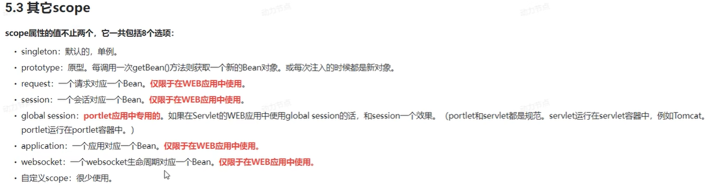

自定义scope

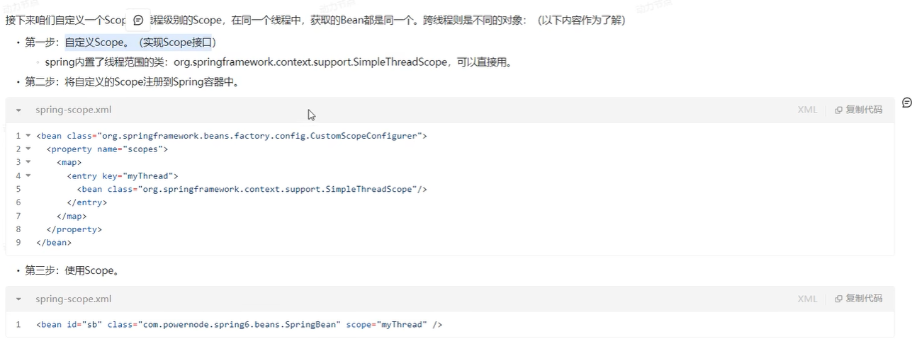

## GoF23中设计模式：

创建型：解决对象创建问题

    单例模式；tomcat

    工厂方法模式；SqlSessionFactory；接口/抽象类->实现类或子类->工厂类(负责对象实例化，批量创建对象)

    抽象工厂模式；

    建造者模式；

    原型模式；

结构型：一些类或者对象组合在一起的经典结构

    代理模式；动态代理，mybatis的动态代理

    装饰模式；IO流

    适配器模式；Servlet里的适配器

    组合模式；

    享元模式；

    外观模式；

    桥接模式；

行为型：解决类或对象之间的交互关系

    策略模式；一个接口下有多个实现类

    模板方法模式；Servlet创建模板

    责任链模式；

    观察者模式；

    迭代子模式；迭代器

    命令模式；

    备忘录模式；

    状态模式；

    访问者模式；

    中介者模式；

    解释器模式；

### 工厂模式：

工厂模式有三种实现方式：

    1.简单工厂模式：不属于23种设计模式，简单工厂模式又叫做***静态工厂方法模式***，**简单工厂模式是工厂方法模式的一种特殊实现**。

    2.工厂方法模式：

    3.抽象工厂模式：

#### 1.简单工厂模式

简单工厂有三种角色：

抽象产品角色：定义抽象类

具体产品角色：子类

工厂类角色：整合生产子类

    优点：

    对于客户来说，不用关心这些子类是怎么来的，只需要向工厂索要就可以

    简单工厂实现了客户不需要关系对象的生产细节

    工厂负责生产，客户负责消费，客户和消费者是职责分离的。

```
public abstract class Weapon {

    public abstract void attack();
}
```

```
public class Tank extends Weapon{
    @Override
    public void attack() {
        System.out.println("嘣嘣嘣！");
    }
}
```

```
public class Fighter extends Weapon{
    @Override
    public void attack() {
        System.out.println("广岛长崎，你妈妈给你带来你最爱的小男孩和瘦子！");
    }
}
```

```
public class WeaponFactory {

    public static Weapon get(String weaponType){
        if (weaponType == "Tank"){
            return new Tank();
        } else if (weaponType.equals("Fighter")){
            return new Fighter();
        } else {
            throw new RuntimeException("无法生产这种武器");
        }
    }
}
```

缺点：把所有鸡蛋放到一个篮子里了；违背OCP原则

#### 工厂方法模式：

    解决简单工厂模式违背OCP原则的问题，上面每种武器各自有他们的工厂类，修改的时候只修改需要修改的工厂类中的代码即可。

## Bean的实例化

1.bean实例化的第一种方式，通过构造方法让spring容器去管理bean，创建对象

2.bean实例化的第二种方式，简单工厂模式

```

    <!--使用简单工厂模式进行bean的创建
        需要指定自己定义的工厂类方法
        用factory-method
    -->
    <bean id="starFactoryBean" class="com.demo.StarFactory" factory-method="createStar"/>
  
    <bean id="starBean" class="com.demo.Star"/>
```

```
public class StarFactory {

    public static Star createStar(){
        return new Star();
    }

}
```

```
public class Star {

    public Star() {
        System.out.println("明星类");
    }


}
```

3.工厂方法模式

每个类与每个工厂类各司其职

Tank类的TankFactory只生产Tank类

```
public class Tank extends Weapon{
    @Override
public void attack() {
        System.out.println("嘣嘣嘣！");
    }
}
```

```
public class TankFactory {

    public Tank get(){
        return new Tank();
    }
}
```

```
<bean id="tankFactory" class="com.simple.factory.TankFactory"/>
  
<!--factory-bean指定这个bean可以通过哪个类去生产，factory-method指定工厂类的哪个方法-->
<bean id="tank" factory-bean="tankFactory" factory-method="get"/>
```

4.工厂类实现FactoryBean<指定哪个类>接口，并实现getObject()方法和getObjectType()方法

    默认是单例的

## FactoryBean和BeanFatory的区别

BeanFatory：这是一个工厂，是SpringIoC容器的顶级接口，是23模式的工厂模式；

    在Spring的IoC容器中，用来创建Bean对象。

FactoryBean：这是一个Bean，辅助Spring实例化其他Bean对象的一个Bean

在Spring中，Bean分为两类：

1.普通Bean

2.工厂Bean

## 注入Date数据

如果一个类里面有一个Date类型的数据

则可以定义一个Date的工厂Bean，通过FactoryBean的构造方法进行值得注入。

```
public class DateFactoryBean implements FactoryBean<Date> {

    private String strDate;

    public DateFactoryBean(String strDate) {
        this.strDate = strDate;
    }

    @Override
    public Date getObject() throws Exception {
	// 在这个方法中格式化date数据
        SimpleDateFormat sdf = new SimpleDateFormat("yyyy-MM-dd");
        Date date = sdf.parse(strDate);

        return date;
    }

    @Override
    public Class<?> getObjectType() {
        return null;
    }
}
```

再放入spring容器中进行管理

```
<?xml version="1.0" encoding="UTF-8"?>
<beans xmlns="http://www.springframework.org/schema/beans"
       xmlns:xsi="http://www.w3.org/2001/XMLSchema-instance"
       xsi:schemaLocation="http://www.springframework.org/schema/beans http://www.springframework.org/schema/beans/spring-beans.xsd">

    <bean id="dateFactoryBean" class="com.TBT.factory.DateFactoryBean">
        <constructor-arg index="0" value="1980-11-11"/>
    </bean>

    <bean id="student" class="com.TBT.entity.Student">
        <property name="birth" ref="dateFactoryBean"/>
    </bean>
</beans>
```

---

## Bean的生命周期之五步

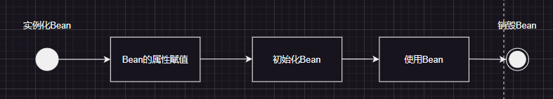

实例化Bean：调用无参构造方法

给Bean的属性赋值：调用set方法

初始化Bean：调用bean的init方法，（init方法需要自己写），当需要在bean的初始化的时候加代码，在这个方法里写

使用Bean：调用bean的各种方法

销毁Bean：调用Bean的destory方法，（这个destory方法需要自己写自己配）

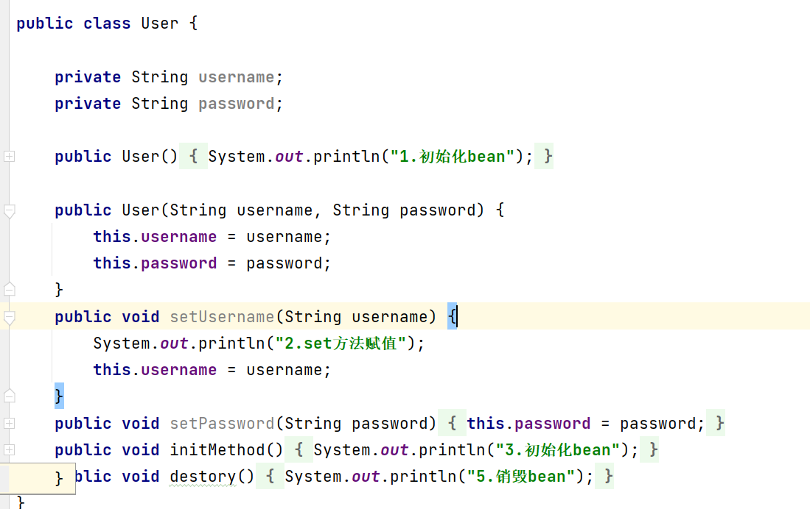

init-method和destroy-method进行bean的初始化和销毁

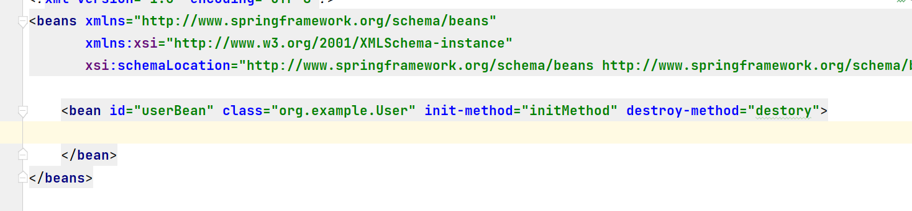

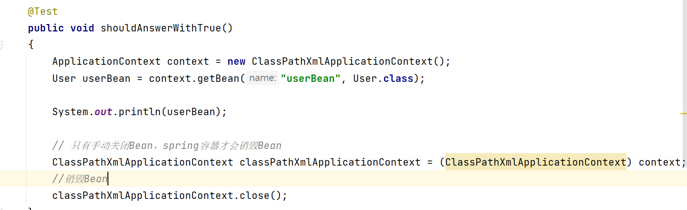

销毁bean之前要做到手动关闭bean

## Bean的生命周期之七步

在初始化Bean之前和之后加一个Bean后处理器的接口，这个接口就是BeanPostProcessor接口

实现里面的before和after方法

### 步骤：

实例化Bean：调用无参构造方法

给Bean的属性赋值：调用set方法

***执行Bean后处理器的before方法***

初始化Bean：调用bean的init方法，（init方法需要自己写），当需要在bean的初始化的时候加代码，在这个方法里写

***执行Bean后处理器的after方法***

使用Bean：调用bean的各种方法

销毁Bean：调用Bean的destory方法，（这个destory方法需要自己写自己配）

定义Bean后处理器

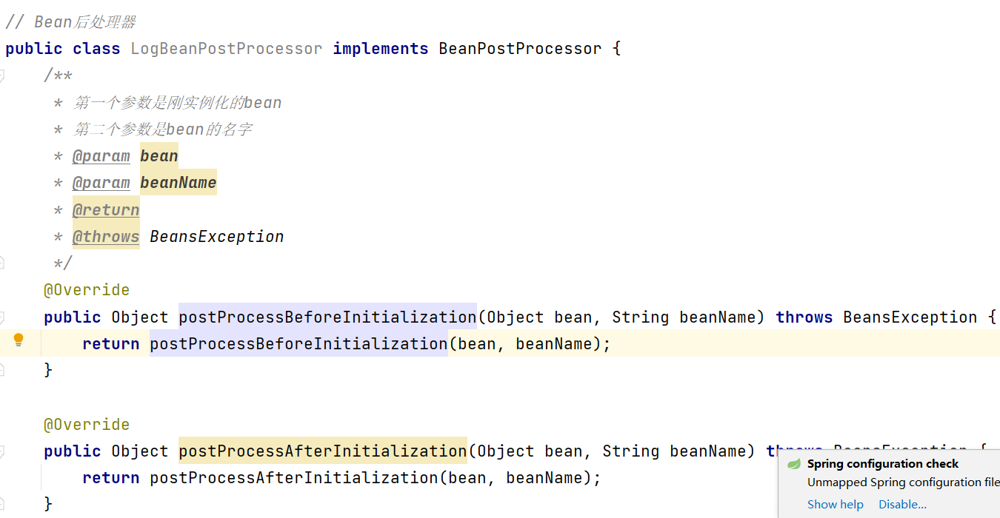

定义bean

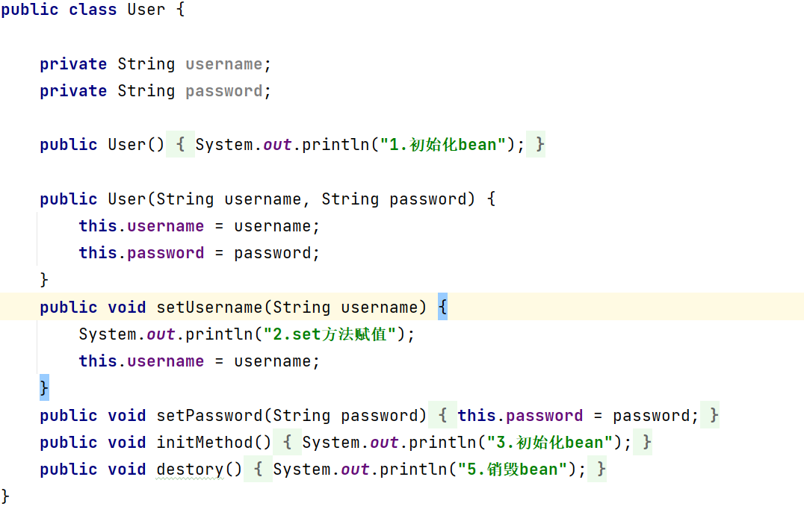

配置spring配置文件

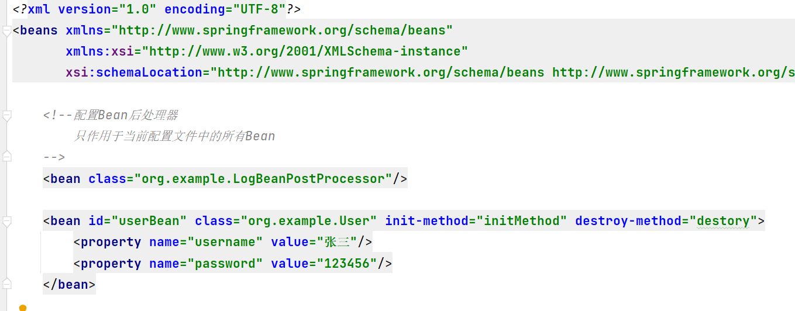

测试

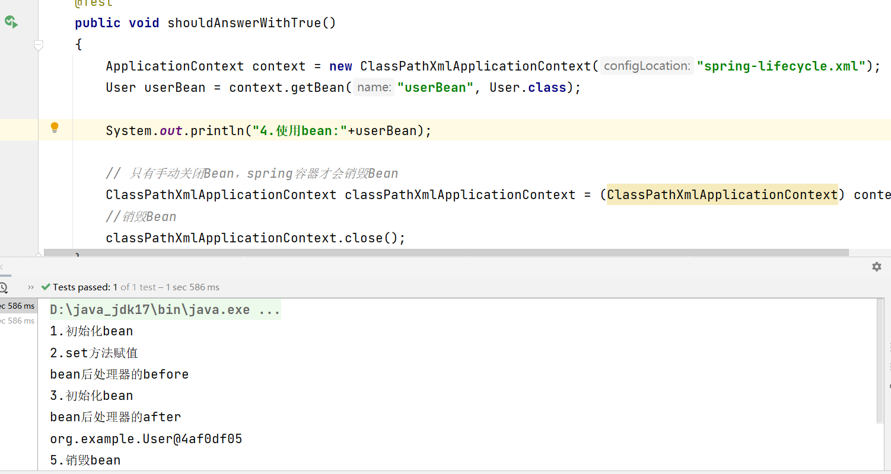

***bean的生命周期之七步顺序***

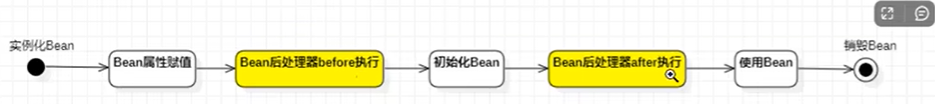

## Bean的生命周期之十步

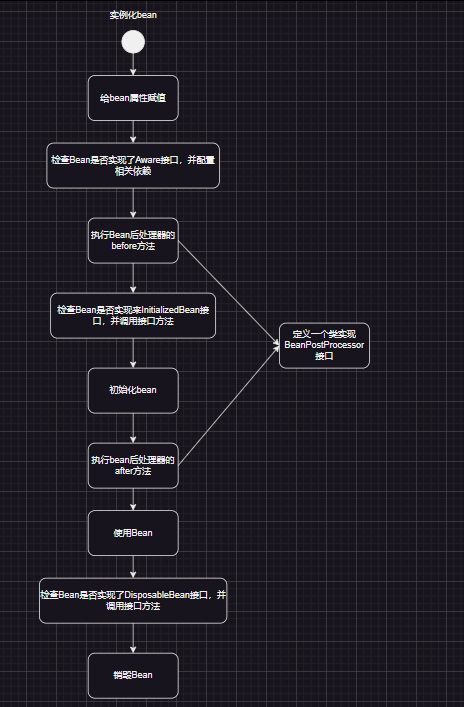

步骤：

1.实例化bean

2.给bean赋值

***3.检查bean是否实现了Aware接口，并调用接口方法***

4.执行bean后处理器的before方法

***5.检查bean是否实现了initialized接口，并调用接口方法***

6.初始化bean

7.执行bean后处理器的after方法

8.使用bean

***9.检查bean是否实现了DisposableBean接口，并调用接口中的方法***

10.销毁bean

其中第三步的Awire接口有三个，分别是BeanNameAware，BeanClassLoaderAware，BeanFactoryAware

BeanNameAware：实现了这个接口的Bean，Spring会将Bean的名字传递给Bean

BeanClassLoaderAware：实现了这个接口的Bean，Spring会将加载该Bean的类加载器传递给Bean

BeanFactoryAware：实现了这个接口的Bean，Spring会将传递给Bean

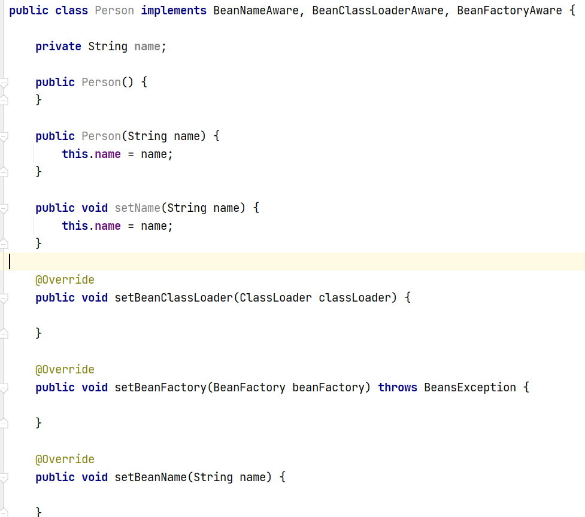

可以设置Bean的名字

设置Bean的类加载器

设置Bean工厂

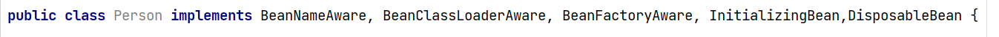

实现InitializingBean接口，并重写afterPropertiesSet方法

实现DisposableBean接口，并重写distory方法，在自定义的销毁bean方法之前调用

### Bean的作用域不同，Spring的管理方式不同

Singleton：Spring管理Bean的整个生命周期

prototype：Spring只负责实例化Bean，客户端获取到Bean，Spring容器不再管理这个Bean，也就是当执行到Bean的生命周期的使用Bean阶段，Spring不再管理这个Bean

将自己new的对象中途交给Spring容器处理

使用DefaultListableBeanFactory对象的registerSingleton方法将对象注册进去

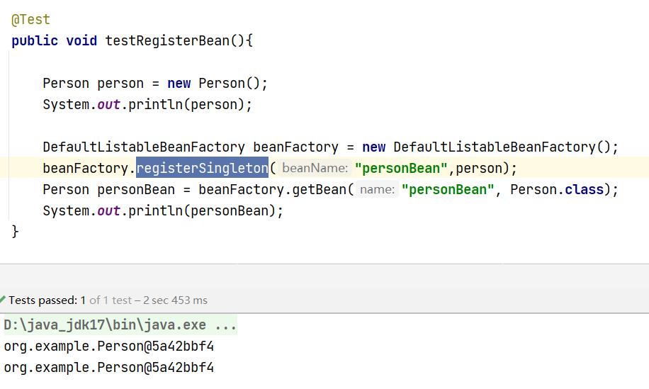

## Bean的循环依赖问题

### 第一种：单例+set注入的方式

这种方式spring是可以解决的

解决的方式分为两个阶段：

第一个阶段，Spring容器在加载的时候，实例化Bean，实例化出来一个Bean，就"曝光"一个Bean

    这个阶段是在给Bean的属性赋值之前

第二个阶段，当"曝光"之后，再调用set方法给属性赋值

解决思路就是：将Bean的实例化与给Bean的属性赋值分为两个阶段。

当有两个Bean，分别是A和B，A先实例化，再set注入；然后B在实例化，再set注入

### 第二种：多例+set注入的方式

配置好bean并设置作用域为prototype多例的形式

也就是Spring容器***不会在一开始就实例化Bean，而是在调用getBean的时候才会将对应的Bean实例化***

```
<?xml version="1.0" encoding="UTF-8"?>
<beans xmlns="http://www.springframework.org/schema/beans"
       xmlns:xsi="http://www.w3.org/2001/XMLSchema-instance"
       xsi:schemaLocation="http://www.springframework.org/schema/beans http://www.springframework.org/schema/beans/spring-beans.xsd">

<!--两个Bean都是prototype，并且双方都有对方的引用属性-->
    <bean id="husbandBean" class="org.example.Husband" scope="prototype">
        <property name="name" value="张三"/>
        <property name="wife" ref="wifeBean"/>
    </bean>

    <bean id="wifeBean" class="org.example.Wife" scope="prototype">
        <property name="name" ref="李四"/>
        <property name="husband" ref="husbandBean"/>
    </bean>
</beans>
```

```
@Test
    void testCircularDependency(){
        ApplicationContext context = new ClassPathXmlApplicationContext("circular-dependency.xml");
        // 此时Spring容器才实例化这个Bean
        Husband husbandBean = context.getBean("husbandBean", Husband.class);
        Wife wifeBean = context.getBean("wifeBean", Wife.class);

    }
```

调用getBean方法之后，实例化多个Bean是按调用getBean的顺序来的

带来的循环依赖：

**对于上面的代码，先实例化Husband这个Bean，但是，Husband类中引用了Wife类，所以当set注入赋值时也需要给wife这个属性赋值，Wife也是个Bean，也需要实例化，它里面的属性也需要set注入赋值，**

**但是Wife这个Bean里面有Husband这个类的引用，所以要给husband这个属性赋值，就需要实例化Husband，也就是新实例化另一个Husband，就死循环了。**

#### 出现的异常

```
org.springframework.beans.factory.BeanCreationException: Error creating bean with name 'husbandBean' defined in class path resource [circular-dependency.xml]: Cannot resolve reference to bean 'wifeBean' while setting bean property 'wife'

	at org.springframework.beans.factory.support.BeanDefinitionValueResolver.resolveReference(BeanDefinitionValueResolver.java:377)
	at org.springframework.beans.factory.support.BeanDefinitionValueResolver.resolveValueIfNecessary(BeanDefinitionValueResolver.java:135)
	at org.springframework.beans.factory.support.AbstractAutowireCapableBeanFactory.applyPropertyValues(AbstractAutowireCapableBeanFactory.java:1663)
	at org.springframework.beans.factory.support.AbstractAutowireCapableBeanFactory.populateBean(AbstractAutowireCapableBeanFactory.java:1412)
	at org.springframework.beans.factory.support.AbstractAutowireCapableBeanFactory.doCreateBean(AbstractAutowireCapableBeanFactory.java:598)
	at org.springframework.beans.factory.support.AbstractAutowireCapableBeanFactory.createBean(AbstractAutowireCapableBeanFactory.java:521)
	at org.springframework.beans.factory.support.AbstractBeanFactory.doGetBean(AbstractBeanFactory.java:344)
	at org.springframework.beans.factory.support.AbstractBeanFactory.getBean(AbstractBeanFactory.java:205)
	at org.springframework.context.support.AbstractApplicationContext.getBean(AbstractApplicationContext.java:1136)
	at org.example.AppTest.testCircularDependency(AppTest.java:63)
	at java.base/jdk.internal.reflect.NativeMethodAccessorImpl.invoke0(Native Method)
	at java.base/jdk.internal.reflect.NativeMethodAccessorImpl.invoke(NativeMethodAccessorImpl.java:77)
	at java.base/jdk.internal.reflect.DelegatingMethodAccessorImpl.invoke(DelegatingMethodAccessorImpl.java:43)
	at java.base/java.lang.reflect.Method.invoke(Method.java:568)
	at org.junit.runners.model.FrameworkMethod$1.runReflectiveCall(FrameworkMethod.java:47)
	at org.junit.internal.runners.model.ReflectiveCallable.run(ReflectiveCallable.java:12)
	at org.junit.runners.model.FrameworkMethod.invokeExplosively(FrameworkMethod.java:44)
	at org.junit.internal.runners.statements.InvokeMethod.evaluate(InvokeMethod.java:17)
	at org.junit.runners.ParentRunner.runLeaf(ParentRunner.java:271)
	at org.junit.runners.BlockJUnit4ClassRunner.runChild(BlockJUnit4ClassRunner.java:70)
	at org.junit.runners.BlockJUnit4ClassRunner.runChild(BlockJUnit4ClassRunner.java:50)
	at org.junit.runners.ParentRunner$3.run(ParentRunner.java:238)
	at org.junit.runners.ParentRunner$1.schedule(ParentRunner.java:63)
	at org.junit.runners.ParentRunner.runChildren(ParentRunner.java:236)
	at org.junit.runners.ParentRunner.access$000(ParentRunner.java:53)
	at org.junit.runners.ParentRunner$2.evaluate(ParentRunner.java:229)
	at org.junit.runners.ParentRunner.run(ParentRunner.java:309)
	at org.junit.runner.JUnitCore.run(JUnitCore.java:160)
	at com.intellij.junit4.JUnit4IdeaTestRunner.startRunnerWithArgs(JUnit4IdeaTestRunner.java:69)
	at com.intellij.rt.junit.IdeaTestRunner$Repeater$1.execute(IdeaTestRunner.java:38)
	at com.intellij.rt.execution.junit.TestsRepeater.repeat(TestsRepeater.java:11)
	at com.intellij.rt.junit.IdeaTestRunner$Repeater.startRunnerWithArgs(IdeaTestRunner.java:35)
	at com.intellij.rt.junit.JUnitStarter.prepareStreamsAndStart(JUnitStarter.java:235)
	at com.intellij.rt.junit.JUnitStarter.main(JUnitStarter.java:54)
Caused by: org.springframework.beans.factory.BeanCreationException: Error creating bean with name 'wifeBean' defined in class path resource [circular-dependency.xml]: Cannot resolve reference to bean '李四' while setting bean property 'name'
	at org.springframework.beans.factory.support.BeanDefinitionValueResolver.resolveReference(BeanDefinitionValueResolver.java:377)
	at org.springframework.beans.factory.support.BeanDefinitionValueResolver.resolveValueIfNecessary(BeanDefinitionValueResolver.java:135)
	at org.springframework.beans.factory.support.AbstractAutowireCapableBeanFactory.applyPropertyValues(AbstractAutowireCapableBeanFactory.java:1663)
	at org.springframework.beans.factory.support.AbstractAutowireCapableBeanFactory.populateBean(AbstractAutowireCapableBeanFactory.java:1412)
	at org.springframework.beans.factory.support.AbstractAutowireCapableBeanFactory.doCreateBean(AbstractAutowireCapableBeanFactory.java:598)
	at org.springframework.beans.factory.support.AbstractAutowireCapableBeanFactory.createBean(AbstractAutowireCapableBeanFactory.java:521)
	at org.springframework.beans.factory.support.AbstractBeanFactory.doGetBean(AbstractBeanFactory.java:344)
	at org.springframework.beans.factory.support.AbstractBeanFactory.getBean(AbstractBeanFactory.java:200)
	at org.springframework.beans.factory.support.BeanDefinitionValueResolver.resolveReference(BeanDefinitionValueResolver.java:365)
	... 33 more
Caused by: org.springframework.beans.factory.NoSuchBeanDefinitionException: No bean named '李四' available
	at org.springframework.beans.factory.support.DefaultListableBeanFactory.getBeanDefinition(DefaultListableBeanFactory.java:892)
	at org.springframework.beans.factory.support.AbstractBeanFactory.getMergedLocalBeanDefinition(AbstractBeanFactory.java:1318)
	at org.springframework.beans.factory.support.AbstractBeanFactory.doGetBean(AbstractBeanFactory.java:300)
	at org.springframework.beans.factory.support.AbstractBeanFactory.getBean(AbstractBeanFactory.java:200)
	at org.springframework.beans.factory.support.BeanDefinitionValueResolver.resolveReference(BeanDefinitionValueResolver.java:365)
	... 41 more

```

#### ***解决这个异常的办法，其中一个Bean改成单例的就可以***

### 第三种：构造注入的方式

单例模式下，Bean的实例化是在构造方法执行完毕之后，进行"曝光"，才算构造注入完成，但是当小a这个Bean还没有"曝光"，就去给小b这个Bean构造注入，当给小b中的小a赋值时，小a没有执行完成，造成循环依赖问题

```
<bean id="wifeBean1" class="org.example.Wife" scope="singleton">
        <constructor-arg index="0" value="李四"/>
        <constructor-arg index="1" ref="husbandBean1"/>
    </bean>

    <bean id="husbandBean1" class="org.example.Husband" scope="prototype">
        <constructor-arg index="0" value="张三"/>
        <constructor-arg index="1" ref="wifeBean1"/>
    </bean>
```

构造注入的循环依赖会产生异常，不管单例还是多例

### **一、单例模式的特点（当没有指定是单例模式还是多例模式的时候，默认是单例模式）：**

    1、Spring容器创建的时候，对应的类的实例化对象一起被创建。
	2、不管获取多少次某个类创建的对象，该实例化对象都只会被创建一次。

### 二、多例模式的特点：

    1、Spring容器创建的时候，对应的类的实例化对象不会被创建，只有在被获取的时候才会被创建。
        2、每次获取的时候都会创建一个新的实例化对象。

### Spring底层解决set+singleton循环依赖

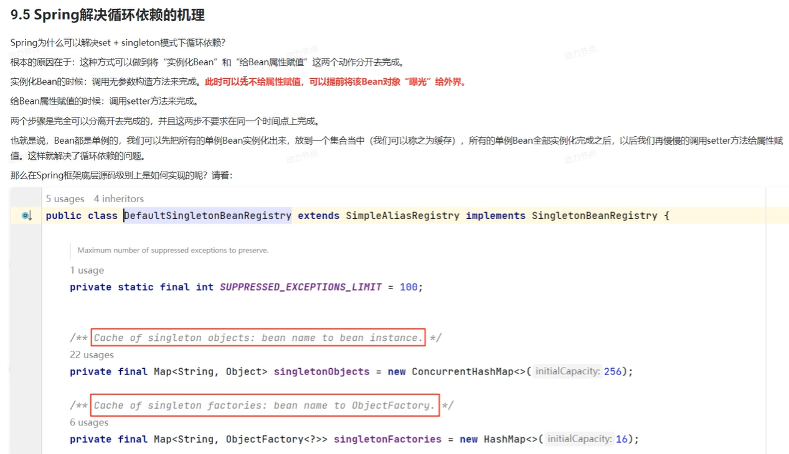

源码：

AbstractAutowireCapableBeanFactory类

```
protected Object doCreateBean(String beanName, RootBeanDefinition mbd, @Nullable Object[] args)
			throws BeanCreationException {

		// Instantiate the bean.
		BeanWrapper instanceWrapper = null;
		if (mbd.isSingleton()) {
			instanceWrapper = this.factoryBeanInstanceCache.remove(beanName);
		}
		if (instanceWrapper == null) {
			instanceWrapper = createBeanInstance(beanName, mbd, args);
		}
		Object bean = instanceWrapper.getWrappedInstance();
		Class<?> beanType = instanceWrapper.getWrappedClass();
		if (beanType != NullBean.class) {
			mbd.resolvedTargetType = beanType;
		}

		// Allow post-processors to modify the merged bean definition.
		synchronized (mbd.postProcessingLock) {
			if (!mbd.postProcessed) {
				try {
					applyMergedBeanDefinitionPostProcessors(mbd, beanType, beanName);
				}
				catch (Throwable ex) {
					throw new BeanCreationException(mbd.getResourceDescription(), beanName,
							"Post-processing of merged bean definition failed", ex);
				}
				mbd.markAsPostProcessed();
			}
		}

		// Eagerly cache singletons to be able to resolve circular references
		// even when triggered by lifecycle interfaces like BeanFactoryAware.
		boolean earlySingletonExposure = (mbd.isSingleton() && this.allowCircularReferences &&
				isSingletonCurrentlyInCreation(beanName));
		if (earlySingletonExposure) {
			if (logger.isTraceEnabled()) {
				logger.trace("Eagerly caching bean '" + beanName +
						"' to allow for resolving potential circular references");
			}
			addSingletonFactory(beanName, () -> getEarlyBeanReference(beanName, mbd, bean));
		}
```

找到最下面的addSingletonFactory方法，进去DefaultSingletonBeanRegistry类里面

## Bean的三级缓存

分别是一级、三级、二级缓存

```
	/** Cache of singleton objects: bean name to bean instance. */
	private final Map<String, Object> singletonObjects = new ConcurrentHashMap<>(256);

	/** Cache of singleton factories: bean name to ObjectFactory. */
	private final Map<String, ObjectFactory<?>> singletonFactories = new HashMap<>(16);

	/** Cache of early singleton objects: bean name to bean instance. */
	private final Map<String, Object> earlySingletonObjects = new ConcurrentHashMap<>(16);
```

这三个缓存都是map集合，key是bean的id

### 一级缓存

存储：完整的单例Bean对象，也就是说这个缓存中的Bean对象已经是赋好值的了，是一个完整的bean对象。

### 二级缓存

存储：早期的单例Bean对象，这个缓存中的单例Bean对象没有赋值，是一个早期的实例对象。

### 三级缓存

存储：单例工厂对象。存储了大量的Bean工厂对象，每一个单例Bean对象都对应一个单例工厂对象

    这个集合中存储的，是创建改单例对象时对应的那个单例工厂对象。

## 注解方式开发

### 1.标注注解的注解，元注解

* @Taget：标注自定义注解可以出现在哪些地方，如：

  ElementType.TYPE：自定义注解可以出现在类上。

  ElementType.METHOD：自定义注解可以出现在方法上。

  ElementType.FIELD：自定义注解可以出现在类的属性上。
* Retention

用来标注自定义注解在程序编译通过后，最用留在字节码文件中，并且可以被反射读取到

RetentionPolicy.SOURCE：表示自定义注解最终只保存在java源文件中，class文件中没有

RetentionPolicy.CLASS：表示java源文件和class文件中都有自定义的注解，但是无法被反射机制读取到

RetentionPolicy.RUNTIME：以上条件都满足，并且能被反射机制读取到

自定义注解

```
@Target(ElementType.TYPE)
@Retention(RetentionPolicy.RUNTIME)
public @interface Component {

    // 定义注解的属性
    // String是属性类型
    // value是属性名
    String value();
}
```

```
@Component("userBean")
public class User {

}
```

测试类

```
public class ReflectAnnotationTest {

    public static void main(String[] args) throws ClassNotFoundException {

        // 想要获取一个类上的注解，需要
        // 1.先获取这个类
        Class<?> aClass = Class.forName("com.tbt.entity.User");

        // 2.判断这个类上是否是这个注解，这里是@Component注解
        if (aClass.isAnnotationPresent(Component.class)) {
            // 3.获取注解
            Component annotation = aClass.getAnnotation(Component.class);
            System.out.println(annotation.value());
        }
    }
}
```

模拟ComponentScan扫描组件

```

/**
 * 组件扫面器
 */
public class ComponentScan {
    static Map<String,Object> beanMap = new HashMap<>();
    public static void main(String[] args) {
        // 当前bean的包路径
        String beanPath = "com.tbt.entity";

        // com/tbt/entity
        String packagePath = beanPath.replaceAll("\\.", "/");

        //file:/D:/My%20Work%20National/IJ_IDEA/annotationtolearn/target/classes/com/tbt/entity
        URL url = ClassLoader.getSystemClassLoader().getResource(packagePath);

        // /D:/My%20Work%20National/IJ_IDEA/annotationtolearn/target/classes/com/tbt/entity
        String path = url.getPath();


        // 根据路径创建文件对象
        File file = new File(path);
        // 获取path路径下所有的文件
        File[] files = file.listFiles();
        Arrays.stream(files).forEach(f -> {
            try{
                //System.out.println(f.getName().split("\\.")[0]);
                // 获取bean的权限定类名
                String className = beanPath + "." + f.getName().split("\\.")[0];
                // 利用反射创建对象
                Class<?> aClass = Class.forName(className);
                // 判断类上面是否有@Component注解
                if (aClass.isAnnotationPresent(Component.class)) {
                    // 有则创建对象
                    Component annotation = aClass.getAnnotation(Component.class);
                    String value = annotation.value();
                    Object obj = aClass.newInstance();

                    beanMap.put(value,obj);
                }
            } catch (Exception e){
                e.printStackTrace();
            }

        });
    }
}
```

根据用户创建的包路径，拿到这个文件的路径，利用文件路径创建文件对象；

拿到这个文件夹下所有的class文件，并遍历;

将.class后缀切掉并在前面拼上包路径;

获取对象字节码文件，拿到注解，创建对象

### 2.声明bean的注解

@Component

@Controller

@Service

@Repository

其他三个都是Component的别名，这四个其实是一个注解

#### 要用这四个注解，需要指定包扫描的路径

```
<?xml version="1.0" encoding="UTF-8"?>
<beans xmlns="http://www.springframework.org/schema/beans"
       xmlns:xsi="http://www.w3.org/2001/XMLSchema-instance"
       xmlns:context="http://www.springframework.org/schema/context"
       xsi:schemaLocation="http://www.springframework.org/schema/beans http://www.springframework.org/schema/beans/spring-beans.xsd
                            http://www.springframework.org/schema/context http://www.springframework.org/schema/context/spring-context  .xsd">

    <!--指定spring的框架需要扫描哪个包中的类-->
    <context:component-scan base-package="com.TBT.spring.bean"/>
</beans>
```

xmlns:context="http://www.springframework.org/schema/context"

http://www.springframework.org/schema/context http://www.springframework.org/schema/context/spring-context  .xsd

<context:component-scan base-package="com.TBT.spring.bean"/>

在spring的配置文件中加这三条

```
@Component("userBean")
public class User {
}

//相当于<bean id="user" class="com.TBT.spring.bean.User"/>
```

如果不指定value的话，默认是类名首字母变小写

Tips：多个包直接用逗号隔开，在一个配置文件里

**了解**

#### 让注解生效和失效的配置

```
<?xml version="1.0" encoding="UTF-8"?>
<beans xmlns="http://www.springframework.org/schema/beans"
       xmlns:xsi="http://www.w3.org/2001/XMLSchema-instance"
       xmlns:context="http://www.springframework.org/schema/context"
       xsi:schemaLocation="http://www.springframework.org/schema/beans http://www.springframework.org/schema/beans/spring-beans.xsd
                           http://www.springframework.org/schema/context http://www.springframework.org/schema/context/spring-context.xsd">

    <!--use-default-filters="false",
    先使com.TBT.spring.bean包下，所有声明bean的注解失效
    Component、Controller、Service、Repository
    -->
    <context:component-scan base-package="com.TBT.spring.bean" use-default-filters="false">
        <!--只让指定的注解生效-->
        <context:include-filter type="annotation" expression="org.springframework.stereotype.Controller"/>
    </context:component-scan>

    <!--use-default-filters="true",
    先使com.TBT.spring.bean包下，所有声明bean的注解生效
    Component、Controller、Service、Repository
    -->
    <context:component-scan base-package="com.TBT.spring.bean">
        <!--只让指定的注解失效-->
        <context:exclude-filter type="annotation" expression="org.springframework.stereotype.Controller"/>
    </context:component-scan>
</beans>
```

### 3.负责属性注入的注解

**有了这些注解，就不需要set方法了**

#### @Value：注入简单类型

**可以出现的位置：**

```
@Target({ElementType.FIELD, ElementType.METHOD, ElementType.PARAMETER, ElementType.ANNOTATION_TYPE})
@Retention(RetentionPolicy.RUNTIME)
```

```
<bean id="userBean" class="com.TBT.spring.bean.User">
    <property name="username" value="张三"/>
</bean>
```

#### @Autowired：注入非简单类型，***默认是根据类型进行自动装配-->byType***

    根据名字进行自动装配，***需要@Autowired和@Qualifier一起用***

**可以出现的位置：**

```
@Target({ElementType.CONSTRUCTOR, ElementType.METHOD, ElementType.PARAMETER, ElementType.FIELD, ElementType.ANNOTATION_TYPE})
@Retention(RetentionPolicy.RUNTIME)
```

OrderDao接口

```
public interface OrderDao {

    void insert();
}
```

OrderDao实现类

```
@Repository
public class OrderDaoForMySql implements OrderDao {
    @Override
    public void insert() {
        System.out.println("mysql数据库正在生成订单。。。");
    }
}
```

OrderService接口

```
public interface OrderService {

    void generate();
}

```

OrderService实现类

```
@Service
public class OrderServiceImpl implements OrderService {

    @Autowired
    private OrderDao orderDao;

    @Override
    public void generate() {
        orderDao.insert();
    }
}
```

@Autowired的缺点：如果一个dao层接口有多个实现类，则会自动报错

    所以一个接口有多个实现类，则这个注解无法识别需要注入哪个实现类

#### @Qualifier

为了解决@Autowired注解根据类型进行注入时，一个接口有多个实现类而不能识别的情况

@Autowired和@Qualifier("实现类的组件名子")唯一标识一个实现类

可以出现的位置：

```
@Target({ElementType.FIELD, ElementType.METHOD, ElementType.PARAMETER, ElementType.TYPE, ElementType.ANNOTATION_TYPE})
@Retention(RetentionPolicy.RUNTIME)
```

#### @Resource


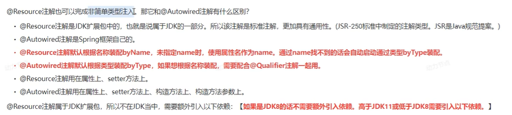

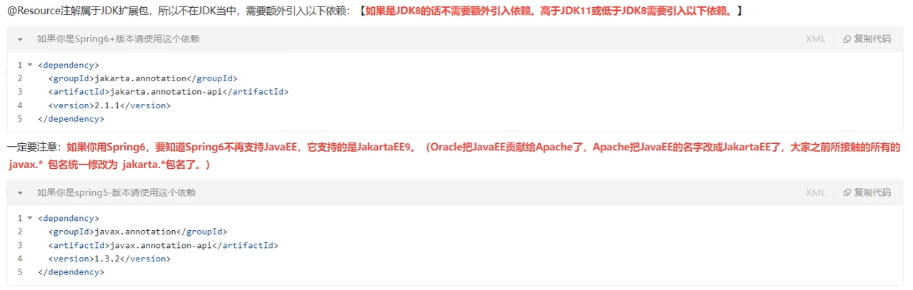

以导入上面的依赖为前提

```
@Service
public class OrderServiceImpl implements OrderService {

    /*@Autowired
    @Qualifier
    private OrderDao orderDao;*/

    @Resource(name = "orderDaoForMySql")
    private OrderDao orderDao;

    @Override
    public void generate() {
        orderDao.insert();
    }
}

```

#### Spring6不支持javax的依赖

javax改成了jakarta包

#### spring配置类代替xml配置文件@Configuration

```
@Configuration
@ComponentScan({"com.TBT.spring.bean3.dao","com.TBT.spring.bean3.service"})
public class springConfig {
}
```

## JDBCTemplate

配置数据源信息

```
<?xml version="1.0" encoding="UTF-8"?>
<beans xmlns="http://www.springframework.org/schema/beans"
       xmlns:xsi="http://www.w3.org/2001/XMLSchema-instance"
       xsi:schemaLocation="http://www.springframework.org/schema/beans http://www.springframework.org/schema/beans/spring-beans.xsd">


    <!--配置自定义数据源-->
    <bean id="myDatabase" class="com.tbt.bean.MyDatabase">
        <property name="driver" value="com.mysql.jdbc.Driver"/>
        <property name="url" value="jdbc:mysql://localhost:3307/emp"/>
        <property name="username" value="root"/>
        <property name="password" value="123456"/>
    </bean>

    <!--配置jdbctemplate-->
    <bean id="jdbcTemplate" class="org.springframework.jdbc.core.JdbcTemplate">
        <property name="dataSource" ref="myDatabase"/>
    </bean>
</beans>
```

实现datasource接口

```
public class MyDatabase implements DataSource {

    private String driver;
    private String url;
    private String username;
    private String password;

    public MyDatabase() {
    }

    public void setDriver(String driver) {
        this.driver = driver;
    }

    public void setUrl(String url) {
        this.url = url;
    }

    public void setUsername(String username) {
        this.username = username;
    }

    public void setPassword(String password) {
        this.password = password;
    }

    @Override
    public Connection getConnection() throws SQLException {
        Connection connection = null;
        try {
            Class.forName(driver);
            connection = DriverManager.getConnection(url, username, password);
        } catch (ClassNotFoundException e) {
            e.printStackTrace();
        }
        return connection;
    }

```

测试

```
@Test
    public void testJdbcDatabase(){
        ApplicationContext applicationContext = new ClassPathXmlApplicationContext("database-config.xml");
        JdbcTemplate jdbcTemplate = applicationContext.getBean("jdbcTemplate", JdbcTemplate.class);
        System.out.println(jdbcTemplate);
    }
```

增加和修改

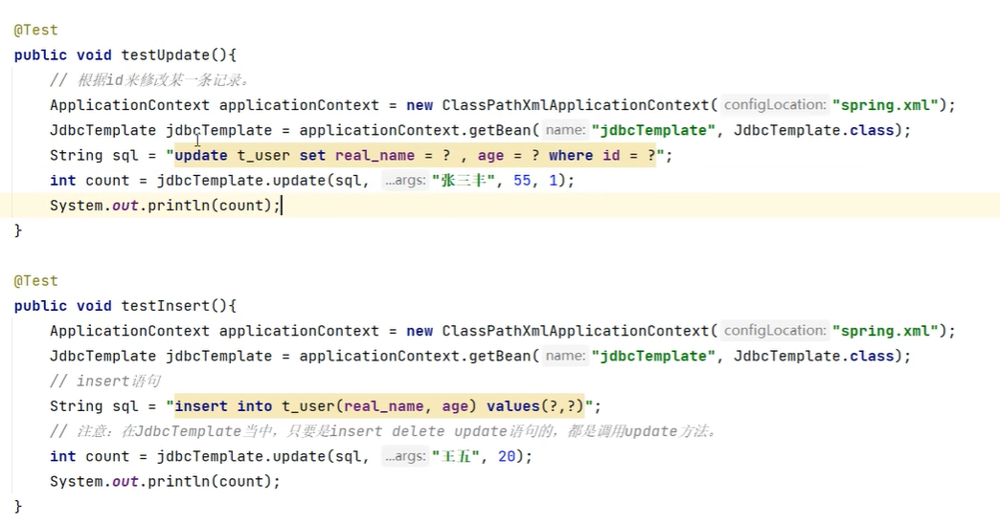

有几个？，就穿几个参数

### 查询

```
public void selectOne(){
    ApplicationContext applicationContext = new ClassPathXmlApplicationContext("database-config.xml");
    JdbcTemplate jdbcTemplate = applicationContext.getBean("jdbcTemplate", JdbcTemplate.class);

    String sql = "select empno from emp";
    //User user = jdbcTemplate.queryForObject(sql, new BeanPropertyRowMapper<>(User.class), 1001);
    // 只能返回一列数据的集合，多列报错
List<Integer> userList = jdbcTemplate.queryForList(sql, Integer.class);
    Iterator<Integer> iterator = userList.iterator();
    while (iterator.hasNext()){
        Integer user = iterator.next();
        System.out.println(user);
    }
    System.out.println();

}
```

jdbcTemplate.queryForList(sql, Integer.class);

### 批量添加测试

```
@Test
    public void insertList(){
        ApplicationContext applicationContext = new ClassPathXmlApplicationContext("database-config.xml");
        JdbcTemplate jdbcTemplate = applicationContext.getBean("jdbcTemplate", JdbcTemplate.class);

        // 批量添加
        String sql = "insert into emp(empno,ename) values(?,?)";
        Object[] obj1 = {1050,"绮良良"};
        Object[] obj2 = {1051,"香菱"};

        List<Object[]> list = new ArrayList<>();
        list.add(obj1);
        list.add(obj2);
        int[] ints = jdbcTemplate.batchUpdate(sql, list);
        String s = Arrays.toString(ints);
        System.out.println(s);

    }
```

### 批量更新测试

```
@Test
    public void batchUpdate(){
        ApplicationContext applicationContext = new ClassPathXmlApplicationContext("database-config.xml");
        JdbcTemplate jdbcTemplate = applicationContext.getBean("jdbcTemplate", JdbcTemplate.class);

        // 批量添加
        String sql = "update emp set empno=?,ename=? where empno=?";
        // 准配数据
        Object[] obj1 = {1045,"瑶瑶",1045};
        Object[] obj2 = {1013,"刻晴",1013};

        List<Object[]> list = new ArrayList<>();
        list.add(obj1);
        list.add(obj2);
        int[] ints = jdbcTemplate.batchUpdate(sql, list);
        String s = Arrays.toString(ints);
        System.out.println(s);

    }
```

批量删除测试

```
@Test
    public void batchDelete(){
        ApplicationContext applicationContext = new ClassPathXmlApplicationContext("database-config.xml");
        JdbcTemplate jdbcTemplate = applicationContext.getBean("jdbcTemplate", JdbcTemplate.class);

        // 批量添加
        String sql = "delete from emp where empno=?";
        // 准配数据,只需要前端的数组
        Object[] obj1 = {1012};
        Object[] obj2 = {1004};

        List<Object[]> list = new ArrayList<>();
        list.add(obj1);
        list.add(obj2);
        int[] ints = jdbcTemplate.batchUpdate(sql, list);
        String s = Arrays.toString(ints);
        System.out.println(s);

    }
```

### 德鲁伊连接池

依赖

```
<dependency>
    <groupId>com.alibaba</groupId>
    <artifactId>druid</artifactId>
    <version>1.2.15</version>
</dependency>
```

配置文件

```
<?xml version="1.0" encoding="UTF-8"?>
<beans xmlns="http://www.springframework.org/schema/beans"
       xmlns:xsi="http://www.w3.org/2001/XMLSchema-instance"
       xsi:schemaLocation="http://www.springframework.org/schema/beans http://www.springframework.org/schema/beans/spring-beans.xsd">


    <!--配置自定义数据源-->
    <bean id="myDatabase" class="com.alibaba.druid.pool.DruidDataSource">
        <property name="driverClassName" value="com.mysql.jdbc.Driver"/>
        <property name="url" value="jdbc:mysql://localhost:3307/emp"/>
        <property name="username" value="root"/>
        <property name="password" value="123456"/>
    </bean>

    <!--配置jdbctemplate-->
    <bean id="jdbcTemplate" class="org.springframework.jdbc.core.JdbcTemplate">
        <property name="dataSource" ref="myDatabase"/>
    </bean>
</beans>
```

## 代理模式GoF

优点：

    1.用户看不到是调用的代理类还是目标类

    2.在功能上增强

    3.保护目标类的代码不被修改

静态代理的缺点：

    会产生类爆炸：如果有1000个接口，则需要1000个代理类

为什么使用代理模式：

1.保护已经写好的代码**不被修改，对于客户端来说使用代理对象，就像是在使用目标对象。**

2.在原来代码的基础上进行**功能增强。**

代理模式中的三个角色

1.目标对象(演员)

2.代理对象(替身演员)

3.目标对象和代理对象之间的公共接口(演员和替身演员都应该具有的动作)

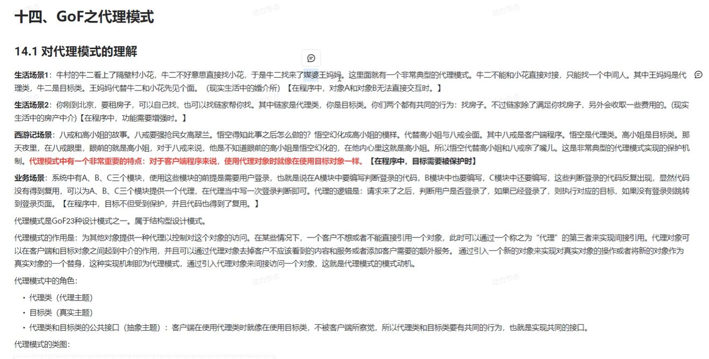

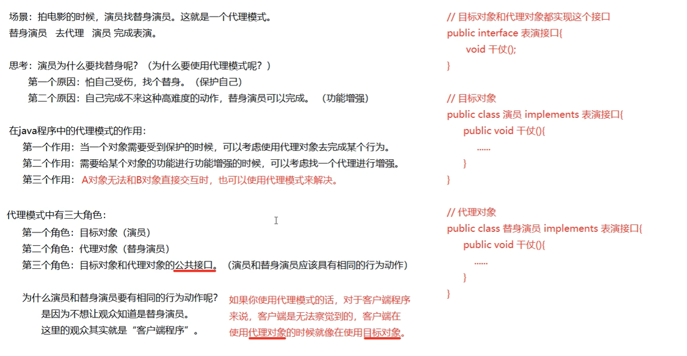

### 静态代理

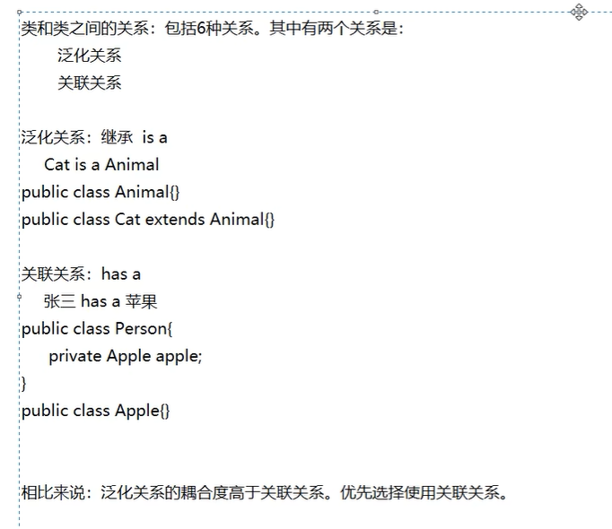

静态代理就是利用的关联关系，降低耦合度

接口

```
public interface OrderService {

    // 生成订单
    void generate();

    // 查询订单
    void findOrder();

    // 提交订单
    void submitOrder();
}
```

实现类（目标类）

```
public class OrderServiceImpl implements OrderService {

    @Override
    public void generate() {
        try {
            Thread.sleep(1000);
        } catch (InterruptedException e) {
            e.printStackTrace();
        }

        System.out.println("订单已生成");
    }

    @Override
    public void findOrder() {
        try {
            Thread.sleep(500);
        } catch (InterruptedException e) {
            e.printStackTrace();
        }

        System.out.println("请查看订单");
    }

    @Override
    public void submitOrder() {
        try {
            Thread.sleep(750);
        } catch (InterruptedException e) {
            e.printStackTrace();
        }

        System.out.println("订单已提交");
    }
}
```

代理类

```

public class OrderServiceProxy implements OrderService {

    // 这样做是为了解耦合
    // 采用关联关系
    private OrderService orderService;

    public OrderServiceProxy(OrderService orderService) {
        this.orderService = orderService;
    }

    @Override
    public void generate() {
        long start = System.currentTimeMillis();
        // 给目标类的前后添加代码，实现代码功能的增强
        orderService.generate();
        long end = System.currentTimeMillis();
        System.out.println("总耗时:"+(end - start));
    }

    @Override
    public void findOrder() {
        long start = System.currentTimeMillis();
        // 给目标类的前后添加代码，实现代码功能的增强
        orderService.findOrder();
        long end = System.currentTimeMillis();
        System.out.println("总耗时:"+(end - start));
    }

    @Override
    public void submitOrder() {
        long start = System.currentTimeMillis();
        // 给目标类的前后添加代码，实现代码功能的增强
        orderService.submitOrder();
        long end = System.currentTimeMillis();
        System.out.println("总耗时:"+(end - start));
    }
}

```

测试

```
@Test
    public void testProxy(){
        // 定义目标类对象
        OrderService orderService = new OrderServiceImpl();

        // 定义代理对象
        OrderService orderServiceProxy = new OrderServiceProxy(orderService);
        orderServiceProxy.generate();
        orderServiceProxy.findOrder();
        orderServiceProxy.submitOrder();
    }
```

### 动态代理

为什么要使用动态代理？

    在内存中动态的生成代理类，目的是为了减少代理类的数量，解决代码复用的问题

有哪些技术：

* JDK的动态代理；
* CGLIB动态代理；

  底层是同过继承的方式实现的；性能比JDK好(底层有一个小而快的字节码处理框架ASM)
* javassist动态代理

#### JDK动态代理

##### 定义调用处理器

```
public class MyInvocationHandler implements InvocationHandler {

    // 目标对象，如果需要调用目标对象中的方法，对方法做增强
    // 则需要如下定义
    private Object target;

    public MyInvocationHandler(Object target) {
        this.target = target;
    }

    /*
    * 这个调用处理器只有在代理对象调用目标类中的方法时
    * JDK才会调用处理器中的invoke()方法
    *
    * 三个参数的作用
    * Object proxy ： 目标对象的引用
    * Method method ： 目标对象的目标方法，就是你要增强的方法
    * Object[] args ： 目标方法的参数
    * */
    @Override
    public Object invoke(Object proxy, Method method, Object[] args) throws Throwable {
        System.out.println("invoke...");
        long start = System.currentTimeMillis();
	// method参数调用invoke方法，将传过来的目标对象以及参数执行
        method.invoke(target,args);
        long end = System.currentTimeMillis();
        System.out.println("总用时"+(end-start));
  
        // 获取调用的目标对象中的方法，有返回值，则需要返回
        // 也就是method.invoke(target,args);这一句接收到了参数
        return null;
    }
}

```

##### 创建代理对象

```
public class TestDynamicProxy {

    public static void main(String[] args) {


        /*
        * newProxyInstance方法的作用
        *   1.用来在内存动态生成代理类的字节码文件.class
        *   2.用来实例化代理类，并在代理类中实现目标类所实现的所有接口
        *
        * newProxyInstance中参数的意义和作用
        *   ClassLoader loader
        *       JDK要求，目标类的类加载器与代理类的类加载器要使用同一个
        *       所以这里可以使用多态实例化目标类，并获取它的类加载器
        *
        *   Class<?>[] interfaces
        *       代理类要实现目标类所有实现的接口，
        *       所以这里可以使用多态实例化目标类，并获取它所实现的所有接口
        *
        *   InvocationHandler h
        *       调用处理器，用来实现代码增强的，所有增强代码都要写在这个类里面
        *       这个类实现了InvocationHandler接口，需要自己手动写
        * */
        OrderService orderService = new OrderServiceImpl();
        OrderService proxyObj = (OrderService) Proxy.newProxyInstance(orderService.getClass().getClassLoader(),
                orderService.getClass().getInterfaces(),
                new MyInvocationHandler());

        // 调用代理对象的代理方法，调用处理器中的invoke方法被调用
        proxyObj.generate();
    }
}
```

#### CGLIB动态代理

依赖

```
<dependency>
	<groupId>cglib</groupId>
	<artifactId>cglib</artifactId>
	<version>3.3.0</version>
</dependency>
```

CGLIB与JDK的动态代理有什么区别

    CGLIB底层采用的是继承的方式，有一个小而轻的字节码处理框架ASM，性能优于JDK

    JDK的动态代理，底层采用实现的接口的方式

## 面向切面编程AOP

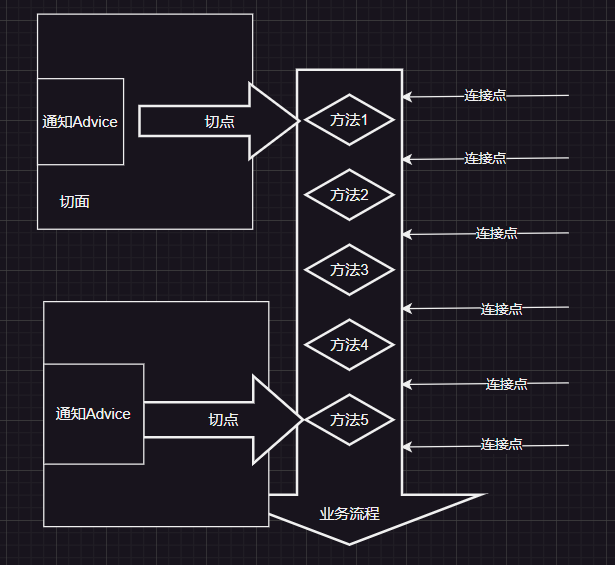

切面：可以理解为，通用的，与本身的业务无挂钩的，固定不变的代码。

    比如一些通用的工具类，拦截器，控制器等，放在哪个项目里都能用。

***适合设置成切面的模块：***

也就是交叉业务

***日志模块、安全模块、事务模块***

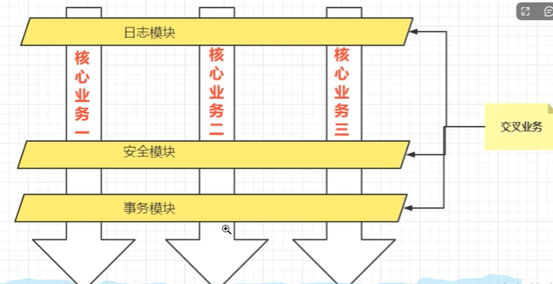

如果将业务逻辑看成是纵向的逻辑，那么切面就是横向的交叉进业务逻辑里

**AOP：面向切面编程，AOP是一种编程技术，是对OOP的一种补充**，

    spring的AOP底层是JDK的动态代理+CGLIB动态代理实现的

    springAOP在这两种动态代理之间灵活切换，如果是代理接口，默认是使用JDK的动态代理；

    如果是代理类，这个类没有实现接口，则使用的是CGLIB动态代理。

### **AOP的优点**

**1.提高代码的复用**

**2.代码易于维护**

**3.使开发者更专注于业务逻辑**

### AOP的七大术语

1.连接点(JoinPoint)：在程序的整个执行流程当中，方法的前后，异常抛出之后等位置，可以设置连接点

    **连接点描述的是位置**

2.切入点(PointCut)：在整个程序执行过程中，织入切面的方法(一个切点对应多个连接点)

    **切点就是方法，就是连接点中间的方法**

3.通知(Advice)：通知又叫做增强，就是真正做增强的那段代码；

    通知可以是记录日志的代码、系统安全的代码、具体事物的代码等

    通知就是说的代码

    通知包括：

* 前置通知；放在切点之前，也就是要增强的方法之前；@Before

  ```
  @Before("execution(* com.tbt.service.UserService.*(..))")
  ```
* 后置通知；放在切点之后，也就是要增强的方法之后；@AfterRuturning

  ```
  @AfterReturning("execution(* com.tbt.service.UserService.*(..))")
  ```
* 环绕通知；放在方法的前后，也就是要增强的方法之前执行，也在之后执行

  ```
  @Around("execution(* com.tbt.service.UserService.*(..))")
  ```
* 异常通知；放在抛异常的位置

  ```
  @AfterThrowing("execution(* com.tbt.service.UserService.*(..))")
  ```
* 最终通知。放在finally的位置

  ```
  @After("execution(* com.tbt.service.UserService.*(..))")
  ```

4.切面：切点+通知就是切面

5.织入

6.代理对象

7.目标对象

### 切点表达式

用来定义通知往哪些方法上切入

语法格式：起始就是一个方法都有哪些东西组成

```
execution([访问修饰符] 返回值 [全限定类名].方法名(形参列表) [异常])
```

***返回值和方法名必须写***

```
execution(public * com.TBT.service.*.update(参数列表))
```

### AOP三种实现方式

***1.基于注解方式，spring结合了AspectJ框架实现的AOP***

**2.基于xml文件，spring结合了AspectJ框架实现的AOP**

~~3.spring自己实现的AOP~~

业务逻辑类

```
@Service
public class UserService {

    public void login(){
        System.out.println("用户验证通过。。。");
    }
}
```

切面=通知+切点

```
@Aspect
@Component("logAspect")
public class LogAspect {
    /**
     * 这是一个通知，用来增强
     * @Before 表示前置通知，也就是在切点之前执行的代码
     */
    @Before("execution(* com.tbt.service.UserService.*(..))")
    public void enhanceLog(){
        System.out.println("执行日志记录。。。");
    }
}
```

@Aspect：告诉spring容器我是一个切面

进行包扫描和开启自动代理

```
<!--组件扫描-->
    <context:component-scan base-package="com.tbt.service;com.tbt.aspect"/>

    <!--开启自动代理-->
    <!--spring容器会在加载的时候扫描所有的bean，如果该bean上有@Aspect注解，则给这个bean生成代理类
        proxy-target-class="true" 表示必须使用CGLIB动态代理
        默认：如果代理接口则使用JDK，如果代理类则使用CGLIB动态代理
    -->
    <aop:aspectj-autoproxy proxy-target-class="true"/>
```

测试

```
public class SpringAOPTest {

    @Test
    public void testAop(){
        ApplicationContext context = new ClassPathXmlApplicationContext("spring-aop.xml");
        UserService userService = context.getBean("userService", UserService.class);
        userService.login();
    }
}
```

### 练习通知的用法

```
@Aspect
@Component("logAspect")
public class LogAspect {
    /**
     * 这是一个通知，用来增强
     * @Before 表示前置通知，也就是在切点之前执行的代码
     */
    @Before("execution(* com.tbt.service.UserService.*(..))")
    public void enhanceLog(){
        System.out.println("前置通知，执行日志记录。。。");
    }

    /**
     * 后置通知
     */
    @After("execution(* com.tbt.service.UserService.*(..))")
    public void logout(){
        System.out.println("最终通知，退出登录。");
    }

    /**
     * 返回通知
     */
    @AfterReturning("execution(* com.tbt.service.UserService.*(..))")
    public void log(){
        System.out.println("后置通知。");
    }

    /**
     * 在前置通知之前
     * 后置通知之后执行
     * @param proceedingJoinPoint 设置连接点
     * @throws Throwable
     */
    @Around("execution(* com.tbt.service.UserService.*(..))")
    public void logging(ProceedingJoinPoint proceedingJoinPoint) throws Throwable {
        System.out.println("前环绕通知。");
        proceedingJoinPoint.proceed();
        System.out.println("后环绕通知。");
    }

    @AfterThrowing("execution(* com.tbt.service.UserService.*(..))")
    public void loggings(){
        System.out.println("异常通知。");
    }
}

```

Tips：环绕通知范围时最大的

***执行的顺序：***

***前环绕***

***前置通知***

***代码***

***后置通知***

***最终通知***

***后环绕***

发生异常之后执行异常通知，但是后环绕不执行

### 切面的执行执行顺序

使用@Order(填数字)：数字越大优先级越低

当LogAspect类的@Order(1)，SecurityLog类的@Order(2)时，先执行SecurityLog类的前置通知

后面执行后置通知等，就好像包裹住了LogAspect类的通知

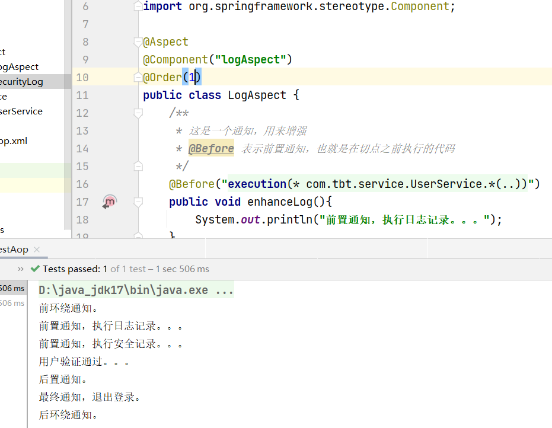

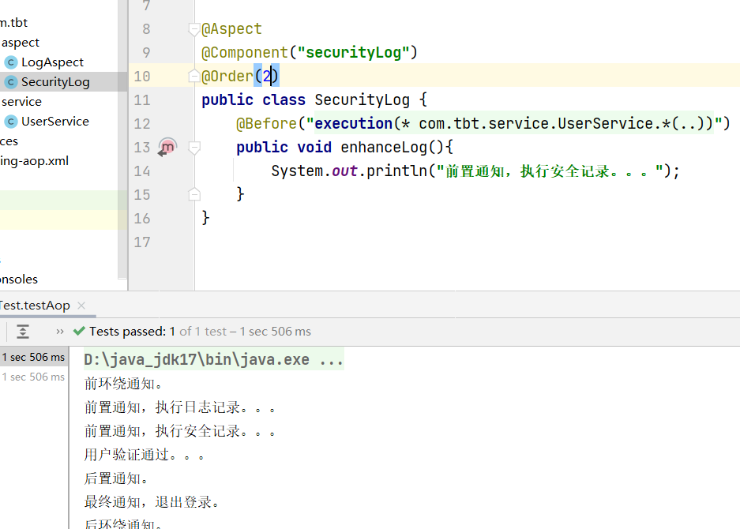

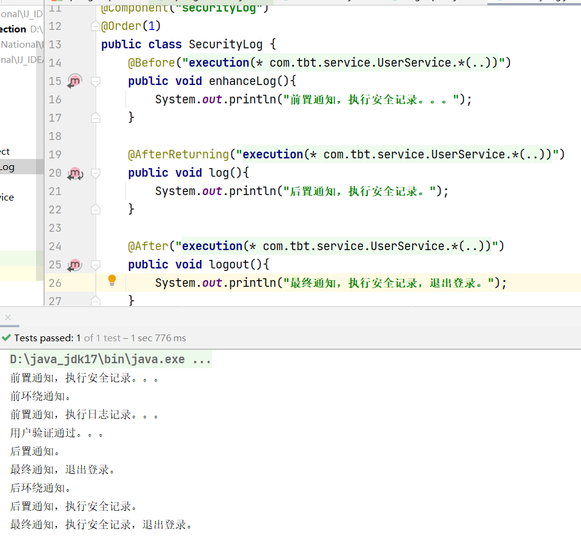

### 通用切点

可以用中文哎

单独写一个方法，其他包调用，需要注明包名

```
@Pointcut("execution(* com.tbt.service.UserService.*(..))")
    public void 通用切点(){
        System.out.println("前置通知，执行安全记录。。。");
    }
```

### 连接点

每个通知方法的参数都有一个JoinPoint对象

```
// 得到目标方法的签名(public void login())
        Signature signature = joinPoint.getSignature();
```

**利用签名可以获取方法的返回值，方法名，参数等**

这样可以在写日志的时候，把执行的方法写入日志

#### **环绕通知可用于现金转账同成功同失败的情况。涉及到事务**

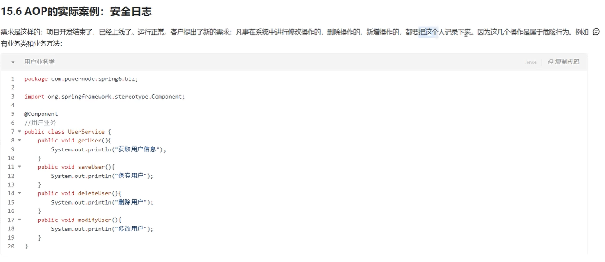

---

## Spring的事务

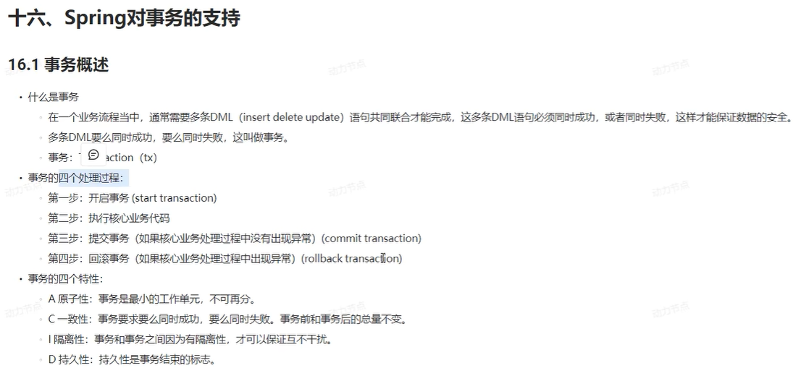

### 事务管理器

PlatformTransactionManager接口：是spring的核心接口；

两个实现：

DataSourceTransactionManager：支持jdbc、mybatis、hibernate事务管理

JtaTransactionManager：支持分布式事务管理

Tips：DataSourceTransactionManager实现了jdbcTemplate

开启事务

```
<?xml version="1.0" encoding="UTF-8"?>
<beans xmlns="http://www.springframework.org/schema/beans"
       xmlns:xsi="http://www.w3.org/2001/XMLSchema-instance"
       xmlns:context="http://www.springframework.org/schema/context"
       xmlns:tx="http://www.springframework.org/schema/tx"
       xsi:schemaLocation="http://www.springframework.org/schema/beans http://www.springframework.org/schema/beans/spring-beans.xsd
                           http://www.springframework.org/schema/context http://www.springframework.org/schema/context/spring-context.xsd
                           http://www.springframework.org/schema/tx http://www.springframework.org/schema/tx/spring-tx.xsd">

    <bean id="database" class="com.alibaba.druid.pool.DruidDataSource">
        <property name="driverClassName" value="com.mysql.jdbc.Driver"/>
        <property name="url" value="jdbc:mysql://localhost:3307/emp"/>
        <property name="username" value="root"/>
        <property name="password" value="123456"/>
    </bean>

    <!--配置jdbctemplate-->
    <bean id="jdbcTemplate" class="org.springframework.jdbc.core.JdbcTemplate">
        <property name="dataSource" ref="database"/>
    </bean>

    <!--配置事务管理-->
    <bean id="tx" class="org.springframework.jdbc.datasource.DataSourceTransactionManager">
        <property name="dataSource" ref="database"/>
    </bean>

    <!--开启事务驱动，开启事务注解-->
    <tx:annotation-driven transaction-manager="tx"/>
</beans>
```

然后在需要开启事务的类或者方法上加上@Transactional注解

@Transactional(propagation=Propagation.事务的传播行为)

### 事务的七种传播行为

什么是事务的传播行为？

**当一个类里面的两个方法都开启了事务，a()方法调用了b()方法，此时就存在事务的传播行为。**

事务的传播行为在spring中被定义为了枚举类型，默认时Propagation.REQUIRED

分别是：

REQUIRED：支持当前事务，如果没有就新建一个(默认)：[没有就新建，有就加入]

SUPPORTS：支持当前事务，如果没有就已非事务的方式执行：[有就加入，没有就不管了]

MANDATORY：必须运行在一个事务当中，如果没有事务，就抛出异常：[有就加入，没有就抛异常]

REQUIRES_NEW：开启一个新事物，如果这个事务已经存在，则将这个事务挂起：[直接开启新事物，之前的事务与新事物不存在嵌入关系，之前的事务被挂起]

NOT_SUPPORTED：以非事务方式运行，如果有事务存在，则挂起当前事务：[不支持事务，如果存在就挂起]

NEVER：以非事务方式运行，如果有事务，则抛出异常：[不支持事务，有则抛异常]

NESTED：如果当前正好有事务在运行，则该事务应该运行在一个嵌套事务当中，被嵌套的事务可以独立于外层事务提交或回滚，如果外层事务不存在，则像REQUIRED一样

### REQUIRED事务传播：

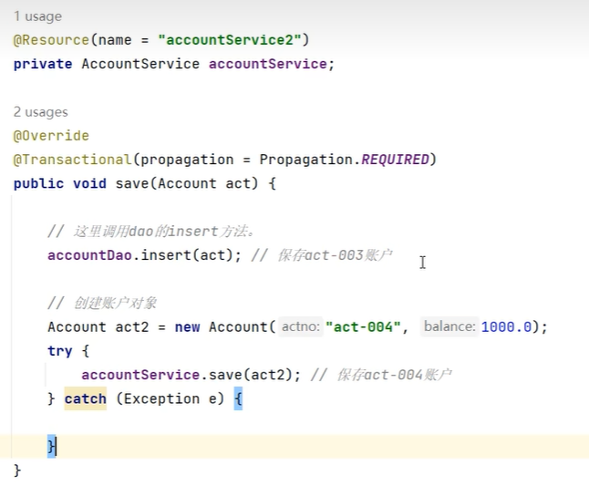

本事务调用另一个事务，如果另一个事务出异常，本事务也会回滚

因为REQUIRED是，如果有事务则加入，没有才新建，所以，如果事务A中存在事务B，则直接加入B，所以事务B出异常，也会跟着回滚。

### REQUIRES_NEW事务传播

本事务调用另一个事务，如果另一个事务除了异常，本事务没有去捕获，则本事务也跟着回滚；但是如果及时捕获了，则程序代码会接着往下执行，本事务会提交。

### 事务超时

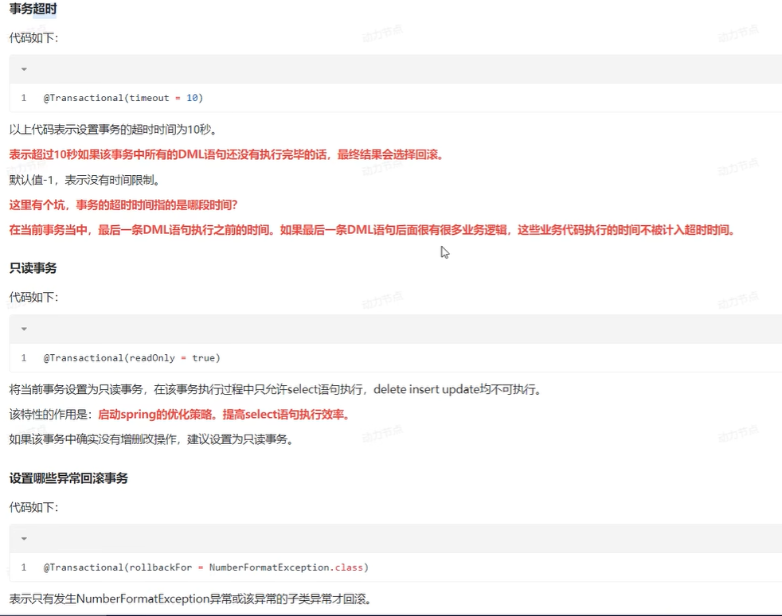

***TIPS：***

***如果最后一条增、删、改语句执行完毕，事务没有超时，但是后面还有其他不是DML语句的程序，则不会回滚事务***

但是如果执行DML语句的时候超时了，则会报TransactionTimedOutException异常

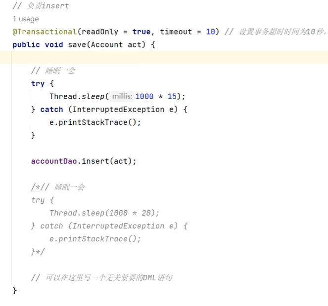

### 只读事务

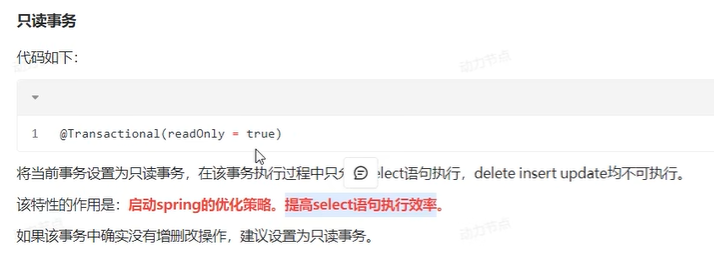

只允许select语句执行

设置遇到哪些异常时回滚(rollbackFor)

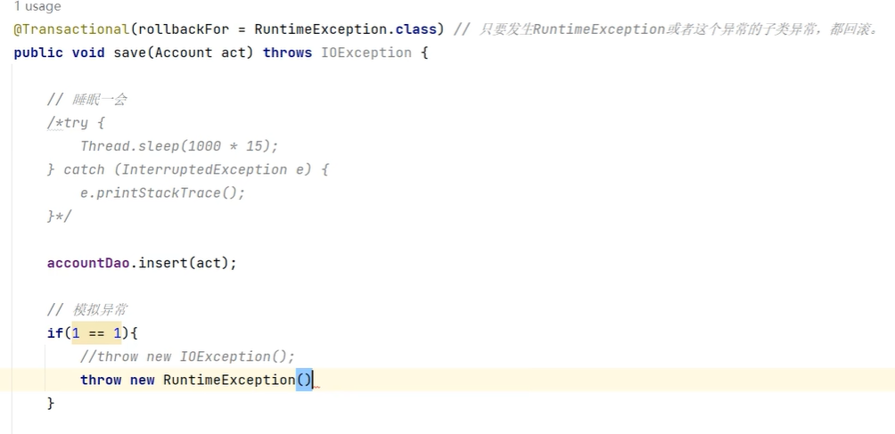

### 事务传播全注解开发

```
@Configuration
@ComponentScan({"com.tbt.bank"})
@EnableAspectJAutoProxy(proxyTargetClass = true)
@EnableTransactionManagement
public class BeanConfig {

    @Bean(name = "dataSource")
    public DruidDataSource getDataSource(){
        DruidDataSource dataSource = new DruidDataSource();
        dataSource.setDriverClassName("com.mysql.cj.jdbc.driver");
        dataSource.setUrl("jdbc:mysql://localhost:3307/emp");
        dataSource.setUsername("root");
        dataSource.setPassword("123456");
        return dataSource;
    }

    @Bean(name = "jdbcTemplate")
    public JdbcTemplate getJdbcTemplate(DataSource dataSource){ // Spring容器会在配置类里面自动创建一个DataSource对象
        JdbcTemplate jdbcTemplate = new JdbcTemplate();
        //jdbcTemplate.setDataSource(this.getDataSource());
        jdbcTemplate.setDataSource(dataSource);
        return jdbcTemplate;
    }

    @Bean(name = "txManager")
    public DataSourceTransactionManager getDataSourceTransactionManager(DataSource dataSource){
        DataSourceTransactionManager dataSourceTransactionManager = new DataSourceTransactionManager();
        //dataSourceTransactionManager.setDataSource(this.getDataSource());
        dataSourceTransactionManager.setDataSource(dataSource);
        return dataSourceTransactionManager;
    }
}
```

**容器会在配置类中自动创建一个DataSource对象，如果在配置类中配置了@Bean的数据源，则会直接将配置好的数据源传递给这个DataSource对象**

xml配置切面，切点，通知

```
<!--配置通知-->
    <tx:advice id="txAdvice" transaction-manager="tx">
        <!--配置给哪个方法设置通知-->
        <tx:attributes>
            <tx:method name="transfer" propagation="REQUIRED" rollback-for="java.lang.RuntimeException"/>
        </tx:attributes>
    </tx:advice>

    <!--配置切面-->
    <aop:config>
        <!--切点-->
        <aop:pointcut id="txPointCut" expression="execution(* com.tbt.bank.service.*(..))"/>
        <!--切面 = 通知 + 切点-->
        <aop:advisor advice-ref="txAdvice" pointcut-ref="txPointCut"/>
    </aop:config>
```

## Spring整合Junit5

```
<dependency>
    <groupId>org.junit.jupiter</groupId>
    <artifactId>junit-jupiter</artifactId>
    <version>5.9.2</version>
    <scope>test</scope>
</dependency>

//spring对junit的支持
<dependency>
            <groupId>org.springframework</groupId>
            <artifactId>spring-test</artifactId>
            <version>6.0.2</version>
            <scope>test</scope>
        </dependency>
```

测试类可以这样写

```
@ExtendWith(SpringExtension.class) // spring对junit的支持，扩展
@ContextConfiguration("spring.xml") // 配置文件
public class SpringJunit5Config {
  
    //将需要的Bean注入
    @Resource(name = "accountService")
    private AccountService accountService;
  
    @Test
    public void test(){
        accountService.transfer("1","2",10000);
    }
}
```

## spring继承mybatis

需要的依赖：

spring-context

spring-jdbc

mysql驱动

mybatis

mybatis-spring：mybatis提供的与spring进行集成的依赖

德鲁伊连接池

junit

配置文件

```xml
<!--组件扫描-->
    <context:component-scan base-package="com.tbt.bank"/>

    <!--引入外部配置文件-->
    <context:property-placeholder location="jdbc.properties"/>

    <!--数据源-->
    <bean id="dataSource" class="com.alibaba.druid.pool.DruidDataSource">
        <property name="driverClassName" value="${jdbc.driver}"/>
        <property name="url" value="${jdbc.url}"/>
        <property name="username" value="${jdbc.username}"/>
        <property name="password" value="${jdbc.password}"/>
    </bean>

    <!--配置SqlSessionFactoryBean-->
    <bean class="org.mybatis.spring.SqlSessionFactoryBean">
        <!--注入数据源-->
        <property name="dataSource" ref="dataSource"/>
        <!--指定mybatis核心配置文件-->
        <property name="configLocation" value="mybatis-config.xml"/>
        <!--指定别名-->
        <property name="typeAliasesPackage" value="com.tbt.bank.pojo"/>
    </bean>

    <!--mapper扫描配置器-->
    <bean class="org.mybatis.spring.mapper.MapperScannerConfigurer">
        <property name="basePackage" value="com.tbt.bank.mapper"/>
    </bean>

    <!--配置事务管理器-->
    <bean id="tx" class="org.springframework.jdbc.datasource.DataSourceTransactionManager">
        <property name="dataSource" ref="dataSource"/>
    </bean>

    <!--启用事务-->
    <tx:annotation-driven transaction-manager="tx"/>
```

## Spring中的八大设计模式

简单工厂模式

工厂方法模式

单例模式

代理模式

装饰器模式

观察者模式

策略模式

模板方法模式
