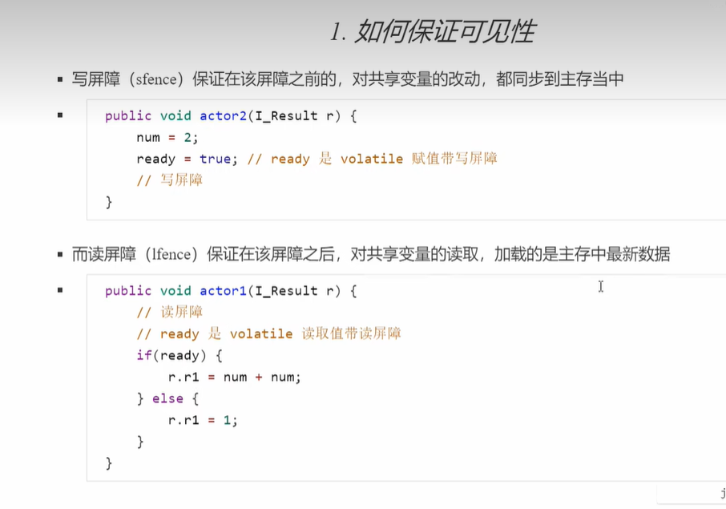
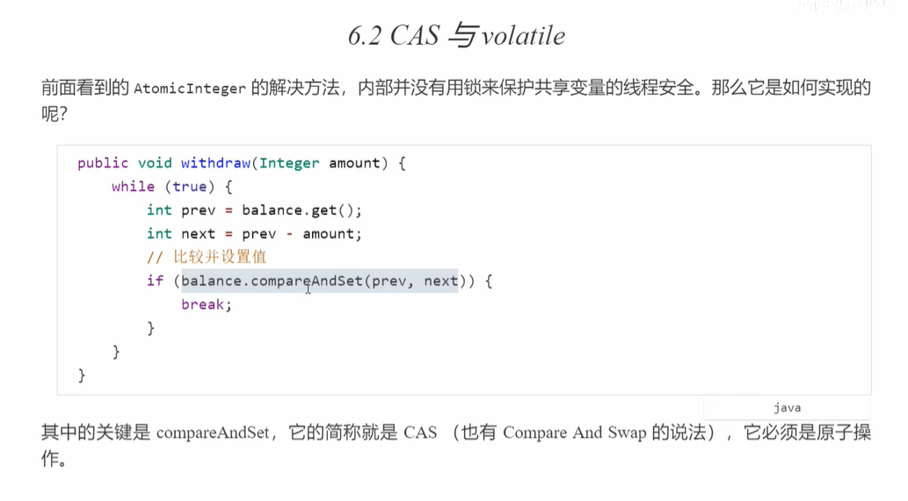
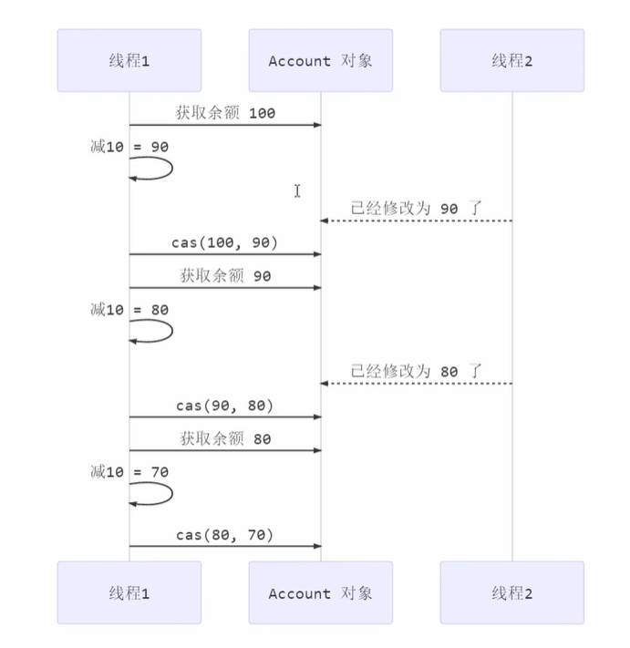
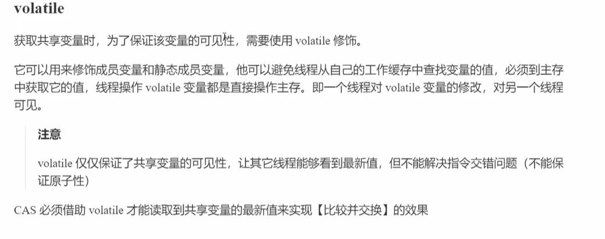

# 传统方式

加synchronized同步锁

```
public class TraditionalThreadSynchronized {

    public static void main(String[] args) {
        new TraditionalThreadSynchronized().init();
    }

    private void init(){
        Outpuer outpuer = new Outpuer();

        // 线程一
        new Thread(new Runnable() {
            @Override
            public void run() {
                while (true){
                    try {
                        Thread.sleep(10);
                    } catch (InterruptedException e) {
                        e.printStackTrace();
                    }
                    outpuer.output("zhangxiaoxiang");
                }
            }
        }).start();

        // 线程二
        new Thread(new Runnable() {
            @Override
            public void run() {
                while (true){
                    try {
                        Thread.sleep(10);
                    } catch (InterruptedException e) {
                        e.printStackTrace();
                    }
                    outpuer.output2("lihuoming");
                }
            }
        }).start();
    }

    // 只保护部分代码
    class Outpuer{
        public void output(String name){
            int len = name.length();
            synchronized(this){
                for (int i = 0; i < len; i++) {
                    System.out.print(name.charAt(i));
                }
                System.out.println();
            }
        }

        // 保护这个方法中的所有代码，此时sychronized检测的就是this对象
        public synchronized void output2(String name){
            int len = name.length();
            synchronized(this){
                for (int i = 0; i < len; i++) {
                    System.out.print(name.charAt(i));
                }
                System.out.println();
            }
        }
    }

    class Outpuer2{
        // 保护这个方法中的所有代码，此时sychronized检测的就是this对象
        public synchronized void output(String name){
            int len = name.length();
            synchronized(this){
                for (int i = 0; i < len; i++) {
                    System.out.print(name.charAt(i));
                }
                System.out.println();
            }
        }
    }
}

```

Outputer这个类中的两个方法，output和output2，都是检测this对象，用的是同一把锁，所以可以线程同步

如果，output2这个方法不变，output这个方法把锁换成其他的，则不能实现线程同步

如果两个线程，一个用Output这个类，另一个用Output2这个类，则这两个线程各玩各的，也不会线程同步

这段代码也是线程同步的

```
static class Outpuer3 {
        // 保护这个方法中的所有代码，此时sychronized检测的就是this对象
        public void output(String name) {
            int len = name.length();
            synchronized (Outpuer3.class) {
                for (int i = 0; i < len; i++) {
                    System.out.print(name.charAt(i));
                }
                System.out.println();
            }
        }

        public static synchronized void output2(String name) {
            int len = name.length();
            for (int i = 0; i < len; i++) {
                System.out.print(name.charAt(i));
            }
            System.out.println();
        }
    }
```

output2是静态的，会在加载的时候先被创建，就跟java类文件的字节码对象一样，会在编译的时候生成

此时如果output用this加锁，则不会实现线程同步，因为执行的优先级不一样，可能会出现死锁

## 问题

```

static class Outpuer3 { 
        // 保护这个方法中的所有代码，此时sychronized检测的就是this对象 
        public void output(String name) { 
            int len = name.length(); 
            synchronized (this) { 
                for (int i = 0; i < len; i++) { 
                    System.out.print(name.charAt(i)); 
                } 
                System.out.println(); 
            } 
        } 
 
        public static synchronized void output2(String name) { 
            int len = name.length(); 
            for (int i = 0; i < len; i++) { 
                System.out.print(name.charAt(i)); 
            } 
            System.out.println(); 
        } 
}
```

在 `output` 方法中，使用 `synchronized (this)` 来保护代码块，这意味着只有一个线程可以同时执行这个代码块。这里的锁是当前对象（ `this` ）。这样做的目的是确保在执行代码块期间，其他线程不能同时访问该对象的其他 `synchronized` 方法或代码块。因此，如果有多个线程同时调用 `output` 方法，只有一个线程能够执行代码块，其他线程需要等待。

而在 `output2` 方法中，使用了 `static synchronized` 修饰符，这意味着该方法是一个静态方法，并且使用类级别的锁来保护代码块。这意味着只有一个线程可以同时执行这个代码块，无论调用的是哪个实例的方法。这里的锁是类对象。因此，如果有多个线程同时调用 `output2` 方法，只有一个线程能够执行代码块，其他线程需要等待。

这样的设计可能会导致性能问题，因为多个线程可能会被阻塞在这些 `synchronized` 代码块上，无法并行执行。如果并发性能是一个关键问题，可以考虑使用其他同步机制，如 `ReentrantLock` 。

## 问题

java 子线程执行10次，主线程再执行100次，接着又回到子线程执行10次，主线程再执行100次，如此循环50次，代码实现

```java
下面是一个实现你描述的子线程和主线程交替执行的代码示例：
public class ThreadCommunicationExample {
    public static void main(String[] args) {
        final Business business = new Business();
        new Thread(() -> {
            for (int i = 0; i < 50; i++) {
                business.subThread(i);
            }
        }).start();

        for (int i = 0; i < 50; i++) {
            business.mainThread(i);
        }
    }

    static class Business {
        private boolean shouldSubThread = true;

        public synchronized void subThread(int loop) {
            while (!shouldSubThread) {
                try {
                    wait();
                } catch (InterruptedException e) {
                    e.printStackTrace();
                }
            }
            for (int i = 0; i < 10; i++) {
                System.out.println("子线程打印 " + (i + 1) + "，主线程循环 " + loop);
            }
            shouldSubThread = false;
            notify();
        }

        public synchronized void mainThread(int loop) {
            while (shouldSubThread) {
                try {
                    wait();
                } catch (InterruptedException e) {
                    e.printStackTrace();
                }
            }
            for (int i = 0; i < 100; i++) {
                System.out.println("主线程打印 " + (i + 1) + "，子线程循环 " + loop);
            }
            shouldSubThread = true;
            notify();
        }
    }
}
在这个例子中， `Business` 类是一个共享的业务类，其中 `shouldSubThread` 变量用于控制子线程和主线程的执行顺序。当 `shouldSubThread` 为 `true` 时，主线程执行，子线程等待；当 `shouldSubThread` 为 `false` 时，子线程执行，主线程等待。

在 `subThread` 方法中，子线程会打印10次信息，然后将 `shouldSubThread` 设为 `false` ，并唤醒等待的主线程。

在 `mainThread` 方法中，主线程会打印100次信息，然后将 `shouldSubThread` 设为 `true` ，并唤醒等待的子线程。

通过使用 `synchronized` 关键字和 `wait()` 、 `notify()` 方法，我们可以实现子线程和主线程的交替执行，并按照你描述的循环次数执行。
```

# 利用ThreadLocal

```java
public class MyThreadScopeData {

    private MyThreadScopeData(){}
    // 饱汉式，需要的时候再创建
    public static /*synchronized*/ MyThreadScopeData getInstance(){
        MyThreadScopeData instance = MyThreadScopeData.myThreadScopeData.get();
        if (instance == null){
            instance = new MyThreadScopeData();
            myThreadScopeData.set(instance);
        }
        return instance;
    }
    //private static MyThreadScopeData instance = null; // new MyThreadScopeData 饿汉式直接创建对象，且是静态的
    private static ThreadLocal<MyThreadScopeData> myThreadScopeData = new ThreadLocal<>();

    private String name;
    private int age;

    public String getName() {
        return name;
    }

    public void setName(String name) {
        this.name = name;
    }

    public int getAge() {
        return age;
    }

    public void setAge(int age) {
        this.age = age;
    }
}

```

既不需要synchronized线程同步，还做到了只有当线程调用的时候才加载

将ThreadLocal放到里面，表示类的实例是跟每个线程相关的，那这个类的实例的设计就交给类本身

相当于将这个类放到了这个线程中，用户调用该线程，则拿到的就是在这个线程上的该类的实例

```
public class ThreadLocalTest {
    //static ThreadLocal<MyThreadScopeData> myThreadScopeData = new ThreadLocal<>();
    static ThreadLocal<Integer> threadLocal = new ThreadLocal<>();
    public static void main(String[] args) {

        for (int i = 0; i < 2; i++) {
            new Thread(new Runnable() {

                @Override
                public void run() {
                    int data = new Random().nextInt();
                    System.out.println(Thread.currentThread().getName() + "has put data: "+data);
                    threadLocal.set(data);

                    /*MyThreadScopeData myData = new MyThreadScopeData();
                    myData.setAge(data);
                    myData.setName("name+"+data);
                    myThreadScopeData.set(myData);*/
                    // 获取到与本线程相关的实例对象
                    MyThreadScopeData.getInstance().setName("name+"+data);
                    MyThreadScopeData.getInstance().setAge(data);


                    new A().get();
                    new B().get();
                }
            }).start();
        }

    }

    static class A{
        public void get(){
            int data = threadLocal.get();
            System.out.println("A from " + Thread.currentThread() + " get data " + data);

            //MyThreadScopeData scopeData = ThreadLocalTest.myThreadScopeData.get();
            MyThreadScopeData instance = MyThreadScopeData.getInstance();
            System.out.println("name = " + instance.getName() + "," + "age = " + instance.getAge());
        }
    }

    static class B{
        public void get(){
            int data = threadLocal.get();
            System.out.println("B from " + Thread.currentThread() + " get data " + data);

            //MyThreadScopeData scopeData = ThreadLocalTest.myThreadScopeData.get();
            MyThreadScopeData instance = MyThreadScopeData.getInstance();
            System.out.println("name = " + instance.getName() + "," + "age = " + instance.getAge());
        }
    }
}

```

## 如何在线程结束后执行逻辑

 `ThreadDeathEvent` 接口是Java虚拟机提供的一个接口，用于表示线程死亡事件。当一个线程即将终止时，会生成一个 `ThreadDeathEvent` 对象，并且将其传递给注册的 `ThreadDeath` 事件监听器。

 `ThreadDeathEvent` 接口本身没有任何方法或行为，它只是作为一个标记接口存在，用于通知监听器线程的终止。

通常情况下，不需要直接使用 `ThreadDeathEvent` 接口，而是通过实现 `ThreadDeath` 事件监听器来处理线程终止事件。

需要注意的是， `ThreadDeathEvent` 接口不应该被应用程序代码直接使用，而是由Java虚拟机内部使用。

如果您需要在线程结束时执行一些特定的操作，可以考虑使用 `Thread` 类的 `join()` 方法或者 `ExecutorService` 框架中的 `Future` 接口，如我在之前的回答中所提到的。

1.使用 `Thread` 类的 `join()` 方法等待线程结束，并在线程结束后发送消息：

```
Thread thread = new Thread(() -> {
       // 线程执行的任务
   });
   thread.start(); // 启动线程

   // 等待线程结束
   try {
       thread.join();
   } catch (InterruptedException e) {
       e.printStackTrace();
   }

   // 线程结束后发送消息
   System.out.println("线程已结束");
```

2.使用 `ExecutorService` 框架提交任务，并通过 `Future` 对象判断线程是否结束并发送消息：

```
ExecutorService executor = Executors.newSingleThreadExecutor();
   Future<?> future = executor.submit(() -> {
       // 线程执行的任务
   });

   // 判断线程是否结束
   if (future.isDone()) {
       System.out.println("线程已结束");
   }
```

# 线程池

## 基于缓存的线程池

`Executors.newCachedThreadPool()` 是Java中提供的一个线程池创建方法，它会返回一个根据需要自动调整大小的线程池。

该线程池的原理如下：

1. 当有任务提交给线程池时，线程池会尝试复用之前创建的空闲线程，如果有空闲线程可用，则直接使用该线程执行任务。
2. 如果没有空闲线程可用，线程池会创建一个新的线程来执行任务。
3. 如果线程池中的线程在一段时间内没有被使用（默认为60秒），则会被标记为可回收的，并在之后的需要时被回收。
4. 当线程池中的线程数量超过了当前任务的需求，并且有一些线程在一段时间内没有被使用，那么这些空闲的线程会被终止并从线程池中移除。

通过以上的机制， `newCachedThreadPool()` 方法创建的线程池可以根据任务的需求动态地调整线程数量，避免了线程过多或过少的问题。

需要注意的是，由于该线程池的线程数量是根据任务需求动态调整的，因此如果任务提交的速度大于线程执行的速度，可能会导致线程数增长过快，最终耗尽系统资源。因此，在使用 `newCachedThreadPool()` 方法创建线程池时，需要根据具体情况合理调整任务提交的速度，或者使用其他类型的线程池来限制线程数量。

## 线程数量固定的线程池

`Executors.newFixedThreadPool(int nThreads)` 是Java中提供的一个线程池创建方法，它会返回一个固定大小的线程池，其中包含指定数量的线程。

该线程池的原理如下：

1. 当有任务提交给线程池时，线程池会创建指定数量的线程，并将任务分配给这些线程来执行。
2. 如果线程池中的线程都在执行任务，并且没有空闲线程可用，新提交的任务会进入等待队列，直到有线程空闲出来。
3. 当线程执行完任务后，会继续从等待队列中获取任务并执行，直到线程池关闭或发生异常。
4. 如果线程池中的线程数量大于任务的需求，并且有一些线程在一段时间内没有被使用，那么这些空闲的线程会被保留在线程池中，以备后续的任务使用。

通过以上的机制， `newFixedThreadPool()` 方法创建的线程池可以固定地维持指定数量的线程，适用于需要控制线程数量的场景。

需要注意的是，如果任务提交的速度大于线程执行的速度，任务会在等待队列中排队等待执行。如果等待队列中的任务过多，可能会导致内存占用过高，因此需要根据具体情况合理设置线程池的大小。

## 单例池

`Executors.newSingleThreadExecutor()` 是Java中提供的一个线程池创建方法，它会返回一个只包含单个线程的线程池。

该线程池的原理如下：

1. 当有任务提交给线程池时，线程池会创建一个单独的线程来执行任务。
2. 如果线程池中的线程正在执行任务，并且没有空闲线程可用，新提交的任务会进入等待队列，直到线程空闲出来。
3. 当线程执行完任务后，会继续从等待队列中获取任务并执行，直到线程池关闭或发生异常。

通过以上的机制， `newSingleThreadExecutor()` 方法创建的线程池始终只有一个线程在执行任务，适用于需要保证任务按顺序执行的场景。

需要注意的是，由于线程池只有一个线程，**如果该线程因为异常终止，线程池会创建一个新的线程来替代它，以确保任务的执行。**

## 定时任务

`Executors.newScheduledThreadPool(3)` 方法创建一个固定大小为3的线程池，该线程池可以执行定时任务和周期性任务。

该线程池的原理如下：

1. 当有任务提交给线程池时，线程池会创建指定数量的线程，并将任务分配给这些线程来执行。
2. 与普通的线程池不同的是， `newScheduledThreadPool()` 方法创建的线程池还提供了调度任务的功能。可以使用 `schedule()` 方法来延迟执行任务，或使用 `scheduleAtFixedRate()` 方法和 `scheduleWithFixedDelay()` 方法来执行周期性任务。
3. 线程池会根据任务的调度时间来安排线程执行任务，可以保证任务按照预定的时间执行。

需要注意的是， `newScheduledThreadPool()` 方法创建的线程池在不需要时需要手动关闭，调用 `shutdown()` 方法来关闭线程池。

```java
public class ThreadPoolTest {
    public static void main(String[] args) {
        // 线程池固定
        ExecutorService threadPool = Executors.newFixedThreadPool(3);

        // 缓存的线程池，如果
        ExecutorService threadPool1 = Executors.newCachedThreadPool();

        // 单例池
        ExecutorService executor = Executors.newSingleThreadExecutor();

        // 开10个线程
        for (int i = 1; i <= 10; i++) {
            final int task = i;
            threadPool.execute(new Runnable() {
                @Override
                public void run() {
                    // 每个线程10个任务
                    for (int j = 1; j <= 10; j++) {
                        try {
                            Thread.sleep(30);
                        } catch (InterruptedException e) {
                            e.printStackTrace();
                        }
                        System.out.println(Thread.currentThread().getName() + " is looping of " + j + " for task of " + task);
                    }
                }
            });
        }

        // 定时任务
        Executors.newScheduledThreadPool(3).schedule(new Runnable() {
            @Override
            public void run() {
                System.out.println("boom!");
            }
        },10, TimeUnit.SECONDS);

    }
}

```

## 方法中的各种参数

```java
public class ScheduledThreadPoolExample {
    public static void main(String[] args) {
        ScheduledExecutorService executor = Executors.newScheduledThreadPool(3);

        // 延迟执行任务
        executor.schedule(() -> {
            System.out.println("任务1延迟执行");
        }, 5, TimeUnit.SECONDS);

        // 周期性执行任务
        executor.scheduleAtFixedRate(() -> {
            System.out.println("任务2周期性执行");
        }, 0, 2, TimeUnit.SECONDS);

        // 关闭线程池
        executor.shutdown();
    }
}
```

# 线程CallableAndFuture

```java
public class CallableAndFutureTest {
    public static void main(String[] args) {
        /*ExecutorService threadPool = Executors.newSingleThreadExecutor();
        Future<String> future = threadPool.submit(new Callable<String>() {
            @Override
            public String call() throws Exception {
                Thread.sleep(2000);
                return "Hello";
            }
        });

        try {
            String s = future.get();
            System.out.println("结果 = " + s);
        } catch (InterruptedException e) {
            e.printStackTrace();
        } catch (ExecutionException e) {
            e.printStackTrace();
        }*/

        // ExecutorCompletionService这个类不是一个池子
        // 需要new一个池子，把它放进去
        ExecutorService pool = Executors.newFixedThreadPool(10);
        CompletionService cs = new ExecutorCompletionService(pool);
        for (int i = 1; i <= 10; i++) {
            final int seq = i;
            cs.submit(new Callable() {
                @Override
                public Integer call() throws Exception {
                    Thread.sleep(new Random().nextInt(5000));
                    return seq;
                }
            });
        }

        for (int i = 1; i <= 10; i++) {
            try {
                // 获取CompletionService中的值
                System.out.println("cs.take().get() = " + cs.take().get());
            } catch (InterruptedException e) {
                e.printStackTrace();
            } catch (ExecutionException e) {
                e.printStackTrace();
            }
        }

    }
}
```

CompletionService是Java并发包中的一个接口，用于处理一组任务的完成结果。它提供了一种将已完成任务的结果按照完成顺序进行处理的机制。

CompletionService的主要作用是将任务的执行和结果处理分离开来，可以让我们在任务执行的同时，及时处理已完成的任务结果，提高任务处理的效率。

使用CompletionService，我们可以将一组任务提交给线程池执行，并使用take()或poll()方法获取已完成的任务结果。这样可以确保我们在任何时候都能获取到已完成的任务结果，而不需要等待所有任务都完成。

# 线程锁

Lock锁是Java并发编程中的一种同步机制，它提供了比传统的synchronized关键字更灵活和可扩展的锁定操作。

与synchronized关键字不同，Lock锁需要显式地获取和释放锁。以下是Lock锁的一些常用方法：

1. `lock()` ：获取锁。如果锁已被其他线程持有，则当前线程会被阻塞，直到获取到锁为止。
2. `unlock()` ：释放锁。当线程完成了对临界区的操作后，应该调用 `unlock()` 方法来释放锁，以便其他线程可以获取锁并执行。
3. `tryLock()` ：尝试获取锁。该方法会尝试获取锁，如果锁当前没有被其他线程持有，则获取成功并返回true；如果锁已被其他线程持有，则获取失败并返回false。
4. `newCondition()` ：创建与锁关联的条件对象。条件对象可以用于线程间的等待和通知机制，可以通过 `await()` 方法等待条件满足，通过 `signal()` 方法通知等待的线程。

## volatile

volatile 是Java中的一个关键字，用于修饰变量。它的作用是确保多个线程之间对该变量的访问具有可见性和有序性。

当一个变量被声明为 `volatile` 时，线程在读取或写入该变量时，会直接从主内存中进行操作，而不是从线程的本地缓存中读取或写入。这样可以确保不同线程之间对该变量的修改是可见的，避免了线程之间的数据不一致性问题。

 `volatile` 关键字的主要特性包括：

- 可见性：当一个线程修改了一个 `volatile` 变量的值，其他线程能够立即看到最新的值。
- 有序性： `volatile` 变量的读写操作具有顺序性，即保证了在一个线程中，对 `volatile` 变量的读操作发生在写操作之后。

需要注意的是，尽管 `volatile` 关键字可以确保可见性和有序性，但它并不能保证原子性。如果一个变量的操作需要保证原子性，例如递增操作，需要使用其他的同步机制，如 `synchronized` 关键字或 `java.util.concurrent.atomic` 包中的原子类。

总的来说， `volatile` 关键字用于修饰变量，确保多个线程之间对该变量的访问具有可见性和有序性。它在多线程编程中起到了重要的作用，用于解决并发访问共享变量时的线程间数据不一致性问题 `：`volatile `是Java中的一个关键字，用于修饰变量。当一个变量被声明为`volatile` 时，表示它是一个共享变量，多个线程之间对该变量的读写操作都会直接从主内存中进行，而不会使用线程的本地缓存。这样可以确保多个线程之间对该变量的操作具有可见性和有序性。

## ReentrantLock

`ReentrantLock` 是Java中的一个类，用于实现可重入的锁机制。它提供了与 `synchronized` 关键字相似的功能，但相比之下更加灵活和可扩展。

 `ReentrantLock` 具有以下特点：

1. 可重入性：线程可以多次获取同一个 `ReentrantLock` 实例的锁，而不会因为重复获取而导致死锁。
2. 公平性： `ReentrantLock` 可以设置为公平锁或非公平锁。公平锁会按照线程的等待时间来获取锁，而非公平锁则允许线程插队获取锁。
3. 条件变量： `ReentrantLock` 提供了条件变量（Condition）的功能，可以通过 `newCondition()` 方法创建条件变量，用于线程间的等待和通知机制。

```
import java.util.concurrent.locks.Condition;
import java.util.concurrent.locks.Lock;
import java.util.concurrent.locks.ReentrantLock;

public class ReentrantLockExample {
    private Lock lock = new ReentrantLock();
    private Condition condition = lock.newCondition();

    public void method() {
        lock.lock();
        try {
            // 临界区操作
            System.out.println("执行临界区操作");
            condition.signal(); // 通知等待的线程
        } finally {
            lock.unlock();
        }
    }

    public void anotherMethod() throws InterruptedException {
        lock.lock();
        try {
            while (true) {
                // 等待条件满足
                condition.await();
                // 执行其他操作
                System.out.println("条件满足，执行其他操作");
            }
        } finally {
            lock.unlock();
        }
    }
}
```

在上述示例中，我们使用 `ReentrantLock` 创建了一个可重入的锁实例。在 `method()` 方法中，我们通过 `lock()` 方法获取锁，执行临界区操作，并通过 `unlock()` 方法释放锁。在 `anotherMethod()` 方法中，我们通过 `await()` 方法等待条件满足，并在条件满足时执行其他操作。

需要注意的是，在使用 `ReentrantLock` 时，需要在 `finally` 块中使用 `unlock()` 方法释放锁，以确保锁的释放。

## 两种不同的方式获取线程中的数据

```
public class CallableAndFutureTest {
    public static void main(String[] args) {
        /*ExecutorService threadPool = Executors.newSingleThreadExecutor();
        Future<String> future = threadPool.submit(new Callable<String>() {
            @Override
            public String call() throws Exception {
                Thread.sleep(2000);
                return "Hello";
            }
        });

        try {
            String s = future.get();
            System.out.println("结果 = " + s);
        } catch (InterruptedException e) {
            e.printStackTrace();
        } catch (ExecutionException e) {
            e.printStackTrace();
        }*/

        // ExecutorCompletionService这个类不是一个池子
        // 需要new一个池子，把它放进去
        ExecutorService pool = Executors.newFixedThreadPool(10);
        CompletionService cs = new ExecutorCompletionService(pool);
        for (int i = 1; i <= 10; i++) {
            final int seq = i;
            cs.submit(new Callable() {
                @Override
                public Integer call() throws Exception {
                    Thread.sleep(new Random().nextInt(5000));
                    return seq;
                }
            });
        }

        for (int i = 1; i <= 10; i++) {
            try {
                // 获取CompletionService中的值
                System.out.println("cs.take().get() = " + cs.take().get());
            } catch (InterruptedException e) {
                e.printStackTrace();
            } catch (ExecutionException e) {
                e.printStackTrace();
            }
        }
    }
}

```

## Lock锁

```
public class LockTest {

    public static void main(String[] args) {
        new LockTest().init();
    }

    private void init() {
        Outpuer outpuer = new Outpuer();

        // 线程一
        new Thread(new Runnable() {
            @Override
            public void run() {
                while (true) {
                    try {
                        Thread.sleep(10);
                    } catch (InterruptedException e) {
                        e.printStackTrace();
                    }
                    outpuer.output("zhangxiaoxiang");
                }
            }
        }).start();

        // 线程二
        new Thread(new Runnable() {
            @Override
            public void run() {
                while (true) {
                    try {
                        Thread.sleep(10);
                    } catch (InterruptedException e) {
                        e.printStackTrace();
                    }
                    outpuer.output("lihuoming");
                }
            }
        }).start();
    }

    // 只保护部分代码
    class Outpuer {
        Lock lock = new ReentrantLock();
        public void output(String name) {
            int len = name.length();
            // 在哪加锁，就在那调用lock()方法，将后面的代码锁住
            lock.lock();
            try{
                for (int i = 0; i < len; i++) {
                    System.out.print(name.charAt(i));
                }
                System.out.println();
            }catch (Exception e){
                e.printStackTrace();
            } finally {
                //在不需要锁的地方加unlock()方法，释放锁
                lock.unlock();
            }
        }

        // 保护这个方法中的所有代码，此时sychronized检测的就是this对象
        public synchronized void output2(String name) {
            int len = name.length();
            synchronized (this) {
                for (int i = 0; i < len; i++) {
                    System.out.print(name.charAt(i));
                }
                System.out.println();
            }
        }
    }
}
```

**lock只需要设置后加锁的时机，以及不需要锁的时候及时释放锁就可以了**

lock锁代替了synchronized的功能

# 读写锁

读锁和读锁不互斥，读锁和写锁互斥，写锁和写锁互斥，这是由JVM自己控制的，不需要开发者关心，只需要设置好锁在哪个位置就行

## 读写锁的例子，ReentrantReadWriteLock

```
public class CacheTest {
    private Map<String ,Object> cache = new HashMap<>();
    public static void main(String[] args) {

    }


    private ReadWriteLock rwl = new ReentrantReadWriteLock();
    public Object getData(String key){

        rwl.readLock().lock();
        Object value = null;

        try{
            // 每个人都可以读
            value = cache.get(key);
            if (value == null){
                // 如果发现读不到，则需要去数据库中查，并给value赋值
                // 赋值操作，就是要写，加写锁，同时把读锁释放
                rwl.readLock().unlock();
                rwl.writeLock().lock();
                // 实际查询数据库，查不到，value报空指针抛异常
                try {
                    // 如果value还是空，才赋值
                    // 如果其他线程进来发现value不是空了，则其他线程就不需要写了
                    if (value == null){
                        value="111";
                    }
                } catch (Exception e){
                    e.printStackTrace();
                } finally {
                    // 保证写锁被释放
                    rwl.writeLock().unlock();
                }
            }
        } catch (Exception e){
            e.printStackTrace();
        } finally {
            rwl.readLock().unlock();
        }
        return value;
    }
}
```

## 条件阻塞Condition

将本线程的wait方法，替换成Condition的await方法

将唤醒其他线程的notify方法，换成Condition的signal方法

这样就能跟lock锁配合使用了

```
public class ConditionLockTest {

    public static void main(String[] args) {
        new ConditionLockTest().init();
    }

    public void init() {
        Test2 test2 = new Test2();
        new Thread(new Runnable() {
            @Override
            public void run() {
                // 子线程
                for (int i = 1; i <= 50; i++) {
                    test2.printSub(i);
                }
            }
        }).start();

        // 主线程
        for (int i = 1; i <= 50; i++) {
            test2.printMain(i);
        }
    }


    public class Test2 {
        Lock lock = new ReentrantLock();
        // Condition只有在Lock的基础实现
        Condition condition = lock.newCondition();
        private boolean bShouldSub = true;

        public void printSub(int i) {
            lock.lock();
            try {
                while (!bShouldSub){
                    try {
                        condition.await();
                    } catch (Exception e){
                        e.printStackTrace();
                    }
                }
                for (int j = 1; j <= 10; j++) {
                    System.out.println("sub thread print " + j + "," + "parent thread loop " + i);
                }
                bShouldSub = false;
                // 执行完毕之后，需要发送一个执行完毕的信号，唤醒其他线程
                condition.signal();
            } finally {
                lock.unlock();
            }

        }

        public void printMain(int i) {
            lock.lock();
            try {
                while (bShouldSub){
                    try {
                        condition.await();
                    } catch (Exception e){
                        e.printStackTrace();
                    }
                }
                for (int j = 1; j <= 100; j++) {
                    System.out.println("main thread print " + j + "," + "parent thread loop " + i);
                }

                bShouldSub = true;
                // 执行完毕之后，需要发送一个执行完毕的信号，唤醒其他线程
                condition.signal();
            } finally {
                lock.unlock();
            }
        }
    }
}

```

## 信号量Semaphore

Semaphore sp = new Semaphore(3);

Semaphore（信号量）是一种并发控制机制，用于控制对共享资源的访问。它可以限制同时访问某个资源的线程数量。

在给定的示例代码中，创建了一个Semaphore实例，初始值为3。这意味着最多允许同时有3个线程访问某个共享资源，超过这个数量的线程将被阻塞，直到有其他线程释放信号量。

Semaphore常用于限制对有限资源的并发访问，例如数据库连接池、线程池等。通过控制信号量的数量，可以有效地控制并发线程的数量，避免资源过度占用和竞争导致的性能问题。同时，Semaphore也可以用于实现一些特定的线程同步和互斥操作。

```java
public class SemaphoreTest {
    public static void main(String[] args) {
        ExecutorService executorService = Executors.newCachedThreadPool();
        final Semaphore sp = new Semaphore(3);
        for (int i = 0; i < 10; i++) {
            Runnable runnable = new Runnable() {
                @Override
                public void run() {
                    try {
                        // 控制并发访问共享资源的线程数量，避免资源过度占用和竞争导致的性能问题
                        // 只有当线程成功获取到许可时，才能继续执行后续的代码逻辑
                        sp.acquire();
                    } catch (InterruptedException e) {
                        e.printStackTrace();
                    }
                    System.out.println("线程："+Thread.currentThread().getName()+
                            "进入，当前已有"+(3-sp.availablePermits())+"个并发");

                    try {
                        Thread.sleep((long) (Math.random()*10000));
                    } catch (InterruptedException e) {
                        e.printStackTrace();
                    }
                    System.out.println("线程："+Thread.currentThread().getName()+
                            "即将离开");
                    // 释放资源
                    sp.release();
                    System.out.println("线程："+Thread.currentThread().getName()+
                            "已离开，当前还有"+(3-sp.availablePermits())+"个并发");

                }
            };
            executorService.execute(runnable);
        }
    }
}
```

### 单个信号量实现互斥锁

单个信号量可以用来实现互斥锁的功能，其中一个线程负责获取锁，另一个线程负责释放锁。

具体实现的思路如下：

1. 创建一个信号量对象，初始值为1，表示只允许一个线程同时访问临界区（共享资源）。
2. 线程A需要获取锁时，调用信号量的acquire()方法，这将使信号量的值减1。如果信号量的值已经为0，说明有其他线程持有锁，线程A将被阻塞等待。
3. 线程B需要释放锁时，调用信号量的release()方法，这将使信号量的值加1。如果有其他线程在等待获取锁，其中一个线程将被唤醒获得锁。

通过这种方式，只有一个线程能够获得锁，其他线程需要等待锁的释放才能继续执行临界区的代码，从而实现了互斥的效果。信号量的值为0时，表示锁已被占用，为1时表示锁是可用的。

```
import java.util.concurrent.Semaphore;

public class MutexLock {
    private Semaphore semaphore;

    public MutexLock() {
        // 创建一个初始值为1的信号量
        semaphore = new Semaphore(1);
    }

    public void acquireLock() {
        try {
            // 获取锁，如果锁已经被占用，线程将被阻塞等待
            semaphore.acquire();
        } catch (InterruptedException e) {
            // 处理中断异常
            e.printStackTrace();
        }
    }

    public void releaseLock() {
        // 释放锁
        semaphore.release();
    }
}
```

使用上述代码，可以实现一个互斥锁。其中， `acquireLock()` 方法用于获取锁， `releaseLock()` 方法用于释放锁。

在多线程环境下，线程A可以调用 `acquireLock()` 方法获取锁，而线程B可以调用 `releaseLock()` 方法释放锁。只有一个线程能够成功获取锁，其他线程需要等待锁的释放才能继续执行。

# CyclicBarrier

CyclicBarrier的应用场景有很多，以下是一些常见的应用场景：

1. 并行计算：当一个大任务可以分解成多个子任务并行执行时，可以使用CyclicBarrier来等待所有子任务完成，然后合并它们的结果。
2. 数据加载：当需要从多个数据源加载数据，并且数据加载的过程可以并行执行时，可以使用CyclicBarrier来等待所有数据加载完成，然后进行后续的数据处理操作。
3. 游戏开发：在多人游戏中，当所有玩家都准备好进行下一轮游戏时，可以使用CyclicBarrier来等待所有玩家就绪，然后一起开始下一轮的游戏。
4. 并发任务协同：当多个任务需要协同工作，每个任务在完成一定工作后需要等待其他任务的完成，然后再一起继续执行下一阶段的工作。
5. 多线程任务分解：当一个大任务需要分解成多个子任务，并且子任务之间存在依赖关系时，可以使用CyclicBarrier来等待所有子任务完成，然后进行下一阶段的任务分解。

```java
public class CyclicBarrierTest {
    public static void main(String[] args) {
        ExecutorService executorService = Executors.newCachedThreadPool();
        // 新建对象
        final CyclicBarrier cb = new CyclicBarrier(3);
        for (int i = 0; i < 3; i++) {
            Runnable runnable = new Runnable() {
                @Override
                public void run() {
                    try {
                        Thread.sleep((long) (Math.random()*10000));
                        System.out.println("线程："+Thread.currentThread().getName()+
                                "即将到达集合点1，当前已有"+(cb.getNumberWaiting()+1) + "个线程等待");
                        // 第一个线程到达之后，在此等待，等待所有线程就位，在唤醒
                        cb.await();

                        Thread.sleep((long) (Math.random()*10000));
                        System.out.println("线程："+Thread.currentThread().getName()+
                                "即将到达集合点2，当前已有"+(cb.getNumberWaiting()+1) + "个线程等待");
                        cb.await();

                        Thread.sleep((long) (Math.random()*10000));
                        System.out.println("线程："+Thread.currentThread().getName()+
                                "即将到达集合点3，当前已有"+(cb.getNumberWaiting()+1) + "个线程等待");
                        cb.await();
                    } catch (Exception e) {
                        e.printStackTrace();
                    }

                }
            };
            executorService.execute(runnable);
        }
    }
}

```

# CountDownLatch

CountDownLatch（倒计时门闩）是Java中的一个同步辅助类，用于控制线程的等待。

CountDownLatch的作用是让一个或多个线程等待其他线程完成一组操作后再继续执行。它通过一个计数器来实现，该计数器初始化为一个正整数，每当一个线程完成了预期的操作，计数器就减1。当计数器减到0时，等待的线程将被唤醒，可以继续执行后续的操作。

CountDownLatch的主要方法是await()和countDown()：

- await()方法使调用线程等待，直到计数器减到0。如果计数器当前值大于0，则线程会阻塞等待。
- countDown()方法将计数器减1。当一个线程完成了预期的操作后，调用该方法通知CountDownLatch计数器减1。

CountDownLatch在以下场景中非常有用：

1. 主线程等待多个子线程完成任务后再继续执行。
2. 并发任务中，一个或多个线程等待其他线程的信号，然后再一起开始执行。
3. 测试用例中，主线程等待多个线程执行完毕后再进行断言或结果验证。

总而言之，CountDownLatch用于线程间的等待和协调，可以实现多个线程之间的同步。它提供了一种简单而有效的方式来控制线程的执行顺序和并发性。

```java
public class CountDownLatchTest {
    public static void main(String[] args) {
        ExecutorService executorService = Executors.newCachedThreadPool();
        // 计数器1，这个计数器用来控制多个线程同时开始
        final CountDownLatch cdOrder = new CountDownLatch(1);
        // 计数器2，这个计数器的作用是，使所有完成任务的线程在终点等待
        // 等所有线程都完成，计数器间到0，再放行
        final CountDownLatch cdAnswer = new CountDownLatch(3);
        for (int i = 0; i < 3; i++) {
            Runnable runnable = new Runnable() {
                @Override
                public void run() {
                    try {
                        System.out.println("线程："+Thread.currentThread().getName()+
                                "正准备执行命令");
                        cdOrder.await();
                        System.out.println("线程："+Thread.currentThread().getName()+
                                "已接收到命令");
                        Thread.sleep((long) (Math.random()*10000));
                        System.out.println("线程："+Thread.currentThread().getName()+
                                "回应命令处理结果");
                        cdAnswer.countDown();
                    } catch (InterruptedException e) {
                        e.printStackTrace();
                    }
                }
            };
            executorService.execute(runnable);
        }
        try {
            Thread.sleep((long) (Math.random()*10000));
            System.out.println("线程："+Thread.currentThread().getName()+
                    "即将发布命令");
            cdOrder.countDown();
            System.out.println("线程："+Thread.currentThread().getName()+
                    "已发送命令,正在等待结果");
            cdAnswer.await();
            System.out.println("线程："+Thread.currentThread().getName()+
                    "回应命令处理结果");
            cdAnswer.countDown();
        } catch (InterruptedException e) {
            e.printStackTrace();
        }
    }
}

```

线程之间数据交换的工具类Exchanger

# 阻塞队列

```java
public class BlockingQueueTest {
    public static void main(String[] args) {
	// 创建阻塞队列的对象
        final BlockingQueue bq = new ArrayBlockingQueue(3);
        // 开两个线程放数据
        for (int i = 0; i < 2; i++) {
            new Thread(){
                @Override
                public void run() {
                    while (true){
                        try {
                            Thread.sleep((long) (Math.random()*1000));
                            System.out.println(Thread.currentThread().getName()+" 准备放数据");
			    //放数据
                            bq.put(1);
                            System.out.println(Thread.currentThread().getName()+ " 已经放了数据，"+
                                    "队列里面有"+bq.size()+"个数据");
                        } catch (InterruptedException e) {
                            e.printStackTrace();
                        }
                    }
                }
            }.start();
        }

        // 这个线程用来取数据
        new Thread(){
            @Override
            public void run() {
                while (true){
                    try {
                        Thread.sleep(1000);
                        System.out.println(Thread.currentThread().getName()+" 准备放取数据");
			//取数据
                        bq.take();
                        System.out.println(Thread.currentThread().getName()+ " 已经取走了数据，"+
                                "队列里面有"+bq.size()+"个数据");
                    } catch (InterruptedException e) {
                        e.printStackTrace();
                    }

                }
            }
        }.start();
    }
}

```


# volatile




# CAS









# 原子整数
