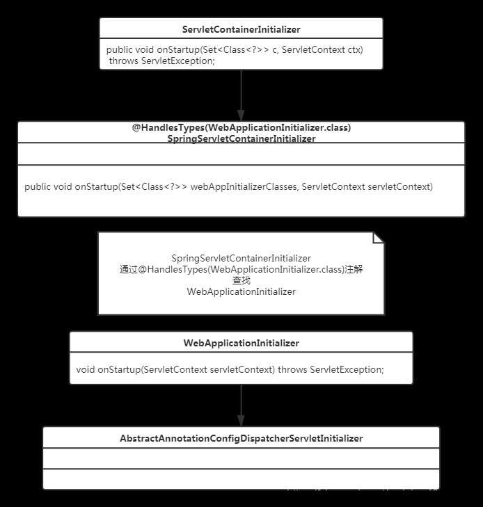

## 1.先配置容器的初始化配置类

```java
// web初始化的类，用来代替web.xml
public class WebInit extends AbstractAnnotationConfigDispatcherServletInitializer {

    // 指定Spring的配置类，父容器
    @Override
    protected Class<?>[] getRootConfigClasses() {
        return new Class[]{SpringConfig.class};
    }

    // 指定SpringMVC的配置类，子容器
    @Override
    protected Class<?>[] getServletConfigClasses() {
        return new Class[]{WebConfig.class};
    }

    //指定DispatcherServlet的映射规则，即url-pattern
    @Override
    protected String[] getServletMappings() {
        return new String[]{"/"};
    }

    //添加过滤器
    @Override
    protected Filter[] getServletFilters() {

        //设置字符编码的过滤器
        CharacterEncodingFilter characterEncodingFilter = new CharacterEncodingFilter();
        characterEncodingFilter.setEncoding("UTF-8");
        characterEncodingFilter.setForceResponseEncoding(true);

        //设置启用Http隐藏请求方法的过滤器
        HiddenHttpMethodFilter hiddenHttpMethodFilter = new HiddenHttpMethodFilter();

        return new Filter[]{characterEncodingFilter, hiddenHttpMethodFilter};
    }
}

```

Spring3.0之后提供了一个专门扫面初始化容器的类

SpringServletContainerInitializer

通过这个类的注解 `@HandlesTypes(WebApplicationInitializer.class)`扫面继承了 `WebApplicationInitializer`类的初始化类




## 2.在初始化类里面加载Spring的配置类和SpringMVC的配置类


## 3.定义Spring的配置类和SpringMVC的配置类

spring的配置类

```java
// spring的配置类，代替spring的配置文件
@Configuration
@EnableAspectJAutoProxy(proxyTargetClass = true)
@ComponentScan({"com.vue.shop.service","com.vue.shop.mapper"})
public class SpringConfig {
  
    // 加载数据库驱动
  
    // 配置相关的bean

}
```

springmvc的配置类

```java
// SpringMVC的配置文件，代替SpringMVC的配置文件
@Configuration
@EnableWebMvc
@ComponentScan("com.vue.shop.controller.mvc")
public class WebConfig {

    // 视图解析器的模板
    /*@Bean
    public ITemplateResolver templateResolver() {
        WebApplicationContext webApplicationContext = ContextLoader.getCurrentWebApplicationContext();
        // ServletContextTemplateResolver需要一个ServletContext作为构造参数，可通过WebApplicationContext 的方法获得
        ServletContextTemplateResolver templateResolver = new ServletContextTemplateResolver(webApplicationContext.getServletContext());
        templateResolver.setPrefix("/WEB-INF/templates/");
        templateResolver.setSuffix(".html");
        templateResolver.setCharacterEncoding("UTF-8");
        templateResolver.setTemplateMode(TemplateMode.HTML);
        return templateResolver;
    }

    //生成模板引擎并为模板引擎注入模板解析器
    @Bean
    public SpringTemplateEngine templateEngine(ITemplateResolver templateResolver) {
        SpringTemplateEngine templateEngine = new SpringTemplateEngine();
        templateEngine.setTemplateResolver(templateResolver);
        return templateEngine;
    }

    //生成视图解析器并未解析器注入模板引擎
    @Bean
    public ViewResolver viewResolver(SpringTemplateEngine templateEngine) {
        ThymeleafViewResolver viewResolver = new ThymeleafViewResolver();
        viewResolver.setCharacterEncoding("UTF-8");
        viewResolver.setTemplateEngine(templateEngine);
        return viewResolver;
    }
*/
}

```

## 能正常运行的相关依赖

```xml
<dependencies>

    <dependency>
      <groupId>mysql</groupId>
      <artifactId>mysql-connector-java</artifactId>
      <version>8.0.26</version>
    </dependency>

    <dependency>
      <groupId>org.mybatis</groupId>
      <artifactId>mybatis</artifactId>
      <version>3.5.13</version>
    </dependency>

    <dependency>
      <groupId>javax.servlet</groupId>
      <artifactId>javax.servlet-api</artifactId>
      <version>3.1.0</version>
      <scope>provided</scope>
    </dependency>

    <dependency>
      <groupId>org.springframework</groupId>
      <artifactId>spring-context</artifactId>
      <version>5.3.9</version>
    </dependency>

    <!--springmvc-->
    <dependency>
      <groupId>org.springframework</groupId>
      <artifactId>spring-webmvc</artifactId>
      <version>5.3.9</version>
    </dependency>

    <dependency>
      <groupId>jakarta.annotation</groupId>
      <artifactId>jakarta.annotation-api</artifactId>
      <version>2.1.1</version>
    </dependency>

    <dependency>
      <groupId>aopalliance</groupId>
      <artifactId>aopalliance</artifactId>
      <version>1.0</version>
    </dependency>

    <dependency>
      <groupId>org.aspectj</groupId>
      <artifactId>aspectjrt</artifactId>
      <version>1.6.11</version>
    </dependency>

    <dependency>
      <groupId>org.aspectj</groupId>
      <artifactId>aspectjweaver</artifactId>
      <version>1.6.11</version>
    </dependency>


    <!--fastjson-->
    <dependency>
      <groupId>com.alibaba</groupId>
      <artifactId>fastjson</artifactId>
      <version>1.2.76</version>
    </dependency>


    <dependency>
      <groupId>com.fasterxml.jackson.core</groupId>
      <artifactId>jackson-annotations</artifactId>
      <version>2.14.2</version>
    </dependency>

    <dependency>
      <groupId>com.fasterxml.jackson.core</groupId>
      <artifactId>jackson-core</artifactId>
      <version>2.14.2</version>
    </dependency>

    <!--log4j日志-->
    <dependency>
      <groupId>org.apache.logging.log4j</groupId>
      <artifactId>log4j-core</artifactId>
      <version>2.20.0</version>
    </dependency>

    <dependency>
      <groupId>org.apache.logging.log4j</groupId>
      <artifactId>log4j-slf4j2-impl</artifactId>
      <version>2.20.0</version>
    </dependency>

    <!--JWT-->
    <dependency>
      <groupId>com.auth0</groupId>
      <artifactId>java-jwt</artifactId>
      <version>4.3.0</version>
    </dependency>

    <dependency>
      <groupId>redis.clients</groupId>
      <artifactId>jedis</artifactId>
      <version>3.7.0</version>
    </dependency>

    <dependency>
      <groupId>com.alibaba</groupId>
      <artifactId>druid</artifactId>
      <version>1.2.15</version>
    </dependency>

  </dependencies>

  <build>
    <plugins>
      <plugin>
        <groupId>org.apache.tomcat.maven</groupId>
        <artifactId>tomcat7-maven-plugin</artifactId>
        <version>2.1</version>
      </plugin>
      <plugin>
        <groupId>org.apache.maven.plugins</groupId>
        <artifactId>maven-compiler-plugin</artifactId>
        <configuration>
          <source>8</source>
          <target>8</target>
        </configuration>
      </plugin>
      <plugin>
        <groupId>org.apache.maven.plugins</groupId>
        <artifactId>maven-war-plugin</artifactId>
        <version>3.3.1</version>
      </plugin>
    </plugins>
  </build>
```
