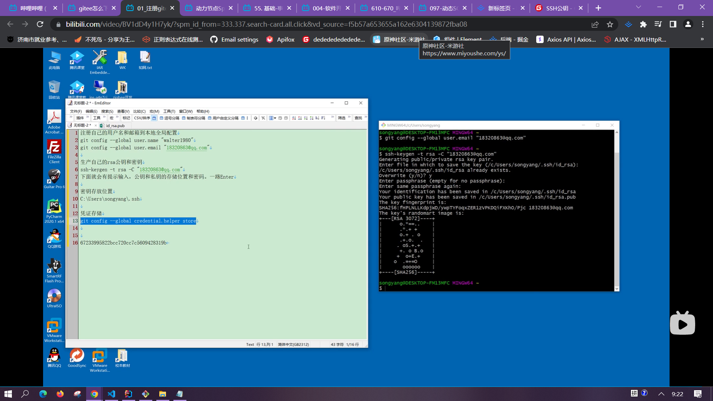
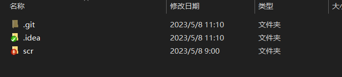

有.git这个隐藏文件，默认找里面config文件设置的连接

[core]
	repositoryformatversion = 0
	filemode = false
	bare = false
	logallrefupdates = true
	symlinks = false
	ignorecase = true
[remote "origin"]
	url = http://43.143.175.64:3000/java-team-one/java-web-two.git
	fetch = +refs/heads/*:refs/remotes/origin/*
[branch "master"]
	remote = origin
	merge = refs/heads/master
[lfs]
	repositoryformatversion = 0

idea集成git

settings-->plugins-->gitee
