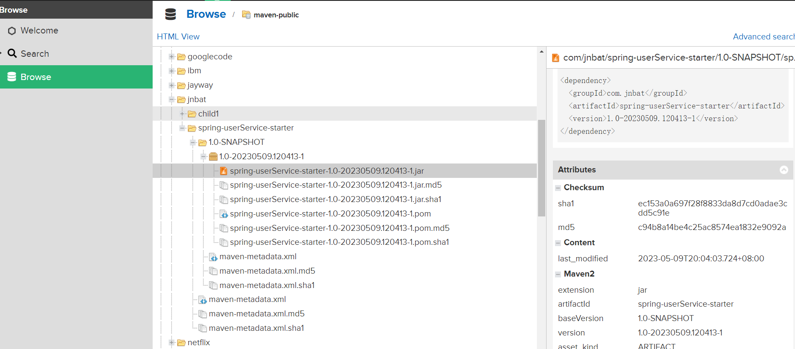

## maven私有仓库下载

在setting.xml配置

找到mirror注释加入

```
<mirror>
      <id>localnexus</id>
      <mirrorOf>*,!central</mirrorOf>
      <name>本地 Nexus 仓库</name>
      <url>http://43.143.175.64:8081//repository/maven-public/</url>
    </mirror>
```

找到server注释，添加，id为 `<repositories>`标签中

```
<server>
      <id>company-releases</id>
      <username>userNormal</username>
      <password>qwe123</password>
    </server>
```

在项目的pom文件中间添加

```
<repositories>
    <repository>
      <id>company-releases</id>
      <url>http://43.143.175.64:8081//repository/maven-public/</url>
      <releases>
        <enabled>true</enabled>
      </releases>
      <snapshots>
        <enabled>true</enabled>
        <updatePolicy>always</updatePolicy>
        <checksumPolicy>fail</checksumPolicy>
      </snapshots>
    </repository>
  </repositories>
```

在私有maven仓库中找到依赖



复制最右边的依赖，将版本号修改成baseVersion的版本号，不然会下载很多东西。

将依赖复制进pom文件中，点击maven的clear，再点击install

## maven私有仓库上传

在pom文件中加入

```
<!--maven私服上传-->
  <distributionManagement>
    <repository>
      <id>company-releases</id>
      <url>http://43.143.175.64:8081//repository/maven-releases/</url>
    </repository>
    <snapshotRepository>
      <id>company-snapshots</id>
      <url>http://43.143.175.64:8081//repository/maven-snapshots/</url>
    </snapshotRepository>
  </distributionManagement>
```

在settings.xml文件中配置

```
    <server>
      <id>company-snapshots</id>
      <username>userNormal</username>
      <password>qwe123</password>
    </server>
```

这里的id对应着pom文件中 `<distributionManagement>`标签中 `<snapshotRepository>`标签的id

注意pom文件中不能有module标签，否则会上传子项目
