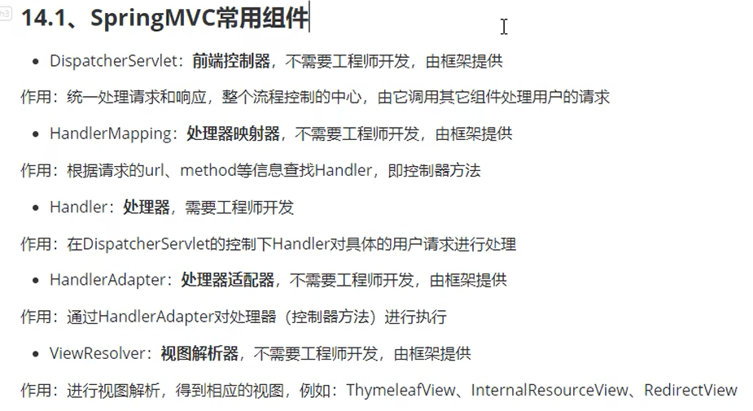

# SpringMVC

## 1.学习之前的小知识点：

### 1.1对pojo的细分：

什么是vo？

视图层的对象(实体类)，存在既合理，本质上就是因为，前端传过来的数据，如果都封装在一个类里面

很多时候都用不到，比如登录需要User类，只需要用户名和密码，但是User类里面又有其他的一些属性，

这样在接收的时候很多字段都用不到，造成资源的浪费；

同理，其他层也可以细分。

什么是dto(数据传输对象)？

mapper层的对象

### 1.2什么是MVC

* MVC是模型(Model)、视图(View)、控制器(Controller)的简写，是一种软件设计规范。
* 是将业务逻辑、数据、显示分离的方法来组织代码。
* MVC主要作用是**降低了视图与业务逻辑间的双向偶合**。
* MVC不是一种设计模式，**MVC是一种架构模式**。当然不同的MVC存在差异。

**Model（模型）：**数据模型，提供要展示的数据，因此包含数据和行为，可以认为是领域模型或JavaBean组件（包含数据和行为），不过现在一般都分离开来：Value Object（数据Dao） 和 服务层（行为Service）。也就是模型提供了模型数据查询和模型数据的状态更新等功能，包括数据和业务。

**View（视图）：**负责进行模型的展示，一般就是我们见到的用户界面，客户想看到的东西。

**Controller（控制器）：**接收用户请求，委托给模型进行处理（状态改变），处理完毕后把返回的模型数据返回给视图，由视图负责展示。也就是说控制器做了个调度员的工作。

### 1.3MVC框架要做的事情

1.3.1将url映射到java类或java类的方法上

1.3.2封装用户提交的数据

1.3.3处理请求--调用相关的业务逻辑--封装响应数据

1.3.4将响应的数据进行渲染

## SpringMVC运行时404的错误：

1.打开项目结构设置

2.点击Artifacts

3.手动添加一个lib目录

4.将所有的jar包复制进去

5.重启tomcat服务器


**6.找到DispatcherServlet-->HandlerMapping-->592行-->DEBUG-->找到matchBeans里的requestHandler-->registerMapping里面看看有没有请求的uri**


## SpringMVC的执行流程


虚线部分是我们需要做的，实线部分是框架帮我们做的

**简要分析执行流程**

1. DispatcherServlet表示前置控制器，是整个SpringMVC的控制中心。用户发出请求，DispatcherServlet接收请求并拦截请求。
   我们假设请求的url为 : http://localhost:8080/SpringMVC/hello
   **如上url拆分成三部分：**
   http://localhost:8080服务器域名
   SpringMVC部署在服务器上的web站点
   hello表示控制器
   通过分析，如上url表示为：请求位于服务器localhost:8080上的SpringMVC站点的hello控制器。
2. HandlerMapping为处理器映射。DispatcherServlet调用HandlerMapping,HandlerMapping根据请求url查找Handler。
3. HandlerExecution表示具体的Handler,其主要作用是根据url查找控制器，如上url被查找控制器为：hello。
4. HandlerExecution将解析后的信息传递给DispatcherServlet,如解析控制器映射等。
5. HandlerAdapter表示处理器适配器，其按照特定的规则去执行Handler。
6. Handler让具体的Controller执行。
7. Controller将具体的执行信息返回给HandlerAdapter,如ModelAndView。
8. HandlerAdapter将视图逻辑名或模型传递给DispatcherServlet。
9. DispatcherServlet调用视图解析器(ViewResolver)来解析HandlerAdapter传递的逻辑视图名。
10. 视图解析器将解析的逻辑视图名传给DispatcherServlet。
11. DispatcherServlet根据视图解析器解析的视图结果，调用具体的视图。
12. 最终视图呈现给用户。

步骤：

请求-->DispatcherServlet-->控制器映射器(HandlerMapping)-->控制器适配器(handlerAdapter)-->Controller返回ModelAndView-->视图解析器(ViewResolver)-->传给前端页面

## 原生SpringMVC代码

依赖

```xml
<!--spring核心-->
        <dependency>
            <groupId>org.springframework</groupId>
            <artifactId>spring-context</artifactId>
            <version>6.0.2</version>
        </dependency>
  
        <!--springmvc-->
        <dependency>
            <groupId>org.springframework</groupId>
            <artifactId>spring-webmvc</artifactId>
            <version>5.3.9</version>
        </dependency>

        <dependency>
            <groupId>javax.servlet.jsp</groupId>
            <artifactId>jsp-api</artifactId>
            <version>2.2</version>
        </dependency>

        <dependency>
            <groupId>javax.servlet</groupId>
            <artifactId>servlet-api</artifactId>
            <version>2.5</version>
        </dependency>

        <dependency>
            <groupId>jstl</groupId>
            <artifactId>jstl</artifactId>
            <version>1.2</version>
        </dependency>
```

配置文件

```xml
<!--处理器映射器-->
    <bean class="org.springframework.web.servlet.handler.BeanNameUrlHandlerMapping"/>

    <!--处理器适配器-->
    <bean class="org.springframework.web.servlet.mvc.SimpleControllerHandlerAdapter"/>

    <!--视图解析器-->
    <bean class="org.springframework.web.servlet.view.InternalResourceViewResolver" id="internalResourceViewResolver">
        <property name="prefix" value="/WEB-INF/jsp/"/>
        <property name="suffix" value=".jsp"/>
    </bean>

    <!--配置bean-->
    <bean id="/hello" class="com.tbt.controller.HelloController"/>
```

处理器适配器会自动找具有名字的bean

controller层代码

```java
import org.springframework.web.servlet.ModelAndView;
import org.springframework.web.servlet.mvc.Controller;

import javax.servlet.http.HttpServletRequest;
import javax.servlet.http.HttpServletResponse;

public class HelloController implements Controller {
    @Override
    public ModelAndView handleRequest(HttpServletRequest request, HttpServletResponse response) throws Exception {
        ModelAndView modelAndView = new ModelAndView();

        // 执行业务代码
        String str = "HelloSpringMVC";
        modelAndView.addObject("msg",str);

        // 试图跳转
        modelAndView.setViewName("test");

        return modelAndView;
    }
}

```

配置web.xml

```xml
<servlet>
        <servlet-name>SpringMVC</servlet-name>
        <servlet-class>org.springframework.web.servlet.DispatcherServlet</servlet-class>
        <init-param>
            <param-name>contextConfigLocation</param-name>
            <param-value>classpath:springmvc-servlet.xml</param-value>
        </init-param>
        <load-on-startup>1</load-on-startup>
    </servlet>
  
    <servlet-mapping>
        <servlet-name>SpringMVC</servlet-name>
        <url-pattern>/</url-pattern>
    </servlet-mapping>
```

## 注解方式开发SpringMVC

### 1.配置web.xml

```
<?xml version="1.0" encoding="UTF-8"?>
<web-app xmlns="http://xmlns.jcp.org/xml/ns/javaee"
         xmlns:xsi="http://www.w3.org/2001/XMLSchema-instance"
         xsi:schemaLocation="http://xmlns.jcp.org/xml/ns/javaee
http://xmlns.jcp.org/xml/ns/javaee/web-app_4_0.xsd"
         version="4.0">
```

```xml
<servlet>
        <servlet-name>SpringMVC</servlet-name>
        <servlet-class>org.springframework.web.servlet.DispatcherServlet</servlet-class>
        <init-param>
            <param-name>contextConfigLocation</param-name>
            <param-value>classpath:springmvc-servlet.xml</param-value>
        </init-param>
        <load-on-startup>1</load-on-startup>
    </servlet>

    <servlet-mapping>
        <servlet-name>SpringMVC</servlet-name>
        <url-pattern>/</url-pattern>
    </servlet-mapping>
```

### 2.配置spring的xml文件

```xml
<?xml version="1.0" encoding="UTF-8"?>
<beans xmlns="http://www.springframework.org/schema/beans"
       xmlns:xsi="http://www.w3.org/2001/XMLSchema-instance"
       xmlns:context="http://www.springframework.org/schema/context"
       xmlns:mvc="http://www.springframework.org/schema/mvc"
       xsi:schemaLocation="http://www.springframework.org/schema/beans
                           http://www.springframework.org/schema/beans/spring-beans.xsd
                           http://www.springframework.org/schema/context
                           http://www.springframework.org/schema/context/spring-context.xsd
                           http://www.springframework.org/schema/mvc
                           http://www.springframework.org/schema/mvc/spring-mvc.xsd">


    <!--包扫描-->
    <context:component-scan base-package="com.tbt.controller"/>

    <!--配置springmvc不处理静态资源 .css .html等-->
    <mvc:default-servlet-handler/>

    <!--mvc支持注解驱动-->
    <mvc:annotation-driven/>

    <!-- 配置Thymeleaf视图解析器 -->
    <bean id="viewResolver" class="org.thymeleaf.spring5.view.ThymeleafViewResolver">
        <property name="order" value="1"/>
        <property name="characterEncoding" value="UTF-8"/>
        <property name="templateEngine">
            <bean class="org.thymeleaf.spring5.SpringTemplateEngine">
                <property name="templateResolver">
                    <bean class="org.thymeleaf.spring5.templateresolver.SpringResourceTemplateResolver">
                        <!-- 视图前缀 -->
                        <property name="prefix" value="/WEB-INF/templates/"/>
                        <!-- 视图后缀 -->
                        <property name="suffix" value=".html"/>
                        <property name="templateMode" value="HTML5"/>
                        <property name="characterEncoding" value="UTF-8" />
                    </bean>
                </property>
            </bean>
        </property>
    </bean>

</beans>
```

创建Controller类

```java
import org.springframework.stereotype.Controller;
import org.springframework.ui.Model;
import org.springframework.web.bind.annotation.RequestMapping;

@Controller
public class HelloController {

    /**
     * 一个方法相当于一个servlet
     * Model就是一个模型
     * @param model
     * @return
     */
    @RequestMapping("/hello")
    public String hello(Model model){
        model.addAttribute("msg","Hello SpringMVC");
        return "Hello";
    }

    @RequestMapping("/hello1")
    public String hello1(Model model){
        model.addAttribute("msg","Hello SpringMVC");
        return "Hello";
    }
}

```

#### tomcat8.5用到的依赖，这能够正常运行

```xml
<dependency>
            <groupId>junit</groupId>
            <artifactId>junit</artifactId>
            <version>4.12</version>
            <scope>test</scope>
        </dependency>

        <dependency>
            <groupId>org.springframework</groupId>
            <artifactId>spring-webmvc</artifactId>
            <version>5.3.9</version>
        </dependency>

        <dependency>
            <groupId>jakarta.servlet</groupId>
            <artifactId>jakarta.servlet-api</artifactId>
            <version>5.0.0</version>
        </dependency>

        <dependency>
            <groupId>javax.servlet.jsp</groupId>
            <artifactId>jsp-api</artifactId>
            <version>2.2</version>
        </dependency>

        <dependency>
            <groupId>jstl</groupId>
            <artifactId>jstl</artifactId>
            <version>1.2</version>
        </dependency>
```

如果tomcat启动不起来，

1.可能是lib没有放到tomcat的classes文件加下，并且没有相关jar包

2.报404可能是依赖包的版本太高，或者冲突

3.静态资源找不到，可能是下面的原因，要对应起来


## @RequestMapping配置

* @RequestMapping注解用于映射url到控制器类或一个特定的处理程序方法。可用于类或方法上。用于类上，表示类中的所有响应请求的方法都是以该地址作为父路径。
* 为了测试结论更加准确，我们可以加上一个项目名测试 myweb
* 只注解在方法上面

```java
import org.springframework.stereotype.Controller;
import org.springframework.ui.Model;
import org.springframework.web.bind.annotation.RequestMapping;

@Controller
public class HelloController {

    /**
     * 一个方法相当于一个servlet
     * Model就是一个模型
     * @param model
     * @return
     */
    @RequestMapping("/h1")
    public String hello(Model model){
        model.addAttribute("msg","Hello");
        System.out.println("111");
        // 返回的页面
        // 一般在webapp下面的WEB-INF下面的页面
        return "hello";
    }

}
```

## RestFul 风格

**使用RESTful操作资源** ：可以通过不同的请求方式来实现不同的效果！如下：请求地址一样，但是功能可以不同！

* http://127.0.0.1/item/1 查询,GET
* http://127.0.0.1/item 新增,POST
* http://127.0.0.1/item 更新,PUT
* http://127.0.0.1/item/1 删除,DELETE

当后面的Controller是这样的请求代码时

```
@RequestMapping("/add")
    public String add(int a,int b,Model model){
        int res = a+b;
        model.addAttribute("msg",res);
        System.out.println("111");
        // 返回的页面
        // 一般在webapp下面的WEB-INF下面的页面
        return "hello";
    }
```

则，请求的样式可以是

localhost:8080/add?a=1&b=1

结果为


RestFul风格不需要这样传参

可以通过在变量上加注解@PathVariable来绑定一个参数

代码

```java
@RequestMapping("/add/{a}/{b}")
    public String add1(@PathVariable int a,@PathVariable int b, Model model){
        int res = a+b;
        model.addAttribute("msg",res);
        System.out.println("111");
        // 返回的页面
        // 一般在webapp下面的WEB-INF下面的页面
        return "hello";
    }
```

url可以这样写


### 请求类型的注解及方法的书写

```
@GetMapping("/add/{a}/{b}")
    public String add1(@PathVariable int a,@PathVariable int b, Model model)
```

@PostMapping

@PutMapping

@DeleteMapping

**注意：相同的请求方式，不能有两个相同路径的请求，否则会报500的错误**

```
@GetMapping("/add/{a}/{b}")
    public String add1(@PathVariable int a,@PathVariable int b, Model model){
        int res = a+b;
        model.addAttribute("msg",res);
        System.out.println("111");
        // 返回的页面
        // 一般在webapp下面的WEB-INF下面的页面
        return "hello";
    }
@GetMapping("/add/{a}/{b}")
    public String add1(@PathVariable int a,@PathVariable int b, Model model){
        int res = a+b;
        model.addAttribute("msg",res);
        System.out.println("111");
        // 返回的页面
        // 一般在webapp下面的WEB-INF下面的页面
        return "hello";
    }
```

## 绑定前端参数的注解：

@PathVariable：用在get类型的请求，绑定传递的参数

@RequestParam("参数")：绑定前端传过来的请求体里的数据，类似mapper层的@Param

```
 @RequestMapping("/user")
    public String getJson5(@RequestParam("username") String username,@RequestParam("password") String password){
        System.out.println(username + " :" + password);
        return "test";
    }
```

**提交的是一个对象**

要求提交的表单域和对象的属性名一致  , 参数使用对象即可

1、实体类

```
public class User {
   private int id;
   private String name;
   private int age;
   //构造
   //get/set
   //tostring()
}
```

2、提交数据 : http://localhost:8080/mvc04/user?name=kuangshen&id=1&age=15

3、处理方法 :

```
@RequestMapping("/user")
public String user(User user){
   System.out.println(user);
   return "hello";
}
```

后台输出 : User { id=1, name='kuangshen', age=15 }

说明：如果使用对象的话，前端传递的参数名和对象名必须一致，否则就是null。

### modelMap

```
@GetMapping("/m2")
    public String test2(ModelMap modelMap){
        modelMap.addAttribute("msg","ModelMap");
        System.out.println("333");
        return "test";
    }
```

model和modelMap的区别

1. Model 只有寥寥几个方法只适合用于储存数据，简化了新手对于Model对象的操作和理解；
2. ModelMap 继承了 LinkedMap ，除了实现了自身的一些方法，同样的继承 LinkedMap 的方法和特性；
3. ModelAndView 可以在储存数据的同时，可以进行设置返回的逻辑视图，进行控制展示层的跳转。

## 乱码问题

```xml
<filter>
        <filter-name>encoding</filter-name>
        <filter-class>org.springframework.web.filter.CharacterEncodingFilter</filter-class>
    </filter>
    <filter-mapping>
        <filter-name>encoding</filter-name>
        <url-pattern>/</url-pattern>
    </filter-mapping>
```

SpringMVC提供的解决乱码的工具

终极大招

```java
package com.kuang.filter;

import javax.servlet.*;
import javax.servlet.http.HttpServletRequest;
import javax.servlet.http.HttpServletRequestWrapper;
import javax.servlet.http.HttpServletResponse;
import java.io.IOException;
import java.io.UnsupportedEncodingException;
import java.util.Map;

/**
* 解决get和post请求 全部乱码的过滤器
*/
public class GenericEncodingFilter implements Filter {

   @Override
   public void destroy() {
  }

   @Override
   public void doFilter(ServletRequest request, ServletResponse response, FilterChain chain) throws IOException, ServletException {
       //处理response的字符编码
       HttpServletResponse myResponse=(HttpServletResponse) response;
       myResponse.setContentType("text/html;charset=UTF-8");

       // 转型为与协议相关对象
       HttpServletRequest httpServletRequest = (HttpServletRequest) request;
       // 对request包装增强
       HttpServletRequest myrequest = new MyRequest(httpServletRequest);
       chain.doFilter(myrequest, response);
  }

   @Override
   public void init(FilterConfig filterConfig) throws ServletException {
  }

}

//自定义request对象，HttpServletRequest的包装类
class MyRequest extends HttpServletRequestWrapper {

   private HttpServletRequest request;
   //是否编码的标记
   private boolean hasEncode;
   //定义一个可以传入HttpServletRequest对象的构造函数，以便对其进行装饰
   public MyRequest(HttpServletRequest request) {
       super(request);// super必须写
       this.request = request;
  }

   // 对需要增强方法 进行覆盖
   @Override
   public Map getParameterMap() {
       // 先获得请求方式
       String method = request.getMethod();
       if (method.equalsIgnoreCase("post")) {
           // post请求
           try {
               // 处理post乱码
               request.setCharacterEncoding("utf-8");
               return request.getParameterMap();
          } catch (UnsupportedEncodingException e) {
               e.printStackTrace();
          }
      } else if (method.equalsIgnoreCase("get")) {
           // get请求
           Map<String, String[]> parameterMap = request.getParameterMap();
           if (!hasEncode) { // 确保get手动编码逻辑只运行一次
               for (String parameterName : parameterMap.keySet()) {
                   String[] values = parameterMap.get(parameterName);
                   if (values != null) {
                       for (int i = 0; i < values.length; i++) {
                           try {
                               // 处理get乱码
                               values[i] = new String(values[i]
                                      .getBytes("ISO-8859-1"), "utf-8");
                          } catch (UnsupportedEncodingException e) {
                               e.printStackTrace();
                          }
                      }
                  }
              }
               hasEncode = true;
          }
           return parameterMap;
      }
       return super.getParameterMap();
  }

   //取一个值
   @Override
   public String getParameter(String name) {
       Map<String, String[]> parameterMap = getParameterMap();
       String[] values = parameterMap.get(name);
       if (values == null) {
           return null;
      }
       return values[0]; // 取回参数的第一个值
  }

   //取所有值
   @Override
   public String[] getParameterValues(String name) {
       Map<String, String[]> parameterMap = getParameterMap();
       String[] values = parameterMap.get(name);
       return values;
  }
}
```

## 接收和发送JSON数据

### 接收json数据 转换为对象类型

```java
@RequestMapping("/test2")
    public void test2(@RequestBody User user){
        System.out.println(user);
        System.out.println("111");
    }
```

### 接收json字符串转换为map集合

```
@RequestMapping("/test3")
    public void test3(@RequestBody Map<String,Object> map){
        System.out.println(map);
        System.out.println("111");
    }
```

### 普通json数据

```
@Controller
public class UserController {

   @RequestMapping("/json1")
   @ResponseBody
   public String json1() throws JsonProcessingException {
       //创建一个jackson的对象映射器，用来解析数据
       ObjectMapper mapper = new ObjectMapper();
       //创建一个对象
       User user = new User("秦疆1号", 3, "男");
       //将我们的对象解析成为json格式
       String str = mapper.writeValueAsString(user);
       //由于@ResponseBody注解，这里会将str转成json格式返回；十分方便
       return str;
  }

}
```

fastjson 三个主要的类：

**JSONObject  代表 json 对象**

* JSONObject实现了Map接口, 猜想 JSONObject底层操作是由Map实现的。
* JSONObject对应json对象，通过各种形式的get()方法可以获取json对象中的数据，也可利用诸如size()，isEmpty()等方法获取"键：值"对的个数和判断是否为空。其本质是通过实现Map接口并调用接口中的方法完成的。

**JSONArray   代表 json 对象数组**

* 内部是有List接口中的方法来完成操作的。

**JSON代表 JSONObject和JSONArray的转化**

* JSON类源码分析与使用
* 仔细观察这些方法，主要是实现json对象，json对象数组，javabean对象，json字符串之间的相互转化。

**代码测试，我们新建一个FastJsonDemo 类**

```java
public class FastJsonDemo {
   public static void main(String[] args) {
       //创建一个对象
       User user1 = new User("秦疆1号", 3, "男");
       User user2 = new User("秦疆2号", 3, "男");
       User user3 = new User("秦疆3号", 3, "男");
       User user4 = new User("秦疆4号", 3, "男");
       List<User> list = new ArrayList<User>();
       list.add(user1);
       list.add(user2);
       list.add(user3);
       list.add(user4);

       System.out.println("*******Java对象 转 JSON字符串*******");
       String str1 = JSON.toJSONString(list);
       System.out.println("JSON.toJSONString(list)==>"+str1);
       String str2 = JSON.toJSONString(user1);
       System.out.println("JSON.toJSONString(user1)==>"+str2);

       System.out.println("\n****** JSON字符串 转 Java对象*******");
       User jp_user1=JSON.parseObject(str2,User.class);
       System.out.println("JSON.parseObject(str2,User.class)==>"+jp_user1);

       System.out.println("\n****** Java对象 转 JSON对象 ******");
       JSONObject jsonObject1 = (JSONObject) JSON.toJSON(user2);
       System.out.println("(JSONObject) JSON.toJSON(user2)==>"+jsonObject1.getString("name"));

       System.out.println("\n****** JSON对象 转 Java对象 ******");
       User to_java_user = JSON.toJavaObject(jsonObject1, User.class);
       System.out.println("JSON.toJavaObject(jsonObject1, User.class)==>"+to_java_user);
  }
}
```


### 发送json数据

```
@RequestMapping("/test4")
    @ResponseBody
    public List<User> test4(){
        User u1 = new User();
        User u2 = new User();
        List<User> list = new ArrayList<>();
        list.add(u1);
        list.add(u2);
        System.out.println("111");
        return list;
    }
```


## ant风格

```
@RequestMapping("a?a/getJson/")
```

？：匹配任意的一个字符，处理它本身

```
@RequestMapping("a*a/getJson/")
```

*：匹配一个至多个任意字符，除了?

错误写法

```
@RequestMapping("a**a/getJson/")
public String getJson4(ModelMap modelMap){
    modelMap.addAttribute("msg","Hello getJson");
    return "test";
}
```

**：匹配任意多级目录

注意：使用**，只能这样写/**/

正确写法

```
@RequestMapping("/**/getJson/")
    public String getJson4(ModelMap modelMap){
        modelMap.addAttribute("msg","Hello getJson");
        return "test";
    }
```

## @RequestHeader

将请求头的信息和控制器方法的参数进行绑定

## @CookieValue

将cookie数据和控制器方法的参数进行绑定

```
@RequestMapping("/getJson6")
    public String getJson6(@RequestHeader("referer") String referer, @CookieValue("JSESSIONID") String jsessionId){
        System.out.println("referer :" + referer);
        System.out.println("jsessionId :" + jsessionId);
        return "test";
    }
```

## Restful风格


乱码处理器

```
<filter>
        <filter-name>CharacterEncodingFilter</filter-name>
        <filter-class>org.springframework.web.filter.CharacterEncodingFilter</filter-class>
        <init-param>
            <param-name>encoding</param-name>
            <param-value>UTF-8</param-value>
        </init-param>
        <init-param>
            <param-name>forceEncoding</param-name>
            <param-value>true</param-value>
        </init-param>
    </filter>
    <filter-mapping>
        <filter-name>CharacterEncodingFilter</filter-name>
        <url-pattern>/*</url-pattern>
    </filter-mapping>
```

## 拦截器

配置xml

```
<!--拦截器 拦截浏览器的请求-->
    <mvc:interceptors>
        <!--<bean class="com.tbt.interceptor.MyInterceptor"/>-->
        <mvc:interceptor>
            <!--上下文路径的一层-->
            <!--<mvc:mapping path="/*" />-->
            <!--多层-->
            <mvc:mapping path="/*"/>
            <mvc:exclude-mapping path=".html"/>
            <bean class="com.tbt.interceptor.MyInterceptor"/>
        </mvc:interceptor>
    </mvc:interceptors>
```

拦截器会先进DispatcherServlet，由DispatcherServlet生成一个mappedHandler的控制器，这个控制器会交给我们自定义的拦截器去拦截Controller层的请求

DispatcherServlet部分源码

```
				// Actually invoke the handler.
				mv = ha.handle(processedRequest, response, mappedHandler.getHandler());

				if (asyncManager.isConcurrentHandlingStarted()) {
					return;
				}

				applyDefaultViewName(processedRequest, mv);
				//执行postHandle的方法
				mappedHandler.applyPostHandle(processedRequest, response, mv);
			}
			catch (Exception ex) {
				dispatchException = ex;
			}
			catch (Throwable err) {
				// As of 4.3, we're processing Errors thrown from handler methods as well,
				// making them available for @ExceptionHandler methods and other scenarios.
				dispatchException = new NestedServletException("Handler dispatch failed", err);
			}
			processDispatchResult(processedRequest, response, mappedHandler, mv, dispatchException);
		}
		catch (Exception ex) {
			triggerAfterCompletion(processedRequest, response, mappedHandler, ex);
		}
		catch (Throwable err) {
			triggerAfterCompletion(processedRequest, response, mappedHandler,
					new NestedServletException("Handler processing failed", err));
		}
		finally {
			if (asyncManager.isConcurrentHandlingStarted()) {
				// Instead of postHandle and afterCompletion
				if (mappedHandler != null) {
					mappedHandler.applyAfterConcurrentHandlingStarted(processedRequest, response);
				}
			}
			else {
				// Clean up any resources used by a multipart request.
				if (multipartRequestParsed) {
					cleanupMultipart(processedRequest);
				}
			}
		}
	}

	/**
	 * Do we need view name translation?
	 */
	private void applyDefaultViewName(HttpServletRequest request, @Nullable ModelAndView mv) throws Exception {
		if (mv != null && !mv.hasView()) {
			String defaultViewName = getDefaultViewName(request);
			if (defaultViewName != null) {
				mv.setViewName(defaultViewName);
			}
		}
	}

	/**
	 * Handle the result of handler selection and handler invocation, which is
	 * either a ModelAndView or an Exception to be resolved to a ModelAndView.
	 */
	private void processDispatchResult(HttpServletRequest request, HttpServletResponse response,
			@Nullable HandlerExecutionChain mappedHandler, @Nullable ModelAndView mv,
			@Nullable Exception exception) throws Exception {

		boolean errorView = false;

		if (exception != null) {
			if (exception instanceof ModelAndViewDefiningException) {
				logger.debug("ModelAndViewDefiningException encountered", exception);
				mv = ((ModelAndViewDefiningException) exception).getModelAndView();
			}
			else {
				Object handler = (mappedHandler != null ? mappedHandler.getHandler() : null);
				mv = processHandlerException(request, response, handler, exception);
				errorView = (mv != null);
			}
		}

		// Did the handler return a view to render?
		if (mv != null && !mv.wasCleared()) {
			render(mv, request, response);
			if (errorView) {
				WebUtils.clearErrorRequestAttributes(request);
			}
		}
		else {
			if (logger.isTraceEnabled()) {
				logger.trace("No view rendering, null ModelAndView returned.");
			}
		}

		if (WebAsyncUtils.getAsyncManager(request).isConcurrentHandlingStarted()) {
			// Concurrent handling started during a forward
			return;
		}

		if (mappedHandler != null) {
			// Exception (if any) is already handled..
			//在执行视图渲染之后执行
			mappedHandler.triggerAfterCompletion(request, response, null);
		}
```

### 多个拦截器的执行顺序


**pre会先执行靠前的拦截器，但是post和after会先执行靠后的拦截器**

因为preHandle的循环遍历是正序的(i++)，而postHandle和afterCompletion的遍历是反序的(i--)

### 拦截器的执行顺序问题：

若拦截器中的某个拦截器的preHandle返回false；

拦截器的preHandle()返回false和它之前的拦截器的preHandle()都会执行，之后的拦截器的preHandle()不会执行；

所有的拦截器的postHandle()都不执行

拦截器的preHandle()返回false之前的拦截器的afterCompletion()会执行。

## 异常处理

接口：HandlerExceptionResolver

AbstractHandlerExceptionResolver实现了这个接口，里面有个doResolverException的方法，而resolverException重写了这个方法，返回一个ModelAndView的对象。

### xml配置异常

```
<!--配置异常-->
    <bean class="org.springframework.web.servlet.handler.SimpleMappingExceptionResolver">
        <property name="exceptionMappings">
            <props>
                <!--key用来设置出现的异常，value设置出现异常跳转的页面-->
                <!--数学运算异常-->
                <prop key="java.lang.ArithmeticException">error</prop>
            </props>
        </property>
    </bean>
```

### 注解定义异常类

```
// 定义异常处理的bean
@ControllerAdvice
public class ExceptionConfig {

    /**
     * 用来指定哪些异常需要处理
     * @param ex
     * @param model
     * @return
     */
    @ExceptionHandler({ArithmeticException.class})
    public String handleException(Throwable ex, Model model){
        model.addAttribute("ex",ex);
        return "error";
    }
}

```

## 配置类设置注解开发

```
@Configuration
@ComponentScan({"com.tbt.config","com.tbt.interceptor"})
@EnableWebMvc
public class SpringConfig implements WebMvcConfigurer {

    /**
     * 配置拦截器
* @param registry
*/
@Override
public void addInterceptors(InterceptorRegistry registry) {
        MyInterceptor myInterceptor = new MyInterceptor();
        registry.addInterceptor(myInterceptor);
    }

    /**
     * 配置异常处理器
* @param resolvers
*/
@Override
public void configureHandlerExceptionResolvers(List<HandlerExceptionResolver> resolvers) {
        SimpleMappingExceptionResolver resolver = new SimpleMappingExceptionResolver();
        Properties prop = new Properties();
        prop.setProperty("java.lang.ArithmeticException","error");
        // 将异常放入map集合中
resolver.setExceptionMappings(prop);
        resolver.setExceptionAttribute("ex");
        resolvers.add(resolver);
    }

    /**
     * 配置视图解析器
* @param registry
*/
@Override
public void addViewControllers(ViewControllerRegistry registry) {
        registry.addViewController("/").setViewName("index");

    }

    /**
     * 配置servlet处理静态资源
* @param configurer
*/
@Override
public void configureDefaultServletHandling(DefaultServletHandlerConfigurer configurer) {
        configurer.enable();
    }
}
```

## 常用组件



## DispatcherServlet初始化的过程

DispatcherServlet集成了FromeworkServlet，里面的createWebApplicationContext用来创建容器并初始化

```
protected WebApplicationContext createWebApplicationContext(@Nullable ApplicationContext parent) {
		Class<?> contextClass = getContextClass();
		if (!ConfigurableWebApplicationContext.class.isAssignableFrom(contextClass)) {
			throw new ApplicationContextException(
					"Fatal initialization error in servlet with name '" + getServletName() +
					"': custom WebApplicationContext class [" + contextClass.getName() +
					"] is not of type ConfigurableWebApplicationContext");
		}
		ConfigurableWebApplicationContext wac =
				(ConfigurableWebApplicationContext) BeanUtils.instantiateClass(contextClass);

		wac.setEnvironment(getEnvironment());
		//将springmvc创建的IoC容器放入父容器中
		wac.setParent(parent);
		String configLocation = getContextConfigLocation();
		if (configLocation != null) {
			wac.setConfigLocation(configLocation);
		}
		configureAndRefreshWebApplicationContext(wac);

		return wac;
	}
```

注意：当spring创建IoC容器和SpringMVC创建IoC容器的时候，Spring的IoC容器是父容器，SpringMVC的IoC容器是子容器。

再将容器共享到Servlet的域对象中，最后交给DispatcherServlet去初始化组件

DispatcherServlet(真正的实现类)-->(FromewrokServlet-->HttpServletBean-->HttpServlet-->GenericServlet)(抽象类)-->Servlet接口

## SpringMVC执行流程


1.浏览器的请求进来，进入DispatcherServlet

这时会将获取到的请求的URL，解析成URI，判断URI对应的servlet映射

如果有，则交给响应的控制器

如果没有，则报404错误

2.DispatcherServlet会将请求的URI交给HandlerMapping，在里面找到所有的handler控制器

3.DispatcherServlet根据获得的Handler，找到一个合适的HandlerAdapter

4.如果成功获取HandlerAdapter，则执行拦截器的preHandle()方法

5.通过HandlerAdapter，找到对应的Controller执行里面的方法；根据配置，spring容器还能进行其他额外的操作

6.在对应的方法中进行数据的转换等操作

7.操作完成后返回一个ModelAndView，给DispatcherServlet

8.执行拦截器中的postHandle()方法

9.进行视图渲染

10.执行拦截器里的afterCompletion()方法
