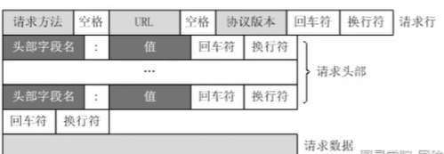
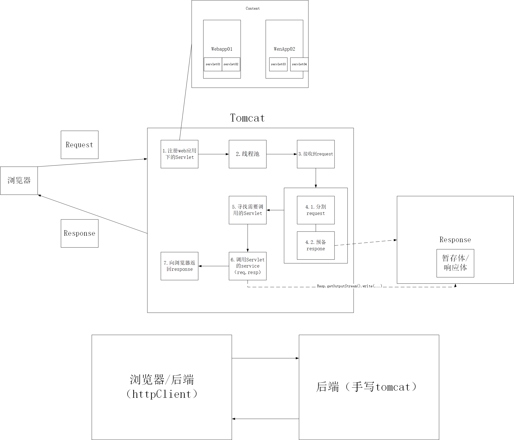
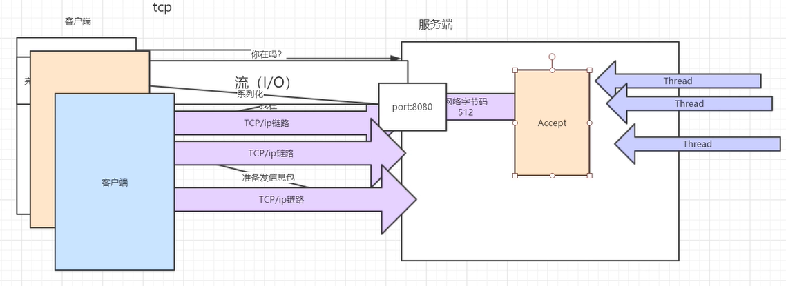
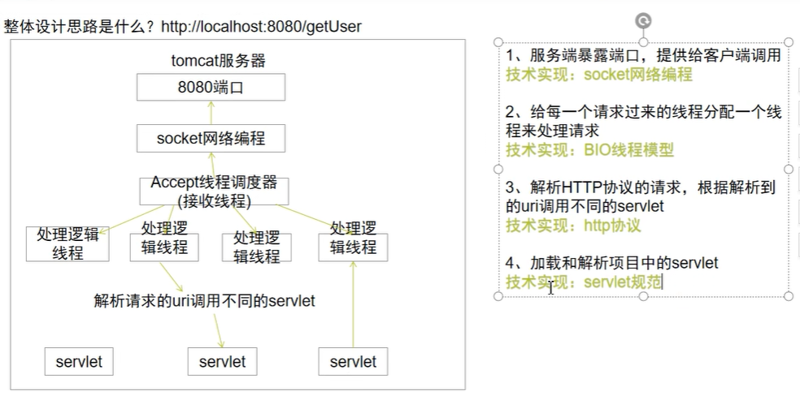

HTTP协议的格式：



手写tomcat



tcp/ip通信



设计思路



主要逻辑就是，模拟tomcat收发请求和响应数据，接收socket的输入与输出流，输入流读取请求，输出流发送响应。

## 1.tomcat的启动类

```java
public class App 
{
    public void start(){
        //socket连接TCP
try {
            // 创建线程池，大小是20
ExecutorService executorService = Executors.newFixedThreadPool(20);
            // 服务端连接TCP
ServerSocket serverSocket = new ServerSocket(8080);

            // 如果不加while循环，则只能处理一个socket，并且关闭
// 加了while循环之后，那么处理完一个socket连接之后，等待另一个socket进行连接
while (true){
                Socket socket = serverSocket.accept();
                executorService.execute(new SocketProcessor(socket));

            }

        } catch (IOException e) {
            e.printStackTrace();
        }
    }

    public static void main( String[] args )
    {
        App tomcat = new App();
        tomcat.start();
        System.out.println( "Hello World!" );
    }
}
```

## 2.处理socket连接

### 1.通过socket获取请求信息

### 2.将获取到的请求头封装成一个Request类。

### 3.将封装好的请求，以参数的形式传给response，给浏览器发送响应。

```java
/**
 * 专门处理socket的类
*/
public class SocketProcessor implements Runnable{

    private Socket socket;

    public SocketProcessor(Socket socket){
        this.socket = socket;
    }


    @Override
public void run() {
        processSocket(socket);
    }

    //专门处理socket连接的方法
private void processSocket(Socket socket) {
        // 处理socket连接
// 读取数据
try {
            InputStream inputStream = socket.getInputStream();
            byte[] bytes = new byte[1024];
            int len = 0;
            /*while ((len = inputStream.read(bytes)) != -1){

            }*/
            // 这里读到的其实是以http协议的格式进行读取的
// 也就是GET uri HTTP/1.1 ······
inputStream.read(bytes);

            // 请求行
// 解析字节流，遇到一个空格就退出
// 组合空格之前的字节流，转换成字符串就是请求方法，入GET或者POST
            // new工具类，将bytes传进去
AnalysisHttpRequestUtil analysisHttpRequestUtil = new AnalysisHttpRequestUtil(bytes);
            StringBuilder method = analysisHttpRequestUtil.getHttpRequestBySP();
            System.out.println(method);

            // 继续遍历获取请求的uri
StringBuilder uri = analysisHttpRequestUtil.getHttpRequestBySP();
            System.out.println(uri);

            // 获取http协议版本号
StringBuilder httpx = analysisHttpRequestUtil.getHttpRequestByRN();
            System.out.println(httpx);

            // 获取请求头
// host
StringBuilder host = analysisHttpRequestUtil.getHttpRequestBySP();
            System.out.println(host);

            // localhost
StringBuilder localhost = analysisHttpRequestUtil.getHttpRequestByRN();

            System.out.println(localhost);
            // 获取IP地址
String[] splitOfLocalhost = localhost.toString().split(":");
            String local = splitOfLocalhost[0];
            System.out.println(local);

            // 获取端口号
String port = splitOfLocalhost[1];
            System.out.println(port);

            // 将请求和响应传给servlet
            // 将解析到的请求行，拿到这次请求
Request request = new Request(uri.toString(), method.toString(), httpx.toString(), socket);
            // 根据这次请求，创建响应对象
Response response = new Response(request);

            // 匹配servlet，service方法判断是什么请求方式
TestServlet testServlet = new TestServlet();
            // 调用servlet的service方法，将request和response的数据传给servlet
testServlet.service(request,response);

            response.complete();
        } catch (IOException e) {
            e.printStackTrace();
        } catch (ServletException e) {
            e.printStackTrace();
        }


    }
}
```

### 4.封装Request类

```java
/**
 * 发送请求的类
 */
public class Request extends AbstractHttpServletRequest{
    // 请求路径，项目名+servlet名
    private String uri;
    // 请求方式
    private String method;
    // http协议版本号
    private String protocol;
    // 这个请求对应的socket连接
    private Socket socket;

    public Request() {
    }

    public Request(String uri, String method, String protocol, Socket socket) {
        this.uri = uri;
        this.method = method;
        this.protocol = protocol;
        this.socket = socket;
    }

    public Request(String uri, String method, String protocol) {
        this.uri = uri;
        this.method = method;
        this.protocol = protocol;
    }

    public StringBuffer getRequestURL() {
        return new StringBuffer(uri);
    }

    public String getMethod() {
        return method;
    }

    public String getProtocol() {
        return protocol;
    }

    public Socket getSocket() {
        return socket;
    }

    @Override
    public String toString() {
        return "Request{" +
                "uri='" + uri + '\'' +
                ", method='" + method + '\'' +
                ", protocol='" + protocol + '\'' +
                '}';
    }
}

```

## 3.匹配哪个Servlet发送的响应

```
// 匹配servlet，service方法判断是什么请求方式
TestServlet testServlet = new TestServlet();
// 调用servlet的service方法，将request和response的数据传给servlet
testServlet.service(request,response);
```

## 4.响应的发送

### 1.封装响应

响应内容包括：

相应行：状态码+相应行信息，利用sendResponseLine()方法发送

响应头：servlet要调用封装好的Response中的addHeader，利用sendResponseHeader()方法发送

响应体：从暂存体中一块发送，利用sendResponseBody()方法

```java
/**
 * 发送响应的类
*/
public class Response extends AbstractHttpServletResponse{

    // 状态码
    private int status = 200;
    // 响应行信息
    private String message = "OK";
    // 响应头
    private Map<String,String> headers = new HashMap<>();
    // 请求,拿到这次请求的socket
    private Request request;
    // socket输出流
    private OutputStream socketOutputStream;

    // 将响应的输入流new出来，不用每次都new一个
    private ResponseServletOutputStream responseServletOutputStream = new ResponseServletOutputStream();

    // 空格
    private static byte SP = ' ';
    private static String CRCF = "\r\n";

    public Response() {
    }

    // 一个请求对应一个连接
public Response(Request request) {
        this.request = request;
        try {
            // 拿到当前请求的socket，并拿到当前socket的输出流
            this.socketOutputStream = request.getSocket().getOutputStream();
        } catch (IOException e) {
            e.printStackTrace();
        }
    }

    @Override
    public void setStatus(int sc, String sm) {
        status = sc;
        message = sm;
    }

    @Override
    public int getStatus() {
        return status;
    }

    @Override
    public void addHeader(String name, String value) {
        headers.put(name, value);
    }

    @Override
    public ResponseServletOutputStream getOutputStream() throws IOException {
        return responseServletOutputStream;
    }

    /**
     * 在执行完service之后，发送响应数据
     */
  public void complete(){
        // 发送响应
    try {
            sendResponseLine();
            sendResponseHeader();
            sendResponseBody();
        } catch (IOException e) {
            e.printStackTrace();
        }

    }

    private void sendResponseBody() throws IOException {
        // 将ResponseServletOutputStream暂存的数据，发送给socket
        socketOutputStream.write(getOutputStream().getBytes());
    }

    /**
     * 发送响应头
     * @throws IOException
     */
    private void sendResponseHeader() throws IOException {

        // tomcat自动识别响应头是否有Content-Length,没有则加上
        if (!headers.containsKey("Content-Length")){
            addHeader("Content-Length", String.valueOf(getOutputStream().getPos()));
        }

        if (!headers.containsKey("Content-Type")){
            // 默认是纯文本
            addHeader("Content-Type", "text/plain;charset=utf-8");
        }


        for (Map.Entry<String, String> entry : headers.entrySet()) {
            String key = entry.getKey();
            String value = entry.getValue();
            /*socketOutputStream.write(key.getBytes());
            socketOutputStream.write(":".getBytes());
            socketOutputStream.write(value.getBytes());
            socketOutputStream.write(CRCF.getBytes());*/
        }
        socketOutputStream.write(CRCF.getBytes());
    }

    /**
     * 相应行格式
     * Http协议版本号 状态码 响应信息\r\n
     */
    private void sendResponseLine() throws IOException {
        socketOutputStream.write(request.getProtocol().getBytes());
        socketOutputStream.write(SP);
        socketOutputStream.write(status);
        socketOutputStream.write(SP);
        socketOutputStream.write(message.getBytes());
        socketOutputStream.write(CRCF.getBytes());
    }
}
```

### 2.封装暂存体

```java
/**
 * response的暂存体
 */
public class ResponseServletOutputStream extends ServletOutputStream {

    // 用于暂存响应体中的数据
    private byte[] bytes = new byte[1024];

    // 游标，表示下次bytes这个数组中的哪里开始写
    // 也可以表示响应数据写到了哪里
    private int pos = 0;

    public byte[] getBytes() {
        return bytes;
    }

    public int getPos() {
        return pos;
    }

    @Override
    public boolean isReady() {
        return false;
    }

    @Override
    public void setWriteListener(WriteListener writeListener) {

    }


    @Override
    public void write(int b) throws IOException {
        bytes[pos] = (byte) b;
        // 每写一次，游标向后移动一次
        pos++;
    }
}
```

## 5.解析webapps中的servlet

```java
private void deployApps() {
        File webapps = new File(System.getProperty("user.dir"), "webapps");
        for (String app : webapps.list()) {
            deployApp(webapps,app);
        }
    }

    /**
     *
     * @param webapps 根目录
     * @param appName 根目录的名字
     */
    private void deployApp(File webapps,String appName) {

        Context context = new Context(appName);

        // 获取到webapps目录下有哪些文件夹
        File appDirectory = new File(webapps, appName);
        // 获取classes目录下的文件夹
        File classesDirectory = new File(appDirectory, "classes");
        // 获取classes下面的所有文件
        // 如果是文件夹，则继续递归
        List<File> files = getAllFilePath(classesDirectory);

        for (File clazz : files) {
            String name = clazz.getPath();
            name = name.replace(classesDirectory.getPath() + "\\","");
            name = name.replace(".class","");
            name = name.replace("\\",".");
            System.out.println(name);
            // 使用类加载器加载这个类
            try {
                WebappClassLoader webappClassLoader = new WebappClassLoader(new URL[]{classesDirectory.toURL()});
                Class<?> servletClazz = webappClassLoader.loadClass(name);
                // 判断这个类是否继承了HttpServlet这个类
                if (HttpServlet.class.isAssignableFrom(servletClazz)) {
                    // 判断这个类是否有WebServlet这个类
                    if (servletClazz.isAnnotationPresent(WebServlet.class)){
                        // 获取WebServlet注解
                        WebServlet annotation = servletClazz.getAnnotation(WebServlet.class);
                        // 获取WebServlet注解的urlPatterns
                        String[] urlPatterns = annotation.urlPatterns();
                        for (String urlPattern : urlPatterns) {
                            // 将解析到的servlet存起来
                            context.addUrlPatternMapping(urlPattern, (Servlet) servletClazz.newInstance());
                        }
                    }
                }
            } catch (ClassNotFoundException e) {
                e.printStackTrace();
            } catch (MalformedURLException e) {
                e.printStackTrace();
            } catch (InstantiationException e) {
                e.printStackTrace();
            } catch (IllegalAccessException e) {
                e.printStackTrace();
            }

        }

        contextMap.put(appName,context);


    }
```

```java
/**
     * 获取指定文件夹下的所有文件
     * @param srcFile
     * @return
     */
    public List<File> getAllFilePath(File srcFile){
        List<File> result = new ArrayList<>();
        File[] fileList = srcFile.listFiles();

        // 递归遍历fileList下面的文件和文件夹
        // 如果是文件，则放入result这个集合中
        // 否则继续递归
        if (fileList != null){
            for (File file : fileList) {
                if (file.isDirectory()){
                    result.addAll(getAllFilePath(file));
                }else {
                    result.add(file);
                }
            }
        }

        return result;
    }

    public Map<String, Context> getContextMap() {
        return contextMap;
    }
```


解析xml文件

```java
private void init(){

        try {
            // 读取classPath路径
            String path = App.class.getResource("/").getPath();
            // 利用dom4j读取具体路径
            SAXReader reader = new SAXReader();

            // 获取web.xml文档总模型
            Document document = reader.read(path);
            Element rootElement = document.getRootElement();
            List<Element> elements = rootElement.elements();
            for (Element element : elements) {
                if ("servlet".equalsIgnoreCase(element.getName())){
                    Element servletName = element.element("servlet-name");
                    Element servletClass = element.element("servlet-class");
                }else if ("servlet-mapping".equalsIgnoreCase(element.getName())){
                    Element servletName = element.element("servlet-name");
                    Element urlPattern = element.element("url-pattern");
                    urlPatternMap.put(servletName.getText(),urlPattern.getText());
                }
            }
        } catch (DocumentException e) {
            e.printStackTrace();
        }
    }
```
