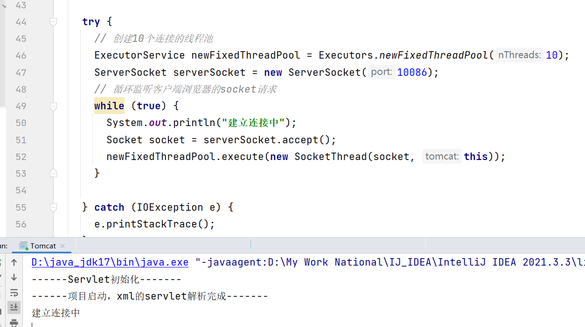

tomcat解析浏览器请求，并发送响应流程

## 1.启动tomcat并开放10086端口等待连接

socket读取到请求之后，交给Request类进行请求信息的处理

## 2.解析项目中的servlet并进行注册保存

获取到xml文件中的servlet信息，并利用类的全限定名，再利用反射创建字节码文件。

保存到map集合中

## 3.解析请求

Request这个类实现了SevletRequest接口

而我们重写了其中的一些方法。

解析请求首行和请求头，并保存。

其中还有解析存储cookie和存储用户设置的属性信息

## 4.解析请求中的请求行中的uri，并拿到servlet，去注册的servlet中找是否存在

## 5.发送响应

将接收到的请求信息，和输入流信息交给封装的Response类处理

封装响应行、响应头、响应体

## 6.这是解析到的request和发送的响应

因为没有带参数，所以有个null值

## 7.浏览器的请求和响应信息

